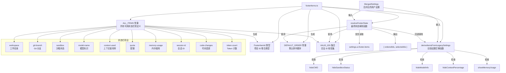

# footerItems.ts

## 概述

`footerItems.ts` 是 Gemini CLI 界面底部状态栏（Footer）的配置管理模块。该文件定义了所有可用的底部状态栏项目（Footer Items）、它们的默认顺序、从旧版设置迁移的逻辑，以及根据用户配置解析最终显示状态的核心函数。底部状态栏用于向用户展示当前工作区、Git 分支、模型信息、上下文使用率、配额等关键运行时信息。

## 架构图（Mermaid）



## 核心组件

### 1. `ALL_ITEMS` 常量

使用 `as const` 声明的只读数组，定义了系统中所有可用的底部状态栏项目。每个项目包含三个字段：

```typescript
export const ALL_ITEMS = [
  { id, header, description },
  ...
] as const;
```

| id | header（显示标题） | description（描述） |
|----|-------------------|-------------------|
| `workspace` | `workspace (/directory)` | 当前工作目录 |
| `git-branch` | `branch` | 当前 Git 分支名（不可用时隐藏） |
| `sandbox` | `sandbox` | 沙箱类型和信任指示器 |
| `model-name` | `/model` | 当前模型标识符 |
| `context-used` | `context` | 上下文窗口使用百分比 |
| `quota` | `/stats` | 每日限额剩余用量（不可用时隐藏） |
| `memory-usage` | `memory` | 应用程序内存使用量 |
| `session-id` | `session` | 当前会话唯一标识符 |
| `code-changes` | `diff` | 会话中代码增删行数（为零时隐藏） |
| `token-count` | `tokens` | 会话中总 Token 使用量（为零时隐藏） |

其中 `header` 字段部分以 `/` 开头（如 `/model`、`/stats`），暗示这些项目同时也对应 CLI 命令。

### 2. `FooterItemId` 类型

```typescript
export type FooterItemId = (typeof ALL_ITEMS)[number]['id'];
```

从 `ALL_ITEMS` 常量中自动提取所有 `id` 字段构成的联合类型。由于 `ALL_ITEMS` 使用了 `as const`，该类型会被精确推断为：

```typescript
type FooterItemId = 'workspace' | 'git-branch' | 'sandbox' | 'model-name' | 'context-used' | 'quota' | 'memory-usage' | 'session-id' | 'code-changes' | 'token-count';
```

这确保了在整个应用中引用 Footer Item ID 时的类型安全。

### 3. `DEFAULT_ORDER` 常量

```typescript
export const DEFAULT_ORDER = [
  'workspace', 'git-branch', 'sandbox', 'model-name',
  'context-used', 'quota', 'memory-usage', 'session-id',
  'code-changes', 'token-count',
];
```

定义了所有 10 个状态栏项目的默认排列顺序。该数组包含 `ALL_ITEMS` 中定义的所有项目 ID，用于在 `resolveFooterState` 中补全用户未选择的项目。

### 4. `deriveItemsFromLegacySettings(settings)` 函数

旧版设置兼容迁移函数，将旧的布尔开关式设置转换为新的项目列表格式。

**参数**: `settings: MergedSettings` -- 合并后的用户设置对象

**返回值**: `string[]` -- 应显示的项目 ID 列表

**逻辑流程**：

1. 从默认列表开始：`['workspace', 'git-branch', 'sandbox', 'model-name', 'quota']`
2. 根据旧版布尔设置逐项移除/添加：
   - `hideCWD` 为 `true` 时移除 `workspace`
   - `hideSandboxStatus` 为 `true` 时移除 `sandbox`
   - `hideModelInfo` 为 `true` 时移除 `model-name`、`context-used`、`quota`
   - `hideContextPercentage` 为 `false` 且 `context-used` 不在列表中时，将其插入到 `model-name` 之后
   - `showMemoryUsage` 为 `true` 时添加 `memory-usage`

内部使用了一个 `remove` 辅助函数，通过 `Array.splice` 就地移除指定元素。

### 5. `VALID_IDS` 私有常量

```typescript
const VALID_IDS: Set<string> = new Set(ALL_ITEMS.map((i) => i.id));
```

从 `ALL_ITEMS` 中提取所有合法 ID 构建的 Set 集合，用于在 `resolveFooterState` 中过滤无效的用户配置值。

### 6. `resolveFooterState(settings)` 函数

核心状态解析函数，由 `FooterConfigDialog` 组件调用以初始化和重置状态。

**参数**: `settings: MergedSettings` -- 合并后的用户设置对象

**返回值**:
```typescript
{
  orderedIds: string[];       // 所有项目的完整排列顺序
  selectedIds: Set<string>;   // 被选中（应显示）的项目 ID 集合
}
```

**逻辑流程**：

1. **确定数据源**: 优先使用 `settings.ui?.footer?.items`（新版配置），若不存在则回退调用 `deriveItemsFromLegacySettings(settings)` 兼容旧版配置。
2. **过滤无效项**: 使用 `VALID_IDS` 集合过滤掉任何不合法的 ID。
3. **补全未选择项**: 从 `DEFAULT_ORDER` 中提取不在 `source` 中的项目作为 `others`。
4. **构建结果**: `orderedIds` 为 `[...source, ...others]`（用户选择的在前，未选择的在后），`selectedIds` 为 `source` 的 Set 形式。

## 依赖关系

### 内部依赖

| 模块 | 导入内容 | 用途 |
|------|---------|------|
| `./settings.js` | `MergedSettings` (type) | 函数参数类型，表示合并后的用户配置 |

### 外部依赖

无。该文件不依赖任何第三方库。

## 关键实现细节

1. **新旧配置兼容策略**: 该模块采用了"新优先、旧回退"的兼容策略。`resolveFooterState` 优先读取新版的 `items` 数组配置，仅在其不存在时（`?? ` nullish coalescing）才调用 `deriveItemsFromLegacySettings` 进行旧版迁移。这确保了平滑升级体验。

2. **`as const` 与类型推导**: `ALL_ITEMS` 使用 `as const` 使得 `FooterItemId` 能够自动推导为精确的字符串字面量联合类型，而非宽泛的 `string`。这种模式避免了手动维护联合类型与数组的同步问题——当添加新的 Footer Item 时，只需修改 `ALL_ITEMS` 数组，类型会自动更新。

3. **有序-选择分离模型**: `resolveFooterState` 返回的 `orderedIds` 和 `selectedIds` 分离了"顺序"和"是否显示"两个维度。这使得 UI 组件（如 FooterConfigDialog）可以展示全部项目的排列顺序，同时通过 `selectedIds` 控制哪些被勾选显示。用户未选择的项目保持 `DEFAULT_ORDER` 中的相对顺序并排列在末尾。

4. **防御性过滤**: `resolveFooterState` 中使用 `VALID_IDS.has(id)` 过滤用户配置中可能存在的无效 ID（如拼写错误或已废弃的项目 ID），增强了鲁棒性。

5. **`deriveItemsFromLegacySettings` 中的插入位置逻辑**: 当 `hideContextPercentage` 为 `false` 时，代码尝试将 `context-used` 插入到 `model-name` 之后（逻辑上它们是关联信息）。如果 `model-name` 已被移除，则退回到数组末尾。这体现了对 UI 布局一致性的关注。

6. **就地修改与内部辅助函数**: `deriveItemsFromLegacySettings` 中的 `remove` 是一个闭包辅助函数，使用 `Array.splice` 就地修改数组。这种设计比 `filter` 创建新数组更高效，但也意味着函数有副作用（对 `items` 数组的就地修改）。不过由于 `items` 是函数内部创建的副本，不会影响外部状态。
