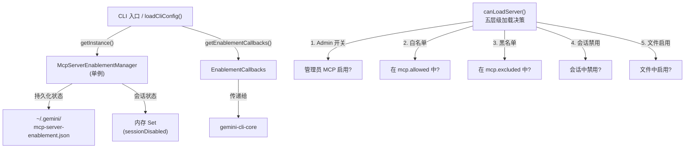
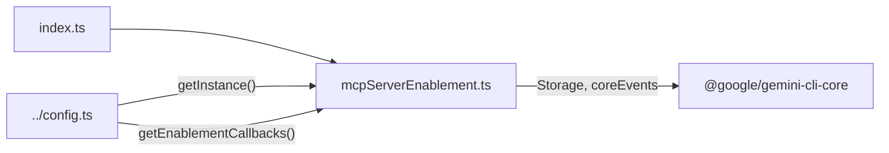
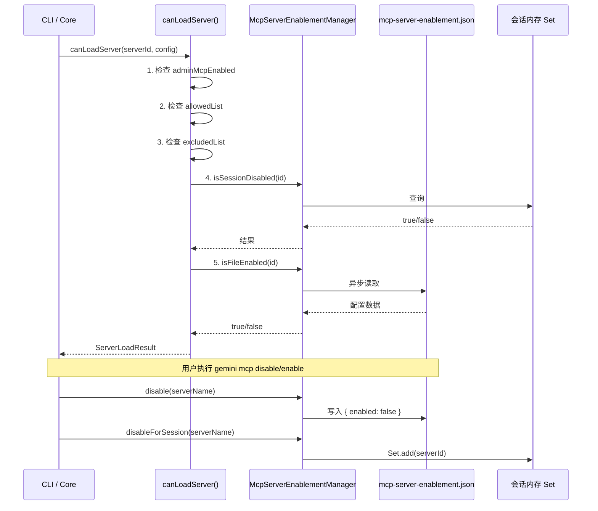

# mcp 目录

## 概述

`mcp` 目录负责 **MCP (Model Context Protocol) 服务器的启用/禁用状态管理**。它提供了一个单例管理器 `McpServerEnablementManager`，维护 MCP 服务器的持久化启用状态（文件级）和会话级禁用状态（内存级），并通过统一的 `canLoadServer()` 函数实现五层级加载决策，确保 MCP 服务器的加载严格遵循管理员策略、白名单、黑名单、会话和启用配置的层级控制。

## 目录结构

```
mcp/
├── index.ts                      # 模块入口，导出所有公开 API
├── mcpServerEnablement.ts        # MCP 服务器启用管理核心实现
└── mcpServerEnablement.test.ts   # 测试文件
```

## 架构图



## 核心组件

### 1. McpServerEnablementManager - MCP 服务器启用管理器

**单例模式**，通过 `getInstance()` 获取，确保会话状态跨代码路径共享。

#### 双层状态模型

| 层级 | 存储位置 | 持久性 | 默认值 |
|---|---|---|---|
| 文件状态 | `~/.gemini/mcp-server-enablement.json` | 持久 | 启用（不在配置中 = 启用） |
| 会话状态 | 内存 `Set<string>` | 当前会话 | 未禁用 |

#### 关键方法

- **`isFileEnabled(serverName)`**: 检查文件中的持久化启用状态。服务器不在配置文件中默认为启用。
- **`isSessionDisabled(serverName)`**: 检查当前会话是否禁用了该服务器。
- **`isEffectivelyEnabled(serverName)`**: 综合文件和会话状态判断最终启用状态。
- **`enable(serverName)` / `disable(serverName)`**: 持久化启用/禁用操作。启用时删除配置条目（回归默认），禁用时写入 `{ enabled: false }`。
- **`disableForSession(serverName)` / `clearSessionDisable(serverName)`**: 会话级禁用/恢复。
- **`getDisplayState(serverName)`**: 返回 UI 显示所需的组合状态（含有效状态、是否会话禁用、是否持久禁用）。
- **`getEnablementCallbacks()`**: 返回回调接口供 `gemini-cli-core` 使用，实现 CLI 包与 Core 包的解耦。
- **`autoEnableServers(serverNames)`**: 批量自动重新启用被禁用的服务器。

### 2. canLoadServer() - 五层级加载决策函数

统一判断 MCP 服务器是否可以加载，返回 `ServerLoadResult`（含 `allowed`、`reason`、`blockType`）。

**检查顺序（短路求值）**：

1. **管理员开关** (`admin`): `adminMcpEnabled` 为 false 则全部拒绝
2. **白名单** (`allowlist`): 若配置了 `mcp.allowed`，服务器必须在列表中
3. **黑名单** (`excludelist`): 若在 `mcp.excluded` 中则拒绝
4. **会话禁用** (`session`): 当前会话中被禁用则拒绝
5. **文件启用** (`enablement`): 文件配置中被禁用则拒绝

### 3. 辅助函数

- **`normalizeServerId(serverId)`**: 将服务器 ID 规范化为小写并去除空白。
- **`isInSettingsList(serverId, list)`**: 大小写不敏感的列表匹配，兼容 `ext:` 前缀的扩展服务器 ID 向后兼容。

## 依赖关系



## 数据流


