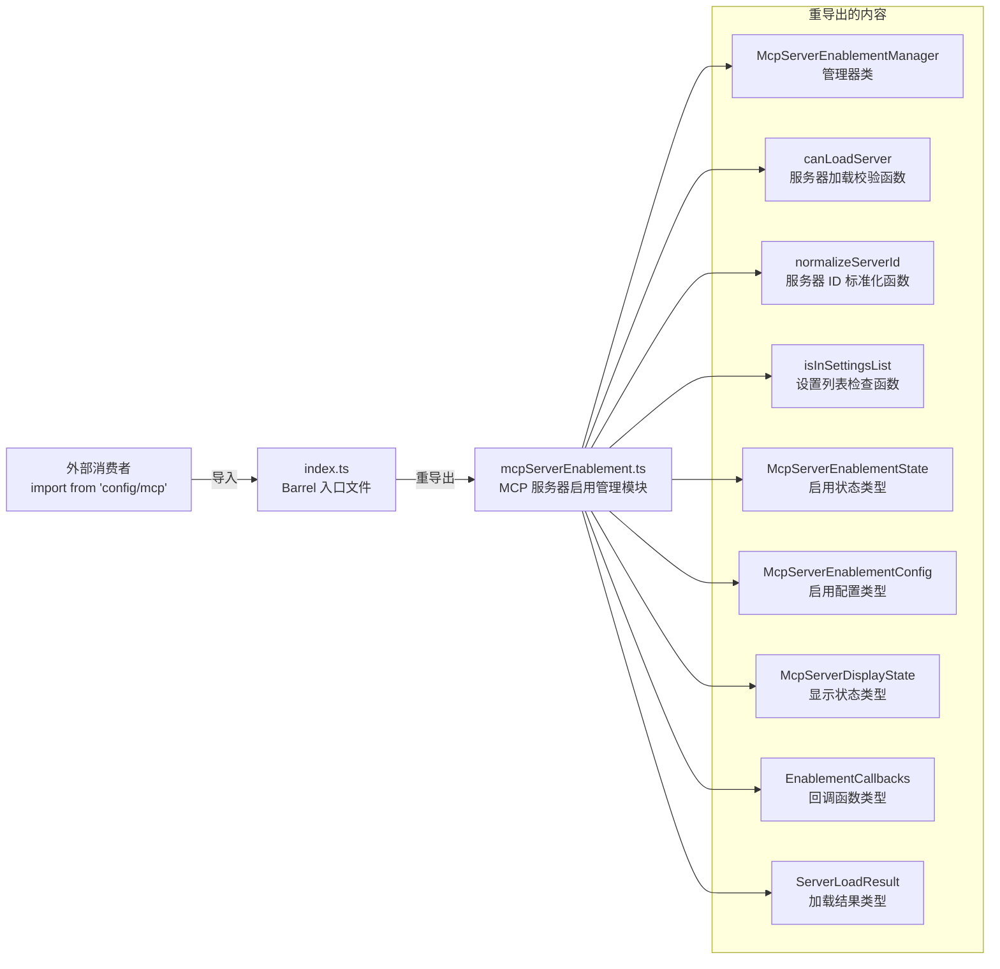

# index.ts (mcp)

## 概述

`index.ts` 是 MCP（Model Context Protocol）服务器配置子模块的入口文件（Barrel 文件）。它本身不包含任何业务逻辑，仅作为统一的导出入口，将 `mcpServerEnablement.ts` 模块中的核心导出项重新导出，为外部消费者提供简洁的导入路径。

通过该文件，其他模块可以从 `config/mcp` 路径导入所需内容，而无需关心内部模块的文件结构。

## 架构图（Mermaid）

## 核心组件

该文件是一个纯 Barrel 文件（桶文件），不包含自身的核心逻辑。它导出以下内容：

### 导出的值（运行时）

| 导出名 | 类型 | 说明 |
|--------|------|------|
| `McpServerEnablementManager` | 类 | MCP 服务器启用状态管理器，负责管理服务器的启用/禁用状态 |
| `canLoadServer` | 函数 | 判断指定 MCP 服务器是否可以被加载 |
| `normalizeServerId` | 函数 | 将服务器 ID 标准化为统一格式 |
| `isInSettingsList` | 函数 | 检查某个服务器是否在设置列表中 |

### 导出的类型（仅编译时）

| 导出名 | 类型 | 说明 |
|--------|------|------|
| `McpServerEnablementState` | type | MCP 服务器的启用状态枚举/联合类型 |
| `McpServerEnablementConfig` | type | MCP 服务器启用相关的配置结构 |
| `McpServerDisplayState` | type | MCP 服务器在 UI 中的显示状态 |
| `EnablementCallbacks` | type | 启用/禁用操作时的回调函数接口 |
| `ServerLoadResult` | type | 服务器加载操作的结果类型 |

## 依赖关系

### 内部依赖

| 模块 | 导入内容 | 用途 |
|------|---------|------|
| `./mcpServerEnablement.js` | 全部上述导出项 | 唯一的源模块，所有内容均从此模块转导出 |

### 外部依赖

无。

## 关键实现细节

1. **Barrel 模式**: 该文件采用了 TypeScript/JavaScript 中常见的 Barrel（桶）模式。通过在目录的 `index.ts` 中重新导出子模块内容，外部代码可以使用更简洁的路径导入（如 `from './config/mcp'` 而非 `from './config/mcp/mcpServerEnablement'`）。这也提供了封装性——如果未来内部文件结构重组，只需修改 `index.ts` 的重导出即可，不影响外部消费者。

2. **`type` 关键字导入导出**: 注意导出语句中使用了 `type` 关键字（如 `type McpServerEnablementState`）。这是 TypeScript 的 `type-only export`，确保这些类型在编译为 JavaScript 后会被完全擦除，不产生任何运行时代码。这对 Tree-shaking 和包体积优化有正面影响。

3. **`.js` 扩展名**: 导入路径使用 `.js` 扩展名（`'./mcpServerEnablement.js'`），这是 ESM（ES Modules）规范的要求。TypeScript 在 ESM 模式下编译时，要求导入路径指向编译后的 `.js` 文件，而非源码的 `.ts` 文件。

4. **单一来源**: 当前所有导出项均来自同一个源模块 `mcpServerEnablement.ts`。如果将来 `mcp` 目录下增加更多子模块（如 MCP 连接管理、协议处理等），可以在此 `index.ts` 中添加新的重导出行，保持入口的统一性。
