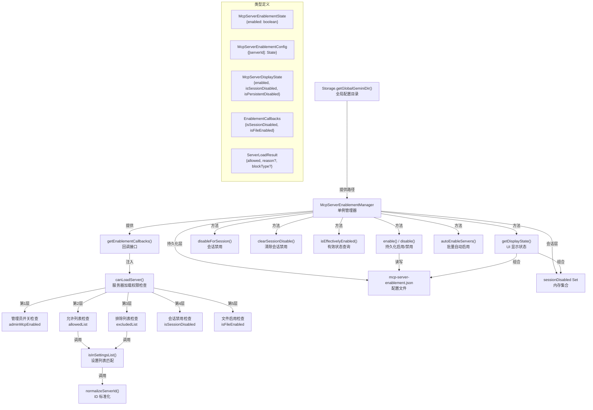

# mcpServerEnablement.ts

## 概述

`mcpServerEnablement.ts` 是 Gemini CLI 中 MCP（Model Context Protocol）服务器启用/禁用状态管理的核心模块。该文件实现了一套完整的 MCP 服务器访问控制机制，包括：

- **多层安全检查**：管理员开关、允许列表、排除列表、会话禁用、文件持久化禁用，共 5 层校验。
- **双层状态模型**：持久化状态（JSON 文件存储）+ 会话状态（内存 Set），两者结合决定最终的有效启用状态。
- **单例管理器**：`McpServerEnablementManager` 类通过单例模式确保全局状态一致性。
- **回调解耦**：通过 `EnablementCallbacks` 接口将 CLI 层的启用状态检查注入到核心层，保持 `packages/core` 的独立性。

## 架构图（Mermaid）



## 核心组件

### 1. 类型接口

#### `McpServerEnablementState`

```typescript
export interface McpServerEnablementState {
  enabled: boolean;  // 服务器是否启用
}
```

JSON 文件中存储的单个服务器持久化状态。

#### `McpServerEnablementConfig`

```typescript
export interface McpServerEnablementConfig {
  [serverId: string]: McpServerEnablementState;  // 服务器ID -> 启用状态
}
```

配置文件的完整格式，以服务器 ID 为键、启用状态为值的字典结构。

#### `McpServerDisplayState`

```typescript
export interface McpServerDisplayState {
  enabled: boolean;             // 综合有效状态
  isSessionDisabled: boolean;   // 是否被会话禁用
  isPersistentDisabled: boolean; // 是否被文件持久化禁用
}
```

供 UI 展示使用的组合状态。`enabled` 为 `true` 当且仅当 `isSessionDisabled` 和 `isPersistentDisabled` 都为 `false`。

#### `EnablementCallbacks`

```typescript
export interface EnablementCallbacks {
  isSessionDisabled: (serverId: string) => boolean;       // 同步：检查会话禁用
  isFileEnabled: (serverId: string) => Promise<boolean>;  // 异步：检查文件启用
}
```

回调接口，用于将 CLI 层的启用检查能力注入到 `canLoadServer()` 函数中，实现 `packages/core` 与 `packages/cli` 的解耦。

#### `ServerLoadResult`

```typescript
export interface ServerLoadResult {
  allowed: boolean;
  reason?: string;
  blockType?: 'admin' | 'allowlist' | 'excludelist' | 'session' | 'enablement';
}
```

`canLoadServer()` 的返回结果。当 `allowed` 为 `false` 时，`reason` 提供人类可读的拒绝原因，`blockType` 标识具体是哪一层检查拦截了请求。

### 2. `normalizeServerId(serverId)` 函数

```typescript
export function normalizeServerId(serverId: string): string {
  return serverId.toLowerCase().trim();
}
```

将服务器 ID 标准化为小写并去除首尾空白。该函数被整个模块广泛使用，确保 ID 比较的一致性。

### 3. `isInSettingsList(serverId, list)` 函数

```typescript
export function isInSettingsList(
  serverId: string,
  list: string[],
): { found: boolean; deprecationWarning?: string }
```

检查服务器 ID 是否存在于设置列表中，支持两种匹配模式：

1. **精确匹配**：标准化后的 ID 完全一致。
2. **向后兼容匹配**：对于 `ext:` 前缀的扩展服务器，支持仅使用冒号后的简短名称匹配。当发生此类匹配时，返回 `deprecationWarning` 提示用户更新配置。

### 4. `canLoadServer(serverId, config)` 函数

核心的服务器加载权限检查函数，实现 5 层检查链：

| 层级 | 检查项 | 阻断类型 | 说明 |
|------|--------|---------|------|
| 1 | 管理员开关 | `admin` | `adminMcpEnabled` 为 `false` 时全局禁止所有 MCP 服务器 |
| 2 | 允许列表 | `allowlist` | 若 `allowedList` 非空，服务器必须在列表中 |
| 3 | 排除列表 | `excludelist` | 若服务器在 `excludedList` 中则被阻止 |
| 4 | 会话禁用 | `session` | 通过 `--session` 标志禁用的服务器 |
| 5 | 文件启用 | `enablement` | 持久化配置文件中被禁用的服务器 |

检查按优先级从高到低顺序执行，一旦某层拒绝则立即返回，不再继续后续检查。全部通过则返回 `{ allowed: true }`。

该函数通过 `EnablementCallbacks` 回调接口获取第 4、5 层的状态，而非直接引用 `McpServerEnablementManager`，以保持 `packages/core` 的独立性。

### 5. `McpServerEnablementManager` 类

单例模式的 MCP 服务器启用状态管理器。

#### 静态方法

| 方法 | 说明 |
|------|------|
| `getInstance()` | 获取单例实例，首次调用时创建 |
| `resetInstance()` | 重置单例实例为 `null`，仅供测试使用 |

#### 实例属性

| 属性 | 类型 | 可见性 | 说明 |
|------|------|--------|------|
| `configFilePath` | `string` | `private readonly` | 配置文件完整路径 |
| `configDir` | `string` | `private readonly` | 配置文件所在目录 |
| `sessionDisabled` | `Set<string>` | `private readonly` | 当前会话中被禁用的服务器 ID 集合 |

#### 实例方法

| 方法 | 返回类型 | 说明 |
|------|---------|------|
| `isFileEnabled(serverName)` | `Promise<boolean>` | 检查服务器在文件中是否启用（默认为 `true`） |
| `isSessionDisabled(serverName)` | `boolean` | 检查服务器是否被会话禁用 |
| `isEffectivelyEnabled(serverName)` | `Promise<boolean>` | 检查综合有效状态（会话 + 文件） |
| `enable(serverName)` | `Promise<void>` | 持久化启用服务器（从配置中删除该条目） |
| `disable(serverName)` | `Promise<void>` | 持久化禁用服务器（写入 `{enabled: false}`） |
| `disableForSession(serverName)` | `void` | 仅在当前会话中禁用服务器 |
| `clearSessionDisable(serverName)` | `void` | 清除服务器的会话禁用状态 |
| `getDisplayState(serverName)` | `Promise<McpServerDisplayState>` | 获取 UI 显示用的组合状态 |
| `getAllDisplayStates(serverIds)` | `Promise<Record<string, McpServerDisplayState>>` | 批量获取多个服务器的显示状态 |
| `getEnablementCallbacks()` | `EnablementCallbacks` | 获取回调接口对象，用于注入 `canLoadServer()` |
| `autoEnableServers(serverNames)` | `Promise<string[]>` | 批量自动启用被禁用的服务器，返回实际被重新启用的名称列表 |

#### 私有方法

| 方法 | 说明 |
|------|------|
| `readConfig()` | 异步读取 JSON 配置文件，文件不存在时返回空对象 |
| `writeConfig(config)` | 异步写入 JSON 配置文件，自动创建目录 |

## 依赖关系

### 内部依赖

| 模块 | 导入内容 | 用途 |
|------|---------|------|
| `@google/gemini-cli-core` | `Storage` | 获取全局 Gemini 配置目录路径 |
| `@google/gemini-cli-core` | `coreEvents` | 发送反馈事件（警告、错误消息） |

### 外部依赖

| 模块 | 用途 |
|------|------|
| `node:fs/promises` | 异步文件读写操作 |
| `node:path` | 文件路径拼接 |

## 关键实现细节

1. **"默认启用"策略**: `isFileEnabled` 中使用 `state?.enabled ?? true`，即配置文件中不存在记录的服务器默认视为启用。`enable()` 方法的实现是 **删除** 配置中的条目（而非设置 `enabled: true`），这是一种精简的设计——配置文件只记录"被禁用"的服务器，未记录的均视为启用。

2. **单例模式确保状态一致性**: `McpServerEnablementManager` 使用经典的单例模式。由于 `sessionDisabled` 是内存中的 `Set`，必须确保全局只有一个实例，否则不同代码路径可能看到不同的会话状态。`resetInstance()` 仅供测试使用。

3. **5 层安全检查链**: `canLoadServer()` 实现了类似中间件/管道的多层检查模式。每一层都有明确的 `blockType` 标识，使得上游调用者可以根据具体拦截原因给出不同的用户提示或采取不同的恢复策略。

4. **回调解耦设计**: `canLoadServer()` 不直接引用 `McpServerEnablementManager`，而是通过 `EnablementCallbacks` 接口接收回调。这使得 `packages/core` 可以调用此函数而不需要依赖 `packages/cli` 的具体实现。`getEnablementCallbacks()` 方法将管理器的方法包装为回调接口。

5. **向后兼容的 `ext:` 服务器匹配**: `isInSettingsList` 支持旧版配置中仅使用简短名称引用扩展服务器的情况。例如，配置中写的 `myserver` 可以匹配 `ext:myserver`。但会产生废弃警告，引导用户迁移到完整 ID。

6. **文件操作的错误容忍**: `readConfig()` 在文件不存在（`ENOENT`）时静默返回空对象而非抛出异常。其他读取错误会通过 `coreEvents.emitFeedback` 发出错误事件，但同样返回空对象，确保系统不会因配置文件损坏而崩溃。

7. **写入前自动创建目录**: `writeConfig()` 在写入前调用 `fs.mkdir(this.configDir, { recursive: true })`，确保配置目录在首次使用时自动创建。

8. **`autoEnableServers` 的双层清理**: 该方法同时处理持久化禁用和会话禁用两种状态。对于每个服务器，它检查两种禁用状态并分别清理，确保服务器能被完全重新启用。

9. **JSON 格式化存储**: `writeConfig` 使用 `JSON.stringify(config, null, 2)` 以 2 空格缩进写入，使配置文件可被人类阅读和手动编辑。

10. **配置文件名**: 持久化配置文件名为 `mcp-server-enablement.json`，存储在 `Storage.getGlobalGeminiDir()` 返回的全局 Gemini 配置目录下。
