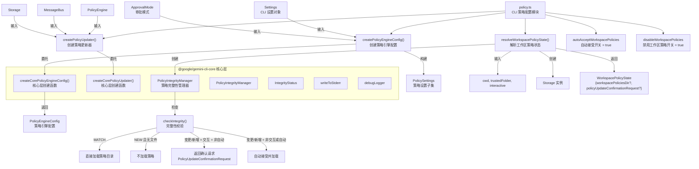

# policy.ts

## 概述

`policy.ts` 是 Gemini CLI 策略引擎（Policy Engine）的 CLI 层配置与初始化模块。该文件负责：

- 将 CLI 层的 `Settings` 配置转换为核心层的 `PolicySettings`，并委托核心层创建策略引擎配置和策略更新器。
- 管理工作区策略（Workspace Policies）的解析和信任验证流程，包括完整性检查、自动接受/用户确认等逻辑。
- 提供两个临时特性开关（`autoAcceptWorkspacePolicies` 和 `disableWorkspacePolicies`），用于控制工作区策略行为。

策略引擎是 Gemini CLI 安全模型的核心组件，控制工具调用的审批方式、MCP 服务器的访问权限等安全相关行为。

## 架构图（Mermaid）



## 核心组件

### 1. 特性开关

#### `autoAcceptWorkspacePolicies`

```typescript
export let autoAcceptWorkspacePolicies = true;
```

临时标志，控制是否自动接受工作区策略变更。当为 `true` 时，策略变更或新策略会被自动接受而不需要用户确认，以减少使用摩擦。使用 `let` 声明以允许测试中通过 setter 修改。

#### `disableWorkspacePolicies`

```typescript
export let disableWorkspacePolicies = true;
```

临时标志，控制是否完全禁用工作区级别的策略。当为 `true` 时，`resolveWorkspacePolicyState` 将跳过所有工作区策略处理逻辑。同样使用 `let` 声明。

两个标志均附带对应的 setter 函数 `setAutoAcceptWorkspacePolicies` 和 `setDisableWorkspacePolicies`，主要供测试使用。

### 2. `createPolicyEngineConfig(settings, approvalMode, workspacePoliciesDir?, interactive?)` 函数

```typescript
export async function createPolicyEngineConfig(
  settings: Settings,
  approvalMode: ApprovalMode,
  workspacePoliciesDir?: string,
  interactive: boolean = true,
): Promise<PolicyEngineConfig>
```

将 CLI 层的 `Settings` 对象转换为核心层所需的 `PolicyEngineConfig`。

**参数**:
- `settings`: CLI 完整设置对象
- `approvalMode`: 审批模式（如自动、手动等）
- `workspacePoliciesDir`: 可选的工作区策略目录路径
- `interactive`: 是否为交互模式，默认 `true`

**逻辑流程**:

1. 从 `Settings` 中显式提取策略相关字段，构建 `PolicySettings` 对象：
   - `mcp`: MCP 相关设置
   - `tools`: 工具相关设置
   - `mcpServers`: MCP 服务器配置
   - `policyPaths`: 策略文件路径
   - `adminPolicyPaths`: 管理员策略文件路径
   - `workspacePoliciesDir`: 工作区策略目录
   - `disableAlwaysAllow`: 从 `security.disableAlwaysAllow` 或 `admin.secureModeEnabled` 推导

2. 委托核心层 `createCorePolicyEngineConfig()` 完成实际创建。

**设计意图**: 显式构造 `PolicySettings` 而非直接传递 `Settings`，是为了确保类型安全并避免非策略相关的设置属性意外泄漏到核心层。

### 3. `createPolicyUpdater(policyEngine, messageBus, storage)` 函数

```typescript
export function createPolicyUpdater(
  policyEngine: PolicyEngine,
  messageBus: MessageBus,
  storage: Storage,
)
```

创建策略更新器的简单委托函数，直接调用核心层的 `createCorePolicyUpdater()`。策略更新器负责在运行时监听和应用策略变更。

### 4. `WorkspacePolicyState` 接口

```typescript
export interface WorkspacePolicyState {
  workspacePoliciesDir?: string;
  policyUpdateConfirmationRequest?: PolicyUpdateConfirmationRequest;
}
```

工作区策略解析结果的类型定义：
- `workspacePoliciesDir`: 已验证可加载的工作区策略目录路径。`undefined` 表示不加载工作区策略。
- `policyUpdateConfirmationRequest`: 当策略需要用户确认时填充，包含确认所需的上下文信息。

两个字段互斥——要么直接给出目录（可加载），要么给出确认请求（等待用户决定）。

### 5. `resolveWorkspacePolicyState(options)` 函数

```typescript
export async function resolveWorkspacePolicyState(options: {
  cwd: string;
  trustedFolder: boolean;
  interactive: boolean;
}): Promise<WorkspacePolicyState>
```

核心的工作区策略解析函数，实现了完整的信任验证和完整性检查流程。

**参数**:
- `cwd`: 当前工作目录
- `trustedFolder`: 当前文件夹是否已被信任
- `interactive`: 是否为交互模式

**完整逻辑流程**:

```
开始
 |
 v
trustedFolder == true 且 disableWorkspacePolicies == false ?
 |                          |
 否 -> 返回空状态            是
                             |
                             v
                     创建 Storage(cwd)
                             |
                             v
                     是全局配置目录（home）?
                      |              |
                      是              否
                      |              |
                      v              v
                   返回空状态     获取工作区策略目录
                                     |
                                     v
                              完整性检查 checkIntegrity()
                                     |
                    +----------------+----------------+
                    |                |                |
                 MATCH          NEW + 0文件        其他（变更/新增）
                    |                |                |
                    v                v                |
              加载策略目录       不加载策略     +------+------+
                                               |             |
                                          交互 + 非自动   非交互或自动
                                               |             |
                                               v             v
                                         返回确认请求    自动接受并加载
                                                         (输出警告日志)
```

**四种完整性状态处理**:

| 状态 | 条件 | 行为 |
|------|------|------|
| `MATCH` | 策略哈希匹配 | 直接加载策略目录 |
| `NEW` + 无文件 | 新工作区且无策略文件 | 不加载（返回 `undefined`） |
| 变更/新增 + 交互 + 非自动 | 需要用户确认 | 返回 `PolicyUpdateConfirmationRequest` |
| 变更/新增 + 非交互或自动 | 自动处理 | 调用 `acceptIntegrity()` 接受并加载，输出警告 |

**警告输出的区分**:
- 非交互模式：通过 `writeToStderr` 输出到标准错误流
- 交互模式（自动接受）：通过 `debugLogger.warn` 输出到调试日志

## 依赖关系

### 内部依赖

| 模块 | 导入内容 | 用途 |
|------|---------|------|
| `@google/gemini-cli-core` | `PolicyEngineConfig` (type) | 策略引擎配置类型 |
| `@google/gemini-cli-core` | `ApprovalMode` (type) | 审批模式类型 |
| `@google/gemini-cli-core` | `PolicyEngine` (type) | 策略引擎类型 |
| `@google/gemini-cli-core` | `MessageBus` (type) | 消息总线类型 |
| `@google/gemini-cli-core` | `PolicySettings` (type) | 策略设置类型 |
| `@google/gemini-cli-core` | `PolicyUpdateConfirmationRequest` (type) | 策略更新确认请求类型 |
| `@google/gemini-cli-core` | `createPolicyEngineConfig` (as `createCorePolicyEngineConfig`) | 核心层策略引擎配置创建函数 |
| `@google/gemini-cli-core` | `createPolicyUpdater` (as `createCorePolicyUpdater`) | 核心层策略更新器创建函数 |
| `@google/gemini-cli-core` | `PolicyIntegrityManager` | 策略文件完整性管理器 |
| `@google/gemini-cli-core` | `IntegrityStatus` | 完整性检查状态枚举 |
| `@google/gemini-cli-core` | `Storage` | 存储管理器，提供工作区/全局配置目录路径 |
| `@google/gemini-cli-core` | `writeToStderr` | 向标准错误流写入内容 |
| `@google/gemini-cli-core` | `debugLogger` | 调试日志记录器 |
| `./settings.js` | `Settings` (type) | CLI 设置类型 |

### 外部依赖

无直接的第三方库依赖。所有 Node.js API 调用均封装在 `@google/gemini-cli-core` 中。

## 关键实现细节

1. **两个临时标志的当前状态**: `autoAcceptWorkspacePolicies` 和 `disableWorkspacePolicies` 当前都默认为 `true`。这意味着在当前版本中，工作区策略实际上是被完全禁用的（`disableWorkspacePolicies = true`）。即使将来启用了工作区策略，由于 `autoAcceptWorkspacePolicies = true`，策略变更也会被自动接受而不会提示用户。这暗示工作区策略功能仍在开发/稳定过程中。

2. **CLI/Core 分层委托**: `createPolicyEngineConfig` 和 `createPolicyUpdater` 都是"薄包装"函数，核心逻辑在 `@google/gemini-cli-core` 中实现。CLI 层的职责仅限于将 `Settings` 对象适配为核心层所需的 `PolicySettings` 格式。这体现了清晰的架构分层。

3. **显式字段提取的类型安全**: `createPolicyEngineConfig` 中通过逐字段提取构建 `PolicySettings`，而非使用展开运算符或类型断言。注释中明确说明这是为了"确保类型安全并避免其他设置属性的意外泄漏"。这是一种防御性编程实践。

4. **`disableAlwaysAllow` 的双源逻辑**: 该字段通过 `settings.security?.disableAlwaysAllow || settings.admin?.secureModeEnabled` 推导。这意味着"禁用始终允许"行为可以由两个独立的配置路径触发——安全设置或管理员安全模式。只要任一为 `true`，工具调用就不能被设为"始终允许"。

5. **Home 目录特殊处理**: `resolveWorkspacePolicyState` 中通过 `storage.isWorkspaceHomeDir()` 检查当前工作目录是否为用户 Home 目录。如果是，则跳过工作区策略加载，避免全局策略被当作工作区策略重复加载。

6. **完整性管理的安全模型**: `PolicyIntegrityManager` 通过哈希值追踪策略文件的变更。`MATCH` 状态表示策略未被修改，可安全加载。其他状态（策略被修改、新增）则需要用户确认或自动接受，防止恶意代码通过修改工作区策略文件来提升权限。

7. **`let` 导出与 setter 模式**: TypeScript/ESM 中，`export let` 变量对外部消费者是只读的（live binding 但不可赋值）。因此提供了专门的 setter 函数以允许测试代码修改这些标志。这是一种常见的测试友好设计模式。

8. **交互/非交互模式的差异化处理**: 在自动接受策略时，非交互模式使用 `writeToStderr`（确保 CI/CD 管道中警告可见），而交互模式使用 `debugLogger.warn`（避免干扰正常的 TUI 界面）。这体现了对不同使用场景的细致考虑。
