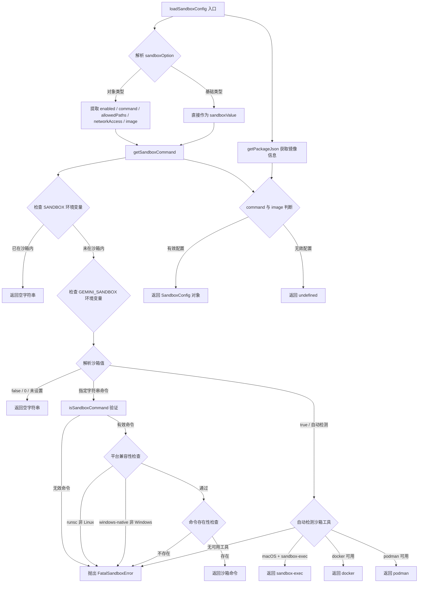

# sandboxConfig.ts

## 概述

`sandboxConfig.ts` 是 Gemini CLI 的沙箱（Sandbox）配置模块，负责检测、验证和加载沙箱运行环境的配置。沙箱机制为 CLI 工具执行提供了安全隔离的运行时环境，支持多种沙箱后端（Docker、Podman、macOS sandbox-exec、gVisor runsc、LXC、Windows 原生沙箱）。

该模块的核心职责包括：
1. 根据用户设置、命令行参数和环境变量，确定要使用的沙箱命令
2. 验证指定的沙箱命令是否合法且在当前平台可用
3. 自动检测系统中可用的沙箱工具
4. 组装并返回最终的 `SandboxConfig` 配置对象

## 架构图（Mermaid）



## 核心组件

### 1. 接口 `SandboxCliArgs`

```typescript
interface SandboxCliArgs {
  sandbox?: boolean | string | null;
}
```

这是一个精简版的 CLI 参数接口，仅包含 `sandbox` 字段，目的是避免与 `config.ts` 中完整的 `CliArgs` 接口产生循环依赖。`sandbox` 字段支持以下类型：
- `boolean`：`true` 表示启用自动检测，`false` 表示禁用
- `string`：指定具体的沙箱命令名称
- `null / undefined`：未指定

### 2. 常量 `VALID_SANDBOX_COMMANDS`

```typescript
const VALID_SANDBOX_COMMANDS = [
  'docker',
  'podman',
  'sandbox-exec',
  'runsc',
  'lxc',
  'windows-native',
];
```

定义了所有合法的沙箱命令列表，共 6 种：
| 命令 | 平台 | 说明 |
|------|------|------|
| `docker` | 跨平台 | Docker 容器隔离 |
| `podman` | 跨平台 | Podman 容器隔离（Docker 替代品） |
| `sandbox-exec` | macOS | macOS Seatbelt 沙箱机制 |
| `runsc` | 仅 Linux | gVisor 用户态内核沙箱，依赖 Docker + `--runtime=runsc` |
| `lxc` | Linux | LXC 容器，需用户预先创建并运行容器 |
| `windows-native` | 仅 Windows | Windows 原生沙箱隔离 |

### 3. 函数 `isSandboxCommand(value: string)`

类型守卫函数，用于判断字符串是否是合法的沙箱命令。通过将 `VALID_SANDBOX_COMMANDS` 数组转换为 `ReadonlyArray<string | undefined>` 来实现类型安全的 `includes` 检查。

### 4. 函数 `getSandboxCommand(sandbox?: boolean | string | null)`

核心的沙箱命令解析函数，返回最终要使用的沙箱命令字符串或空字符串（表示不使用沙箱）。

**优先级逻辑：**
1. 如果 `SANDBOX` 环境变量已设置 → 已在沙箱内，返回空字符串
2. `GEMINI_SANDBOX` 环境变量 > 命令行参数/设置文件中的值
3. 将字符串 `'1'`/`'true'` 转换为布尔 `true`，`'0'`/`'false'`/空值转换为 `false`
4. 如果为 `false` → 返回空字符串
5. 如果为具体命令字符串 → 验证合法性、平台兼容性、命令存在性
6. 如果为 `true`（自动检测）→ 按优先级检测：`sandbox-exec`(macOS) > `docker` > `podman`
7. 注意：`lxc` 和 `runsc` 不会被自动检测，必须显式指定

**异常处理：**
- 无效命令名 → 抛出 `FatalSandboxError`
- `runsc` 在非 Linux 平台 → 抛出 `FatalSandboxError`
- `windows-native` 在非 Windows 平台 → 抛出 `FatalSandboxError`
- 指定命令不存在 → 抛出 `FatalSandboxError`
- `runsc` 但 Docker 未安装 → 抛出 `FatalSandboxError`
- `sandbox=true` 但无可用工具 → 抛出 `FatalSandboxError`

### 5. 函数 `loadSandboxConfig(settings: Settings, argv: SandboxCliArgs)`

模块的公开导出函数，也是沙箱配置的入口。

**参数：**
- `settings: Settings`：用户的设置对象，包含 `tools.sandbox` 配置
- `argv: SandboxCliArgs`：命令行参数对象

**流程：**
1. 合并配置源：`argv.sandbox`（命令行优先） → `settings.tools?.sandbox`（设置文件兜底）
2. 解析 `sandboxOption`：
   - 如果是对象类型（结构化配置），提取 `enabled`、`command`、`allowedPaths`、`networkAccess`、`image`
   - 如果是基础类型，直接作为沙箱开关/命令
3. 调用 `getSandboxCommand` 获取最终命令
4. 通过 `getPackageJson` 获取 Docker 镜像 URI
5. 镜像优先级：`GEMINI_SANDBOX_IMAGE` 环境变量 > `GEMINI_SANDBOX_IMAGE_DEFAULT` 环境变量 > 用户自定义 `customImage` > `package.json` 中的 `config.sandboxImageUri`
6. 对于原生沙箱（`windows-native`、`sandbox-exec`、`lxc`）不需要镜像
7. 返回 `SandboxConfig` 对象或 `undefined`（无法启用沙箱时）

**返回值结构：**
```typescript
{
  enabled: true,
  allowedPaths: string[],    // 沙箱中允许访问的路径列表
  networkAccess: boolean,     // 是否允许网络访问
  command: string,            // 沙箱命令
  image: string | undefined   // Docker/容器镜像 URI
}
```

## 依赖关系

### 内部依赖

| 依赖模块 | 导入内容 | 用途 |
|----------|----------|------|
| `@google/gemini-cli-core` | `getPackageJson` | 从 `package.json` 中读取沙箱镜像 URI 配置 |
| `@google/gemini-cli-core` | `SandboxConfig` 类型 | 沙箱配置的标准类型定义 |
| `@google/gemini-cli-core` | `FatalSandboxError` | 致命沙箱错误类，用于不可恢复的配置错误 |
| `./settings.js` | `Settings` 类型 | 用户设置的类型定义，用于读取 `tools.sandbox` |

### 外部依赖

| 依赖包 | 用途 |
|--------|------|
| `command-exists` | 检测系统中是否存在指定的沙箱命令（`commandExists.sync`） |
| `node:os` | 获取操作系统平台信息（`os.platform()`），用于平台兼容性判断 |
| `node:url` | `fileURLToPath` 将 ESM 的 `import.meta.url` 转换为文件路径 |
| `node:path` | 路径操作，获取当前文件所在目录 `__dirname` |

## 关键实现细节

1. **ESM 兼容的 `__dirname`**：由于项目使用 ES Modules，`__dirname` 不再自动可用。通过 `fileURLToPath(import.meta.url)` + `path.dirname()` 手动构建，用于传给 `getPackageJson` 查找 `package.json`。

2. **避免循环依赖**：定义了精简的 `SandboxCliArgs` 接口替代从 `config.ts` 导入完整的 `CliArgs`，注释中明确说明了这一设计决策。

3. **环境变量优先级体系**：
   - `SANDBOX`：标识当前进程是否已在沙箱内运行（由沙箱启动器设置），若已设置则跳过所有沙箱逻辑
   - `GEMINI_SANDBOX`：用户显式配置的沙箱命令，优先级高于命令行参数和设置文件
   - `GEMINI_SANDBOX_IMAGE` / `GEMINI_SANDBOX_IMAGE_DEFAULT`：容器镜像 URI 的环境变量覆盖

4. **自动检测策略**：当用户仅设置 `sandbox=true` 而不指定具体命令时，按 `sandbox-exec`(macOS) → `docker` → `podman` 的优先级自动检测。`lxc` 因需要预配置容器、`runsc` 因仅限 Linux 且需特殊运行时，均不参与自动检测。

5. **原生沙箱与容器沙箱的区分**：`windows-native`、`sandbox-exec`、`lxc` 被视为"原生"沙箱，不需要容器镜像即可运行；`docker`、`podman`、`runsc` 则需要有效的镜像 URI 才能返回有效配置。

6. **防御性编程**：所有异常情况均通过 `FatalSandboxError` 抛出，确保在沙箱配置错误时 CLI 不会以不安全的方式运行。
