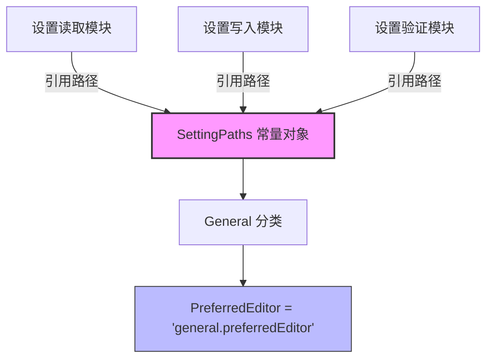

# settingPaths.ts

## 概述

`settingPaths.ts` 是一个极为精简的常量定义模块，定义了 Gemini CLI 设置系统中各配置项的**路径字符串常量**。这些路径字符串以点号（`.`）分隔的形式表示设置项在嵌套配置对象中的位置，类似于 JSON Path 的简化形式。

该模块的设计目的是：
1. 将设置路径集中管理，避免在代码中硬编码设置路径字符串
2. 通过 `as const` 断言提供字面量类型支持，实现编译时类型检查
3. 为设置的读取、写入和验证提供统一的路径引用

目前该模块仅定义了一个设置路径：`general.preferredEditor`（用户首选编辑器）。

## 架构图（Mermaid）



## 核心组件

### 1. 常量对象 `SettingPaths`

```typescript
export const SettingPaths = {
  General: {
    PreferredEditor: 'general.preferredEditor',
  },
} as const;
```

**结构说明：**

这是一个通过 `as const` 声明的只读常量对象，采用两级嵌套结构：

| 第一级（分类） | 第二级（设置项） | 路径值 | 含义 |
|---------------|----------------|--------|------|
| `General` | `PreferredEditor` | `'general.preferredEditor'` | 用户首选的文本编辑器 |

**`as const` 的作用：**
- 使对象成为深度只读（`readonly`），不可修改
- 使所有字符串值的类型从宽泛的 `string` 收窄为字面量类型（如 `'general.preferredEditor'`）
- 在 TypeScript 类型系统中提供精确的类型推断，消费方可以获得准确的字面量类型提示

**类型推断结果：**
```typescript
typeof SettingPaths = {
  readonly General: {
    readonly PreferredEditor: "general.preferredEditor";
  };
}
```

### 2. 路径命名规范

路径字符串遵循 `<分类>.<设置名>` 的格式：
- 分类名使用全小写（`general`）
- 设置名使用驼峰命名（`preferredEditor`）
- 对象中的分类键使用大驼峰（`General`）
- 对象中的设置键使用大驼峰（`PreferredEditor`）

## 依赖关系

### 内部依赖

无。该模块是纯常量定义，不依赖任何其他模块。

### 外部依赖

无。该模块不使用任何外部库或 Node.js 内置模块。

## 关键实现细节

1. **极简设计**：整个模块仅 12 行（含许可证头），体现了"单一职责原则"——只做路径常量的集中管理。

2. **`as const` 断言**：这是该模块最关键的 TypeScript 特性。没有 `as const`，`PreferredEditor` 的类型会被推断为 `string`；有了 `as const`，类型精确到字面量 `"general.preferredEditor"`，使得消费方在进行路径匹配、分发等操作时可以获得完整的类型安全。

3. **可扩展结构**：虽然目前只有 `General.PreferredEditor` 一个路径，但嵌套对象的结构为后续添加更多分类和设置项预留了扩展空间。例如，未来可能增加：
   ```typescript
   Tools: {
     Sandbox: 'tools.sandbox',
   },
   Theme: {
     ColorScheme: 'theme.colorScheme',
   },
   ```

4. **路径字符串与对象结构的映射**：路径值 `'general.preferredEditor'` 与实际设置对象的嵌套结构 `settings.general.preferredEditor` 保持一致，便于通过工具函数（如 lodash 的 `_.get` / `_.set`）动态访问嵌套属性。

5. **避免魔法字符串**：通过将路径提取为命名常量，代码中不再出现散落的硬编码字符串，减少拼写错误的风险，也方便通过 IDE 的"查找引用"功能追踪某个设置路径的所有使用点。
