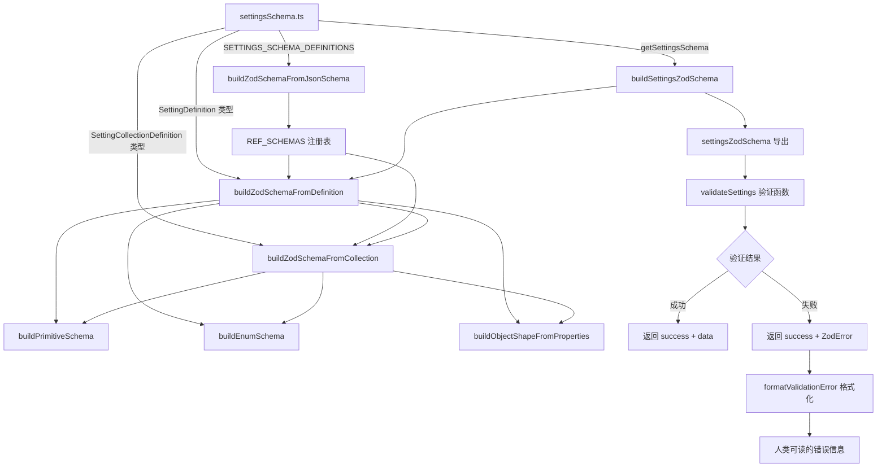

# settings-validation.ts

## 概述

`settings-validation.ts` 是 Gemini CLI 设置验证模块，负责将 `settingsSchema.ts` 中定义的自定义 JSON Schema 风格的设置定义**动态转换为 Zod 验证模式（Schema）**，并提供设置数据的运行时验证能力和友好的错误格式化输出。

该模块的核心职责包括：
1. 将 `SETTINGS_SCHEMA_DEFINITIONS`（JSON Schema 风格的类型定义注册表）编译为 Zod Schema
2. 将 `SETTINGS_SCHEMA`（设置项定义树）递归编译为完整的 Zod 验证对象
3. 对用户提供的设置数据执行安全的运行时验证（`safeParse`）
4. 将验证错误格式化为人类可读的提示信息

## 架构图（Mermaid）



## 核心组件

### 1. 函数 `buildZodSchemaFromJsonSchema(def: any): z.ZodTypeAny`

将 JSON Schema 风格的类型定义递归转换为 Zod Schema。主要用于处理 `SETTINGS_SCHEMA_DEFINITIONS` 中注册的复杂类型（如 `TelemetrySettings`、`SandboxConfig` 等）。

**支持的 JSON Schema 特性：**

| JSON Schema 特性 | Zod 映射 |
|------------------|----------|
| `anyOf: [...]` | `z.union([...])` |
| `type: 'string'` | `z.string()` |
| `type: 'string'` + `enum` | `z.enum([...])` |
| `type: 'number'` | `z.number()` |
| `type: 'boolean'` | `z.boolean()` |
| `type: 'array'` + `items` | `z.array(itemSchema)` |
| `type: 'array'`（无 items） | `z.array(z.unknown())` |
| `type: 'object'` + `properties` | `z.object(shape).passthrough()` |
| `type: 'object'`（无 properties） | `z.object({}).passthrough()` |
| `additionalProperties: false` | `schema.strict()` |
| `additionalProperties: {...}` | `schema.catchall(valueSchema)` |
| `required: [...]` | 对应字段不加 `.optional()` |
| 未匹配类型 | `z.unknown()` |

**注意事项：**
- `passthrough()` 允许未在 `properties` 中声明的额外属性通过验证
- `strict()` 禁止任何未声明的属性
- 非 `required` 列表中的属性自动添加 `.optional()`

### 2. 函数 `buildEnumSchema(options: ReadonlyArray<{value, label}>): z.ZodTypeAny`

从选项数组构建枚举验证 Schema，根据值的类型采取不同策略：

| 值类型 | Zod 映射 |
|--------|----------|
| 全为 `string` | `z.enum([...])` |
| 全为 `number` | `z.union([z.literal(n1), z.literal(n2), ...])` |
| 混合类型 | `z.union([z.literal(v1), z.literal(v2), ...])` |

若 `options` 为空或未定义，抛出错误。

### 3. 函数 `buildObjectShapeFromProperties(properties: Record<string, SettingDefinition>): Record<string, z.ZodTypeAny>`

辅助函数，将属性记录中的每个 `SettingDefinition` 递归转换为 Zod Schema，组装成 `z.object()` 所需的 shape 对象。

### 4. 函数 `buildPrimitiveSchema(type: 'string' | 'number' | 'boolean'): z.ZodTypeAny`

简单的原始类型到 Zod Schema 的映射函数。

### 5. 常量 `REF_SCHEMAS: Record<string, z.ZodTypeAny>`

**引用类型注册表**，在模块加载时通过遍历 `SETTINGS_SCHEMA_DEFINITIONS` 自动初始化。用于解析设置定义中的 `ref` 引用——当某个 `SettingDefinition` 有 `ref` 字段时，直接从注册表中查找预编译的 Zod Schema，避免重复构建。

### 6. 函数 `buildZodSchemaFromDefinition(definition: SettingDefinition): z.ZodTypeAny`

**核心递归函数**，将单个 `SettingDefinition` 转换为 Zod Schema。处理逻辑：

1. **特殊处理 `TelemetrySettings`**：允许 `boolean | TelemetrySettingsObject` 联合类型
2. **`ref` 引用解析**：如果定义有 `ref` 且在 `REF_SCHEMAS` 中存在，直接返回预编译 Schema
3. **按 `type` 分发：**
   - `string` / `number` / `boolean` → `buildPrimitiveSchema`
   - `enum` → `buildEnumSchema`
   - `array` → `z.array(itemSchema)`（item Schema 通过 `buildZodSchemaFromCollection` 构建）
   - `object` → 根据 `properties` 和 `additionalProperties` 组合构建
4. **所有字段最终添加 `.optional()`**，因为设置对象是部分的（用户不必提供所有配置项）

### 7. 函数 `buildZodSchemaFromCollection(collection: SettingCollectionDefinition): z.ZodTypeAny`

处理集合类型定义（数组元素类型、`additionalProperties` 的值类型等），类似 `buildZodSchemaFromDefinition` 但不添加 `.optional()`（因为集合元素本身不是可选的）。

### 8. 函数 `buildSettingsZodSchema(): z.ZodObject<...>`

**顶层构建函数**，调用 `getSettingsSchema()` 获取完整的设置 Schema 定义，遍历每个顶级设置分类，通过 `buildZodSchemaFromDefinition` 递归构建，最终返回一个 `z.object(shape).passthrough()` 作为完整的设置验证 Schema。

### 9. 导出常量 `settingsZodSchema`

```typescript
export const settingsZodSchema = buildSettingsZodSchema();
```

在模块加载时一次性构建的完整设置验证 Schema，后续所有验证调用复用该实例。

### 10. 导出函数 `validateSettings(data: unknown)`

```typescript
export function validateSettings(data: unknown): {
  success: boolean;
  data?: unknown;
  error?: z.ZodError;
}
```

对外提供的验证入口，使用 Zod 的 `safeParse` 进行安全验证（不抛异常），返回结果包含：
- `success: boolean`：是否通过验证
- `data`：验证通过时的解析后数据
- `error`：验证失败时的 `ZodError` 对象

### 11. 导出函数 `formatValidationError(error: z.ZodError, filePath: string): string`

将 Zod 验证错误格式化为用户友好的多行字符串。

**格式化规则：**
- 第一行显示配置文件路径
- 每个错误显示路径（如 `tools.sandbox.enabled`）和错误消息
- 对 `invalid_type` 错误额外显示期望类型和实际类型
- **最多显示 5 个错误**（`MAX_ERRORS_TO_DISPLAY = 5`），超出部分显示数量提示
- 末尾附带修复建议和文档链接

**路径格式化逻辑：**
- 数字索引用方括号表示（如 `arr[0]`）
- 字符串键用点号分隔（如 `tools.sandbox`）
- 空路径显示 `(root)`

**输出示例：**
```
Invalid configuration in /home/user/.gemini/settings.json:

Error in: tools.sandbox.enabled
    Expected boolean, received string
Expected: boolean, but received: string

Please fix the configuration.
See: https://geminicli.com/docs/reference/configuration/
```

## 依赖关系

### 内部依赖

| 依赖模块 | 导入内容 | 用途 |
|----------|----------|------|
| `./settingsSchema.js` | `getSettingsSchema` | 获取完整的设置 Schema 定义 |
| `./settingsSchema.js` | `SettingDefinition` 类型 | 单个设置项的类型定义 |
| `./settingsSchema.js` | `SettingCollectionDefinition` 类型 | 集合/元素类型的定义 |
| `./settingsSchema.js` | `SETTINGS_SCHEMA_DEFINITIONS` | JSON Schema 风格的复杂类型定义注册表 |

### 外部依赖

| 依赖包 | 用途 |
|--------|------|
| `zod` | 运行时类型验证库，提供 Schema 构建、解析和错误处理能力 |

## 关键实现细节

1. **双层 Schema 转换体系**：
   - **第一层**：`buildZodSchemaFromJsonSchema` 处理 `SETTINGS_SCHEMA_DEFINITIONS` 中的 JSON Schema 风格定义，构建 `REF_SCHEMAS` 注册表
   - **第二层**：`buildZodSchemaFromDefinition` / `buildZodSchemaFromCollection` 处理 `SETTINGS_SCHEMA` 中的自定义 `SettingDefinition` 定义，遇到 `ref` 时查询第一层的注册表

   这种设计允许复杂类型（如 `TelemetrySettings`）用标准 JSON Schema 定义一次，然后在多个设置项中通过 `ref` 引用。

2. **`TelemetrySettings` 的特殊处理**：遥测设置支持两种格式——简单的布尔值（`true`/`false`）或详细的对象配置。`buildZodSchemaFromDefinition` 对此做了硬编码的特殊分支：`z.union([z.boolean(), objectSchema]).optional()`。

3. **`passthrough()` 策略**：几乎所有对象类型都使用 `passthrough()`，意味着即使配置中存在 Schema 未定义的额外字段也不会报错。这提供了向前兼容性——新版 CLI 添加的配置项不会导致旧版验证失败。

4. **模块加载时一次性构建**：`settingsZodSchema` 在 import 时立即构建，后续所有 `validateSettings` 调用复用同一个 Schema 实例，避免重复构建的性能开销。

5. **错误显示限制**：`formatValidationError` 最多显示 5 个错误，避免配置文件存在大量问题时输出过长。超出的错误数量通过 `...and N more errors.` 提示。

6. **TypeScript 类型安全性妥协**：由于 JSON Schema 定义本身是动态结构，代码中多处使用了 `any` 类型和 ESLint 禁用注释。这是在动态 Schema 转换场景下的务实选择，核心的类型安全由 Zod 在运行时保证。
