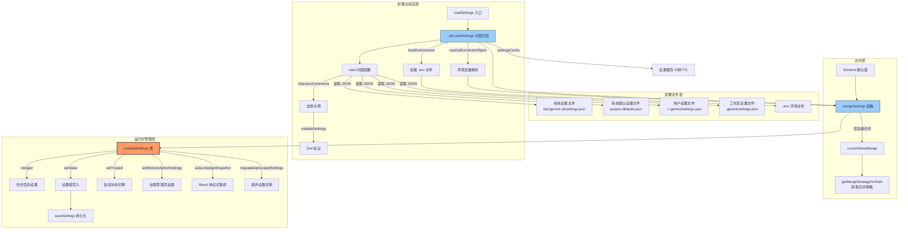

# settings.ts

## 概述

`settings.ts` 是 Gemini CLI 设置系统的**核心模块**，负责设置的完整生命周期管理：加载、验证、合并、迁移、持久化和环境变量处理。它是整个配置系统中最大、最复杂的文件（约 1215 行），协调了多个层级（系统级、系统默认、用户级、工作区级）的设置文件，并通过 `LoadedSettings` 类提供统一的设置访问和响应式更新能力。

该模块的核心职责包括：
1. 从四个不同作用域的 JSON 文件中加载设置
2. 按优先级合并多层设置（支持自定义合并策略）
3. 解析设置中的环境变量引用
4. 验证设置数据的合法性（通过 Zod）
5. 加载 `.env` 环境文件
6. 自动迁移已废弃的设置项
7. 提供响应式设置快照（与 React 的 `useSyncExternalStore` 集成）
8. 支持远程管理员设置的覆盖
9. 设置的持久化保存（保留原始格式和注释）

## 架构图（Mermaid）



## 核心组件

### 1. 设置作用域枚举 `SettingScope`

```typescript
export enum SettingScope {
  User = 'User',           // 用户级设置
  Workspace = 'Workspace', // 工作区级设置
  System = 'System',       // 系统级设置（管理员覆盖）
  SystemDefaults = 'SystemDefaults', // 系统默认设置
  Session = 'Session',     // 会话级设置（仅扩展支持）
}
```

设置合并的**优先级**（后者覆盖前者）：
1. Schema 默认值（内置）
2. 系统默认设置（SystemDefaults）
3. 用户设置（User）
4. 工作区设置（Workspace）
5. 系统设置（System，作为最终覆盖）

### 2. 路径常量与系统路径

```typescript
export const USER_SETTINGS_PATH = Storage.getGlobalSettingsPath();
export const USER_SETTINGS_DIR = path.dirname(USER_SETTINGS_PATH);
export const DEFAULT_EXCLUDED_ENV_VARS = ['DEBUG', 'DEBUG_MODE'];
```

**`getSystemSettingsPath()`**：根据平台返回系统级设置文件路径：
| 平台 | 路径 |
|------|------|
| macOS | `/Library/Application Support/GeminiCli/settings.json` |
| Windows | `C:\ProgramData\gemini-cli\settings.json` |
| Linux | `/etc/gemini-cli/settings.json` |

可通过 `GEMINI_CLI_SYSTEM_SETTINGS_PATH` 环境变量覆盖。

**`getSystemDefaultsPath()`**：系统默认设置文件路径，位于系统设置文件同目录下的 `system-defaults.json`。可通过 `GEMINI_CLI_SYSTEM_DEFAULTS_PATH` 环境变量覆盖。

### 3. 函数 `sanitizeEnvVar(value: string): string`

环境变量值消毒函数，限制字符集为 `a-zA-Z0-9\-_./`，移除所有其他字符。用于不受信任的工作区中的环境变量安全处理。

### 4. 函数 `getMergeStrategyForPath(path: string[]): MergeStrategy | undefined`

根据设置路径在 Schema 中查找对应的合并策略（`MergeStrategy`）。沿路径逐级深入 Schema 定义，支持 `additionalProperties` 的合并策略回退。当找不到匹配路径时返回 `undefined`，此时使用默认的深度合并行为。

### 5. 函数 `getDefaultsFromSchema(schema?: SettingsSchema): Settings`

从 Schema 定义中递归提取所有默认值，构建一个包含所有默认设置的 `Settings` 对象。递归处理 `properties` 子对象，提取 `definition.default` 值。

### 6. 函数 `mergeSettings(system, systemDefaults, user, workspace, isTrusted): MergedSettings`

设置合并的核心函数，按优先级将多个设置层合并为最终的 `MergedSettings`。

**合并流程：**
1. 不受信任的工作区其设置被替换为空对象
2. 从 Schema 提取默认值作为基础
3. 通过 `customDeepMerge` 按优先级合并（最后的参数优先级最高）
4. 使用 `getMergeStrategyForPath` 决定每个路径的合并策略

### 7. 类 `LoadedSettings`

设置系统的核心运行时类，管理所有已加载设置的状态。

**构造函数参数：**
- `system: SettingsFile`：系统级设置文件（只读）
- `systemDefaults: SettingsFile`：系统默认设置文件（只读）
- `user: SettingsFile`：用户级设置文件（可写）
- `workspace: SettingsFile`：工作区级设置文件
- `isTrusted: boolean`：工作区是否受信任
- `errors: SettingsError[]`：加载过程中的错误列表

**关键方法：**

| 方法 | 功能 |
|------|------|
| `get merged` | 返回合并后的设置（getter） |
| `setTrusted(isTrusted)` | 切换工作区信任状态，触发重新合并和事件 |
| `setValue(scope, key, value)` | 设置指定作用域下的值，自动持久化并触发更新 |
| `setRemoteAdminSettings(remoteSettings)` | 应用远程管理员控制设置 |
| `subscribe(listener)` | 订阅设置变更事件（React `useSyncExternalStore` 接口） |
| `getSnapshot()` | 获取不可变设置快照（React `useSyncExternalStore` 接口） |
| `forScope(scope)` | 获取指定作用域的设置文件对象 |

**响应式机制：**
- `subscribe` / `getSnapshot` 配合 React 的 `useSyncExternalStore` 使用
- 通过 `coreEvents.emitSettingsChanged()` 触发更新通知
- 快照通过 `structuredClone` 实现不可变性

**远程管理员设置：**
- `setRemoteAdminSettings` 接收远程管理员控制设置
- 远程 admin 设置**始终优先**于文件中的 admin 设置
- 映射关系：`strictModeDisabled` -> `secureModeEnabled`（取反）、`mcpSetting` -> `admin.mcp`、`cliFeatureSetting` -> `admin.extensions` / `admin.skills`

### 8. 接口 `SettingsFile`

```typescript
export interface SettingsFile {
  settings: Settings;           // 解析后的设置（可含环境变量替换）
  originalSettings: Settings;   // 原始设置（用于保存时保留格式）
  path: string;                // 文件路径
  rawJson?: string;            // 原始 JSON 字符串（含注释）
  readOnly?: boolean;          // 是否只读
}
```

### 9. 函数 `loadSettings(workspaceDir?: string): LoadedSettings`

**设置加载的公开入口**，带有 10 秒 TTL 的缓存机制，避免重复磁盘 I/O。

### 10. 函数 `_doLoadSettings(workspaceDir: string): LoadedSettings`（内部）

实际的设置加载实现，流程：

1. 确定四个设置文件的路径
2. 通过 `load()` 内部函数逐个加载：
   - 读取文件内容
   - `stripJsonComments` 去除 JSON 注释
   - `JSON.parse` 解析
   - `validateSettings` 进行 Zod 验证
   - 验证失败记录为 `warning`，解析失败记录为 `error`
3. 如果工作区是 home 目录，跳过工作区设置
4. `structuredClone` 保存原始设置副本
5. `resolveEnvVarsInObject` 解析环境变量引用
6. 处理遗留主题名映射（`VS` -> `DefaultLight`，`VS2015` -> `DefaultDark`）
7. 初始信任检查（仅基于用户+系统设置）
8. 创建临时合并设置并加载环境变量
9. 检查致命错误，有则抛出 `FatalConfigError`
10. 创建 `LoadedSettings` 实例
11. 执行废弃设置迁移

### 11. 函数 `findEnvFile(startDir: string): string | null`（内部）

从指定目录向上递归查找 `.env` 文件，查找顺序：
1. 当前目录下的 `.gemini/.env`（Gemini 专用）
2. 当前目录下的 `.env`
3. 向父目录递归
4. 最终回退到 `~/gemini/.env` 和 `~/.env`

### 12. 函数 `loadEnvironment(settings, workspaceDir)`

加载环境变量文件的核心函数：
- Cloud Shell 环境特殊处理（`GOOGLE_CLOUD_PROJECT` 默认设为 `cloudshell-gca`）
- 不受信任的沙箱环境中，只允许白名单环境变量（`AUTH_ENV_VAR_WHITELIST`）并进行消毒
- 项目级 `.env` 文件中排除 `DEFAULT_EXCLUDED_ENV_VARS` 中的变量
- 不覆盖已存在的环境变量

### 13. 函数 `migrateDeprecatedSettings(loadedSettings, removeDeprecated = true): boolean`

自动迁移已废弃设置项的函数，遍历所有四个作用域。

**迁移映射：**

| 废弃设置 | 新设置 | 迁移方式 |
|----------|--------|----------|
| `general.disableAutoUpdate` | `general.enableAutoUpdate` | 布尔值取反 |
| `general.disableUpdateNag` | `general.enableAutoUpdateNotification` | 布尔值取反 |
| `ui.accessibility.disableLoadingPhrases` | `ui.accessibility.enableLoadingPhrases` | 布尔值取反 |
| `ui.accessibility.enableLoadingPhrases: false` | `ui.loadingPhrases: 'off'` | 值映射 |
| `context.fileFiltering.disableFuzzySearch` | `context.fileFiltering.enableFuzzySearch` | 布尔值取反 |
| `tools.approvalMode` | `general.defaultApprovalMode` | 路径迁移 |
| `experimental.codebaseInvestigatorSettings` | `agents.overrides.codebase_investigator` | 结构重组 |
| `experimental.cliHelpAgentSettings` | `agents.overrides.cli_help` | 结构重组 |

**特殊行为：**
- 只读作用域（系统级）无法自动迁移，会通过 `coreEvents.emitFeedback` 发出警告
- 默认移除旧的废弃键（`removeDeprecated = true`）
- 新旧键并存时保留新键的值

### 14. 函数 `saveSettings(settingsFile: SettingsFile): void`

保存设置到磁盘：
1. 清除设置缓存
2. 确保目标目录存在
3. 使用 `updateSettingsFilePreservingFormat` 保存，保留原始 JSON 的格式和注释

### 15. 函数 `saveModelChange(loadedSettings, model): void`

便捷函数，将模型选择保存到用户设置中（`model.name` 路径）。

### 16. 辅助接口与类型

| 类型/接口 | 用途 |
|-----------|------|
| `CheckpointingSettings` | 检查点设置（`enabled?: boolean`） |
| `SummarizeToolOutputSettings` | 工具输出摘要设置（`tokenBudget?: number`） |
| `LoadingPhrasesMode` | 加载提示模式（`'tips' | 'witty' | 'all' | 'off'`） |
| `AccessibilitySettings` | 无障碍设置（含已废弃的 `enableLoadingPhrases`） |
| `SessionRetentionSettings` | 会话保留策略（`enabled`、`maxAge`、`maxCount`、`minRetention`） |
| `SettingsError` | 设置加载错误记录 |
| `LoadedSettingsSnapshot` | 不可变设置快照（用于 React 响应式） |
| `LoadableSettingScope` | 可加载的设置作用域子集 |

## 依赖关系

### 内部依赖

| 依赖模块 | 导入内容 | 用途 |
|----------|----------|------|
| `@google/gemini-cli-core` | `CoreEvent`, `coreEvents` | 事件系统，发送设置变更通知 |
| `@google/gemini-cli-core` | `FatalConfigError` | 致命配置错误异常 |
| `@google/gemini-cli-core` | `GEMINI_DIR` | Gemini 目录名常量（`.gemini`） |
| `@google/gemini-cli-core` | `getErrorMessage`, `getFsErrorMessage` | 错误消息提取工具 |
| `@google/gemini-cli-core` | `Storage` | 存储工具类，获取设置文件路径 |
| `@google/gemini-cli-core` | `homedir` | 跨平台 home 目录获取 |
| `@google/gemini-cli-core` | `AdminControlsSettings` 类型 | 远程管理员控制设置类型 |
| `@google/gemini-cli-core` | `createCache` | 带 TTL 的缓存工厂 |
| `./settingsSchema.js` | `Settings`, `MergedSettings` 等类型 | 设置相关类型定义 |
| `./settingsSchema.js` | `getSettingsSchema` | 获取 Schema 定义 |
| `./settings-validation.js` | `validateSettings`, `formatValidationError` | 设置验证和错误格式化 |
| `./trustedFolders.js` | `isWorkspaceTrusted` | 工作区信任检查 |
| `../utils/envVarResolver.js` | `resolveEnvVarsInObject` | 递归解析设置中的环境变量引用 |
| `../utils/deepMerge.js` | `customDeepMerge` | 支持自定义策略的深度合并 |
| `../utils/commentJson.js` | `updateSettingsFilePreservingFormat` | 保留格式和注释的 JSON 保存 |
| `../ui/themes/builtin/light/default-light.js` | `DefaultLight` | 默认亮色主题（用于旧主题名映射） |
| `../ui/themes/builtin/dark/default-dark.js` | `DefaultDark` | 默认暗色主题（用于旧主题名映射） |

### 外部依赖

| 依赖包 | 用途 |
|--------|------|
| `node:fs` | 文件系统操作（读取/写入设置文件、检查文件存在性） |
| `node:path` | 路径操作（拼接、解析目录） |
| `node:os` | 获取操作系统平台（`platform()`） |
| `node:process` | 访问环境变量、命令行参数 |
| `dotenv` | 解析 `.env` 文件内容 |
| `strip-json-comments` | 去除 JSON 文件中的注释（支持 JSONC 格式） |

## 关键实现细节

1. **多层设置合并优先级**：系统设置（System）作为最终覆盖层，优先级最高。这使管理员可以强制覆盖用户的任何设置。工作区设置在用户设置之上，但在系统设置之下。系统默认设置优先级最低（仅高于 Schema 内置默认值），提供组织级的默认配置。

2. **工作区信任机制**：不受信任的工作区其设置被完全忽略（替换为空对象）。信任状态可通过 `setTrusted` 动态切换，切换后自动重新合并并触发事件。初始信任检查不包含工作区设置，避免不受信任的工作区通过自身设置绕过信任检查。

3. **环境变量安全**：不受信任但处于沙箱中的工作区，其 `.env` 文件中只允许加载白名单变量（`GEMINI_API_KEY` 等认证相关），且值经过 `sanitizeEnvVar` 消毒。项目级 `.env` 中的 `DEBUG`/`DEBUG_MODE` 默认被排除。

4. **设置缓存**：`settingsCache` 使用 10 秒 TTL，同一工作区目录在 10 秒内的重复 `loadSettings` 调用直接返回缓存。`saveSettings` 时清除整个缓存，确保下次加载读取最新数据。

5. **原始设置与解析后设置的分离**：`originalSettings` 保留用户写入的原始值（含 `${ENV_VAR}` 引用），`settings` 是环境变量解析后的运行时值。保存时使用 `originalSettings`，确保不会将解析后的值写回文件。

6. **格式保留保存**：通过 `updateSettingsFilePreservingFormat` 保存设置，保留原始 JSON 中的注释、缩进和格式，避免用户的手工格式化被破坏。

7. **React 响应式集成**：`LoadedSettings` 的 `subscribe` / `getSnapshot` 方法严格符合 React `useSyncExternalStore` 的接口规范。快照通过 `structuredClone` 深拷贝，确保不可变性——React 通过对象引用相等性判断是否需要重新渲染。

8. **废弃设置自动迁移**：加载完成后立即执行 `migrateDeprecatedSettings`，自动将旧的 `disable*` 布尔值迁移为新的 `enable*`（取反），并移除旧键。对于只读的系统级文件，仅发出警告而不尝试修改。

9. **Cloud Shell 特殊处理**：在 Google Cloud Shell 环境中，`GOOGLE_CLOUD_PROJECT` 被默认设为 `cloudshell-gca`，避免使用用户通过 `gcloud config set project` 设置的值，除非 `.env` 文件中显式覆盖。

10. **re-export 模式**：模块从 `settingsSchema.js` 导入类型后立即 re-export，使消费方可以只依赖 `settings.ts` 而不必直接导入 `settingsSchema.ts`，简化了依赖图。
