# settingsSchema.ts

## 概述

`settingsSchema.ts` 是 Gemini CLI 配置系统的**基石模块**（约 3118 行），定义了整个应用程序所有可配置设置项的**规范化 Schema**。它既是设置的**类型定义源**（通过 TypeScript 高级类型推断自动生成 `Settings` 和 `MergedSettings` 类型），也是设置的**运行时元数据源**（包含默认值、描述、分类、UI 展示控制、合并策略等）。

该模块的核心职责包括：
1. 定义所有设置项的 Schema 结构（`SETTINGS_SCHEMA`），包括类型、默认值、描述、分类、嵌套关系
2. 定义复杂引用类型的 JSON Schema 风格定义（`SETTINGS_SCHEMA_DEFINITIONS`），如 MCP 服务器配置、遥测设置等
3. 通过 TypeScript 条件类型从 Schema 自动推断出 `Settings`（部分/可选）和 `MergedSettings`（完整/必需）类型
4. 提供设置的元数据接口（`SettingDefinition`），供 UI 对话框、文档生成器、验证器使用
5. 定义合并策略枚举（`MergeStrategy`），控制多层设置合并行为

## 架构图（Mermaid）

```mermaid
graph TD
    subgraph 类型定义层
        ST[SettingsType 类型枚举]
        SV[SettingsValue 值类型]
        SEO[SettingEnumOption 枚举选项]
        SCD[SettingCollectionDefinition 集合定义]
        SD[SettingDefinition 设置定义]
        SS[SettingsSchema 键值映射]
        MS_E[MergeStrategy 合并策略枚举]
    end

    subgraph Schema 核心
        SCHEMA[SETTINGS_SCHEMA<br>规范化设置 Schema<br>as const satisfies]
        DEFS[SETTINGS_SCHEMA_DEFINITIONS<br>JSON Schema 引用类型注册表]
        GSS[getSettingsSchema 函数]
    end

    subgraph 设置分类
        S_MCP[mcpServers<br>MCP 服务器]
        S_GEN[general<br>通用设置]
        S_OUT[output<br>输出设置]
        S_UI[ui<br>界面设置]
        S_IDE[ide<br>IDE 集成]
        S_PRI[privacy<br>隐私设置]
        S_TEL[telemetry<br>遥测设置]
        S_BIL[billing<br>计费设置]
        S_MOD[model<br>模型设置]
        S_MC[modelConfigs<br>模型配置]
        S_AGT[agents<br>代理设置]
        S_CTX[context<br>上下文设置]
        S_TOL[tools<br>工具设置]
        S_MCP2[mcp<br>MCP 设置]
        S_SEC[security<br>安全设置]
        S_ADV[advanced<br>高级设置]
        S_EXP[experimental<br>实验设置]
        S_EXT[extensions<br>扩展设置]
        S_SKL[skills<br>技能设置]
        S_HKC[hooksConfig<br>钩子配置]
        S_HK[hooks<br>钩子事件]
        S_ADM[admin<br>管理员设置]
    end

    subgraph 类型推断
        IS[InferSettings 条件类型]
        IMS[InferMergedSettings 条件类型]
        SETTINGS_T["Settings 类型<br>(所有字段可选)"]
        MERGED_T["MergedSettings 类型<br>(所有字段必需)"]
    end

    SD --> SS
    SCD --> SD
    MS_E --> SD
    MS_E --> SCD
    SEO --> SD

    SCHEMA --> S_MCP & S_GEN & S_OUT & S_UI & S_IDE & S_PRI
    SCHEMA --> S_TEL & S_BIL & S_MOD & S_MC & S_AGT & S_CTX
    SCHEMA --> S_TOL & S_MCP2 & S_SEC & S_ADV & S_EXP & S_EXT
    SCHEMA --> S_SKL & S_HKC & S_HK & S_ADM

    GSS --> SCHEMA
    SCHEMA --> IS --> SETTINGS_T
    SCHEMA --> IMS --> MERGED_T

    DEFS -->|MCPServerConfig| S_MCP
    DEFS -->|TelemetrySettings| S_TEL
    DEFS -->|CustomTheme| S_UI
    DEFS -->|AgentOverride| S_AGT
    DEFS -->|HookDefinitionArray| S_HK

    style SCHEMA fill:#f96,stroke:#333,stroke-width:2px
    style DEFS fill:#9cf,stroke:#333,stroke-width:2px
    style SETTINGS_T fill:#9f9,stroke:#333
    style MERGED_T fill:#9f9,stroke:#333
```



## 核心组件

### 1. 类型定义

#### `SettingsType`
```typescript
export type SettingsType = 'boolean' | 'string' | 'number' | 'array' | 'object' | 'enum';
```
设置项支持的六种数据类型。

#### `SettingsValue`
```typescript
export type SettingsValue = boolean | string | number | string[] | object | undefined;
```
设置值的联合类型。

#### `SettingEnumOption`
```typescript
export interface SettingEnumOption {
  value: string | number;
  label: string;
}
```
枚举类型设置的选项定义，`value` 为实际值，`label` 为 UI 显示文本。

#### `TOGGLE_TYPES`
```typescript
export const TOGGLE_TYPES: ReadonlySet<SettingsType | undefined> = new Set(['boolean', 'enum']);
```
标识"切换类"设置类型——这些类型的值在固定列表中循环选择（如布尔翻转、枚举循环），而非自由输入。

### 2. 接口 `SettingCollectionDefinition`

集合/子元素类型的定义，用于描述数组元素（`items`）或 Map 值（`additionalProperties`）的结构：

```typescript
export interface SettingCollectionDefinition {
  type: SettingsType;
  description?: string;
  properties?: SettingsSchema;
  options?: readonly SettingEnumOption[];
  ref?: string;              // 引用 SETTINGS_SCHEMA_DEFINITIONS 中的类型
  mergeStrategy?: MergeStrategy;
}
```

### 3. 枚举 `MergeStrategy`

```typescript
export enum MergeStrategy {
  REPLACE = 'replace',       // 替换（默认行为）
  CONCAT = 'concat',         // 数组拼接
  UNION = 'union',           // 数组去重合并
  SHALLOW_MERGE = 'shallow_merge', // 对象浅合并
}
```

控制多层设置（系统/用户/工作区）合并时的行为策略。不同的设置项可以指定不同的合并策略，例如：
- `mcpServers`：`SHALLOW_MERGE`（多层 MCP 服务器配置浅合并）
- `policyPaths`：`UNION`（策略路径去重合并）
- Hook 事件：`CONCAT`（钩子数组拼接，不去重）
- Admin 设置：`REPLACE`（管理员设置完全替代）

### 4. 接口 `SettingDefinition`

每个设置项的完整元数据定义：

```typescript
export interface SettingDefinition {
  type: SettingsType;           // 数据类型
  label: string;                // 显示标签
  category: string;             // 所属分类
  requiresRestart: boolean;     // 修改后是否需要重启
  default: SettingsValue;       // 默认值
  description?: string;         // 描述文本
  parentKey?: string;           // 父级键名
  childKey?: string;            // 子级键名
  key?: string;                 // 自身键名
  properties?: SettingsSchema;  // 子属性（对象类型）
  showInDialog?: boolean;       // 是否在设置对话框中显示
  ignoreInDocs?: boolean;       // 是否在文档中忽略
  mergeStrategy?: MergeStrategy;// 合并策略
  options?: readonly SettingEnumOption[]; // 枚举选项
  items?: SettingCollectionDefinition;    // 数组元素定义
  additionalProperties?: SettingCollectionDefinition; // Map 值定义
  unit?: string;                // 值的单位（如 '%'）
  ref?: string;                 // 引用类型标识
}
```

### 5. 辅助函数 `oneLine`

模板标签函数，将多行模板字符串压缩为单行（将所有连续空白替换为单个空格）。用于在 Schema 定义中编写长描述而不影响代码格式化。

### 6. 辅助函数 `pathArraySetting`

工厂函数，生成"路径数组"类型设置的标准定义。用于 `policyPaths` 和 `adminPolicyPaths`，避免重复代码。

### 7. 常量 `SETTINGS_SCHEMA`

**整个模块的核心**——通过 `as const satisfies SettingsSchema` 声明的完整设置 Schema 对象。`as const` 确保类型精确到字面量级别，`satisfies` 确保结构符合 `SettingsSchema` 接口。

#### 顶级设置分类总览

| 键名 | 分类 | 设置数量 | 描述 |
|------|------|---------|------|
| `mcpServers` | Advanced | - | MCP 服务器配置（Map 类型） |
| `policyPaths` | Advanced | 1 | 额外策略文件路径 |
| `adminPolicyPaths` | Advanced | 1 | 管理员策略路径 |
| `general` | General | 13+ | 通用设置（编辑器、审批模式、更新、检查点、会话保留等） |
| `output` | General | 1 | 输出格式（text/json） |
| `ui` | UI | 30+ | 界面设置（主题、底栏、无障碍、加载提示、渲染等） |
| `ide` | IDE | 2 | IDE 集成模式 |
| `privacy` | Privacy | 1 | 隐私设置（使用统计） |
| `telemetry` | Advanced | - | 遥测配置（ref: TelemetrySettings） |
| `billing` | Advanced | 1 | 计费策略（配额耗尽处理） |
| `model` | Model | 6 | 模型设置（名称、会话轮数、工具输出摘要、压缩阈值等） |
| `modelConfigs` | Model | 6 | 模型配置（别名、覆盖、定义、解析规则、链路） |
| `agents` | Advanced | 2 | 子代理设置（覆盖配置、浏览器代理） |
| `context` | Context | 7 | 上下文设置（文件过滤、目录树、内存导入等） |
| `tools` | Tools | 14 | 工具设置（沙箱、Shell、核心/允许/排除工具等） |
| `mcp` | MCP | 3 | MCP 协议设置（服务器命令、允许/排除列表） |
| `useWriteTodos` | Advanced | 1 | 写 TODO 工具开关 |
| `security` | Security | 11+ | 安全设置（工具沙箱、YOLO 模式、认证、环境变量脱敏等） |
| `advanced` | Advanced | 4 | 高级设置（内存、DNS、环境变量排除、Bug 命令） |
| `experimental` | Experimental | 20+ | 实验功能（代理、工作树、扩展、JIT 上下文、计划模式等） |
| `extensions` | Extensions | 2 | 扩展管理设置 |
| `skills` | Advanced | 2 | 代理技能设置 |
| `hooksConfig` | Advanced | 3 | 钩子系统全局配置 |
| `hooks` | Advanced | 11 | 钩子事件定义（BeforeTool、AfterTool、BeforeAgent 等） |
| `admin` | Admin | 4 | 远程管理员控制设置 |

#### 重要子分类详解

**general（通用设置）：**
- `preferredEditor`：首选编辑器
- `vimMode`：Vim 键绑定
- `defaultApprovalMode`：默认审批模式（`default`/`auto_edit`/`plan`）
- `enableAutoUpdate` / `enableAutoUpdateNotification`：自动更新
- `enableNotifications`：运行事件通知
- `checkpointing.enabled`：会话检查点
- `plan.directory` / `plan.modelRouting`：计划模式
- `retryFetchErrors`：网络错误重试
- `maxAttempts`：最大请求尝试次数（上限 10）
- `sessionRetention`：会话清理策略（`enabled`/`maxAge`/`maxCount`/`minRetention`）

**ui（界面设置）：**
- 主题相关：`theme`、`autoThemeSwitching`、`customThemes`
- 底栏控制：`footer.items`、`footer.hideCWD`、`footer.hideModelInfo` 等
- 显示控制：`hideBanner`、`hideContextSummary`、`hideTips`、`showShortcutsHint`
- 渲染相关：`useAlternateBuffer`、`incrementalRendering`、`useBackgroundColor`
- 加载提示：`loadingPhrases`（`tips`/`witty`/`all`/`off`）、`customWittyPhrases`
- 无障碍：`accessibility.screenReader`
- 内联思考：`inlineThinkingMode`（`off`/`full`）

**tools（工具设置）：**
- 沙箱：`sandbox`（支持布尔/字符串/对象三种格式）、`sandboxAllowedPaths`、`sandboxNetworkAccess`
- Shell：`shell.enableInteractiveShell`、`shell.pager`、`shell.inactivityTimeout`
- 工具过滤：`core`（核心工具白名单）、`allowed`（免确认工具）、`exclude`（排除工具）
- 自定义工具：`discoveryCommand`、`callCommand`

**security（安全设置）：**
- `toolSandboxing`：实验性工具级沙箱
- `disableYoloMode`：禁用 YOLO 模式
- `disableAlwaysAllow`：禁用"始终允许"
- `enablePermanentToolApproval`：永久工具审批
- `folderTrust.enabled`：文件夹信任机制
- `environmentVariableRedaction`：环境变量脱敏
- `auth`：认证设置（`selectedType`/`enforcedType`/`useExternal`）
- `enableConseca`：上下文感知安全检查器

**hooks（钩子事件）：**
支持 11 种预定义事件 + 自定义事件：
`BeforeTool`、`AfterTool`、`BeforeAgent`、`AfterAgent`、`Notification`、`SessionStart`、`SessionEnd`、`PreCompress`、`BeforeModel`、`AfterModel`、`BeforeToolSelection`

### 8. 常量 `SETTINGS_SCHEMA_DEFINITIONS`

JSON Schema 风格的复杂类型注册表，为 Schema 中通过 `ref` 引用的类型提供详细定义。这些定义被 `settings-validation.ts` 编译为 Zod Schema 用于运行时验证，也可用于生成 JSON Schema 文档。

| 定义名 | 描述 |
|--------|------|
| `MCPServerConfig` | MCP 服务器完整配置（命令、参数、环境变量、URL、传输类型、OAuth 等） |
| `RequiredMcpServerConfig` | 管理员必需的 MCP 服务器（仅远程传输） |
| `TelemetrySettings` | 遥测配置（启用、目标、OTLP 端点等） |
| `BugCommandSettings` | Bug 报告命令配置 |
| `SummarizeToolOutputSettings` | 工具输出摘要设置 |
| `AgentOverride` | 子代理覆盖配置（模型、运行配置、启用状态） |
| `CustomTheme` | 自定义主题定义（文本/背景/边框/UI/状态颜色） |
| `StringOrStringArray` | 字符串或字符串数组联合类型 |
| `BooleanOrStringOrObject` | 布尔/字符串/沙箱配置对象联合类型 |
| `HookDefinitionArray` | 钩子定义数组（matcher + hooks） |
| `ModelDefinition` | 模型元数据（名称、层级、特性等） |
| `ModelResolution` | 模型解析规则（默认值 + 条件上下文） |
| `ModelPolicyChain` | 模型可用性策略链（回退行为） |
| `ModelPolicy` | 单个模型的策略（状态转换、动作） |

### 9. 函数 `getSettingsSchema(): SettingsSchemaType`

公开访问 `SETTINGS_SCHEMA` 的函数入口，返回类型为 `typeof SETTINGS_SCHEMA`（保留完整的字面量类型信息）。

### 10. 类型推断 `InferSettings` 和 `InferMergedSettings`

两个高级条件类型，从 Schema 常量自动推断出 TypeScript 类型：

```typescript
type InferSettings<T extends SettingsSchema> = {
  -readonly [K in keyof T]?: ...  // 所有字段可选（用户可能只配置部分）
};

type InferMergedSettings<T extends SettingsSchema> = {
  -readonly [K in keyof T]-?: ... // 所有字段必需（合并后保证完整性）
};
```

**类型推断逻辑：**
1. 有 `properties` 的设置 → 递归推断子类型
2. `enum` 类型 → 联合字面量类型（从 `options` 推断）
3. 默认值为 `boolean` → `boolean`
4. 默认值为 `string` → `string`
5. 默认值为 `ReadonlyArray<U>` → `U[]`
6. 其他 → 直接使用 `default` 的类型

**最终导出：**
```typescript
export type Settings = InferSettings<SettingsSchemaType>;       // 部分类型
export type MergedSettings = InferMergedSettings<SettingsSchemaType>; // 完整类型
```

## 依赖关系

### 内部依赖

| 依赖模块 | 导入内容 | 用途 |
|----------|----------|------|
| `@google/gemini-cli-core` | `DEFAULT_TRUNCATE_TOOL_OUTPUT_THRESHOLD` | 工具输出截断阈值默认值 |
| `@google/gemini-cli-core` | `DEFAULT_MODEL_CONFIGS` | 模型配置默认值 |
| `@google/gemini-cli-core` | `AuthProviderType` | 认证提供者类型枚举 |
| `@google/gemini-cli-core` | `MCPServerConfig` 类型 | MCP 服务器配置类型 |
| `@google/gemini-cli-core` | `RequiredMcpServerConfig` 类型 | 必需 MCP 服务器配置类型 |
| `@google/gemini-cli-core` | `BugCommandSettings` 类型 | Bug 命令设置类型 |
| `@google/gemini-cli-core` | `TelemetrySettings` 类型 | 遥测设置类型 |
| `@google/gemini-cli-core` | `AuthType` 类型 | 认证类型 |
| `@google/gemini-cli-core` | `AgentOverride` 类型 | 代理覆盖类型 |
| `@google/gemini-cli-core` | `CustomTheme` 类型 | 自定义主题类型 |
| `@google/gemini-cli-core` | `SandboxConfig` 类型 | 沙箱配置类型 |
| `./settings.js` | `SessionRetentionSettings` 类型 | 会话保留设置类型 |
| `../utils/sessionCleanup.js` | `DEFAULT_MIN_RETENTION` | 最小保留期限默认值 |

### 外部依赖

无。该模块不使用任何外部 npm 包或 Node.js 内置模块（除了 TypeScript 类型系统本身）。

## 关键实现细节

1. **`as const satisfies SettingsSchema` 双重约束**：`as const` 让 TypeScript 推断出最精确的字面量类型（例如 `default: false` 的类型是 `false` 而非 `boolean`），`satisfies` 确保对象结构符合 `SettingsSchema` 接口而不丢失精确类型。这是 TypeScript 4.9+ 的特性，使得类型推断和结构验证可以并存。

2. **Schema 即类型源**：`Settings` 和 `MergedSettings` 类型完全由 `SETTINGS_SCHEMA` 推断而来，不存在手动维护的类型定义。这确保了 Schema 变更自动反映为类型变更，消除了类型与 Schema 不一致的风险。

3. **`Settings` vs `MergedSettings` 的区别**：
   - `Settings`：所有字段 `?`（可选），表示用户的部分配置
   - `MergedSettings`：所有字段 `-?`（必需），表示合并后的完整配置，所有值都有保障（来自默认值或某层设置）

4. **`ref` 引用机制**：`SettingDefinition` 的 `ref` 字段引用 `SETTINGS_SCHEMA_DEFINITIONS` 中的类型名。这种设计类似 JSON Schema 的 `$ref`，允许复杂类型（如 MCP 配置）只定义一次，在多处引用。`settings-validation.ts` 负责将 `ref` 解析为 Zod Schema。

5. **合并策略声明式设计**：每个设置项可以通过 `mergeStrategy` 字段声明合并行为，而非在合并逻辑中硬编码。这使得新增设置时只需在 Schema 中声明策略，无需修改合并代码。

6. **`showInDialog` 控制**：布尔字段控制设置是否在 CLI 的交互式设置对话框中显示。许多高级或内部设置（如 `mcpServers`、`admin`）不在对话框中显示，只能通过编辑 JSON 文件配置。

7. **`requiresRestart` 标记**：标识修改后是否需要重启 CLI 才能生效。例如 `ui.theme` 不需要重启（运行时可切换），但 `security.auth.enforcedType` 需要重启。

8. **`ignoreInDocs` 标记**：控制是否在自动生成的文档中排除某个设置项。运行 `npm run docs:settings` 时参考此标记。

9. **默认值的类型断言**：Schema 中大量使用 `as` 断言来为默认值提供更精确的类型，例如 `default: undefined as string | undefined`、`default: {} as Record<string, MCPServerConfig>`。这是因为 `as const` 会将 `undefined` 推断为 `undefined` 类型（太窄），断言可以扩展到期望的联合类型。

10. **Admin 设置的 REPLACE 策略**：`admin` 分类下的所有设置都使用 `MergeStrategy.REPLACE`。这确保远程管理员设置完全覆盖本地配置，而非合并——安全相关的设置不应该被本地配置"稀释"。

11. **Hook 事件的可扩展性**：`hooks` 设置除了预定义的 11 种事件外，还通过 `additionalProperties` 支持用户自定义事件名，使用 `CONCAT` 合并策略拼接各层的钩子定义。

12. **浏览器代理安全设置**：`agents.browser` 包含细粒度的安全控制，如 `allowedDomains`（域名白名单）、`confirmSensitiveActions`（敏感操作确认）、`blockFileUploads`（阻止文件上传）、`maxActionsPerTask`（最大操作数硬限制）、`disableUserInput`（自动化时禁用用户输入）。

13. **循环依赖处理**：`settingsSchema.ts` 从 `settings.ts` 导入 `SessionRetentionSettings` 类型，而 `settings.ts` 又从 `settingsSchema.ts` 导入大量类型。TypeScript 可以处理类型级别的循环引用（因为类型在编译后被擦除），但在代码注释中仍建议谨慎处理。
