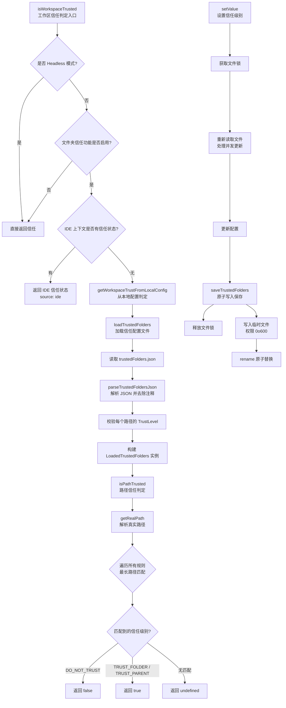

# trustedFolders.ts

## 概述

`trustedFolders.ts` 是 Gemini CLI 的**文件夹信任管理模块**，负责管理工作区的信任状态。该模块实现了一套完整的"文件夹信任"安全机制，允许用户配置哪些目录是受信任的、哪些不受信任，从而控制 CLI 在不同目录下的行为权限。信任配置以 JSON 文件形式持久化存储在用户主目录下的 `.gemini/trustedFolders.json` 中。

核心功能包括：
- 信任级别枚举定义（信任当前文件夹、信任父目录、不信任）
- 信任配置文件的加载、解析、保存（支持 JSON 注释）
- 基于最长路径匹配的信任判定算法
- 并发安全的配置文件更新（文件锁 + 临时文件原子写入）
- 多信任来源优先级（Headless 模式 > IDE 上下文 > 本地配置文件）

## 架构图（Mermaid）

## 核心组件

### 1. 枚举 `TrustLevel`

定义了三种信任级别：

| 枚举值 | 含义 |
|--------|------|
| `TRUST_FOLDER` | 信任该文件夹本身及其所有子目录 |
| `TRUST_PARENT` | 信任该路径的**父目录**及父目录下的所有子目录 |
| `DO_NOT_TRUST` | 明确标记为不信任 |

### 2. 类 `LoadedTrustedFolders`

核心类，封装了已加载的信任配置和解析错误列表。

**构造参数：**
- `user: TrustedFoldersFile` — 用户级别的信任配置文件（包含路径和配置内容）
- `errors: TrustedFoldersError[]` — 解析过程中发生的错误列表

**关键属性：**
- `rules: TrustRule[]` — 将配置对象转为路径-信任级别的规则数组（getter）

**关键方法：**

#### `isPathTrusted(location, config?, headlessOptions?): boolean | undefined`

判定指定路径是否受信任。算法逻辑：

1. 如果是 Headless 模式，直接返回 `true`
2. 将待判定路径解析为真实路径（realpath），处理符号链接
3. 遍历所有信任规则，对每条规则：
   - 如果是 `TRUST_PARENT`，取规则路径的父目录作为有效路径
   - 将有效路径也解析为真实路径
   - 使用 `isWithinRoot()` 判断目标路径是否在有效路径范围内
4. 采用**最长路径匹配**策略：多条规则都匹配时，以路径字符串最长的规则为准
5. 返回值：`true`（信任）、`false`（不信任）、`undefined`（无匹配规则）

#### `setValue(folderPath, trustLevel): Promise<void>`

异步设置指定路径的信任级别，具有以下安全保障：

1. **前置校验**：如果存在解析错误，抛出 `FatalConfigError` 拒绝更新
2. **目录自动创建**：如果配置文件目录不存在则自动创建
3. **文件锁**：使用 `proper-lockfile` 获取文件锁，防止并发写入冲突（最多重试 10 次，最小间隔 100ms）
4. **重新读取**：在锁内重新读取文件，确保拿到最新内容
5. **回滚机制**：如果 `saveTrustedFolders` 失败，将内存中的配置回滚到修改前的状态

### 3. 函数 `loadTrustedFolders(): LoadedTrustedFolders`

单例加载函数，带有模块级缓存（`loadedTrustedFolders`）。

加载流程：
1. 检查缓存，有则直接返回
2. 获取信任配置文件路径（支持 `GEMINI_CLI_TRUSTED_FOLDERS_PATH` 环境变量覆盖）
3. 如果文件存在，读取并用 `strip-json-comments` 去除注释后解析
4. 校验解析结果必须是对象（非数组、非 null）
5. 遍历每个条目，验证 `TrustLevel` 的合法性
6. 收集所有错误到 `errors` 数组
7. 构建并缓存 `LoadedTrustedFolders` 实例

### 4. 函数 `saveTrustedFolders(trustedFoldersFile): void`

同步保存信任配置到文件，采用**原子写入**策略：
1. 确保目标目录存在
2. 将配置序列化为格式化 JSON
3. 先写入带随机 UUID 后缀的临时文件（权限 `0o600`，仅所有者可读写）
4. 使用 `fs.renameSync()` 原子替换目标文件
5. 如果 rename 失败，清理临时文件

### 5. 函数 `isWorkspaceTrusted(settings, workspaceDir?, trustConfig?, headlessOptions?): TrustResult`

工作区信任判定的顶层入口，按优先级从高到低依次判定：

1. **Headless 模式**：直接返回信任（`isTrusted: true`）
2. **功能开关**：如果 `settings.security.folderTrust.enabled` 为 `false`，直接返回信任
3. **IDE 信任上下文**：从 `ideContextStore` 获取 IDE 提供的信任状态（source: `'ide'`）
4. **本地配置文件**：通过 `getWorkspaceTrustFromLocalConfig` 从 `trustedFolders.json` 判定（source: `'file'`）

### 6. 辅助函数

#### `getRealPath(location): string`
解析路径的真实路径（处理符号链接），带有模块级缓存 `realPathCache`。如果路径不存在或解析失败，返回原始路径。

#### `getUserSettingsDir(): string`
返回用户设置目录：`~/.gemini/`

#### `getTrustedFoldersPath(): string`
返回信任配置文件路径，优先使用环境变量 `GEMINI_CLI_TRUSTED_FOLDERS_PATH`，否则为 `~/.gemini/trustedFolders.json`

#### `isTrustLevel(value): value is TrustLevel`
类型守卫，判断值是否为合法的 `TrustLevel` 枚举值

#### `isFolderTrustEnabled(settings): boolean`
从 settings 读取 `security.folderTrust.enabled`，默认为 `true`

## 依赖关系

### 内部依赖

| 模块 | 导入内容 | 用途 |
|------|---------|------|
| `@google/gemini-cli-core` | `FatalConfigError` | 致命配置错误类，在配置文件无效时抛出 |
| `@google/gemini-cli-core` | `getErrorMessage` | 从未知错误对象提取错误消息字符串 |
| `@google/gemini-cli-core` | `isWithinRoot` | 判断路径是否在指定根路径下（路径包含关系判定） |
| `@google/gemini-cli-core` | `ideContextStore` | IDE 上下文存储，用于获取 IDE 提供的工作区信任状态 |
| `@google/gemini-cli-core` | `GEMINI_DIR` | Gemini 配置目录名常量（`.gemini`） |
| `@google/gemini-cli-core` | `homedir` | 获取用户主目录的函数 |
| `@google/gemini-cli-core` | `isHeadlessMode` | 判断是否处于 Headless（无头）运行模式 |
| `@google/gemini-cli-core` | `coreEvents` | 核心事件总线，用于发送错误反馈 |
| `@google/gemini-cli-core` | `HeadlessModeOptions` | Headless 模式选项类型 |
| `./settings.js` | `Settings` | 设置类型，用于读取文件夹信任的开关配置 |

### 外部依赖

| 包名 | 用途 |
|------|------|
| `node:fs` | 文件系统操作（同步读写、existsSync、realpathSync、renameSync 等） |
| `node:path` | 路径操作（join、dirname） |
| `node:crypto` | 生成随机 UUID 用于临时文件名 |
| `proper-lockfile` | 文件级别的互斥锁，防止并发写入冲突 |
| `strip-json-comments` | 去除 JSON 文件中的注释（支持 `//` 和 `/* */` 风格注释） |

## 关键实现细节

### 1. 最长路径匹配算法

当多条信任规则都匹配目标路径时，模块采用**最长路径匹配**策略来确定最终的信任级别。这意味着更具体（更深层）的规则优先于更笼统（更浅层）的规则。例如：

- 规则 `/home/user/projects` → `TRUST_FOLDER`
- 规则 `/home/user/projects/secret` → `DO_NOT_TRUST`

查询 `/home/user/projects/secret/code` 时，第二条规则路径更长，最终判定为**不信任**。

### 2. `TRUST_PARENT` 的语义

`TRUST_PARENT` 信任级别具有特殊语义：它将规则路径的**父目录**作为有效匹配路径。这意味着如果用户信任了 `/home/user/projects/myapp`（TRUST_PARENT），实际生效的是 `/home/user/projects/` 及其所有子目录。这在首次进入一个新目录时特别有用——用户可以选择信任包含该目录的父级。

### 3. 原子写入保证数据安全

保存操作使用「写临时文件 + rename」的经典原子写入模式。`rename` 在 POSIX 系统上是原子操作，确保即使在写入过程中进程崩溃，原有配置文件也不会损坏。临时文件名使用 `crypto.randomUUID()` 生成，避免多进程同时写入时的命名冲突。

### 4. 文件锁防并发

`setValue` 方法在修改配置前先通过 `proper-lockfile` 获取文件锁，并在锁内重新读取文件内容。这解决了以下竞态条件：

1. 进程 A 读取配置
2. 进程 B 读取配置
3. 进程 A 写入修改后的配置
4. 进程 B 覆盖进程 A 的修改

通过锁内重读，确保每次写入都基于最新的文件内容。

### 5. 符号链接处理

模块通过 `getRealPath()` 将所有路径解析为真实路径（canonical path），确保符号链接指向的目标路径能正确匹配信任规则。解析结果缓存在 `realPathCache` Map 中以避免重复的文件系统调用。

### 6. 多来源信任优先级

信任判定有明确的优先级链：
1. **Headless 模式** — 自动化场景（如 CI/CD）始终信任
2. **Settings 开关** — 全局禁用文件夹信任功能
3. **IDE 上下文** — VS Code 等 IDE 通过扩展传递的信任状态
4. **本地配置文件** — 用户在 `trustedFolders.json` 中手动配置的规则

### 7. 文件权限安全

配置文件和临时文件写入时均使用 `mode: 0o600`（仅文件所有者可读写），防止其他用户读取或篡改信任配置。

### 8. 错误容忍策略

- 加载阶段：解析错误被收集到 `errors` 数组中而非直接抛出，允许部分有效的规则仍然生效
- 更新阶段：如果存在任何解析错误，则拒绝更新并抛出 `FatalConfigError`，要求用户手动修复
- `setValue` 中若 JSON 解析失败，会通过 `coreEvents.emitFeedback` 发出错误通知，然后使用空配置继续

### 9. 测试支持

模块导出了两个测试辅助函数：
- `resetTrustedFoldersForTesting()` — 重置单例缓存和路径缓存
- `clearRealPathCacheForTesting()` — 仅清除真实路径缓存

这些函数确保单元测试间的隔离性。
