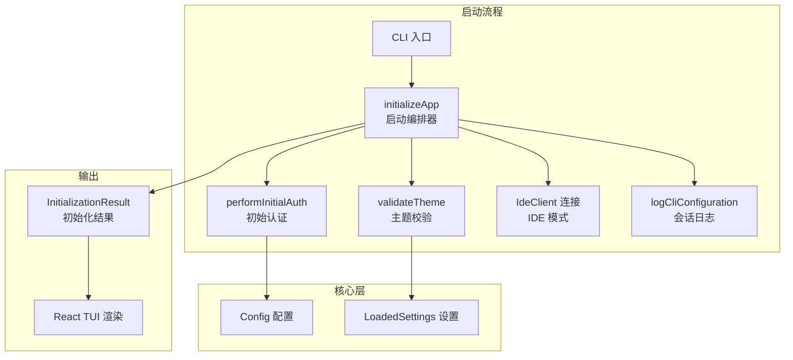
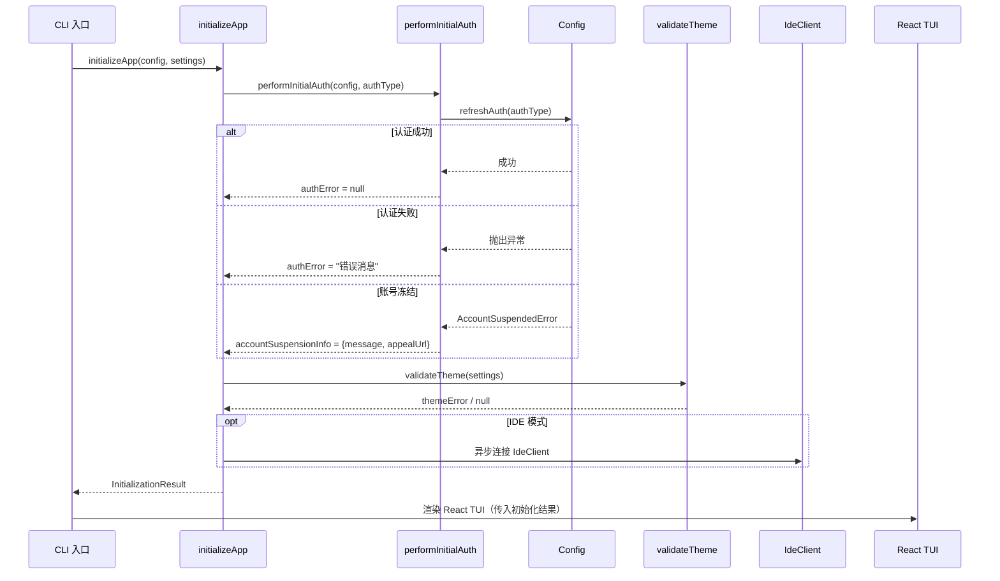

# core (CLI 启动初始化)

## 概述

`core` 目录负责 Gemini CLI **终端模式**（TUI）的启动初始化编排。它在 React UI 渲染之前执行，完成认证、主题校验、IDE 连接和会话日志记录等准备工作。这是 CLI 终端界面（区别于 ACP 无头模式）的入口前置逻辑。

## 目录结构

```
core/
├── initializer.ts       # 应用启动编排器（initializeApp）
├── initializer.test.ts  # initializer 单元测试
├── auth.ts              # 初始认证流程（performInitialAuth）
├── auth.test.ts         # auth 单元测试
├── theme.ts             # 主题校验（validateTheme）
└── theme.test.ts        # theme 单元测试
```

## 架构图



## 核心组件

### 1. `initializer.ts` — 启动编排器

`initializeApp(config, settings)` 是 TUI 模式的核心初始化函数，按以下顺序执行：

1. **认证** — 调用 `performInitialAuth()` 完成身份验证
2. **主题校验** — 调用 `validateTheme()` 验证配置的主题是否存在
3. **会话日志** — 调用 `logCliConfiguration()` 记录 CLI 配置和工具注册信息
4. **IDE 连接**（可选）— 如果处于 IDE 模式，异步建立 `IdeClient` 连接

返回 `InitializationResult`，包含：
- `authError` — 认证错误消息（如有）
- `accountSuspensionInfo` — 账号冻结信息（如有）
- `themeError` — 主题校验错误（如有）
- `shouldOpenAuthDialog` — 是否需要打开认证对话框
- `geminiMdFileCount` — 项目中 GEMINI.md 文件数量

### 2. `auth.ts` — 初始认证流程

`performInitialAuth(config, authType)` 处理启动时的认证逻辑：

- 若未选择认证类型，静默跳过
- 调用 `config.refreshAuth(authType)` 尝试刷新认证
- 特殊错误处理：
  - `ValidationRequiredError` — 不视为致命错误，允许 UI 显示验证对话框
  - 账号冻结错误 — 提取申诉链接和消息
  - `ProjectIdRequiredError` — OAuth 成功但需要项目 ID

### 3. `theme.ts` — 主题校验

`validateTheme(settings)` 检查用户配置的 UI 主题名称是否在 `themeManager` 中注册。若主题不存在则返回错误消息字符串。

## 依赖关系

| 依赖方向 | 目标 | 说明 |
|---------|------|------|
| `@google/gemini-cli-core` | 核心库 | Config、IdeClient、认证错误类型、日志函数、性能分析器 |
| `../config/settings.ts` | 配置层 | LoadedSettings 类型和设置读取 |
| `../ui/themes/theme-manager.ts` | UI 层 | 主题管理器，用于主题名称校验 |
| `../ui/contexts/UIStateContext.ts` | UI 层 | AccountSuspensionInfo 类型定义 |

## 数据流


