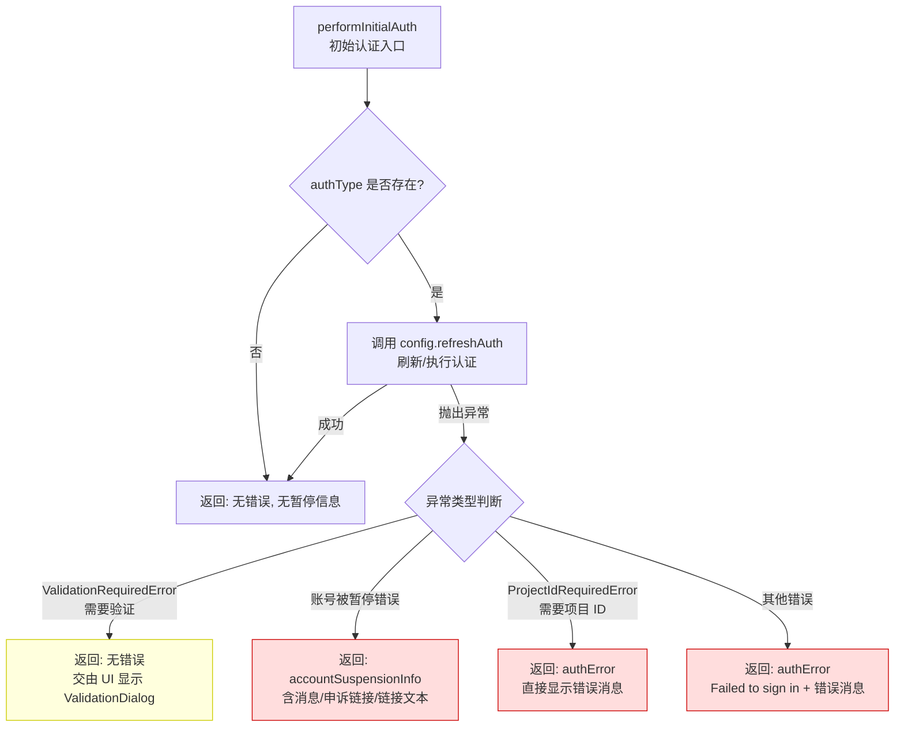

# auth.ts

## 概述

`auth.ts` 是 Gemini CLI 的**初始认证流程处理模块**，负责在应用启动时执行身份认证（登录）。该模块封装了认证过程中可能遇到的各种异常场景（验证待确认、账号被暂停、需要项目 ID、一般性登录失败），并将结果以结构化的 `InitialAuthResult` 返回，供上层 UI 组件做相应展示。

模块的设计理念是：将认证错误作为数据流转而非异常抛出，让 React UI 层有机会以合适的方式展示错误信息（如弹窗、提示等），而不是直接崩溃退出。

## 架构图（Mermaid）

## 核心组件

### 1. 接口 `InitialAuthResult`

初始认证流程的返回结果：

| 字段 | 类型 | 说明 |
|------|------|------|
| `authError` | `string \| null` | 认证错误消息，`null` 表示无错误 |
| `accountSuspensionInfo` | `AccountSuspensionInfo \| null` | 账号暂停信息，包含消息、申诉链接等 |

### 2. 函数 `performInitialAuth(config, authType): Promise<InitialAuthResult>`

异步执行初始认证的核心函数。

**参数：**
- `config: Config` — 应用配置对象，提供 `refreshAuth()` 方法执行认证刷新
- `authType: AuthType | undefined` — 认证类型（如 OAuth、API Key 等），为 `undefined` 时跳过认证

**异常处理策略（按优先级）：**

| 异常类型 | 处理方式 | 设计意图 |
|----------|---------|---------|
| `ValidationRequiredError` | 返回无错误结果 | 不视为致命错误，允许 React UI 加载并显示 `ValidationDialog` 验证对话框 |
| 账号被暂停错误（通过 `isAccountSuspendedError` 检测） | 返回 `accountSuspensionInfo` 对象 | 包含 `message`、`appealUrl`、`appealLinkText`，供 UI 展示暂停信息和申诉入口 |
| `ProjectIdRequiredError` | 返回原始错误消息作为 `authError` | OAuth 成功但账号设置需要项目 ID，直接显示错误消息，不加 "Failed to login" 前缀 |
| 其他所有错误 | 返回 `"Failed to sign in. Message: ..."` | 通用错误处理，附加原始错误消息 |

**返回值：** `Promise<InitialAuthResult>` — 始终成功返回，不会抛出异常。

## 依赖关系

### 内部依赖

| 模块 | 导入内容 | 用途 |
|------|---------|------|
| `@google/gemini-cli-core` | `AuthType` | 认证类型定义（类型） |
| `@google/gemini-cli-core` | `Config` | 应用配置接口（类型），提供 `refreshAuth()` 方法 |
| `@google/gemini-cli-core` | `getErrorMessage` | 从未知错误对象安全提取错误消息字符串 |
| `@google/gemini-cli-core` | `ValidationRequiredError` | 需要用户验证时抛出的特定错误类 |
| `@google/gemini-cli-core` | `isAccountSuspendedError` | 判断错误是否为账号暂停错误的类型守卫/检测函数 |
| `@google/gemini-cli-core` | `ProjectIdRequiredError` | OAuth 成功但需要项目 ID 时抛出的特定错误类 |
| `../ui/contexts/UIStateContext.js` | `AccountSuspensionInfo` | 账号暂停信息的类型定义（类型） |

### 外部依赖

无外部第三方依赖。该模块仅使用项目内部模块。

## 关键实现细节

### 1. 错误降级而非异常传播

`performInitialAuth` 函数永远不会向调用者抛出异常。所有可能的认证错误都被捕获并转化为 `InitialAuthResult` 结构体返回。这种设计使得上层 React UI 可以根据不同的错误类型做出差异化展示：

- `ValidationRequiredError` 被静默处理，因为 UI 会独立检测并展示 `ValidationDialog`
- 账号暂停有专门的 `accountSuspensionInfo` 结构传递详细信息
- 一般错误只传递错误消息字符串

### 2. 认证类型可选

当 `authType` 为 `undefined` 时，函数直接返回成功结果，不执行任何认证操作。这允许在某些场景下（如无需认证的本地模式）跳过整个认证流程。

### 3. 账号暂停信息的完整传递

对于账号被暂停的情况，模块不仅传递错误消息，还提取并传递了 `appealUrl`（申诉链接）和 `appealLinkText`（申诉链接文本），使得 UI 可以直接展示用户可操作的申诉入口，提升用户体验。

### 4. ProjectIdRequiredError 的特殊处理

当 OAuth 认证本身成功但后续账号设置需要项目 ID 时，错误消息直接使用 `getErrorMessage(e)` 返回，故意不添加 "Failed to login" 前缀。这是因为此时登录本身已成功，问题出在账号配置上，使用不准确的前缀会误导用户。

### 5. 模块职责边界

该模块仅负责认证的**执行和错误分类**，不涉及：
- 认证 UI 的渲染（由 React 组件负责）
- 认证策略的选择（由上层配置逻辑负责）
- Token 的存储和缓存（由 `Config.refreshAuth` 内部处理）
