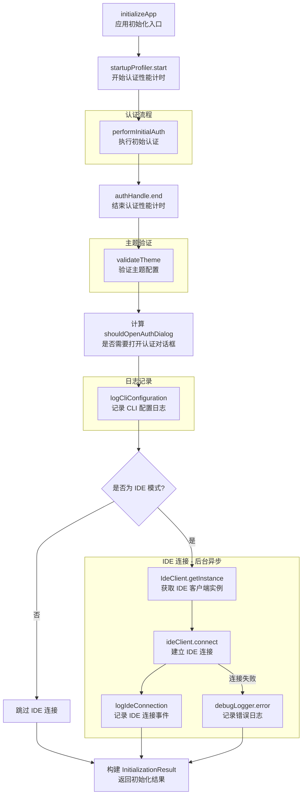

# initializer.ts

## 概述

`initializer.ts` 是 Gemini CLI 的**应用启动初始化编排器**，负责在 React UI 渲染之前执行所有必要的启动任务。该模块作为启动流程的总协调者，依次完成认证、主题验证、配置日志记录和 IDE 连接等初始化工作，并将所有初始化结果打包为 `InitializationResult` 返回给 UI 层。

模块的核心设计理念是：将分散在各个子系统中的初始化逻辑集中编排，提供统一的初始化入口和结构化的结果输出，让 UI 层可以根据初始化结果决定首屏展示内容（如认证对话框、错误提示等）。

## 架构图（Mermaid）

## 核心组件

### 1. 接口 `InitializationResult`

启动初始化的完整结果结构：

| 字段 | 类型 | 说明 |
|------|------|------|
| `authError` | `string \| null` | 认证错误消息，`null` 表示认证成功或未执行认证 |
| `accountSuspensionInfo` | `AccountSuspensionInfo \| null` | 账号暂停信息（含消息、申诉链接等），`null` 表示账号正常 |
| `themeError` | `string \| null` | 主题验证错误消息，`null` 表示主题配置合法 |
| `shouldOpenAuthDialog` | `boolean` | 是否需要打开认证对话框（当未选择认证类型或认证失败时为 `true`） |
| `geminiMdFileCount` | `number` | 项目中 Gemini Markdown 文件的数量，用于 UI 展示 |

### 2. 函数 `initializeApp(config, settings): Promise<InitializationResult>`

应用启动初始化的核心编排函数，在 React UI 渲染前执行。

**参数：**
- `config: Config` — 应用配置对象，提供认证、工具注册表、IDE 模式判断等功能
- `settings: LoadedSettings` — 已加载的应用设置，包含合并后的安全、主题等配置

**执行流程（按顺序）：**

#### 步骤 1：认证初始化
1. 使用 `startupProfiler.start('authenticate')` 开始性能计时
2. 从 `settings.merged.security.auth.selectedType` 获取选定的认证类型
3. 调用 `performInitialAuth(config, authType)` 执行认证
4. 调用 `authHandle.end()` 结束性能计时
5. 解构获取 `authError` 和 `accountSuspensionInfo`

#### 步骤 2：主题验证
调用 `validateTheme(settings)` 验证主题配置的合法性，获取 `themeError`

#### 步骤 3：认证对话框判断
计算 `shouldOpenAuthDialog`，在以下两种情况下为 `true`：
- `selectedType` 为 `undefined`（用户尚未选择认证类型）
- `authError` 存在（认证失败）

#### 步骤 4：配置日志记录
调用 `logCliConfiguration` 记录当前 CLI 配置，传入 `StartSessionEvent` 事件对象（包含配置和工具注册表信息）

#### 步骤 5：IDE 连接（后台异步，仅 IDE 模式）
如果 `config.getIdeMode()` 返回 `true`：
1. 异步获取 `IdeClient` 单例实例
2. 调用 `ideClient.connect()` 建立连接
3. 记录 `IdeConnectionEvent`（类型为 `START`）
4. 如果连接失败，仅通过 `debugLogger.error` 记录错误，不影响主流程

**注意：** IDE 连接是**后台异步执行**的（使用 `.then().catch()` 而非 `await`），不会阻塞初始化流程的返回。

#### 步骤 6：返回结果
构建并返回 `InitializationResult`，包含所有初始化阶段的结果。

## 依赖关系

### 内部依赖

| 模块 | 导入内容 | 用途 |
|------|---------|------|
| `@google/gemini-cli-core` | `IdeClient` | IDE 客户端类，用于建立与 IDE（如 VS Code）的连接 |
| `@google/gemini-cli-core` | `IdeConnectionEvent` | IDE 连接事件类，用于日志记录 |
| `@google/gemini-cli-core` | `IdeConnectionType` | IDE 连接类型枚举（`START` 等） |
| `@google/gemini-cli-core` | `logIdeConnection` | 记录 IDE 连接事件的日志函数 |
| `@google/gemini-cli-core` | `Config` | 应用配置接口（类型） |
| `@google/gemini-cli-core` | `StartSessionEvent` | 会话启动事件类，用于配置日志记录 |
| `@google/gemini-cli-core` | `logCliConfiguration` | 记录 CLI 配置信息的日志函数 |
| `@google/gemini-cli-core` | `startupProfiler` | 启动性能分析器，用于计时各初始化阶段 |
| `@google/gemini-cli-core` | `debugLogger` | 调试日志记录器，用于记录 IDE 连接失败等调试信息 |
| `../config/settings.js` | `LoadedSettings` | 已加载设置的类型定义 |
| `./auth.js` | `performInitialAuth` | 初始认证执行函数 |
| `./theme.js` | `validateTheme` | 主题配置验证函数 |
| `../ui/contexts/UIStateContext.js` | `AccountSuspensionInfo` | 账号暂停信息类型（类型） |

### 外部依赖

无外部第三方依赖。该模块仅使用项目内部模块进行编排。

## 关键实现细节

### 1. 编排者模式

`initializeApp` 是一个典型的**编排者（Orchestrator）**函数。它本身不包含复杂的业务逻辑，而是按正确的顺序调用各子系统的初始化函数，并收集结果。这种设计使得：
- 各子系统的初始化逻辑可以独立测试
- 初始化顺序一目了然
- 新增初始化步骤只需在此处添加调用

### 2. 性能分析集成

认证流程使用 `startupProfiler` 进行性能计时。这是一种"手动埋点"的性能分析方式，允许开发者追踪启动过程中各阶段的耗时。`startupProfiler.start()` 返回一个 handle，调用 `handle.end()` 结束计时。使用可选链（`authHandle?.end()`）处理 profiler 可能未初始化的情况。

### 3. IDE 连接的非阻塞设计

IDE 客户端连接使用 `.then().catch()` 而非 `await`，这意味着：
- 初始化函数不会等待 IDE 连接建立完成就返回
- IDE 连接失败仅记录调试日志，不影响 CLI 的正常启动
- 这是一种有意的设计决策——IDE 连接是增强功能，不应成为启动的阻塞点

### 4. 认证对话框的打开条件

`shouldOpenAuthDialog` 的计算逻辑覆盖了两种场景：
- **首次使用**：`selectedType === undefined`，用户尚未配置任何认证方式
- **认证失败**：`!!authError`，已配置但认证过程出错（如 token 过期、网络问题等）

这两种情况都需要用户介入，因此统一触发认证对话框的展示。

### 5. Gemini Markdown 文件计数

`config.getGeminiMdFileCount()` 返回项目中 Gemini 特定的 Markdown 文件数量。这个计数被包含在初始化结果中，可能用于 UI 展示（如显示项目中有多少个 Gemini 配置/提示文件）。

### 6. 会话启动事件日志

`logCliConfiguration` 接收一个 `StartSessionEvent` 事件对象，该对象包含当前配置和工具注册表信息。这种日志记录有助于：
- 问题排查时了解用户的配置环境
- 收集匿名化的使用统计数据
- 追踪会话开始时间和配置快照
