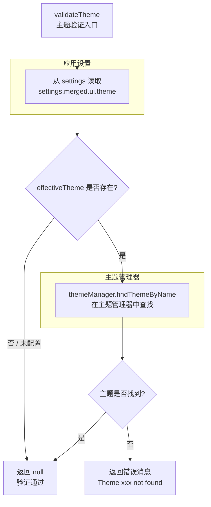

# theme.ts

## 概述

`theme.ts` 是 Gemini CLI 的**主题验证模块**，负责在应用启动时校验用户配置的 UI 主题是否有效。该模块提供一个简洁的验证函数 `validateTheme`，检查用户在设置中指定的主题名称是否能在主题管理器的注册列表中找到。如果主题不存在，返回错误消息；否则返回 `null` 表示验证通过。

该模块被 `initializer.ts`（应用初始化编排器）调用，是启动初始化流程的一部分。

## 架构图（Mermaid）

## 核心组件

### 函数 `validateTheme(settings): string | null`

主题验证的唯一导出函数。

**参数：**
- `settings: LoadedSettings` — 已加载的应用设置对象，包含合并后的用户配置

**逻辑流程：**
1. 从 `settings.merged.ui.theme` 读取用户配置的有效主题名称
2. 如果主题名称存在（非空/非 undefined），则通过 `themeManager.findThemeByName()` 在已注册的主题列表中查找
3. 如果查找失败（主题不存在），返回格式化的错误消息：`Theme "<主题名>" not found.`
4. 如果主题名称不存在（用户未配置主题）或查找成功，返回 `null`

**返回值：**
- `string` — 主题验证失败时的错误消息
- `null` — 验证通过（主题有效或未配置主题）

## 依赖关系

### 内部依赖

| 模块 | 导入内容 | 用途 |
|------|---------|------|
| `../ui/themes/theme-manager.js` | `themeManager` | 主题管理器单例实例，提供 `findThemeByName()` 方法用于查找已注册的主题 |
| `../config/settings.js` | `LoadedSettings` | 已加载设置的类型定义（类型），用于读取用户配置的主题名称 |

### 外部依赖

无外部第三方依赖。

## 关键实现细节

### 1. 宽容验证策略

该函数采用宽容验证策略：
- **未配置主题**（`effectiveTheme` 为 falsy）：直接通过验证，使用系统默认主题
- **配置了有效主题**：通过验证
- **配置了无效主题**：返回错误消息但不抛出异常

这意味着该函数永远不会抛出异常，所有结果通过返回值传递。上层调用者（如 `initializeApp`）可以决定如何处理错误消息（如显示警告但继续使用默认主题）。

### 2. 模块职责单一

该模块仅做一件事——验证主题名称是否有效。它不负责：
- 主题的应用/切换（由 `themeManager` 负责）
- 主题的注册/加载（由主题管理器的初始化逻辑负责）
- 错误的展示（由 UI 层负责）

### 3. 合并设置的使用

函数读取的是 `settings.merged.ui.theme`，即**合并后**的设置值。`merged` 表示这是经过多层配置源（默认值、用户全局配置、项目级配置等）合并后的最终有效值。这确保验证的是实际会生效的主题配置。

### 4. 短路求值

条件 `effectiveTheme && !themeManager.findThemeByName(effectiveTheme)` 使用了 JavaScript 的短路求值：
- 如果 `effectiveTheme` 为 falsy（`undefined`、`null`、`""`），整个表达式为 `false`，不会调用 `findThemeByName`
- 只有在确实配置了主题名称时，才会执行查找操作
