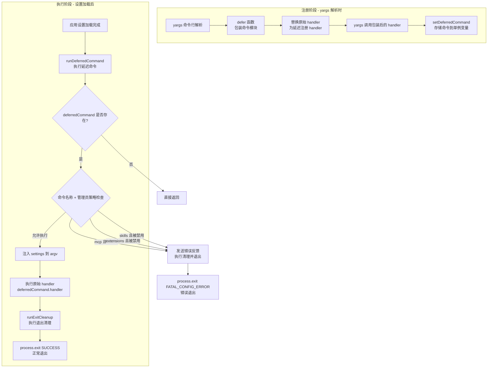

# deferred.ts

## 概述

`deferred.ts` 是 Gemini CLI 的**延迟命令执行模块**，实现了一种命令延迟执行（Deferred Execution）模式。该模块允许 CLI 的子命令（如 `mcp`、`extensions`、`skills` 等）在 yargs 命令行解析阶段仅"注册"而不立即执行，将实际执行推迟到应用设置完全加载之后。

这种设计解决了一个关键的启动时序问题：yargs 解析命令行参数并调用命令 handler 时，应用设置（包括管理员策略配置）可能尚未加载完成。通过延迟执行，模块可以在设置就绪后进行管理员策略检查（如某些功能是否被管理员禁用），然后再决定是否执行命令。

## 架构图（Mermaid）



## 核心组件

### 1. 接口 `DeferredCommand`

延迟命令的数据结构，存储了命令执行所需的全部信息：

| 字段 | 类型 | 说明 |
|------|------|------|
| `handler` | `(argv: ArgumentsCamelCase) => void \| Promise<void>` | 原始命令的 handler 函数 |
| `argv` | `ArgumentsCamelCase` | yargs 解析后的命令行参数 |
| `commandName` | `string` | 命令名称（如 `'mcp'`、`'extensions'`、`'skills'`），用于管理员策略匹配 |

### 2. 模块级单例变量 `deferredCommand`

```typescript
let deferredCommand: DeferredCommand | undefined;
```

模块级别的单例变量，用于存储待延迟执行的命令。同一时刻最多只能有一个延迟命令。

### 3. 函数 `setDeferredCommand(command): void`

设置待延迟执行的命令。直接将传入的 `DeferredCommand` 赋值给模块单例变量。

### 4. 函数 `runDeferredCommand(settings): Promise<void>`

执行已注册的延迟命令，这是模块的核心执行逻辑。

**参数：**
- `settings: MergedSettings` — 已合并的应用设置，包含管理员策略配置

**执行流程：**

#### 步骤 1：空值检查
如果 `deferredCommand` 为 `undefined`（没有延迟命令需要执行），直接返回。

#### 步骤 2：管理员策略检查
依次检查三种命令的管理员禁用策略：

| 命令名称 | 管理员策略路径 | 检查条件 |
|----------|---------------|---------|
| `mcp` | `adminSettings.mcp.enabled` | 为 `false` 时禁止执行 |
| `extensions` | `adminSettings.extensions.enabled` | 为 `false` 时禁止执行 |
| `skills` | `adminSettings.skills.enabled` | 为 `false` 时禁止执行 |

如果命令被管理员禁用：
1. 通过 `coreEvents.emitFeedback('error', ...)` 发送错误反馈
2. 使用 `getAdminErrorMessage` 生成标准化的管理员限制错误消息
3. 调用 `runExitCleanup()` 执行退出清理
4. 以 `ExitCodes.FATAL_CONFIG_ERROR` 退出进程

#### 步骤 3：注入设置并执行
1. 将 `settings` 注入到 `argv` 对象中（通过对象展开创建新对象）
2. 调用原始 handler：`deferredCommand.handler(argvWithSettings)`
3. 调用 `runExitCleanup()` 执行退出清理
4. 以 `ExitCodes.SUCCESS` 正常退出进程

### 5. 函数 `defer<T, U>(commandModule, parentCommandName?): CommandModule<T, U>`

泛型包装函数，将 yargs `CommandModule` 的 handler 替换为延迟注册逻辑。

**参数：**
- `commandModule: CommandModule<T, U>` — 原始的 yargs 命令模块
- `parentCommandName?: string` — 父命令名称，用于设置 `commandName`（默认为 `'unknown'`）

**返回值：** 新的 `CommandModule<T, U>`，保留原始命令模块的所有属性（`command`、`describe`、`builder` 等），仅替换 `handler`。

**替换逻辑：**
新 handler 在被 yargs 调用时不执行任何业务逻辑，而是将原始 handler、解析后的 argv 和命令名称打包为 `DeferredCommand`，通过 `setDeferredCommand` 存储到单例变量中。

## 依赖关系

### 内部依赖

| 模块 | 导入内容 | 用途 |
|------|---------|------|
| `@google/gemini-cli-core` | `coreEvents` | 核心事件总线，用于发送管理员策略阻断的错误反馈 |
| `@google/gemini-cli-core` | `ExitCodes` | 进程退出码枚举（`SUCCESS`、`FATAL_CONFIG_ERROR`） |
| `@google/gemini-cli-core` | `getAdminErrorMessage` | 生成标准化的管理员策略限制错误消息 |
| `./utils/cleanup.js` | `runExitCleanup` | 执行进程退出前的清理操作 |
| `./config/settings.js` | `MergedSettings` | 合并后设置的类型定义（类型） |

### 外部依赖

| 包名 | 用途 |
|------|------|
| `yargs` | `ArgumentsCamelCase` 和 `CommandModule` 类型定义，用于命令行参数解析框架的类型兼容 |
| `node:process` | 进程退出（`process.exit`） |

## 关键实现细节

### 1. 延迟执行模式（Deferred Execution Pattern）

这是该模块的核心设计模式。在 CLI 应用中，yargs 的命令解析和 handler 调用发生在启动早期，而某些资源（如应用设置、管理员策略）需要异步加载。通过延迟执行模式：

```
时间线：
[yargs 解析] → [存储命令] → [加载设置] → [策略检查] → [执行命令]
     ↑                                                        ↑
  defer() 包装                                    runDeferredCommand() 执行
```

这种分离确保了命令执行时所有依赖的配置都已就绪。

### 2. 管理员策略的硬性阻断

管理员策略检查是**硬阻断**（hard block）——被禁用的命令直接导致进程退出，退出码为 `FATAL_CONFIG_ERROR`。这不同于一般的错误处理（返回错误消息让 UI 展示），体现了管理员策略的强制性。

### 3. 设置注入机制

`runDeferredCommand` 通过对象展开将 `settings` 注入到 `argv` 中：

```typescript
const argvWithSettings = { ...deferredCommand.argv, settings };
```

这使得命令 handler 可以通过 `argv.settings` 访问已加载的设置，而不需要修改 handler 的函数签名。这是一种运行时依赖注入的简易实现。

### 4. 单例限制

模块使用单例变量存储延迟命令，这意味着：
- 一次 CLI 执行只能有一个延迟命令
- 如果多次调用 `setDeferredCommand`，后面的会覆盖前面的
- 这与 CLI 的使用场景一致——用户一次只会执行一个子命令

### 5. 泛型保持类型安全

`defer<T, U>` 函数使用泛型参数保持与原始 `CommandModule<T, U>` 相同的类型签名，确保包装后的命令模块在类型层面与原始模块兼容。内部使用了 `@typescript-eslint/no-unsafe-type-assertion` 禁止注释来处理 handler 类型的向上转型，因为延迟存储需要将具体类型擦除为通用的 `ArgumentsCamelCase`。

### 6. 退出清理保证

无论命令执行成功还是被管理员策略阻断，都会调用 `runExitCleanup()` 确保进程退出前的清理工作（如释放文件锁、关闭连接等）得到执行。这是一种防御性编程实践。

### 7. 命令名称回退

在 `defer` 函数中，`commandName` 使用 `parentCommandName || 'unknown'` 作为回退值。当未提供父命令名称时，命令名称为 `'unknown'`，这不会匹配任何管理员策略检查（因为策略检查使用精确匹配），因此 `'unknown'` 命令会跳过所有策略检查直接执行。
