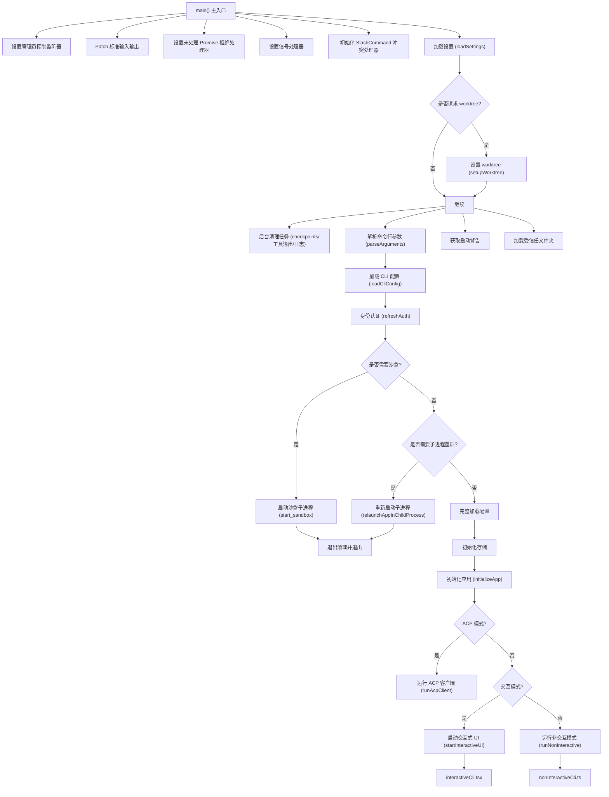

# gemini.tsx

## 概述

`gemini.tsx` 是 Gemini CLI 的**主入口文件**，包含了整个 CLI 应用的启动流程（`main()` 函数）。它负责从命令行参数解析、设置加载、身份认证、沙盒环境初始化、到最终决定以**交互模式**还是**非交互模式**运行应用的全部逻辑。该文件是整个 CLI 包的核心枢纽，协调了配置、认证、清理、UI 渲染等多个子系统。

## 架构图（Mermaid）



## 核心组件

### 1. `main()` —— 主入口函数

整个 CLI 应用的入口点，执行以下关键步骤：

1. **基础设施初始化**：设置管理员控制监听器、patch 标准 I/O、设置全局错误处理器、信号处理器、SlashCommand 冲突处理器。
2. **配置加载**：加载用户设置（`loadSettings`）、解析命令行参数（`parseArguments`）、加载 CLI 配置（`loadCliConfig`）。
3. **Worktree 设置**：如果设置中请求了 worktree，则在早期阶段设置（因为会修改 CWD）。
4. **后台清理**：并行运行 checkpoint 清理、工具输出文件清理、后台日志清理。
5. **身份认证**：根据交互/非交互模式选择不同的认证流程，支持 OAuth、Compute ADC、Login with Google 等方式。
6. **沙盒决策**：如果不在沙盒环境且不是命令模式，则决定是否启动沙盒子进程或子进程重启。
7. **会话管理**：处理 `--list-sessions`、`--delete-session`、`--resume` 等会话相关参数。
8. **模式分流**：根据配置决定进入交互模式（`startInteractiveUI`）、ACP 模式（`runAcpClient`）或非交互模式（`runNonInteractive`）。

### 2. `startInteractiveUI()` —— 交互式 UI 启动器

```typescript
export async function startInteractiveUI(
  config: Config,
  settings: LoadedSettings,
  startupWarnings: StartupWarning[],
  workspaceRoot: string,
  resumedSessionData: ResumedSessionData | undefined,
  initializationResult: InitializationResult,
)
```

通过**动态 import** 延迟加载 `interactiveCli.js`，避免在非交互模式下解析 React/Ink 等重量级 UI 模块，从而优化启动速度。

### 3. `validateDnsResolutionOrder()` —— DNS 解析顺序验证

验证设置中的 `dnsResolutionOrder` 值，仅接受 `'ipv4first'` 和 `'verbatim'` 两个值，默认使用 `'ipv4first'`。无效值不会抛出异常，而是打印警告并回退到默认值。

### 4. `getNodeMemoryArgs()` —— 节点内存参数计算

```typescript
export function getNodeMemoryArgs(isDebugMode: boolean): string[]
```

根据系统总内存的 50% 计算 Node.js 的 `--max-old-space-size` 参数。如果目标内存大于当前堆限制，则返回需要重启进程时使用的参数。环境变量 `GEMINI_CLI_NO_RELAUNCH` 可以禁用此行为。

### 5. `setupUnhandledRejectionHandler()` —— 未处理 Promise 拒绝处理器

全局捕获未处理的 Promise 拒绝，记录详细错误日志（包括堆栈信息），并在首次发生时触发 `OpenDebugConsole` 事件。

### 6. `initializeOutputListenersAndFlush()` —— 输出监听器初始化

在非交互模式下设置输出事件监听器，将 `CoreEvent.Output`、`CoreEvent.ConsoleLog`、`CoreEvent.UserFeedback` 三类事件路由到 stdout 或 stderr，然后调用 `coreEvents.drainBacklogs()` 排空所有缓冲输出。

### 7. `setupAdminControlsListener()` —— 管理员控制监听器

通过 IPC（`process.on('message')`）监听来自父进程的管理员设置消息。支持延迟绑定 config（设置可能在 config 初始化之前到达，会暂存为 `pendingSettings`）。返回 `setConfig` 和 `cleanup` 两个方法。

## 依赖关系

### 内部依赖

| 模块路径 | 用途 |
|---------|------|
| `./config/config.js` | CLI 配置加载与参数解析（`loadCliConfig`, `parseArguments`, `isDebugMode`, `getRequestedWorktreeName`） |
| `./config/settings.js` | 用户设置加载（`loadSettings`, `SettingScope`） |
| `./config/trustedFolders.js` | 受信任文件夹加载（`loadTrustedFolders`） |
| `./config/auth.js` | 认证方法验证（`validateAuthMethod`） |
| `./config/sandboxConfig.js` | 沙盒配置加载（`loadSandboxConfig`） |
| `./config/policy.js` | 策略引擎更新器（`createPolicyUpdater`） |
| `./utils/readStdin.js` | 从 stdin 读取输入（`readStdin`） |
| `./utils/sandbox.js` | 沙盒启动（`start_sandbox`） |
| `./utils/startupWarnings.js` | 获取启动警告（`getStartupWarnings`） |
| `./utils/userStartupWarnings.js` | 获取用户级启动警告（`getUserStartupWarnings`） |
| `./utils/cleanup.js` | 清理注册与执行（`cleanupCheckpoints`, `registerCleanup`, `registerSyncCleanup`, `runExitCleanup`, `registerTelemetryConfig`, `setupSignalHandlers`） |
| `./utils/worktreeSetup.js` | Git worktree 设置（`setupWorktree`） |
| `./utils/sessionCleanup.js` | 会话清理（`cleanupToolOutputFiles`, `cleanupExpiredSessions`） |
| `./utils/relaunch.js` | 子进程重启（`relaunchAppInChildProcess`, `relaunchOnExitCode`） |
| `./utils/sessions.js` | 会话列表与删除（`listSessions`, `deleteSession`） |
| `./utils/sessionUtils.js` | 会话选择器（`SessionSelector`, `SessionError`） |
| `./utils/events.js` | 应用事件总线（`appEvents`, `AppEvent`） |
| `./utils/terminalTheme.js` | 终端主题设置（`setupTerminalAndTheme`） |
| `./utils/logCleanup.js` | 后台日志清理（`cleanupBackgroundLogs`） |
| `./ui/utils/ConsolePatcher.js` | 控制台输出拦截（`ConsolePatcher`） |
| `./ui/hooks/useAlternateBuffer.js` | 备用缓冲区检测（`isAlternateBufferEnabled`） |
| `./core/initializer.js` | 应用初始化（`initializeApp`） |
| `./nonInteractiveCli.js` | 非交互模式运行器（`runNonInteractive`） |
| `./interactiveCli.js` | 交互式 UI（动态导入） |
| `./acp/acpClient.js` | ACP 客户端运行器（`runAcpClient`） |
| `./validateNonInterActiveAuth.js` | 非交互式认证验证（`validateNonInteractiveAuth`） |
| `./deferred.js` | 延迟命令执行（`runDeferredCommand`） |
| `./services/SlashCommandConflictHandler.js` | Slash 命令冲突处理（`SlashCommandConflictHandler`） |

### 外部依赖

| 包名 | 用途 |
|------|------|
| `@google/gemini-cli-core` | 核心库，提供 Config 类型、事件系统（`coreEvents`）、认证类型（`AuthType`）、会话 ID、日志工具、标准输出补丁（`patchStdio`）、性能分析（`startupProfiler`）、退出码（`ExitCodes`）等 |
| `node:crypto` | 用于生成启动警告的唯一 ID（`createHash('sha256')`） |
| `node:v8` | 获取 V8 堆统计信息（`getHeapStatistics`），用于内存参数计算 |
| `node:os` | 获取系统总内存（`os.totalmem()`） |
| `node:dns` | 设置 DNS 解析顺序（`dns.setDefaultResultOrder`） |

## 关键实现细节

### 启动流程优化

- **性能分析**：使用 `startupProfiler` 在关键阶段记录性能数据（`cli_startup`、`load_settings`、`parse_arguments`、`setup_worktree`、`cleanup_ops`、`load_cli_config`、`setup_terminal`、`initialize_app`）。
- **延迟加载**：交互式 UI 模块 (`interactiveCli.js`) 通过动态 `import()` 实现延迟加载，避免非交互模式下加载 React/Ink。
- **并行清理**：使用 `Promise.all` 同时执行 checkpoint 清理、工具输出文件清理和后台日志清理。

### 沙盒机制

- 当不在沙盒环境中（`!process.env['SANDBOX']`）且不是命令模式时，程序会判断是否启用沙盒。
- 如果启用沙盒，会将 stdin 数据注入到参数中（`injectStdinIntoArgs`），然后通过 `start_sandbox` 启动沙盒子进程。
- 如果不启用沙盒，仍然会通过 `relaunchAppInChildProcess` 创建子进程，以便支持内部重启。

### stdin 注入逻辑

`injectStdinIntoArgs` 函数将 stdin 数据注入到命令行参数中：
- 如果已有 `--prompt/-p` 参数，则将 stdin 数据前置到原有 prompt 前面。
- 如果没有 prompt 参数，则添加 `--prompt` 参数并将 stdin 数据作为值。

### 认证流程

1. **交互模式**：验证已选择的认证方法后调用 `config.refreshAuth()`。
2. **非交互模式**：通过 `validateNonInteractiveAuth` 确定认证类型后刷新认证。
3. **特殊处理**：`ValidationCancelledError` 导致正常退出；`ValidationRequiredError` 允许应用继续启动（由 React UI 处理验证对话框）。
4. **Cloud Shell 环境**：自动检测并设置 `COMPUTE_ADC` 认证类型。

### Hook 系统集成

- 在非交互模式下，`main()` 会手动触发 `SessionStart` 和 `SessionEnd` hook 事件。
- `SessionStart` hook 返回的额外上下文会被包裹在 `<hook_context>` 标签中并前置到用户输入前。
- 注册了两个 `SessionEnd` 清理回调（一个用于完整配置阶段，一个用于非交互模式），确保会话结束事件在退出时触发。

### 输出路由

`initializeOutputListenersAndFlush` 根据事件类型和严重级别路由输出：
- `Output` 事件：根据 `isStderr` 标志分流到 stdout 或 stderr。
- `ConsoleLog` 事件：`error` 和 `warn` 类型输出到 stderr，其他到 stdout。
- `UserFeedback` 事件：`error` 和 `warning` 级别输出到 stderr，其他到 stdout。
- 最后调用 `drainBacklogs()` 确保缓冲的事件数据不会丢失。

### 管理员控制 IPC

`setupAdminControlsListener` 通过 Node.js 的 IPC 通道（`process.on('message')`）接收父进程发送的管理员设置。采用了延迟绑定模式：如果设置在 config 初始化之前到达，会暂存到 `pendingSettings`；当 config 可用时再通过 `setConfig` 应用这些设置。
