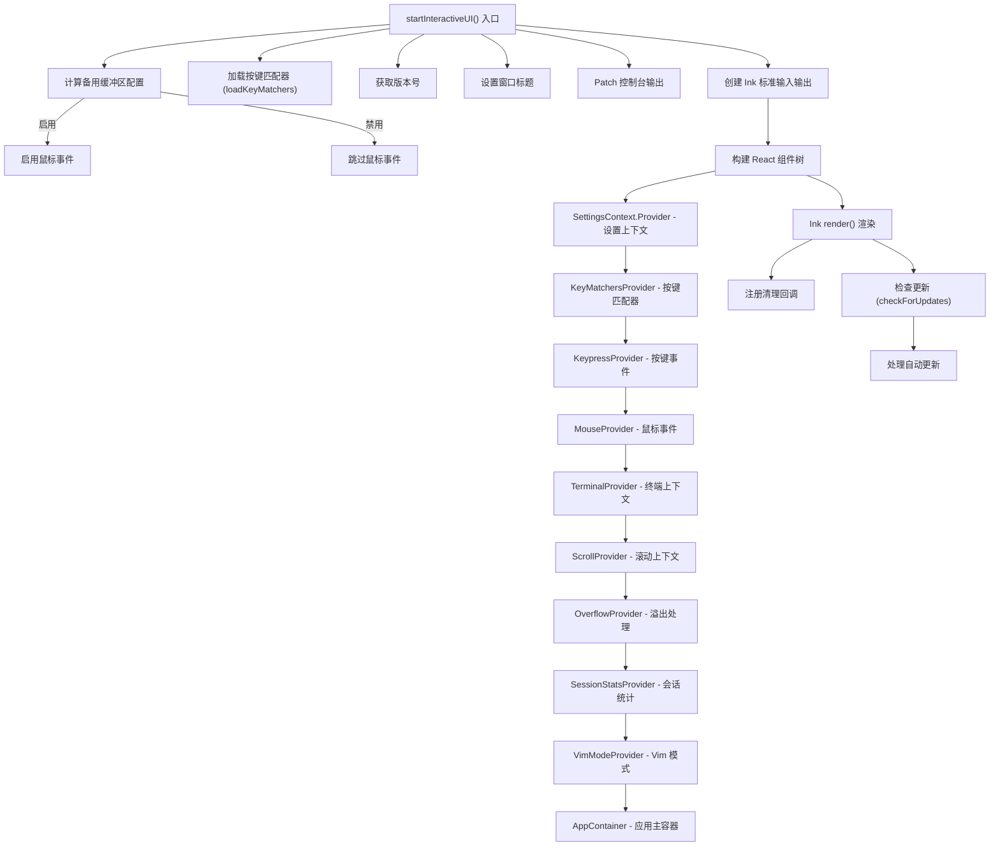

# interactiveCli.tsx

## 概述

`interactiveCli.tsx` 是 Gemini CLI **交互式终端界面**的启动入口。它负责组装整个 React/Ink 渲染树，包括设置上下文提供者（Context Providers）、键盘协议、鼠标事件、终端备用缓冲区管理、窗口标题设置等。该文件是连接底层配置系统与 React UI 组件层的桥梁，由 `gemini.tsx` 中的 `main()` 函数在交互模式下通过动态 import 调用。

## 架构图（Mermaid）



## 核心组件

### 1. `startInteractiveUI()` —— 交互式 UI 启动函数

```typescript
export async function startInteractiveUI(
  config: Config,
  settings: LoadedSettings,
  startupWarnings: StartupWarning[],
  workspaceRoot: string,
  resumedSessionData: ResumedSessionData | undefined,
  initializationResult: InitializationResult,
)
```

这是交互模式的核心启动函数，执行以下步骤：

#### 1.1 备用缓冲区与鼠标事件

- 通过 `shouldEnterAlternateScreen()` 判断是否启用终端备用缓冲区（alternate screen buffer）。
- **屏幕阅读器模式**下强制禁用备用缓冲区，因为 Ink 的备用缓冲区模式需要禁用行折叠（line wrapping），这对屏幕阅读器不友好。
- 鼠标事件与备用缓冲区绑定：仅在启用备用缓冲区时才启用鼠标事件。

#### 1.2 按键匹配器加载

调用 `loadKeyMatchers()` 异步加载按键绑定配置。加载过程中的错误会通过 `coreEvents.emitFeedback` 发出警告，但不会阻止应用启动。

#### 1.3 控制台拦截

创建新的 `ConsolePatcher` 实例，将控制台输出重定向到核心事件系统（`coreEvents.emitConsoleLog`），避免控制台输出破坏 Ink 的渲染。

#### 1.4 Ink 标准 I/O

通过 `createWorkingStdio()` 创建独立的 stdout/stderr 流供 Ink 使用，与被 patch 过的标准 I/O 隔离。

#### 1.5 shpool 兼容性

检测 `SHPOOL_SESSION_NAME` 环境变量，如果运行在 shpool 会话中，等待 100ms 让终端大小和状态稳定。

### 2. `AppWrapper` —— React 组件包装器

内部函数组件，负责：
- 调用 `useKittyKeyboardProtocol()` hook 启用 Kitty 键盘协议支持。
- 构建完整的 Context Provider 嵌套树（9 层嵌套）。

**Context Provider 嵌套顺序（从外到内）：**

| 层级 | Provider | 作用 |
|------|----------|------|
| 1 | `SettingsContext.Provider` | 提供全局设置数据 |
| 2 | `KeyMatchersProvider` | 提供按键匹配规则 |
| 3 | `KeypressProvider` | 提供按键事件处理 |
| 4 | `MouseProvider` | 提供鼠标事件处理 |
| 5 | `TerminalProvider` | 提供终端信息上下文 |
| 6 | `ScrollProvider` | 提供滚动控制 |
| 7 | `OverflowProvider` | 提供内容溢出处理 |
| 8 | `SessionStatsProvider` | 提供会话统计数据 |
| 9 | `VimModeProvider` | 提供 Vim 模式状态 |

最内层渲染 `AppContainer` 核心组件。

### 3. Ink 渲染配置

```typescript
render(<AppWrapper />, {
  stdout: inkStdout,
  stderr: inkStderr,
  stdin: process.stdin,
  exitOnCtrlC: false,
  isScreenReaderEnabled: config.getScreenReader(),
  onRender: ({ renderTime }) => { ... },
  patchConsole: false,
  alternateBuffer: useAlternateBuffer,
  incrementalRendering: ...,
});
```

关键渲染参数：
- **`exitOnCtrlC: false`**：禁用 Ctrl+C 默认退出行为（由应用自行处理）。
- **`patchConsole: false`**：禁用 Ink 自带的控制台 patch（使用自定义的 `ConsolePatcher`）。
- **`onRender`**：渲染回调，当渲染时间超过 `SLOW_RENDER_MS`（200ms）时记录慢渲染，并通知性能分析器。
- **`incrementalRendering`**：增量渲染，在备用缓冲区模式下且非 shpool 环境下启用，可通过 `settings.merged.ui.incrementalRendering` 控制。
- **`alternateBuffer`**：备用缓冲区模式。
- **DEBUG 模式**：当 `DEBUG` 环境变量存在时，使用 `React.StrictMode` 包裹以便检测潜在问题。

### 4. `setWindowTitle()` —— 窗口标题设置

```typescript
function setWindowTitle(title: string, settings: LoadedSettings)
```

- 使用 ANSI 转义序列 `\x1b]0;...\x07` 设置终端窗口标题。
- 标题由 `computeTerminalTitle()` 根据当前状态（流式状态、确认状态、工作状态等）计算。
- 进程退出时自动清空窗口标题。
- 可通过 `settings.merged.ui.hideWindowTitle` 禁用。

## 依赖关系

### 内部依赖

| 模块路径 | 用途 |
|---------|------|
| `./ui/AppContainer.js` | 应用主容器组件 |
| `./ui/utils/ConsolePatcher.js` | 控制台输出拦截器 |
| `./ui/utils/updateCheck.js` | 版本更新检查（`checkForUpdates`） |
| `./ui/contexts/SettingsContext.js` | 设置 Context |
| `./ui/contexts/MouseContext.js` | 鼠标事件 Context |
| `./ui/contexts/SessionContext.js` | 会话统计 Context |
| `./ui/contexts/VimModeContext.js` | Vim 模式 Context |
| `./ui/contexts/KeypressContext.js` | 按键事件 Context |
| `./ui/contexts/ScrollProvider.js` | 滚动 Context |
| `./ui/contexts/TerminalContext.js` | 终端 Context |
| `./ui/contexts/OverflowContext.js` | 溢出处理 Context |
| `./ui/hooks/useKeyMatchers.js` | 按键匹配器 Provider |
| `./ui/hooks/useKittyKeyboardProtocol.js` | Kitty 键盘协议 hook |
| `./ui/hooks/useAlternateBuffer.js` | 备用缓冲区检测（`isAlternateBufferEnabled`） |
| `./ui/key/keyMatchers.js` | 按键匹配器加载（`loadKeyMatchers`） |
| `./ui/components/DebugProfiler.js` | 性能分析器（`profiler`） |
| `./ui/types.js` | UI 类型定义（`StreamingState`） |
| `./utils/cleanup.js` | 清理注册（`registerCleanup`, `setupTtyCheck`） |
| `./utils/handleAutoUpdate.js` | 自动更新处理（`handleAutoUpdate`） |
| `./utils/windowTitle.js` | 窗口标题计算（`computeTerminalTitle`） |
| `./core/initializer.js` | 初始化结果类型（`InitializationResult`） |
| `./config/settings.js` | 设置类型（`LoadedSettings`） |

### 外部依赖

| 包名 | 用途 |
|------|------|
| `react` | React 框架，用于构建 UI 组件树 |
| `ink` | 终端 UI 渲染引擎（`render` 函数） |
| `node:path` | 路径处理（`basename`，提取工作区根目录名） |
| `@google/gemini-cli-core` | 核心库，提供事件系统、终端控制函数（鼠标事件、行折叠、备用缓冲区）、性能记录、日志、版本获取等 |

## 关键实现细节

### 多层 Context Provider 架构

采用了 9 层嵌套的 React Context Provider 模式来管理全局状态。这种设计将不同关注点（设置、键盘、鼠标、终端、滚动、会话、Vim 模式等）解耦，子组件可以通过对应的 `useContext` hook 按需获取所需的状态。嵌套顺序经过精心设计，外层 Provider 的数据可以被内层 Provider 使用。

### 终端兼容性处理

- **shpool 兼容**：检测 shpool 会话并增加 100ms 延迟，确保终端状态稳定。
- **Kitty 键盘协议**：通过 `useKittyKeyboardProtocol()` hook 支持 Kitty 终端的增强键盘协议。
- **屏幕阅读器**：检测屏幕阅读器模式，禁用备用缓冲区和鼠标事件以提高可访问性。
- **行折叠控制**：在备用缓冲区模式下禁用行折叠（`disableLineWrapping`），退出时恢复。

### 渲染性能监控

- **慢渲染检测**：Ink 的 `onRender` 回调会报告每帧渲染时间，超过 200ms 的帧会通过 `recordSlowRender` 记录到遥测系统。
- **帧计数**：每次渲染完成后通知 `profiler.reportFrameRendered()`，用于性能调试面板。

### 更新检查

在 UI 渲染启动后异步执行版本更新检查（`checkForUpdates`），成功后触发自动更新处理（`handleAutoUpdate`）。检查失败时静默忽略错误（仅在调试模式下输出警告）。

### 清理机制

注册了多个清理回调：
1. **鼠标事件清理**：`disableMouseEvents()` 恢复鼠标事件状态。
2. **控制台 Patcher 清理**：`consolePatcher.cleanup` 恢复控制台行为。
3. **行折叠恢复**：`enableLineWrapping()` 恢复行折叠。
4. **Ink 实例卸载**：`instance.unmount()` 卸载 React 组件树。
5. **TTY 检查**：`setupTtyCheck()` 返回的清理函数。

### 窗口标题管理

初始标题在 React 渲染循环启动前设置，使用 ANSI OSC (Operating System Command) 转义序列直接写入 stdout。支持以下配置：
- `hideWindowTitle`：完全禁用标题设置。
- `showStatusInTitle`：在标题中显示思考状态。
- `dynamicWindowTitle`：启用动态标题更新。
