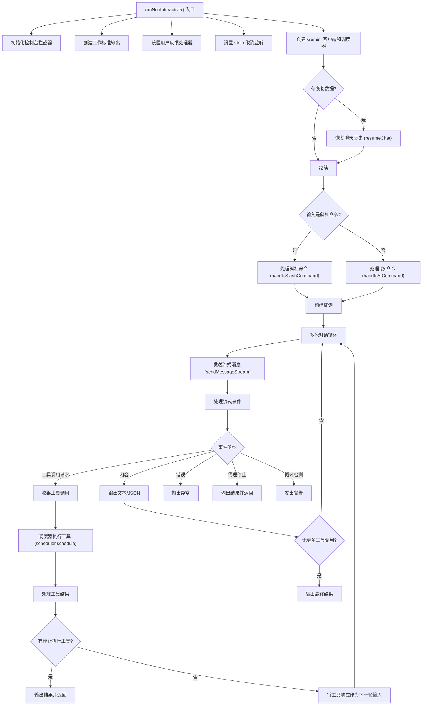

# nonInteractiveCli.ts

## 概述

`nonInteractiveCli.ts` 实现了 Gemini CLI 的**非交互式运行模式**。当用户通过管道输入、`--prompt` 参数或在非 TTY 环境下运行 CLI 时，该模块接管执行流程。它负责与 Gemini API 进行流式通信、处理工具调用（Tool Calls）、管理多轮对话循环、支持多种输出格式（纯文本、JSON、流式 JSON），以及处理用户取消（Ctrl+C）等操作。

## 架构图（Mermaid）



## 核心组件

### 1. `RunNonInteractiveParams` —— 参数接口

```typescript
interface RunNonInteractiveParams {
  config: Config;
  settings: LoadedSettings;
  input: string;
  prompt_id: string;
  resumedSessionData?: ResumedSessionData;
}
```

定义非交互模式运行所需的全部参数：
- `config`: CLI 配置对象
- `settings`: 用户设置
- `input`: 用户输入（可能来自 stdin 或 `--prompt` 参数）
- `prompt_id`: 唯一的提示标识符
- `resumedSessionData`: 可选的会话恢复数据

### 2. `runNonInteractive()` —— 非交互模式主函数

整个非交互模式的核心执行函数，在 `promptIdContext` 上下文中运行，确保 prompt ID 在整个执行链中可追踪。

#### 2.1 初始化阶段

1. **控制台拦截**：创建 `ConsolePatcher`，将控制台输出重定向到 stderr（`stderr: true, interactive: false`）。
2. **活动日志**：如果设置了 `GEMINI_CLI_ACTIVITY_LOG_TARGET` 环境变量，动态导入并初始化活动日志器。
3. **文本输出**：创建 `TextOutput` 实例用于格式化文本输出。
4. **用户反馈处理**：注册 `UserFeedback` 事件处理器，将反馈信息格式化后写入 stderr。
5. **流式 JSON 格式化器**：如果输出格式为 `STREAM_JSON`，创建 `StreamJsonFormatter`。
6. **EPIPE 处理**：监听 stdout 的 EPIPE 错误，当输出管道被提前关闭时优雅退出。

#### 2.2 取消机制（Ctrl+C）

```
setupStdinCancellation() / cleanupStdinCancellation()
```

- 仅在 TTY 环境下启用。
- 将 stdin 设置为 raw mode 以捕获单个按键事件。
- 使用 readline 发射 keypress 事件。
- 检测 Ctrl+C（`ctrl+c` 组合键或字符码 `\u0003`）。
- 首次按下时设置 `isAborting` 标志并触发 `abortController.abort()`。
- 如果取消操作超过 200ms 未完成，才显示 "Cancelling..." 提示（减少快速取消时的冗余输出）。
- 清理时恢复 stdin 的原始状态。

#### 2.3 输入处理

1. **斜杠命令检测**：通过 `isSlashCommand()` 判断输入是否为斜杠命令（如 `/help`），如果是则交给 `handleSlashCommand` 处理。
2. **@ 命令处理**：非斜杠命令输入通过 `handleAtCommand` 处理 `@file` 等引用语法。
3. **错误处理**：@ 命令处理失败时抛出 `FatalInputError`。

#### 2.4 多轮对话循环

核心的 `while(true)` 循环实现了完整的代理式对话：

1. **轮次限制**：每轮递增 `turnCount`，超过 `maxSessionTurns` 时调用 `handleMaxTurnsExceededError`。
2. **流式消息发送**：通过 `geminiClient.sendMessageStream()` 发送消息并获取事件流。
3. **事件处理**：遍历响应流中的事件，根据类型分发处理：

| 事件类型 | 处理方式 |
|---------|---------|
| `Content` | 根据输出格式输出文本（支持 raw 模式或 strip ANSI） |
| `ToolCallRequest` | 收集到 `toolCallRequests` 数组 |
| `LoopDetected` | 发出循环检测警告 |
| `MaxSessionTurns` | 发出最大轮次超限错误 |
| `Error` | 抛出错误 |
| `AgentExecutionStopped` | 输出停止信息并返回 |
| `AgentExecutionBlocked` | 输出阻塞警告 |

4. **工具调用执行**：如果有工具调用请求，通过 `Scheduler` 调度执行，然后将结果反馈给 Gemini 作为下一轮输入。
5. **停止执行检测**：如果某个工具返回 `STOP_EXECUTION` 错误类型，终止循环。
6. **无工具调用**：如果没有工具调用请求，表示对话完成，输出最终结果并返回。

### 3. 输出格式支持

| 格式 | 类 | 行为 |
|------|---|------|
| `TEXT` | `TextOutput` | 直接输出文本到 stdout，确保尾部换行 |
| `JSON` | `JsonFormatter` | 积累完整响应后一次性格式化为 JSON |
| `STREAM_JSON` | `StreamJsonFormatter` | 实时发射 JSON 事件流（INIT、MESSAGE、TOOL_USE、TOOL_RESULT、RESULT、ERROR） |

### 4. 安全相关

- **Raw 输出警告**：当 `--raw-output` 启用但未确认风险时，输出安全警告提示 ANSI 序列可能被用于钓鱼或命令注入。
- **ANSI 清理**：默认使用 `stripAnsi` 清除响应中的 ANSI 转义序列，除非启用了 raw 输出模式。

## 依赖关系

### 内部依赖

| 模块路径 | 用途 |
|---------|------|
| `./nonInteractiveCliCommands.js` | 斜杠命令处理器（`handleSlashCommand`） |
| `./ui/utils/commandUtils.js` | 斜杠命令检测（`isSlashCommand`） |
| `./ui/utils/ConsolePatcher.js` | 控制台拦截（`ConsolePatcher`） |
| `./ui/utils/textOutput.js` | 文本输出工具（`TextOutput`） |
| `./ui/hooks/atCommandProcessor.js` | @ 命令处理（`handleAtCommand`） |
| `./utils/errors.js` | 错误处理函数（`handleError`, `handleToolError`, `handleCancellationError`, `handleMaxTurnsExceededError`） |
| `./utils/devtoolsService.js` | 活动日志器（动态导入） |
| `./config/settings.js` | 设置类型（`LoadedSettings`） |

### 外部依赖

| 包名 | 用途 |
|------|------|
| `@google/gemini-cli-core` | 核心库，提供 Gemini 客户端、事件系统、输出格式化（`JsonFormatter`, `StreamJsonFormatter`）、调度器（`Scheduler`）、遥测服务、日志等 |
| `@google/genai` | Gemini API 类型（`Content`, `Part`） |
| `node:readline` | 读取行输入接口，用于 keypress 事件发射 |
| `strip-ansi` | 清除 ANSI 转义序列 |

## 关键实现细节

### 代理循环（Agentic Loop）

`runNonInteractive` 实现了一个完整的代理式多轮对话循环：
1. 用户输入 -> Gemini API
2. Gemini 响应可能包含工具调用请求
3. 工具调用由 `Scheduler` 调度执行
4. 工具执行结果作为新的用户消息发回 Gemini
5. 循环持续直到：Gemini 返回纯文本响应（无工具调用）、代理执行被停止、或达到最大轮次限制

### 流式事件处理

使用 `for await...of` 遍历异步迭代器处理流式响应。每个事件都会检查 `abortController.signal.aborted` 状态以支持取消操作。

### Prompt ID 上下文传播

整个执行过程运行在 `promptIdContext.run()` 中，这是一个 Node.js `AsyncLocalStorage` 上下文，确保在所有异步操作中都能追踪到当前的 prompt ID，用于遥测和日志关联。

### 工具调用记录

工具调用完成后，通过两个途径记录：
1. `geminiClient.getChat().recordCompletedToolCalls()` —— 记录到聊天历史
2. `recordToolCallInteractions()` —— 记录到遥测系统

错误记录不会阻断主流程。

### 错误处理策略

- 使用 `try/catch/finally` 包裹主逻辑。
- `finally` 中执行清理（stdin 取消监听、控制台 patcher、事件监听器）。
- 错误被保存到 `errorToHandle` 变量，在 `finally` 之后由 `handleError` 统一处理。
- 这种设计确保即使发生错误也能正确清理资源。
