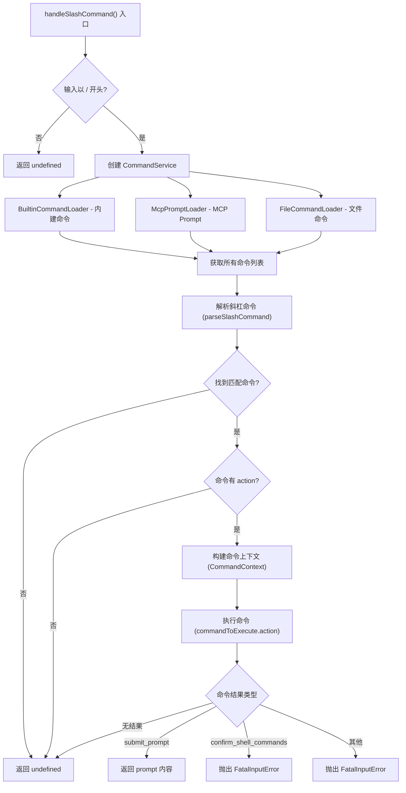

# nonInteractiveCliCommands.ts

## 概述

`nonInteractiveCliCommands.ts` 负责在**非交互式环境**中处理斜杠命令（Slash Commands）。当用户在非交互模式下输入以 `/` 开头的命令时（例如通过 `--prompt "/help"` 传入），该模块解析并执行对应的命令。它使用 `CommandService` 加载所有可用命令（内建命令、MCP Prompt、文件命令），然后根据匹配结果执行命令动作并返回可用于 Gemini API 的 prompt 内容。

## 架构图（Mermaid）



## 核心组件

### 1. `handleSlashCommand()` —— 斜杠命令处理函数

```typescript
export const handleSlashCommand = async (
  rawQuery: string,
  abortController: AbortController,
  config: Config,
  settings: LoadedSettings,
): Promise<PartListUnion | undefined>
```

这是该模块的唯一导出函数，处理流程如下：

#### 1.1 前置验证

检查输入是否以 `/` 开头，如果不是则直接返回 `undefined`，交由上层逻辑处理。

#### 1.2 命令服务创建

通过 `CommandService.create()` 异步创建命令服务，加载三种类型的命令：

| 命令加载器 | 说明 |
|-----------|------|
| `BuiltinCommandLoader` | 内建命令（如 `/help`、`/clear`、`/bug` 等） |
| `McpPromptLoader` | 从 MCP (Model Context Protocol) 服务加载的 Prompt 命令 |
| `FileCommandLoader` | 从文件系统加载的自定义命令 |

加载过程使用 `abortController.signal` 支持取消。

#### 1.3 命令解析

调用 `parseSlashCommand(rawQuery, commands)` 将原始输入解析为命令对象和参数。返回 `{ commandToExecute, args }`。

#### 1.4 命令执行

如果找到匹配的命令且该命令有 `action` 方法：

1. **构建会话统计**：创建 `SessionStatsState` 对象，包含会话 ID、启动时间、遥测指标等。
2. **创建日志器**：使用 `Logger` 创建会话相关的日志实例。
3. **构建命令上下文**：组装 `CommandContext` 对象。
4. **执行命令**：调用 `commandToExecute.action(commandContext, args)`。

#### 1.5 结果处理

根据命令执行结果的 `type` 字段进行分支处理：

| 结果类型 | 处理方式 |
|---------|---------|
| `submit_prompt` | 返回 `result.content` 作为 Gemini API 的 prompt 内容 |
| `confirm_shell_commands` | 抛出 `FatalInputError`（非交互模式不支持确认对话） |
| 其他类型 | 抛出 `FatalInputError`（不支持的结果类型） |
| 无结果（`undefined`） | 返回 `undefined` |

### 2. `CommandContext` —— 命令上下文结构

在非交互模式下构建的 `CommandContext` 包含以下组成部分：

```typescript
const commandContext: CommandContext = {
  services: {
    agentContext: config,          // CLI 配置（作为代理上下文）
    settings,                      // 用户设置
    git: undefined,                // Git 服务（非交互模式不可用）
    logger,                        // 日志器
  },
  ui: createNonInteractiveUI(),    // 非交互式 UI 接口
  session: {
    stats: sessionStats,           // 会话统计
    sessionShellAllowlist: new Set(), // Shell 命令白名单（空集合）
  },
  invocation: {
    raw: trimmed,                  // 原始输入（去除首尾空白）
    name: commandToExecute.name,   // 命令名称
    args,                          // 解析后的参数
  },
};
```

注意事项：
- `git` 服务在非交互模式下设置为 `undefined`（不可用）。
- `sessionShellAllowlist` 为空集合，因为非交互模式下除非启用了 YOLO 模式，否则 Shell 工具会被排除。
- UI 使用 `createNonInteractiveUI()` 创建的简化 UI 接口。

## 依赖关系

### 内部依赖

| 模块路径 | 用途 |
|---------|------|
| `./utils/commands.js` | 斜杠命令解析（`parseSlashCommand`） |
| `./services/CommandService.js` | 命令服务（加载和管理所有命令） |
| `./services/BuiltinCommandLoader.js` | 内建命令加载器 |
| `./services/FileCommandLoader.js` | 文件命令加载器 |
| `./services/McpPromptLoader.js` | MCP Prompt 加载器 |
| `./ui/commands/types.js` | 命令上下文类型定义（`CommandContext`） |
| `./ui/noninteractive/nonInteractiveUi.js` | 非交互式 UI 创建（`createNonInteractiveUI`） |
| `./ui/contexts/SessionContext.js` | 会话统计类型（`SessionStatsState`） |
| `./config/settings.js` | 设置类型（`LoadedSettings`） |

### 外部依赖

| 包名 | 用途 |
|------|------|
| `@google/genai` | Gemini API 类型（`PartListUnion`） |
| `@google/gemini-cli-core` | 核心库，提供 `FatalInputError`、`Logger`、`uiTelemetryService`、`Config` 类型 |

## 关键实现细节

### 命令加载架构

采用了**策略模式**（Strategy Pattern），通过三个不同的命令加载器将命令来源抽象化：
- `BuiltinCommandLoader`：加载代码中硬编码的内建命令。
- `McpPromptLoader`：从 MCP 服务器动态加载 prompt 类型的命令。
- `FileCommandLoader`：从文件系统加载用户自定义命令。

三个加载器传入 `CommandService.create()` 进行统一创建和管理，实现了命令来源的可扩展性。

### 非交互模式下的限制

1. **不支持确认对话**：`confirm_shell_commands` 结果类型会直接抛出 `FatalInputError`，因为非交互模式没有用户界面来显示确认对话框。注释中指出，当前 Shell 工具在非交互模式下已被排除（除非启用 YOLO 模式），所以这个分支实际上不太可能被触发。
2. **Git 服务不可用**：`git` 被设置为 `undefined`。
3. **简化 UI**：使用 `createNonInteractiveUI()` 而非完整的 React UI。

### 返回值语义

- 返回 `PartListUnion`：表示斜杠命令产生了一个需要发送给 Gemini 的 prompt 内容，上层调用方 (`runNonInteractive`) 会将其作为查询发送。
- 返回 `undefined`：表示斜杠命令已经完成处理（如 `/help` 输出帮助信息后无需进一步调用 API），或者输入不是有效的斜杠命令，上层会将原始输入作为普通查询处理。

### 遥测集成

通过 `uiTelemetryService.getMetrics()` 获取当前遥测指标，将其包含在 `SessionStatsState` 中传递给命令上下文，使命令执行过程中也能进行遥测数据收集。
