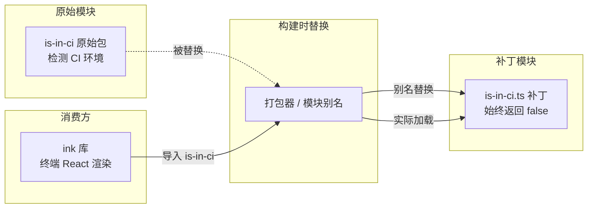
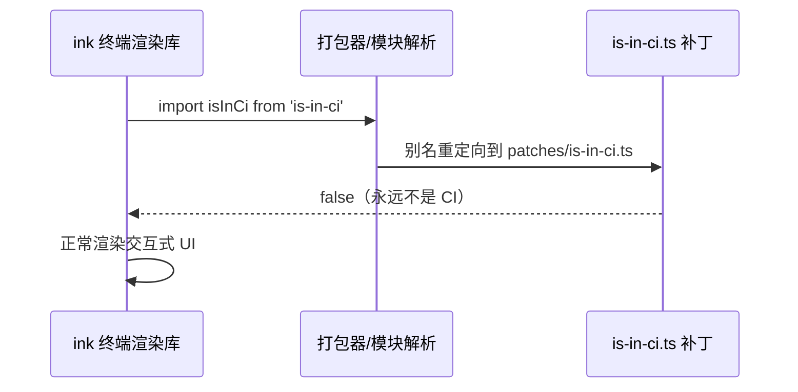

# patches (运行时补丁)

## 概述

`patches` 目录包含对第三方依赖库的运行时补丁（monkey-patch / 模块替换）。这些补丁通过构建配置（如 bundler alias）将原始第三方模块替换为自定义实现，用于修复特定环境下的兼容性问题。

## 目录结构

```
patches/
└── is-in-ci.ts   # 替换 is-in-ci 包，强制返回 false
```

## 架构图



## 核心组件

### `is-in-ci.ts` — CI 环境检测补丁

**问题背景**：`ink`（Gemini CLI 的终端 UI 框架）依赖 `is-in-ci` 包检测是否在 CI 环境中运行。在 CI 环境下，`ink` 会跳过交互式 UI 渲染，导致 CLI 在某些被误判为 CI 的环境中无法正常显示界面。

**补丁策略**：用一个始终返回 `false` 的模块替换 `is-in-ci`，确保 `ink` 在任何环境下都正常渲染交互式 UI。

**安全性**：此补丁是安全的，因为 `is-in-ci` 仅在 `ink`（交互式代码路径）中使用，不影响 CLI 的非交互式/自动化模式。

参考：[Issue #1563](https://github.com/google-gemini/gemini-cli/issues/1563)

```typescript
// 补丁核心代码
const isInCi = false;
export default isInCi;
```

## 依赖关系

| 依赖方向 | 目标 | 说明 |
|---------|------|------|
| `ink` → `is-in-ci` | 被替换的依赖 | 原始 CI 检测逻辑被此补丁覆盖 |
| 构建配置 | 打包器别名 | 通过模块别名机制将 `is-in-ci` 指向此补丁文件 |

## 数据流


