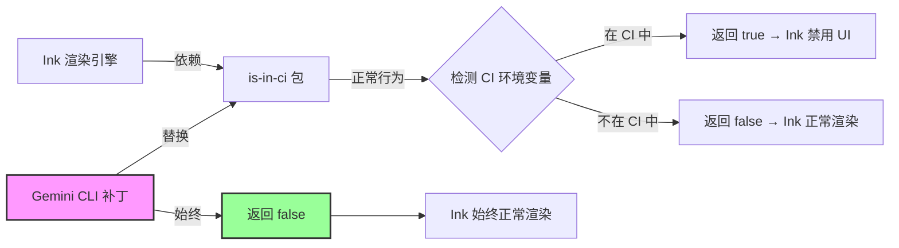

# is-in-ci.ts

## 概述

`is-in-ci.ts` 是一个**补丁文件（Patch）**，用于替换第三方 `is-in-ci` npm 包。该补丁始终返回 `false`，从而阻止 Ink（终端 UI 渲染引擎）检测到 CI 环境并禁用 UI 渲染。这是一个针对 Ink 在 CI 环境中不渲染交互式 UI 问题的变通方案（workaround），相关 issue 编号为 #1563。

## 架构图（Mermaid）



## 核心组件

### 唯一导出：`isInCi` 常量

```typescript
const isInCi = false;
export default isInCi;
```

这是一个极其简单的模块，只做一件事：导出一个值为 `false` 的常量。通过模块路径映射（通常在 `package.json` 的 `imports` 字段或打包工具的 `resolve.alias` 配置中），这个文件替换了 `is-in-ci` 包的默认导出。

## 依赖关系

### 内部依赖

无。该文件不依赖任何内部模块。

### 外部依赖

无。该文件不依赖任何外部包。它本身就是用来替换外部包 `is-in-ci` 的。

## 关键实现细节

### 问题背景

`is-in-ci` 是一个 npm 包，用于检测当前进程是否运行在 CI（持续集成）环境中。它通过检查一系列 CI 相关的环境变量（如 `CI`、`GITHUB_ACTIONS`、`JENKINS_URL`、`GITLAB_CI` 等）来判断。

Ink（Gemini CLI 使用的终端 UI 框架）依赖 `is-in-ci` 来决定是否渲染交互式 UI。当检测到 CI 环境时，Ink 会禁用其渲染系统，因为 CI 环境通常没有交互式终端。

### 为什么需要这个补丁

Gemini CLI 希望即使在 CI 环境中也能正常渲染交互式 UI。这可能因为：
1. 用户可能在 CI 环境中以交互式方式使用 Gemini CLI（例如通过 SSH 连接到 CI runner）。
2. Gemini CLI 有自己的非交互模式检测逻辑，不需要 Ink 层面的 CI 检测。
3. 某些开发环境（如 Cloud Shell、容器化开发环境）可能被误判为 CI 环境。

### 安全性说明

注释中明确指出这个替换是安全的，因为：
- `is-in-ci` 包仅在 Ink 中使用。
- Ink 仅在交互式代码路径中使用。
- 非交互模式有独立的代码路径（`nonInteractiveCli.ts`），完全不涉及 Ink。

因此，强制返回 `false` 不会影响非交互模式的行为，只会确保交互模式下 Ink 始终正常渲染。

### 模块替换机制

这个补丁通过构建工具或 Node.js 的模块解析机制生效。常见的实现方式包括：
- `package.json` 中的 `imports` 映射
- TypeScript `paths` 配置
- 打包工具（如 esbuild、webpack）的 `alias` 配置
- `package.json` 中的 `browser`/`exports` 字段覆盖

当 Ink 内部 `import isInCi from 'is-in-ci'` 时，模块解析器会将其重定向到这个补丁文件，从而返回始终为 `false` 的值。

### 代码规范

文件中的 `// eslint-disable-next-line import/no-default-export` 注释表明项目的 ESLint 规则通常禁止默认导出（偏好命名导出），但由于此文件需要替换 `is-in-ci` 包的默认导出，因此这里特别豁免了该规则。
