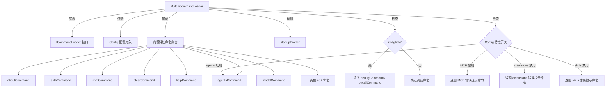

# BuiltinCommandLoader.ts

## 概述

`BuiltinCommandLoader` 是 Gemini CLI 的内置斜杠命令加载器。它负责收集、配置和过滤所有硬编码在应用程序中的核心斜杠命令（如 `/help`、`/clear`、`/model` 等）。该类实现了 `ICommandLoader` 接口，是命令加载体系中最基础的一环，提供了 CLI 运行所必需的全部内置命令。

该加载器的核心职责：
1. 汇集所有内置命令定义
2. 根据配置（`Config`）动态决定哪些命令可用
3. 根据构建类型（nightly/development）注入调试命令
4. 过滤掉 `null` 值，返回最终的命令列表

## 架构图（Mermaid）



## 核心组件

### 类：`BuiltinCommandLoader`

```typescript
export class BuiltinCommandLoader implements ICommandLoader {
  constructor(private config: Config | null) {}
  async loadCommands(_signal: AbortSignal): Promise<SlashCommand[]>
}
```

#### 构造函数

| 参数 | 类型 | 说明 |
|------|------|------|
| `config` | `Config \| null` | 全局配置对象，用于判断各特性开关状态。可能为 `null`。 |

#### 方法：`loadCommands(_signal: AbortSignal)`

这是 `ICommandLoader` 接口要求的核心方法。虽然接收一个 `AbortSignal` 参数，但由于内置命令加载是基本同步的（除 `ideCommand` 和 `isNightly` 外），该信号在此加载器中未被使用。

**执行流程：**

1. 通过 `startupProfiler.start('load_builtin_commands')` 开始性能追踪
2. 调用 `isNightly(process.cwd())` 判断是否为 nightly 构建
3. 通过辅助函数 `addDebugToChatResumeSubCommands` 为 chat/resume 命令的子命令注入 debug 命令（仅 nightly）
4. 构建完整的命令定义数组 `allDefinitions`，其中根据配置条件动态包含/排除命令
5. 结束性能追踪
6. 过滤掉 `null` 值后返回

### 辅助函数：`addDebugToChatResumeSubCommands`

这是一个在 `loadCommands` 内部定义的递归函数，用于在 nightly 构建中为 `chat` 和 `resume` 命令的子命令列表注入 `debugCommand`。

```typescript
const addDebugToChatResumeSubCommands = (
  subCommands: SlashCommand[] | undefined,
): SlashCommand[] | undefined => { ... }
```

**逻辑：**
- 如果子命令列表为空，直接返回
- 递归处理名为 `checkpoints` 的子命令的嵌套子命令
- 在 nightly 构建中，如果子命令列表中尚未包含 `debugCommand`，则追加它

### 命令的条件加载策略

| 命令 | 条件 | 说明 |
|------|------|------|
| `agentsCommand` | `config.isAgentsEnabled()` | 仅在 agents 功能启用时加载 |
| `extensionsCommand` | `config.getExtensionsEnabled() !== false` | 禁用时替换为错误提示命令 |
| `hooksCommand` | `config.getEnableHooksUI()` | 仅在 hooks UI 启用时加载 |
| `oncallCommand` | `isNightly` | 仅在 nightly 构建中加载 |
| `mcpCommand` | `config.getMcpEnabled() !== false` | 禁用时替换为错误提示命令 |
| `permissionsCommand` | `config.getFolderTrust()` | 仅在文件夹信任功能启用时加载 |
| `planCommand` | `config.isPlanEnabled()` | 仅在计划功能启用时加载 |
| `profileCommand` | `isDevelopment` | 仅在开发环境中加载 |
| `skillsCommand` | `config.isSkillsSupportEnabled()` 且管理员未禁用 | 三重条件判断 |
| `upgradeCommand` | `authType === AuthType.LOGIN_WITH_GOOGLE` | 仅在使用 Google 登录认证时加载 |
| `debugCommand` | `isNightly`（作为 chat/resume 子命令） | 通过递归函数注入 |

### 完整内置命令清单

以下是所有可能被加载的内置命令（按代码中出现顺序）：

| 命令名 | 来源模块 | 是否有条件 |
|--------|----------|-----------|
| about | aboutCommand | 无条件 |
| agents | agentsCommand | 需要 agents 启用 |
| auth | authCommand | 无条件 |
| bug | bugCommand | 无条件 |
| chat | chatCommand | 无条件（子命令有条件） |
| clear | clearCommand | 无条件 |
| commands | commandsCommand | 无条件 |
| compress | compressCommand | 无条件 |
| copy | copyCommand | 无条件 |
| corgi | corgiCommand | 无条件 |
| docs | docsCommand | 无条件 |
| directory | directoryCommand | 无条件 |
| editor | editorCommand | 无条件 |
| extensions | extensionsCommand | 条件（禁用时显示错误） |
| help | helpCommand | 无条件 |
| footer | footerCommand | 无条件 |
| shortcuts | shortcutsCommand | 无条件 |
| hooks | hooksCommand | 需要 hooks UI 启用 |
| rewind | rewindCommand | 无条件 |
| ide | ideCommand | 无条件（异步） |
| init | initCommand | 无条件 |
| oncall | oncallCommand | 仅 nightly |
| mcp | mcpCommand | 条件（禁用时显示错误） |
| memory | memoryCommand | 无条件 |
| model | modelCommand | 无条件 |
| permissions | permissionsCommand | 需要 folder trust |
| plan | planCommand | 需要 plan 启用 |
| policies | policiesCommand | 无条件 |
| privacy | privacyCommand | 无条件 |
| profile | profileCommand | 仅开发环境 |
| quit | quitCommand | 无条件 |
| restore | restoreCommand | 无条件（接收 config 参数） |
| resume | resumeCommand | 无条件（子命令有条件） |
| stats | statsCommand | 无条件 |
| theme | themeCommand | 无条件 |
| tools | toolsCommand | 无条件 |
| skills | skillsCommand | 需要 skills 支持且管理员未禁用 |
| settings | settingsCommand | 无条件 |
| shells | shellsCommand | 无条件 |
| vim | vimCommand | 无条件 |
| setupGithub | setupGithubCommand | 无条件 |
| terminalSetup | terminalSetupCommand | 无条件 |
| upgrade | upgradeCommand | 仅 Google 登录认证 |

## 依赖关系

### 内部依赖

| 模块路径 | 导入内容 | 说明 |
|----------|----------|------|
| `../utils/installationInfo.js` | `isDevelopment` | 判断是否为开发环境 |
| `./types.js` | `ICommandLoader` | 命令加载器接口 |
| `../ui/commands/types.js` | `CommandKind`, `SlashCommand`, `CommandContext` | 命令类型定义 |
| `../ui/commands/*.js` | 约 40 个命令定义 | 所有内置命令的具体实现 |

### 外部依赖

| 包名 | 导入内容 | 说明 |
|------|----------|------|
| `@google/gemini-cli-core` | `MessageActionReturn`, `Config` | 核心类型定义 |
| `@google/gemini-cli-core` | `isNightly` | 判断是否为 nightly 构建 |
| `@google/gemini-cli-core` | `startupProfiler` | 启动性能追踪器 |
| `@google/gemini-cli-core` | `getAdminErrorMessage` | 获取管理员错误消息 |
| `@google/gemini-cli-core` | `AuthType` | 认证类型枚举 |

## 关键实现细节

1. **禁用功能的优雅降级**：当某些功能（如 MCP、Extensions、Skills）被管理员禁用时，加载器不是简单地移除命令，而是替换为一个同名但返回错误提示的占位命令。这保证了用户在输入命令时能得到明确的提示信息，而非"命令不存在"的错误。

2. **性能追踪**：使用 `startupProfiler` 追踪内置命令加载的耗时，追踪标签为 `load_builtin_commands`。

3. **递归子命令注入**：`addDebugToChatResumeSubCommands` 通过递归方式处理嵌套子命令（特别是 `checkpoints` 子命令的再嵌套），确保 `debugCommand` 在正确的层级被注入。

4. **不可变模式**：对于需要修改子命令的 `chatCommand` 和 `resumeCommand`，使用展开运算符 `{...command, subCommands: ...}` 创建新对象，而非直接修改原始命令定义。

5. **Null 安全过滤**：最终通过 `.filter((cmd): cmd is SlashCommand => cmd !== null)` 进行类型安全的 null 过滤，确保返回的数组中不包含任何 null 值。

6. **异步操作**：虽然大部分命令加载是同步的，但 `isNightly()` 和 `ideCommand()` 是异步调用，因此 `loadCommands` 方法本身是 `async` 的。

7. **Config null 安全**：由于 `config` 可能为 `null`，代码中大量使用可选链操作符 `?.` 来安全访问配置方法，当 `config` 为 null 时相关条件命令不会被加载。
