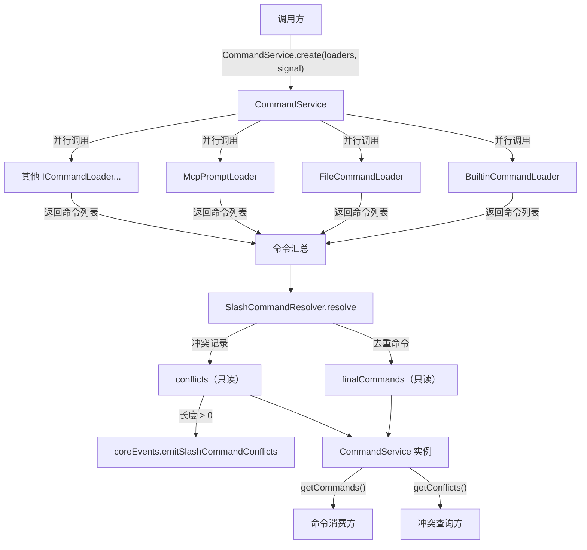
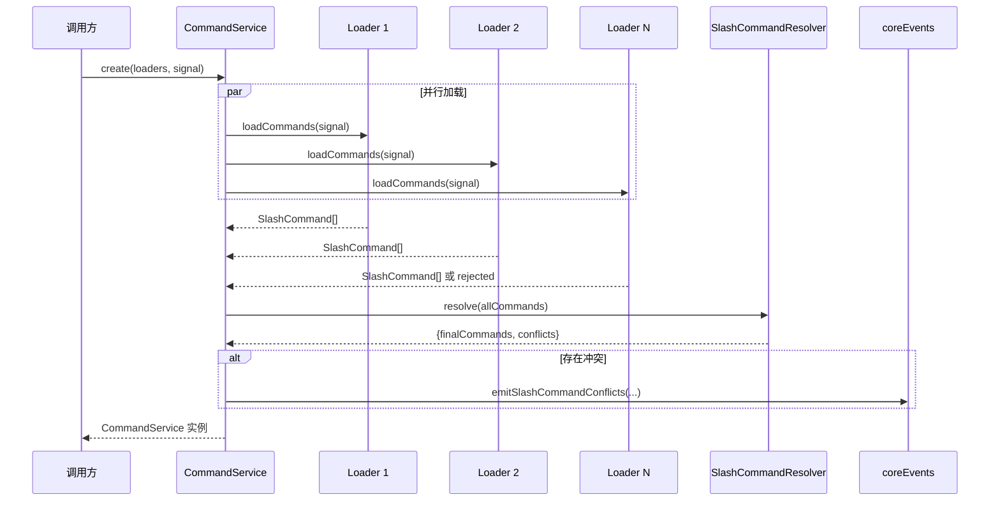

# CommandService.ts

## 概述

`CommandService` 是 Gemini CLI 斜杠命令系统的核心编排服务。它采用 **提供者模式（Provider Pattern）** 统一管理来自多个来源的命令加载、冲突解决和对外分发。该服务接收一组 `ICommandLoader` 实例（如 `BuiltinCommandLoader`、`FileCommandLoader`、`McpPromptLoader` 等），并行加载所有命令后，通过 `SlashCommandResolver` 解决命名冲突，最终提供一个去重后的、只读的命令列表。

核心设计特点：
1. **异步工厂模式**：通过静态 `create()` 方法构造实例，构造函数为私有
2. **并行加载**：使用 `Promise.allSettled` 并行调用所有加载器，容错性好
3. **不可变状态**：加载完成后命令列表和冲突记录均通过 `Object.freeze` 冻结
4. **冲突遥测**：当出现命令名冲突时，自动发射遥测事件

## 架构图（Mermaid）





## 核心组件

### 类：`CommandService`

```typescript
export class CommandService {
  private constructor(
    private readonly commands: readonly SlashCommand[],
    private readonly conflicts: readonly CommandConflict[],
  ) {}
}
```

#### 私有构造函数

| 参数 | 类型 | 说明 |
|------|------|------|
| `commands` | `readonly SlashCommand[]` | 去重后的最终命令列表，不可变 |
| `conflicts` | `readonly CommandConflict[]` | 加载过程中发生的命令名冲突记录，不可变 |

构造函数被设为 `private`，强制外部使用 `CommandService.create()` 静态工厂方法来创建实例。

#### 静态方法：`create(loaders, signal)`

```typescript
static async create(
  loaders: ICommandLoader[],
  signal: AbortSignal,
): Promise<CommandService>
```

**参数：**
- `loaders`: 一组命令加载器实例，每个负责从特定来源获取命令
- `signal`: `AbortSignal`，支持取消加载操作

**执行流程：**
1. 调用 `loadAllCommands()` 并行加载所有加载器的命令
2. 将汇总的命令传递给 `SlashCommandResolver.resolve()` 进行冲突解决
3. 如果存在冲突，调用 `emitConflictEvents()` 发射遥测事件
4. 使用 `Object.freeze()` 冻结命令和冲突数组
5. 返回新的 `CommandService` 实例

#### 私有静态方法：`loadAllCommands(loaders, signal)`

```typescript
private static async loadAllCommands(
  loaders: ICommandLoader[],
  signal: AbortSignal,
): Promise<SlashCommand[]>
```

使用 `Promise.allSettled` 并行调用所有加载器。关键设计：
- **容错性**：即使某个加载器失败（rejected），其他加载器的结果不受影响
- **失败日志**：失败的加载器会通过 `debugLogger.debug` 记录原因
- **结果扁平化**：所有成功加载器返回的命令数组被 `push(...value)` 合并为一个扁平数组

#### 私有静态方法：`emitConflictEvents(conflicts)`

```typescript
private static emitConflictEvents(conflicts: CommandConflict[]): void
```

将命令冲突信息格式化为遥测事件并发射。每个冲突记录包含：
- `name`: 冲突的命令名
- `renamedTo`: 失败方被重命名为什么
- `loserExtensionName` / `winnerExtensionName`: 扩展名称
- `loserMcpServerName` / `winnerMcpServerName`: MCP 服务器名称
- `loserKind` / `winnerKind`: 命令类型

#### 公共方法：`getCommands()`

```typescript
getCommands(): readonly SlashCommand[]
```

返回只读的命令列表。由于使用了 `Object.freeze`，消费方无法修改内部状态。

#### 公共方法：`getConflicts()`

```typescript
getConflicts(): readonly CommandConflict[]
```

返回只读的冲突记录列表。

## 依赖关系

### 内部依赖

| 模块路径 | 导入内容 | 说明 |
|----------|----------|------|
| `../ui/commands/types.js` | `SlashCommand` | 斜杠命令类型定义 |
| `./types.js` | `ICommandLoader`, `CommandConflict` | 加载器接口和冲突类型 |
| `./SlashCommandResolver.js` | `SlashCommandResolver` | 命令冲突解析器 |

### 外部依赖

| 包名 | 导入内容 | 说明 |
|------|----------|------|
| `@google/gemini-cli-core` | `debugLogger` | 调试日志记录器 |
| `@google/gemini-cli-core` | `coreEvents` | 核心事件发射器，用于遥测 |

## 关键实现细节

1. **异步工厂模式（Async Factory Pattern）**：由于命令加载涉及异步操作（如文件 I/O、MCP 通信），构造函数无法直接执行初始化逻辑。因此使用静态 `create()` 方法作为工厂，先完成所有异步工作，再将结果传入私有构造函数。这确保了实例在创建时即处于完全初始化状态。

2. **`Promise.allSettled` vs `Promise.all`**：选择 `allSettled` 而非 `all`，使得单个加载器的失败不会影响其他加载器。例如，即使 MCP 服务器不可达导致 `McpPromptLoader` 失败，内置命令和文件命令仍能正常加载。

3. **不可变性保证**：命令和冲突数组均通过 `Object.freeze()` 冻结，且类型声明为 `readonly`。这提供了运行时和编译时双重保护，防止服务状态被意外修改。

4. **冲突遥测**：冲突事件通过 `flatMap` 将每个冲突展开为多个"失败者"事件（一个命令名冲突可能涉及多个失败方），每个事件包含胜出方和失败方的完整上下文信息。

5. **职责分离**：`CommandService` 本身不处理冲突解决逻辑，而是委托给 `SlashCommandResolver`。这使得冲突解决策略可以独立测试和修改。

6. **调试友好**：加载器失败时通过 `debugLogger.debug` 记录，不会中断整体流程，方便开发者排查问题。
