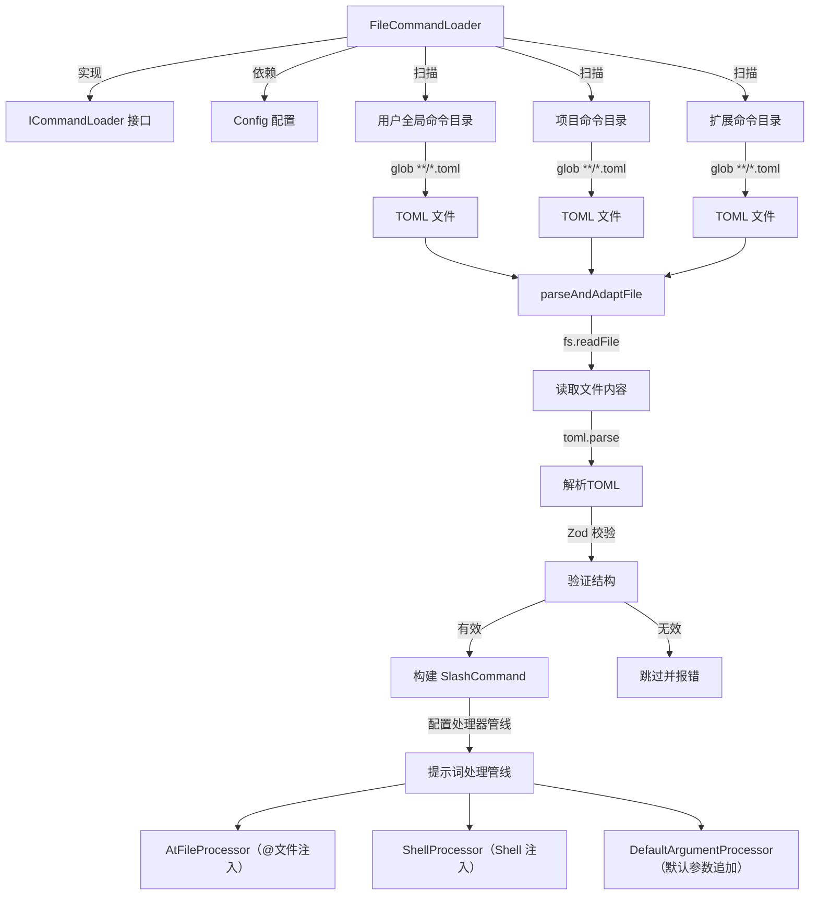
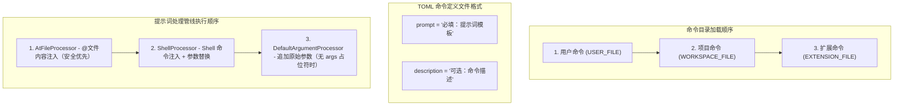

# FileCommandLoader.ts

## 概述

`FileCommandLoader` 是基于文件系统的自定义斜杠命令加载器。它负责从 TOML 格式的命令定义文件中发现、解析、验证并适配自定义斜杠命令。该加载器扫描三类目录：

1. **用户全局命令目录** -- 用户级别的自定义命令
2. **项目命令目录** -- 当前工作区/项目级别的自定义命令
3. **扩展命令目录** -- 已激活扩展提供的命令

加载顺序为 "用户 -> 项目 -> 扩展"，这一顺序对冲突解决策略至关重要：用户/项目命令采用"后者胜出"策略，而扩展命令在冲突时会被重命名。

该加载器还集成了提示词处理管线（Prompt Processing Pipeline），支持 `{{args}}` 参数替换、`$()` Shell 注入和 `@file` 文件内容注入等高级特性。

## 架构图（Mermaid）





## 核心组件

### 接口：`CommandDirectory`

```typescript
interface CommandDirectory {
  path: string;          // 命令目录的绝对路径
  kind: CommandKind;     // 命令类型（USER_FILE / WORKSPACE_FILE / EXTENSION_FILE）
  extensionName?: string; // 扩展名称（仅扩展命令）
  extensionId?: string;   // 扩展 ID（仅扩展命令）
}
```

### Zod Schema：`TomlCommandDefSchema`

```typescript
const TomlCommandDefSchema = z.object({
  prompt: z.string({ required_error: "The 'prompt' field is required." }),
  description: z.string().optional(),
});
```

定义了 TOML 命令文件的合法结构：
- `prompt`（必填）：提示词模板字符串，可包含 `{{args}}`、`$()` 和 `@file` 等占位符
- `description`（可选）：命令描述，默认为 `Custom command from <文件名>`

### 类：`FileCommandLoader`

```typescript
export class FileCommandLoader implements ICommandLoader {
  private readonly projectRoot: string;
  private readonly folderTrustEnabled: boolean;
  private readonly isTrustedFolder: boolean;
  constructor(private readonly config: Config | null) {}
}
```

#### 构造函数

| 属性 | 来源 | 说明 |
|------|------|------|
| `projectRoot` | `config.getProjectRoot()` 或 `process.cwd()` | 项目根目录 |
| `folderTrustEnabled` | `config.getFolderTrust()` | 是否启用了文件夹信任功能 |
| `isTrustedFolder` | `config.isTrustedFolder()` | 当前文件夹是否被信任 |

#### 方法：`loadCommands(signal: AbortSignal)`

主加载方法。

**安全检查：** 如果文件夹信任功能已启用但当前文件夹未被信任，则直接返回空数组，不加载任何自定义命令。

**执行流程：**
1. 调用 `getCommandDirectories()` 获取所有需要扫描的目录
2. 对每个目录使用 `glob('**/*.toml', ...)` 递归查找 TOML 文件
3. 对每个 TOML 文件调用 `parseAndAdaptFile()` 解析并转换为 `SlashCommand`
4. 过滤掉 `null` 值（无效文件）
5. 将所有命令汇总返回

**错误处理：**
- `ENOENT`（目录不存在）和信号中止被静默忽略
- 其他错误通过 `coreEvents.emitFeedback('error', ...)` 报告

**Glob 选项：**
- `nodir: true` -- 仅匹配文件
- `dot: true` -- 包含以 `.` 开头的文件
- `follow: true` -- 跟随符号链接
- `signal` -- 支持取消

#### 方法：`getCommandDirectories()`

返回命令目录列表，按固定顺序：

| 顺序 | 类型 | 路径 | CommandKind |
|------|------|------|-------------|
| 1 | 用户命令 | `Storage.getUserCommandsDir()` | `USER_FILE` |
| 2 | 项目命令 | `storage.getProjectCommandsDir()` | `WORKSPACE_FILE` |
| 3 | 扩展命令 | `<ext.path>/commands`（按扩展名字母排序） | `EXTENSION_FILE` |

扩展命令仅包含处于激活状态（`isActive`）的扩展，且按名称字母序排列以确保加载的确定性。

#### 方法：`parseAndAdaptFile(filePath, baseDir, kind, extensionName?, extensionId?)`

将单个 TOML 文件解析并转换为 `SlashCommand` 对象。

**步骤：**

1. **读取文件**：`fs.readFile(filePath, 'utf-8')`
2. **解析 TOML**：`toml.parse(fileContent)`
3. **Zod 验证**：`TomlCommandDefSchema.safeParse(parsed)`
4. **生成命令名称**：
   - 计算相对路径（去掉 `.toml` 扩展名）
   - 用 `:` 替换路径分隔符（命名空间分隔符）
   - 每个路径段中非 `[a-zA-Z0-9_\-.]` 字符替换为 `_`
   - 每段超过 50 字符时截断为 47 + `...`
5. **生成描述**：使用文件中的 `description` 或默认描述，截断至 100 字符，扩展命令前缀加 `[扩展名]`
6. **配置处理器管线**（按安全优先顺序）：
   - 如果包含 `@file` 触发器 -> 添加 `AtFileProcessor`
   - 如果包含 `$()` 触发器或 `{{args}}` -> 添加 `ShellProcessor`
   - 如果不包含 `{{args}}` -> 添加 `DefaultArgumentProcessor`
7. **构建 SlashCommand**：包含 `action` 闭包，执行时依次运行处理器管线

**命令 Action 执行逻辑：**

```typescript
action: async (context, _args) => {
  // 1. 检查 invocation 上下文
  // 2. 按顺序执行处理器管线
  // 3. 返回 { type: 'submit_prompt', content: processedContent }
  // 4. 若 ShellProcessor 抛出 ConfirmationRequiredError
  //    -> 返回 { type: 'confirm_shell_commands', ... }
}
```

## 依赖关系

### 内部依赖

| 模块路径 | 导入内容 | 说明 |
|----------|----------|------|
| `./types.js` | `ICommandLoader` | 命令加载器接口 |
| `../ui/commands/types.js` | `CommandKind`, `SlashCommand`, `SlashCommandActionReturn`, `CommandContext` | 命令类型定义 |
| `./prompt-processors/argumentProcessor.js` | `DefaultArgumentProcessor` | 默认参数处理器 |
| `./prompt-processors/types.js` | `IPromptProcessor`, `PromptPipelineContent`, `SHORTHAND_ARGS_PLACEHOLDER`, `SHELL_INJECTION_TRIGGER`, `AT_FILE_INJECTION_TRIGGER` | 处理器接口和常量 |
| `./prompt-processors/shellProcessor.js` | `ConfirmationRequiredError`, `ShellProcessor` | Shell 命令处理器 |
| `./prompt-processors/atFileProcessor.js` | `AtFileProcessor` | @文件内容处理器 |
| `../ui/utils/textUtils.js` | `sanitizeForDisplay` | 文本展示清理工具 |

### 外部依赖

| 包名 | 导入内容 | 说明 |
|------|----------|------|
| `node:fs` | `promises as fs` | 文件系统异步操作 |
| `node:path` | `path` | 路径操作 |
| `@iarna/toml` | `toml` | TOML 文件解析器 |
| `glob` | `glob` | 文件 glob 模式匹配 |
| `zod` | `z` | 运行时类型验证 |
| `@google/gemini-cli-core` | `Storage`, `coreEvents`, `Config` | 存储、事件和配置 |

## 关键实现细节

1. **安全优先的处理器排序**：处理器管线的执行顺序经过精心设计——`AtFileProcessor` 最先执行，确保文件内容在 Shell 命令执行之前被安全注入，防止恶意 `@` 路径通过 Shell 动态生成。

2. **文件夹信任机制**：当 `folderTrustEnabled` 为 `true` 且当前文件夹不被信任时，加载器不会加载任何自定义命令。这是一个重要的安全措施，防止不受信任的项目目录中的恶意命令文件被执行。

3. **命令命名规则**：TOML 文件的相对路径被转换为命令名，路径分隔符 `/` 变为 `:` 作为命名空间分隔符。例如 `git/commit.toml` 变为 `git:commit`。路径段中的特殊字符被替换为 `_`，且长度限制为 50 字符。

4. **确定性加载**：扩展命令按扩展名字母序排列，确保在不同运行之间加载顺序一致，从而使冲突解决结果可预测。

5. **ConfirmationRequiredError 模式**：当 Shell 处理器检测到需要用户确认的命令时，不是直接执行，而是抛出 `ConfirmationRequiredError`。命令 action 捕获此异常，并返回特殊的 `confirm_shell_commands` 类型结果，将确认流程委托给 UI 层。

6. **Glob 跟随符号链接**：`follow: true` 选项允许命令目录中使用符号链接，增加了灵活性。

7. **优雅的错误处理**：每个可能失败的步骤（读取文件、解析 TOML、验证 schema）都有独立的 try-catch 块和明确的错误日志，一个文件的失败不影响其他文件的加载。

8. **描述清理**：使用 `sanitizeForDisplay` 将描述文本截断至 100 字符，防止 UI 溢出。扩展命令的描述会自动加上 `[扩展名]` 前缀以便识别来源。
