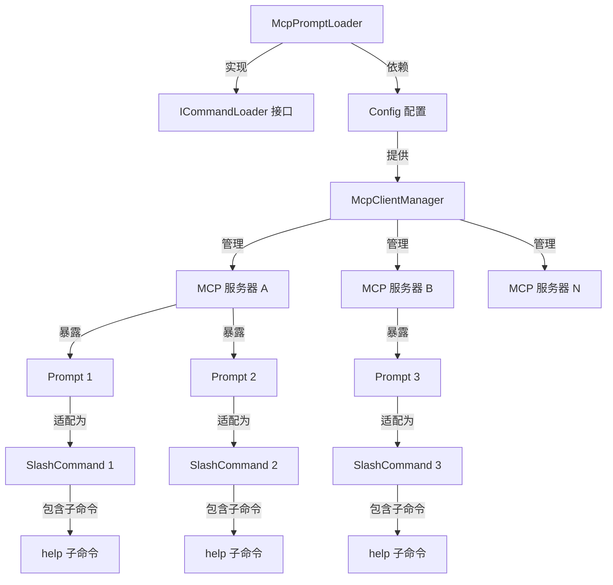
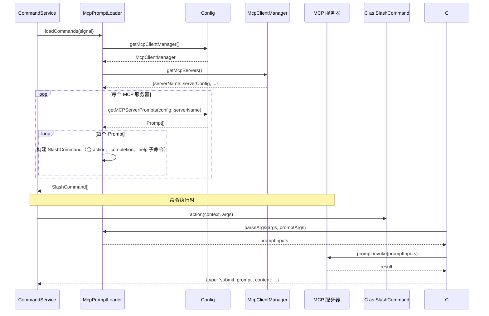

# McpPromptLoader.ts

## 概述

`McpPromptLoader` 是基于 MCP（Model Context Protocol）协议的命令加载器。它从已配置的 MCP 服务器中发现并加载 "Prompt" 类型资源，将其适配为可执行的斜杠命令（SlashCommand）。

MCP 是一种标准化协议，允许外部服务器为 AI 助手提供工具（Tools）、提示词（Prompts）和资源（Resources）。本加载器专注于 Prompts 部分——将 MCP 服务器暴露的提示词模板转换为 CLI 可用的斜杠命令。

核心特性：
1. 遍历所有已配置的 MCP 服务器，收集其暴露的 Prompts
2. 为每个 Prompt 生成一个可执行的斜杠命令
3. 支持命名参数（`--key="value"`）和位置参数
4. 提供自动补全（completion）功能
5. 为每个 Prompt 命令自动生成 `help` 子命令

## 架构图（Mermaid）





## 核心组件

### 类：`McpPromptLoader`

```typescript
export class McpPromptLoader implements ICommandLoader {
  constructor(private readonly config: Config | null) {}
}
```

#### 方法：`loadCommands(_signal: AbortSignal)`

遍历所有 MCP 服务器及其 Prompts，为每个 Prompt 构建一个完整的 `SlashCommand` 对象。

**执行流程：**
1. 检查 `config` 是否存在，不存在则返回空数组
2. 通过 `config.getMcpClientManager()?.getMcpServers()` 获取所有 MCP 服务器
3. 对每个服务器调用 `getMCPServerPrompts(config, serverName)` 获取其 Prompts
4. 对每个 Prompt 构建 `SlashCommand`

**注意：** 该方法虽然返回 `Promise<SlashCommand[]>`，但实际上是同步执行的（使用 `Promise.resolve` 包装返回值），因为 MCP Prompts 的元数据在服务启动时已缓存。

#### SlashCommand 构建详情

每个 MCP Prompt 被转换为的 SlashCommand 包含以下部分：

| 属性 | 说明 |
|------|------|
| `name` | Prompt 名称，空格替换为 `-`（如 `"Prompt Name"` -> `"Prompt-Name"`） |
| `description` | Prompt 描述或默认的 `Invoke prompt <name>` |
| `kind` | `CommandKind.MCP_PROMPT` |
| `mcpServerName` | 来源 MCP 服务器名称 |
| `autoExecute` | 无参数时为 `true`，有参数时为 `false` |
| `subCommands` | 包含一个 `help` 子命令 |
| `action` | 解析参数后调用 `prompt.invoke()` |
| `completion` | 提供参数名自动补全 |

#### help 子命令

每个 MCP Prompt 命令自动附带一个 `help` 子命令：

```
/<command-name> help
```

输出内容包含：
- Prompt 是否有参数
- 所有参数的名称、描述和是否必填
- 使用示例（命名参数和位置参数两种方式）

#### action 执行逻辑

```
用户输入 -> parseArgs() 解析参数 -> prompt.invoke(inputs) -> 返回结果
```

**错误处理：**
- `config` 为 null -> 返回错误消息
- `parseArgs` 返回 Error -> 返回参数错误消息
- MCP 服务器配置不存在 -> 返回配置错误消息
- `prompt.invoke()` 返回 error 字段 -> 返回调用错误消息
- 响应内容不是 text 类型 -> 返回无效响应错误
- 其他异常 -> 通过 `getErrorMessage` 格式化后返回

#### completion 自动补全逻辑

提供参数名称的智能补全功能：

1. 解析当前已输入的参数
2. 找出尚未使用的参数名
3. 处理正在输入中的参数（未闭合的引号）
4. 如果恰好有一个参数匹配且引号未闭合，自动补全闭合引号
5. 返回以 `--argName="` 格式的补全建议

**特殊逻辑：**
- 如果某个参数已被赋值但值等于 `partialArg`（表示用户还在输入参数名而非值），该参数仍被视为未使用
- 当输入末尾恰好匹配一个参数名且引号未闭合时，自动补全闭合引号 `"`

#### 方法：`parseArgs(userArgs, promptArgs)`

```typescript
parseArgs(
  userArgs: string,
  promptArgs: PromptArgument[] | undefined,
): Record<string, unknown> | Error
```

将用户输入的参数字符串解析为键值对记录。支持两种参数格式：

**命名参数：**
```
--key="value"       // 引号包裹
--key=value         // 无引号
--key="va\"lue"     // 转义引号
```

**位置参数：**
```
"value1" value2     // 按 promptArgs 定义的顺序匹配
```

**解析算法：**

1. 使用正则 `/--([^=]+)=(?:"((?:\\.|[^"\\])*)"|([^ ]+))/g` 匹配所有命名参数
2. 收集命名参数之间和之后的文本作为位置参数候选
3. 使用正则 `/(?:"((?:\\.|[^"\\])*)"|([^ ]+))/g` 从位置参数文本中提取各个值
4. 将命名参数按名称匹配到 `promptArgs`
5. 收集未被命名参数填充的必填参数（`unfilledArgs`）
6. **特殊优化：** 如果只有一个未填充的必填参数，将所有位置参数合并为一个字符串赋给它（不要求引号）
7. 如果有多个未填充参数，按顺序用位置参数填充
8. 如果仍有必填参数缺失，返回 Error

**返回值：**
- 成功：`Record<string, unknown>` -- 参数名到值的映射
- 失败：`Error` -- 包含缺失参数名列表的错误信息

## 依赖关系

### 内部依赖

| 模块路径 | 导入内容 | 说明 |
|----------|----------|------|
| `../ui/commands/types.js` | `CommandKind`, `CommandContext`, `SlashCommand`, `SlashCommandActionReturn` | 命令类型定义 |
| `./types.js` | `ICommandLoader` | 命令加载器接口 |

### 外部依赖

| 包名 | 导入内容 | 说明 |
|------|----------|------|
| `@google/gemini-cli-core` | `getErrorMessage` | 错误消息格式化 |
| `@google/gemini-cli-core` | `getMCPServerPrompts` | 获取 MCP 服务器的 Prompts |
| `@google/gemini-cli-core` | `Config` | 配置类型 |
| `@modelcontextprotocol/sdk/types.js` | `PromptArgument` | MCP Prompt 参数类型定义 |

## 关键实现细节

1. **同步式 Promise 返回**：虽然 `loadCommands` 的签名返回 `Promise`，但实际执行是同步的——MCP Prompts 的元数据在 CLI 启动时已经通过 MCP 客户端管理器缓存。真正的异步操作（`prompt.invoke()`）发生在命令执行时而非加载时。

2. **命令名清理**：Prompt 名称中的空白字符被替换为 `-`（如 `"Code Review"` -> `"Code-Review"`），确保生成的斜杠命令名合法。

3. **autoExecute 语义**：当 Prompt 没有参数时，`autoExecute` 为 `true`，意味着用户输入命令名后无需按回车即可自动执行；有参数时为 `false`，等待用户输入参数。

4. **单参数优化**：`parseArgs` 中，如果只有一个未填充的必填参数，所有位置参数会被合并为一个字符串。这提供了更友好的用户体验——用户不需要用引号包裹包含空格的单参数值。

5. **命名参数正则的转义支持**：正则表达式 `(?:"((?:\\.|[^"\\])*)"|([^ ]+))` 支持引号内的转义字符（如 `\"`），解析后通过 `.replace(/\\(.)/g, '$1')` 移除转义前缀。

6. **惰性执行**：命令的 `action` 闭包捕获了 `prompt` 对象和 `serverName`。实际的 MCP 调用（`prompt.invoke()`）只在用户执行命令时才发生，而非加载时。

7. **补全智能引号闭合**：completion 函数在检测到用户正在输入参数值（引号未闭合）时，会自动补全闭合引号，提升输入体验。

8. **错误返回而非抛出**：`parseArgs` 方法使用 `Error` 对象作为返回值来表示解析失败，而非抛出异常。调用方通过 `instanceof Error` 检查来区分成功和失败，这是一种函数式风格的错误处理。
