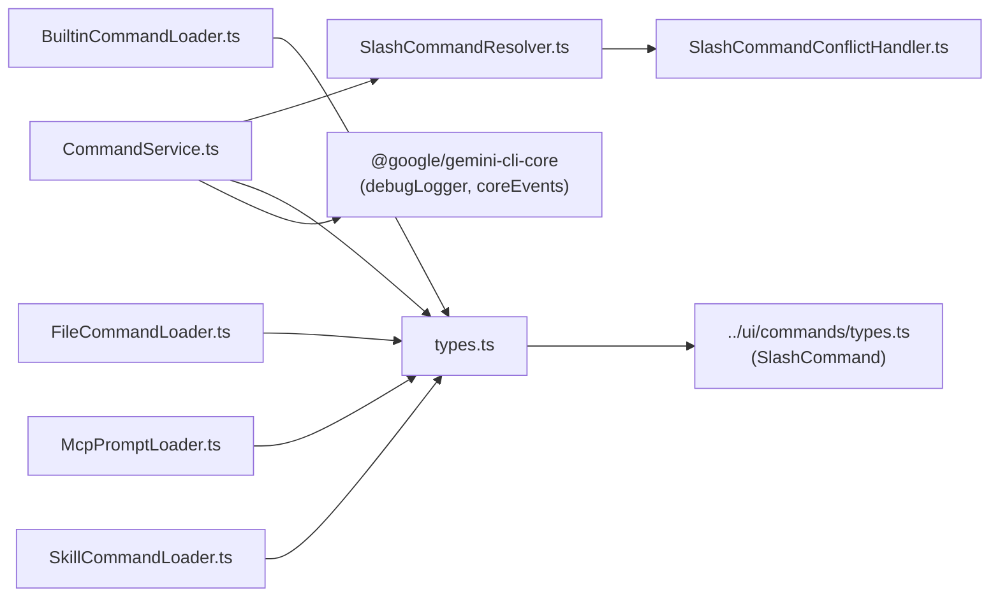
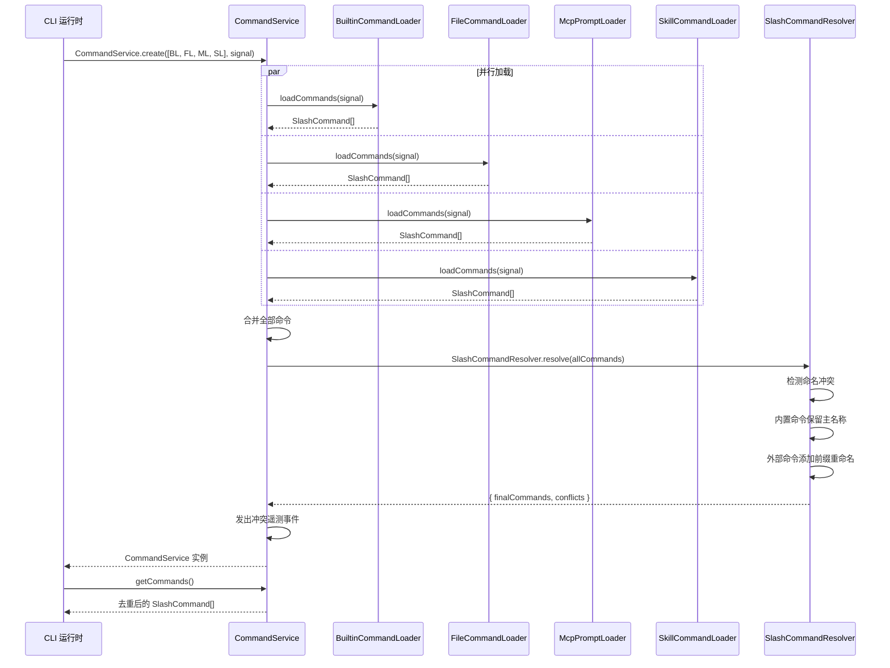

# services 目录

## 概述

`services` 目录实现了 Gemini CLI 的 **斜杠命令（Slash Command）服务层**。它负责从多种来源（内置命令、本地文件、MCP Prompt、Skill）发现、加载、解析和去重斜杠命令，并通过统一的 `CommandService` 对外提供一个无冲突的命令列表。该层采用 **Provider 模式**（加载器模式），支持在不修改核心逻辑的情况下扩展新的命令来源。

## 目录结构

```
services/
├── types.ts                          # 核心接口定义（ICommandLoader, CommandConflict）
├── CommandService.ts                 # 命令服务编排器（异步工厂 + 冲突解析）
├── SlashCommandResolver.ts           # 命令冲突解析器（去重 + 重命名）
├── SlashCommandConflictHandler.ts    # 冲突处理策略
├── BuiltinCommandLoader.ts           # 内置命令加载器
├── FileCommandLoader.ts              # 文件命令加载器（本地 .md/.txt 文件）
├── McpPromptLoader.ts                # MCP Prompt 命令加载器
├── SkillCommandLoader.ts             # Skill 命令加载器
├── prompt-processors/                # 提示词处理器子目录
└── *.test.ts                         # 对应测试文件
```

## 架构图

```mermaid
graph TD
    CLI["CLI 运行时"]

    CLI -->|"CommandService.create(loaders)"| 服务["CommandService<br/>命令服务编排器"]

    服务 -->|并行加载| 内置["BuiltinCommandLoader<br/>内置命令"]
    服务 -->|并行加载| 文件["FileCommandLoader<br/>文件命令"]
    服务 -->|并行加载| MCP["McpPromptLoader<br/>MCP Prompt"]
    服务 -->|并行加载| Skill["SkillCommandLoader<br/>Skill 命令"]

    内置 -->|SlashCommand[]| 汇总["全部命令汇总"]
    文件 -->|SlashCommand[]| 汇总
    MCP -->|SlashCommand[]| 汇总
    Skill -->|SlashCommand[]| 汇总

    汇总 --> 解析器["SlashCommandResolver<br/>冲突解析"]
    解析器 -->|冲突处理| 冲突处理["SlashCommandConflictHandler<br/>重命名策略"]
    解析器 --> 最终命令["去重后的<br/>SlashCommand[]"]
    解析器 --> 冲突列表["CommandConflict[]"]

    最终命令 --> 服务
    冲突列表 -->|遥测事件| 事件["coreEvents"]
```

## 核心组件

### 1. CommandService - 命令服务编排器

- **异步工厂模式**: 通过 `CommandService.create(loaders, signal)` 创建实例，不暴露构造函数。
- **并行加载**: 使用 `Promise.allSettled()` 并行调用所有加载器，单个加载器失败不影响其他。
- **冲突解析委托**: 将所有加载到的命令传递给 `SlashCommandResolver.resolve()` 进行去重。
- **冲突遥测**: 自动通过 `coreEvents.emitSlashCommandConflicts()` 发出冲突事件。
- **不可变输出**: 返回的命令列表和冲突列表均为冻结的只读数组。

### 2. ICommandLoader 接口 - 命令加载器契约

```typescript
interface ICommandLoader {
  loadCommands(signal: AbortSignal): Promise<SlashCommand[]>;
}
```

所有加载器实现此接口，通过构造函数注入依赖（如 Config）。

### 3. 四种命令加载器

| 加载器 | 来源 | 说明 |
|---|---|---|
| `BuiltinCommandLoader` | 代码内置 | 加载 CLI 核心内置的斜杠命令 |
| `FileCommandLoader` | 本地文件 | 从工作区或用户目录加载 `.md`/`.txt` 格式的自定义命令 |
| `McpPromptLoader` | MCP 服务器 | 从已连接的 MCP 服务器加载 Prompt 类型命令 |
| `SkillCommandLoader` | Skill 定义 | 从已加载的 Skill 中提取斜杠命令 |

### 4. SlashCommandResolver - 冲突解析器

当多个加载器返回同名命令时，解析器负责：
- 内置命令保留主名称（最高优先级）。
- 冲突的外部命令通过 `SlashCommandConflictHandler` 重命名（添加来源前缀）。
- 记录所有冲突信息供遥测和 UI 展示。

### 5. CommandConflict - 冲突记录

```typescript
interface CommandConflict {
  name: string;                       // 冲突的命令名
  losers: Array<{
    command: SlashCommand;            // 被重命名的命令
    renamedTo: string;                // 新名称
    reason: SlashCommand;             // 优胜命令
  }>;
}
```

## 依赖关系



## 数据流


