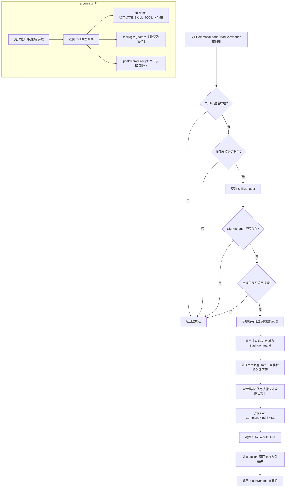
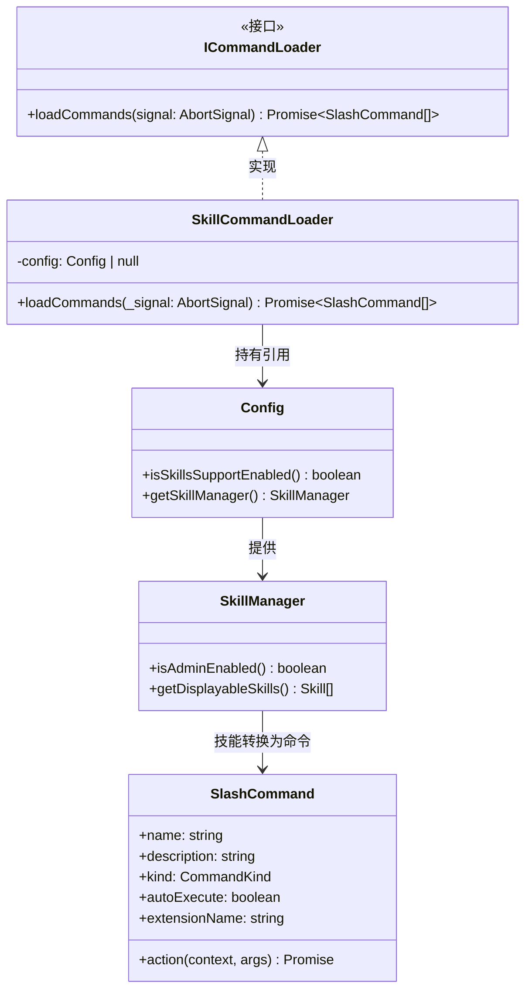

# SkillCommandLoader.ts

## 概述

`SkillCommandLoader` 是一个命令加载器，实现了 `ICommandLoader` 接口。它的职责是**将 Agent Skills（代理技能）转换为可执行的斜杠命令（Slash Commands）**，使用户可以通过 `/技能名称` 的方式在 CLI 中激活和使用各种技能。

工作流程：
1. 检查技能支持是否启用（配置层面和管理员层面双重检查）。
2. 从 `SkillManager` 获取所有可显示的技能。
3. 将每个技能映射为一个 `SlashCommand` 对象，包含命令名称、描述、类型和执行动作。
4. 每个生成的命令在执行时会返回一个 `tool` 类型的结果，触发 `ACTIVATE_SKILL_TOOL_NAME` 工具调用来激活对应的技能。

## 架构图（Mermaid）





## 核心组件

### `SkillCommandLoader` 类

| 成员 | 类型 | 说明 |
|---|---|---|
| `config` | `Config \| null`（私有） | 应用配置对象，可能为 null（此时加载器返回空命令列表） |
| `loadCommands(_signal)` | 异步方法 | 加载并返回从技能转换而来的斜杠命令数组。`_signal` 参数未使用（该加载器本质上是同步的） |

### `loadCommands` 方法详细流程

#### 前置守卫检查（四重防护）

1. **Config 存在性检查**：`this.config` 为 null 时直接返回空数组。
2. **技能支持启用检查**：调用 `config.isSkillsSupportEnabled()`，若返回 false 则返回空数组。
3. **SkillManager 存在性检查**：调用 `config.getSkillManager()`，若返回 null/undefined 则返回空数组。
4. **管理员启用检查**：调用 `skillManager.isAdminEnabled()`，若返回 false 则返回空数组。

#### 技能到命令的映射逻辑

对 `skillManager.getDisplayableSkills()` 返回的每个技能，生成一个 `SlashCommand` 对象：

| SlashCommand 字段 | 值来源 | 说明 |
|---|---|---|
| `name` | `skill.name.trim().replace(/\s+/g, '-')` | 技能名称经过 trim 去空白后，将所有空白字符序列替换为连字符 `-`。例如 "Code Review" 变为 "Code-Review" |
| `description` | `skill.description \|\| \`Activate the ${skill.name} skill\`` | 优先使用技能自带描述，若无描述则生成默认文本 |
| `kind` | `CommandKind.SKILL` | 命令类型标记为技能命令 |
| `autoExecute` | `true` | 标记为自动执行，意味着选中后自动触发而非等待用户二次确认 |
| `extensionName` | `skill.extensionName` | 技能所属的扩展名称，直接透传 |
| `action` | 异步函数 | 命令执行时的动作函数 |

#### `action` 函数的返回值

```typescript
{
  type: 'tool',
  toolName: ACTIVATE_SKILL_TOOL_NAME,  // 技能激活工具名称
  toolArgs: { name: skill.name },       // 使用技能的原始名称（非处理后的命令名）
  postSubmitPrompt: args.trim().length > 0 ? args.trim() : undefined,
}
```

- **`type: 'tool'`**：表示该命令的结果是一个工具调用请求。
- **`toolName`**：使用 `ACTIVATE_SKILL_TOOL_NAME` 常量，这是核心库中定义的技能激活工具名称。
- **`toolArgs`**：传递技能的**原始名称**（`skill.name`）而非处理后的命令名称，确保技能管理器能正确识别。
- **`postSubmitPrompt`**：如果用户在命令后提供了参数（如 `/Code-Review 请检查这个函数`），则参数经过 trim 后作为后续提示发送；若无参数则为 `undefined`。

## 依赖关系

### 内部依赖

| 模块路径 | 导入内容 | 用途 |
|---|---|---|
| `@google/gemini-cli-core` | `Config`（类型） | 应用配置类型，提供技能支持状态检查、SkillManager 获取等方法 |
| `@google/gemini-cli-core` | `ACTIVATE_SKILL_TOOL_NAME` | 技能激活工具名称常量，用于构造工具调用结果 |
| `../ui/commands/types.js` | `CommandKind` | 命令类型枚举，使用了 `SKILL` 值 |
| `../ui/commands/types.js` | `SlashCommand`（类型） | 斜杠命令类型定义 |
| `./types.js` | `ICommandLoader`（类型） | 命令加载器接口 |

### 外部依赖

无直接外部第三方依赖。

## 关键实现细节

1. **命令名称规范化**：技能名称通过 `trim().replace(/\s+/g, '-')` 转换为命令名称。这意味着：
   - 前后空白被移除。
   - 中间的连续空白（空格、制表符等）被替换为单个连字符 `-`。
   - 例如："  My  Skill  " → "My-Skill"。
   - 但 `toolArgs` 中仍使用原始 `skill.name`，确保技能激活时的名称匹配。

2. **四重防护策略**：加载器在尝试获取技能之前进行了四层防护检查（config 存在性 → 技能支持开关 → SkillManager 存在性 → 管理员启用状态）。任何一层不满足都会安全地返回空数组，不会抛出错误。这种防御式编程确保了在技能系统未完全配置时不会破坏命令加载流程。

3. **`autoExecute: true` 的含义**：技能命令被标记为自动执行。当用户选择（或输入）该命令时，系统会立即执行 `action` 函数，而不需要用户再按一次回车确认。这提供了更流畅的用户体验。

4. **`_signal` 参数未使用**：虽然 `ICommandLoader` 接口要求 `loadCommands` 接收 `AbortSignal`，但 `SkillCommandLoader` 的实现本质上是同步的（只是进行内存中的数据映射），因此不需要响应取消信号。参数前的下划线 `_` 表明这是有意为之。

5. **工具调用模式**：技能命令的 `action` 不直接执行技能逻辑，而是返回一个 `tool` 类型的结果对象。这是一种**间接调用模式** — 命令系统将工具调用请求传递给上层的 AI 代理循环，由代理负责实际的技能激活和执行。这种解耦使得技能的执行可以集成到代理的工具调用流程中，享受统一的上下文管理和错误处理。

6. **`extensionName` 透传**：技能所属的扩展名称被直接传递到 `SlashCommand` 对象上。这使得 UI 层可以显示技能来源信息（如 "此技能由 xxx 扩展提供"），帮助用户了解命令的来源和可信度。
