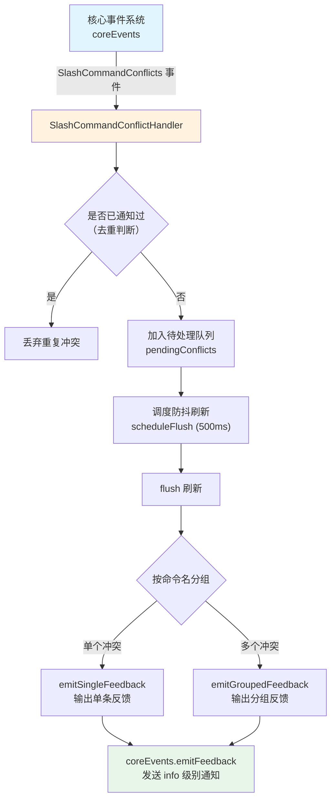

# SlashCommandConflictHandler.ts

## 概述

`SlashCommandConflictHandler` 是一个斜杠命令冲突处理器，负责监听并处理来自核心事件系统（`coreEvents`）的斜杠命令冲突事件。当多个来源（内置命令、扩展命令、MCP 服务器命令、用户命令、工作区命令等）注册了同名的斜杠命令时，系统会自动对"失败方"进行重命名。本处理器通过**防抖批量合并**策略，将短时间内产生的多个冲突通知聚合为一条用户友好的反馈消息，避免在启动或增量加载期间产生大量 UI 噪音。

## 架构图（Mermaid）



## 核心组件

### 类：`SlashCommandConflictHandler`

| 成员 | 类型 | 可见性 | 说明 |
|---|---|---|---|
| `notifiedConflicts` | `Set<string>` | `private` | 已通知的冲突唯一键集合，用于去重。键格式为 `{name}:{sourceId}:{renamedTo}` |
| `pendingConflicts` | `SlashCommandConflict[]` | `private` | 待处理的冲突队列，等待防抖窗口结束后统一刷新 |
| `flushTimeout` | `ReturnType<typeof setTimeout> \| null` | `private` | 防抖定时器句柄，用于控制 flush 时机 |

### 方法详解

#### `constructor()`
- 在构造函数中将 `handleConflicts` 绑定到 `this`，确保作为事件回调时上下文正确。

#### `start()`
- 注册事件监听：通过 `coreEvents.on(CoreEvent.SlashCommandConflicts, this.handleConflicts)` 开始监听冲突事件。
- 通常在应用初始化阶段调用。

#### `stop()`
- 移除事件监听：通过 `coreEvents.off(...)` 取消监听。
- 清除可能存在的防抖定时器，防止内存泄漏。
- 通常在应用销毁或组件卸载时调用。

#### `handleConflicts(payload: SlashCommandConflictsPayload)` (private)
- 接收冲突事件负载。
- 对每个冲突生成唯一键 `{name}:{sourceId}:{renamedTo}`，其中 `sourceId` 取值优先级为：`loserExtensionName` > `loserMcpServerName` > `loserKind`。
- 通过 `notifiedConflicts` Set 过滤已通知过的冲突，仅保留新冲突。
- 将新冲突加入 `pendingConflicts` 队列，并调度一次防抖刷新。

#### `scheduleFlush()` (private)
- 实现**尾部防抖**（trailing debounce）策略。
- 每次调用清除上一次定时器并重新设置 500ms 延迟。
- 目的是在启动时捕获交错到达的重载事件，合并为一次通知。

#### `flush()` (private)
- 将 `pendingConflicts` 取出并清空。
- 按原始命令名（`c.name`）分组到 `Map<string, SlashCommandConflict[]>`。
- 对每个命令名：
  - 如果只有 1 个冲突，调用 `emitSingleFeedback()` 输出详细的单条反馈。
  - 如果有多个冲突，调用 `emitGroupedFeedback()` 输出合并列表。

#### `emitGroupedFeedback(name, conflicts)` (private)
- 为多个共享同一命令名的冲突生成分组通知。
- 输出格式示例：
  ```
  Conflicts detected for command '/run':
  - Extension 'my-ext' command '/run' was renamed to '/my-ext:run'
  - MCP server 'tools' command '/run' was renamed to '/tools:run'
  ```

#### `emitSingleFeedback(c)` (private)
- 为单个冲突生成描述性通知。
- 输出格式示例：
  ```
  Extension 'my-ext' command '/run' was renamed to '/my-ext:run' because it conflicts with built-in command.
  ```

#### `getSourceDescription(extensionName?, kind?, mcpServerName?)` (private)
- 根据命令来源类型（`CommandKind`）返回人类可读的描述字符串。
- 支持的来源类型及对应描述：

| `CommandKind` | 描述格式 |
|---|---|
| `EXTENSION_FILE` | `extension '{name}' command` 或 `extension command` |
| `SKILL` | `extension '{name}' skill` 或 `skill command` |
| `MCP_PROMPT` | `MCP server '{name}' command` 或 `MCP server command` |
| `USER_FILE` | `user command` |
| `WORKSPACE_FILE` | `workspace command` |
| `BUILT_IN` | `built-in command` |
| 默认 | `existing command` |

#### `capitalize(s)` (private)
- 简单的首字母大写工具方法。

## 依赖关系

### 内部依赖

| 模块路径 | 导入内容 | 说明 |
|---|---|---|
| `@google/gemini-cli-core` | `coreEvents`, `CoreEvent`, `SlashCommandConflictsPayload`, `SlashCommandConflict` | 核心事件系统和冲突相关类型定义 |
| `../ui/commands/types.js` | `CommandKind` | 命令来源类型枚举，用于 `getSourceDescription` 中的 switch 匹配 |

### 外部依赖

无外部第三方依赖。本模块仅依赖 Node.js 内置的 `setTimeout` / `clearTimeout` API。

## 关键实现细节

1. **去重机制**：使用 `Set<string>` 存储已通知的冲突唯一键。键由冲突命令名、失败方来源标识和重命名后的名称组成，确保同一冲突不会重复通知用户。

2. **尾部防抖策略（500ms）**：在应用启动阶段，多个扩展和 MCP 服务器可能以交错方式加载并注册命令，导致冲突事件分多批到达。通过 500ms 的尾部防抖，将这些零散事件合并为一次性的用户通知，显著减少 UI 噪音。

3. **按命令名分组输出**：冲突通知按原始命令名分组。多个冲突共享同一命令名时，输出一条包含列表的合并消息；单个冲突则输出包含胜利方和失败方详细信息的完整句子。

4. **生命周期管理**：`start()` 和 `stop()` 方法明确管理事件监听器的注册和注销，`stop()` 同时清除待处理的定时器，防止在处理器停止后仍有延迟回调执行。

5. **this 绑定**：构造函数中通过 `this.handleConflicts = this.handleConflicts.bind(this)` 确保事件回调中 `this` 指向正确的实例，这是在将类方法作为事件监听器传递时的常见模式。
