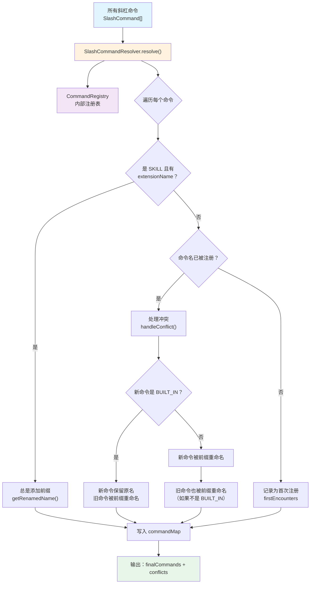
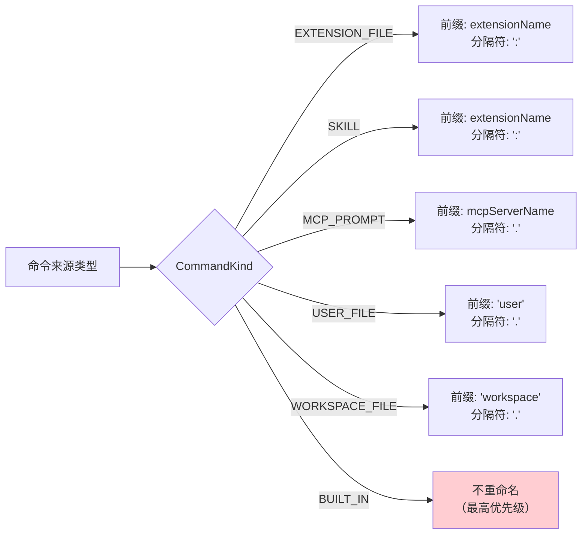

# SlashCommandResolver.ts

## 概述

`SlashCommandResolver` 是斜杠命令名称冲突的**解析器**，负责在所有斜杠命令注册完毕后，通过确定性的规则对重名命令进行重命名，确保每个命令拥有唯一的名称。它与 `SlashCommandConflictHandler`（冲突通知器）协同工作：本模块负责"解决冲突"，`ConflictHandler` 负责"通知用户"。

核心解析规则：
1. **内置命令（BUILT_IN）始终保留原始名称**，优先级最高。
2. **SKILL 类型的扩展命令总是添加前缀**（即使没有冲突也会加上 `extensionName:commandName` 的格式）。
3. 其他类型的非内置命令在发生冲突时，**全部被重命名**（加上来源前缀）。
4. 如果重命名后仍有冲突，通过**数字后缀**自动消歧。

本文件还包含一个内部辅助类 `CommandRegistry`，用于在解析过程中追踪命令注册状态和冲突记录。

## 架构图（Mermaid）



### 重命名前缀策略



## 核心组件

### 内部类：`CommandRegistry`

用于在解析过程中维护命令和冲突的中间状态。

| 成员 | 类型 | 说明 |
|---|---|---|
| `commandMap` | `Map<string, SlashCommand>` | 最终命令名到命令对象的映射。键是解析后的唯一名称 |
| `conflictsMap` | `Map<string, CommandConflict>` | 冲突记录映射。键是原始冲突命令名 |
| `firstEncounters` | `Map<string, SlashCommand>` | 每个命令名的首次注册者记录，用于后续冲突判断时确定"先占者" |
| `finalCommands` (getter) | `SlashCommand[]` | 返回 `commandMap` 中所有命令的数组 |
| `conflicts` (getter) | `CommandConflict[]` | 返回 `conflictsMap` 中所有冲突记录的数组 |

### 主类：`SlashCommandResolver`

全部方法为 `static`，无需实例化。

#### `resolve(allCommands: SlashCommand[])`（公开静态方法）

**入参**：所有待注册的斜杠命令数组。

**返回值**：
```typescript
{
  finalCommands: SlashCommand[];  // 解析后名称唯一的命令列表
  conflicts: CommandConflict[];   // 产生的冲突记录列表
}
```

**处理流程**：
1. 创建 `CommandRegistry` 实例。
2. 遍历每个命令：
   - 如果是 SKILL 类型且有 `extensionName`，**无条件添加前缀**（`extensionName:commandName`）。
   - 如果命令名已在 `firstEncounters` 中存在，调用 `handleConflict()` 处理冲突。
   - 否则，记录为该名称的首次注册者。
3. 将命令以最终名称写入 `commandMap`。
4. 返回所有命令和冲突记录。

#### `handleConflict(incoming, registry)` (private static)

处理一次名称碰撞。

- 如果 `incoming` 是 `BUILT_IN`：
  - `incoming` 保留原始名称。
  - 已注册的旧命令被重命名（通过 `prefixExistingCommand`）。
- 如果 `incoming` 不是 `BUILT_IN`：
  - `incoming` 被重命名为带前缀的版本。
  - 同时检查并重命名旧占有者（如果旧占有者也不是 `BUILT_IN`）。
  - 记录冲突信息。

#### `prefixExistingCommand(name, reason, registry)` (private static)

安全地重命名已注册在 `commandMap` 中的命令。

- 仅对非 `BUILT_IN` 命令生效。
- 从 `commandMap` 中删除旧名称条目，以新名称重新插入。
- 记录冲突事件。

#### `getRenamedName(name, prefix, commandMap, kind?)` (private static)

生成唯一的重命名名称。

- 根据命令类型选择分隔符：
  - `SKILL` 和 `EXTENSION_FILE` 使用 `:`（冒号），例如 `myext:run`
  - 其他类型使用 `.`（点号），例如 `user.run`
- 如果有前缀，生成 `{prefix}{separator}{name}` 格式。
- 如果生成的名称仍有冲突，追加数字后缀 `1`, `2`, `3`...直到唯一。

#### `getPrefix(cmd)` (private static)

根据命令的 `kind` 类型返回适当的前缀字符串：

| `CommandKind` | 返回的前缀 |
|---|---|
| `EXTENSION_FILE` | `cmd.extensionName` |
| `SKILL` | `cmd.extensionName` |
| `MCP_PROMPT` | `cmd.mcpServerName` |
| `USER_FILE` | `'user'` |
| `WORKSPACE_FILE` | `'workspace'` |
| 其他 | `undefined` |

#### `trackConflict(conflictsMap, originalName, reason, displacedCommand, renamedTo)` (private static)

记录一条冲突事件到 `conflictsMap`。

- 如果该原始名称尚无冲突记录，创建新的 `CommandConflict` 条目。
- 将被重命名的命令信息（`command`, `renamedTo`, `reason`）追加到 `losers` 数组。

## 依赖关系

### 内部依赖

| 模块路径 | 导入内容 | 说明 |
|---|---|---|
| `../ui/commands/types.js` | `CommandKind`, `SlashCommand` | 命令类型枚举和斜杠命令接口定义 |
| `./types.js` | `CommandConflict` | 冲突记录类型定义 |

### 外部依赖

无外部第三方依赖。本模块是纯逻辑模块，不依赖任何运行时 API 或第三方库。

## 关键实现细节

1. **SKILL 命令的特殊处理**：SKILL 类型命令即使没有名称冲突也会被加上 `extensionName:` 前缀。这是因为 SKILL 命令来自扩展系统，命名空间隔离是设计意图的一部分，可以避免潜在的冲突。

2. **双向重命名策略**：当两个非内置命令冲突时，**双方都会被重命名**，而不是让先注册的命令保留原名。这确保了解析结果不依赖于命令的注册顺序（对于非内置命令），提供了更公平和可预测的行为。

3. **数字后缀消歧**：`getRenamedName` 方法在前缀重命名后仍有冲突时（例如两个不同扩展恰好生成了相同的前缀名称），通过追加递增数字后缀（`base1`, `base2`...）来保证最终名称的唯一性。

4. **分隔符差异化**：扩展相关命令（`EXTENSION_FILE`, `SKILL`）使用冒号 `:` 作为分隔符（如 `myext:run`），其他类型使用点号 `.`（如 `user.run`）。这种视觉差异帮助用户快速区分命令来源。

5. **纯静态设计**：`SlashCommandResolver` 所有方法均为 `static`，不维护实例状态。每次调用 `resolve()` 都是独立的，通过内部 `CommandRegistry` 实例管理临时状态，保证了函数的纯粹性和可测试性。

6. **firstEncounters 与 commandMap 分离**：`firstEncounters` 记录每个名称的首次注册者（用于冲突判断和原因追溯），而 `commandMap` 记录最终解析后的命令映射。两者分离使得在后续冲突发生时，仍能准确追溯是哪个命令最先占用了该名称。
