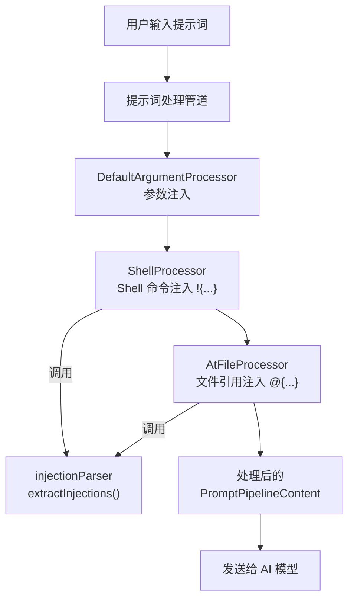
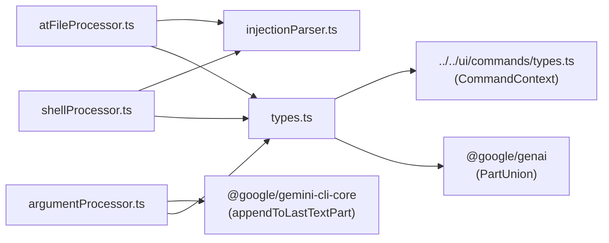
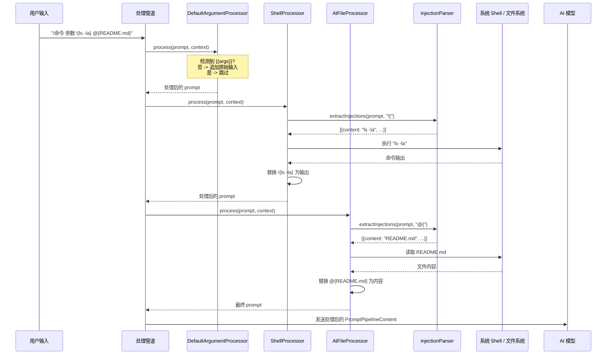

# prompt-processors 目录

## 概述

`prompt-processors` 目录实现了 Gemini CLI 的**提示词处理管道（Prompt Pipeline）**。它定义了一套可链式组合的处理器接口 `IPromptProcessor`，每个处理器对提示词执行特定的转换操作。提示词在发送给模型之前，依次经过管道中的各处理器，完成参数注入、Shell 命令执行替换、`@` 文件引用展开等预处理操作。该设计采用**管道模式（Pipeline Pattern）**，各处理器职责单一、可组合、可独立测试。

## 目录结构

```
prompt-processors/
├── types.ts                # 核心接口与常量定义
├── argumentProcessor.ts    # 参数注入处理器
├── shellProcessor.ts       # Shell 命令注入处理器 (!{...})
├── atFileProcessor.ts      # 文件引用注入处理器 (@{...})
├── injectionParser.ts      # 通用注入解析器（花括号匹配）
└── *.test.ts               # 对应测试文件
```

## 架构图



## 核心组件

### 1. types.ts - 接口与常量

#### IPromptProcessor 接口

```typescript
interface IPromptProcessor {
  process(
    prompt: PromptPipelineContent,
    context: CommandContext,
  ): Promise<PromptPipelineContent>;
}
```

- **`PromptPipelineContent`**: 类型为 `PartUnion[]`（来自 `@google/genai`），支持文本和多模态内容部分。
- **`CommandContext`**: 提供命令调用详情（原始输入、参数）、应用服务和 UI 处理器。

#### 常量

| 常量 | 值 | 说明 |
|---|---|---|
| `SHORTHAND_ARGS_PLACEHOLDER` | `{{args}}` | 参数注入占位符 |
| `SHELL_INJECTION_TRIGGER` | `!{` | Shell 命令注入触发器 |
| `AT_FILE_INJECTION_TRIGGER` | `@{` | 文件引用注入触发器 |

### 2. DefaultArgumentProcessor - 参数注入处理器

- 当提示词中**不包含** `{{args}}` 时生效。
- 将用户的完整命令调用（`context.invocation.raw`）追加到提示词末尾。
- 允许模型自行解析参数。
- 若提示词已包含 `{{args}}`，则此处理器跳过，由其他处理器进行显式替换。

### 3. ShellProcessor - Shell 命令注入处理器

- 处理 `!{command}` 语法：提取花括号内的 Shell 命令，执行后将标准输出替换回提示词。
- 当 `{{args}}` 出现在 `!{...}` 内部时，参数会经过 Shell 转义处理以防止注入攻击。
- 当 `{{args}}` 出现在 `!{...}` 外部时，参数原样注入。

### 4. AtFileProcessor - 文件引用注入处理器

- 处理 `@{path}` 语法：解析花括号内的文件路径，读取文件内容后替换回提示词。
- 支持相对路径和绝对路径。

### 5. injectionParser - 通用注入解析器

- **`extractInjections(prompt, trigger, contextName)`**: 核心解析函数，支持任意触发器前缀。
- **嵌套花括号支持**: 通过花括号计数正确处理嵌套结构（如 JSON 片段）。
- **严格验证**: 未闭合的花括号会抛出带上下文信息的异常。
- 返回 `Injection[]`，每个元素包含 `content`（提取的内容）、`startIndex`、`endIndex`。

## 依赖关系



## 数据流


