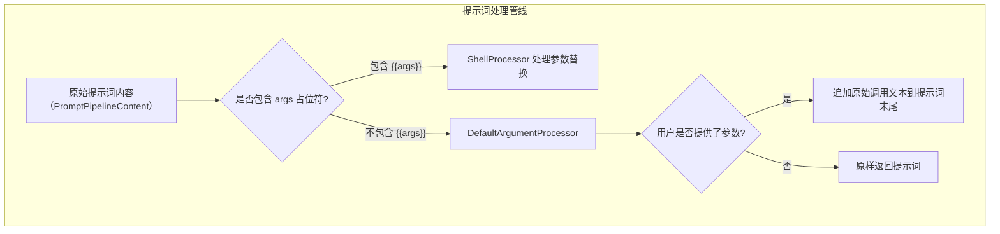
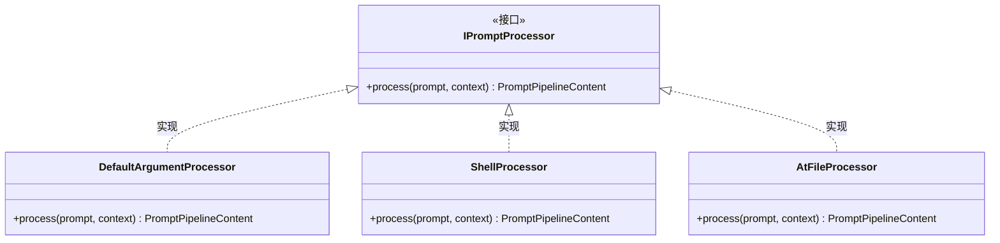
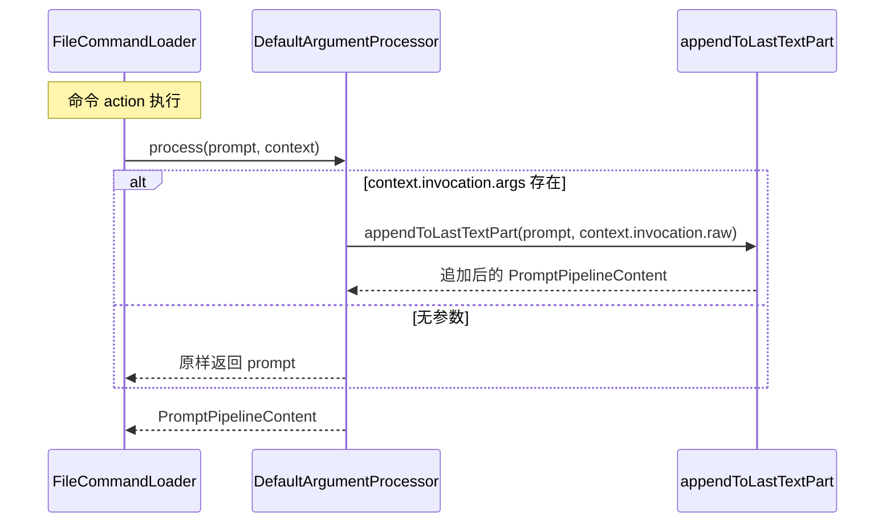

# argumentProcessor.ts

## 概述

`DefaultArgumentProcessor` 是提示词处理管线（Prompt Processing Pipeline）中的一个处理器，负责在用户提供了命令参数但提示词模板中**没有** `{{args}}` 占位符时，将用户的完整原始命令调用文本追加到提示词末尾。

这是一种"兜底"策略——当自定义命令的提示词模板没有显式定义参数插入位置时，直接将用户输入的原始命令行追加到提示词后面，让 AI 模型自行解析参数含义。

**使用场景举例：**

假设有一个自定义命令 `/review`，其 TOML 定义为：
```toml
prompt = "请审查以下代码变更"
```

用户输入：`/review src/main.ts --detailed`

由于提示词中没有 `{{args}}`，`DefaultArgumentProcessor` 会将完整的 `/review src/main.ts --detailed` 追加到提示词后面，最终发送给模型的内容为：
```
请审查以下代码变更/review src/main.ts --detailed
```

注意：如果提示词中包含 `{{args}}` 占位符，则由 `ShellProcessor` 负责参数替换，`DefaultArgumentProcessor` 不会被添加到处理器管线中。

## 架构图（Mermaid）







## 核心组件

### 类：`DefaultArgumentProcessor`

```typescript
export class DefaultArgumentProcessor implements IPromptProcessor {
  async process(
    prompt: PromptPipelineContent,
    context: CommandContext,
  ): Promise<PromptPipelineContent>
}
```

实现了 `IPromptProcessor` 接口，是管线中最简单的处理器之一。

#### 方法：`process(prompt, context)`

| 参数 | 类型 | 说明 |
|------|------|------|
| `prompt` | `PromptPipelineContent` | 当前管线中的提示词内容（可能已被前面的处理器修改） |
| `context` | `CommandContext` | 命令执行上下文，包含用户的调用信息 |

**返回值：** `Promise<PromptPipelineContent>`

**逻辑：**

1. 检查 `context.invocation?.args` 是否存在（即用户是否在命令名之后提供了额外的参数文本）
2. 如果有参数：调用 `appendToLastTextPart(prompt, context.invocation.raw)` 将用户的**完整原始调用文本**（包括命令名和参数）追加到提示词内容的最后一个文本部分
3. 如果没有参数：直接返回原始提示词，不做任何修改

**关键点：** 注意这里追加的是 `context.invocation.raw`（完整的原始输入）而非 `context.invocation.args`（仅参数部分）。这意味着模型会看到完整的命令调用，包括命令名本身，从而获得更完整的上下文。

### 类型说明

#### `PromptPipelineContent`

提示词管线内容类型，是一个数组结构，每个元素可以包含文本（`text`）或其他类型的内容部分。该类型在管线中的各处理器之间传递。

#### `CommandContext`

命令执行上下文，核心属性：
- `invocation?.args` -- 用户提供的参数文本（命令名之后的部分）
- `invocation?.raw` -- 用户输入的完整原始文本

### 辅助函数：`appendToLastTextPart`

来自 `@google/gemini-cli-core`，将指定文本追加到 `PromptPipelineContent` 数组中最后一个文本类型元素的末尾。如果内容为空或没有文本元素，会创建新的文本元素。

## 依赖关系

### 内部依赖

| 模块路径 | 导入内容 | 说明 |
|----------|----------|------|
| `./types.js` | `IPromptProcessor`, `PromptPipelineContent` | 处理器接口和管线内容类型 |
| `../../ui/commands/types.js` | `CommandContext` | 命令执行上下文类型 |

### 外部依赖

| 包名 | 导入内容 | 说明 |
|------|----------|------|
| `@google/gemini-cli-core` | `appendToLastTextPart` | 向管线内容追加文本的工具函数 |

## 关键实现细节

1. **仅在无 `{{args}}` 时使用**：`FileCommandLoader` 在构建处理器管线时会检查提示词模板是否包含 `{{args}}` 占位符。如果包含，则不会添加 `DefaultArgumentProcessor`，而是由 `ShellProcessor` 负责参数替换。两者互斥，确保参数不会被双重处理。

2. **追加 raw 而非 args**：处理器追加的是 `context.invocation.raw`（完整原始输入如 `/review src/main.ts`）而非仅参数部分。这让模型能看到完整的调用上下文，包含命令名称，有助于理解用户意图。

3. **管线位置**：`DefaultArgumentProcessor` 总是作为处理器管线的**最后一个**处理器。在 `FileCommandLoader.parseAndAdaptFile` 中，它的添加条件是 `!usesArgs`，且在 `AtFileProcessor` 和 `ShellProcessor` 之后。

4. **空操作优化**：当用户未提供任何参数时（`context.invocation?.args` 为 falsy），处理器直接返回原始提示词，不执行任何操作，避免不必要的内容修改。

5. **异步接口、同步实现**：虽然 `process` 方法的签名返回 `Promise`（为了遵循 `IPromptProcessor` 接口规范），但实际执行是同步的。`appendToLastTextPart` 本身也是同步操作，async 关键字仅用于接口一致性。

6. **与其他处理器的协作关系**：
   - `AtFileProcessor`：处理 `@file` 引用，最先执行（安全优先）
   - `ShellProcessor`：处理 `$()` Shell 注入和 `{{args}}` 参数替换
   - `DefaultArgumentProcessor`：兜底追加原始参数，仅在无 `{{args}}` 时工作

   三者在管线中的组合由 `FileCommandLoader` 根据提示词模板内容动态决定。
