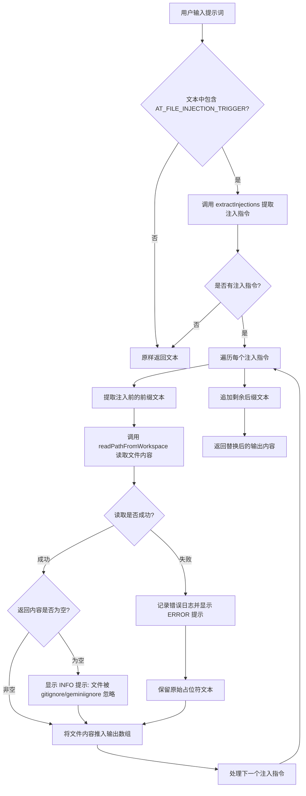

# atFileProcessor.ts

## 概述

`AtFileProcessor` 是一个提示词处理器（Prompt Processor），实现了 `IPromptProcessor` 接口。它的核心职责是**解析用户提示词中的 `@{文件路径}` 语法，将其替换为对应文件的实际内容**，从而实现"在提示词中引用文件"的功能。

该处理器是提示词处理管线（Prompt Pipeline）中的一个环节。当用户在输入中使用 `@{path/to/file}` 语法时，处理器会：
1. 检测文本中是否包含 `@` 触发符（`AT_FILE_INJECTION_TRIGGER`）。
2. 利用 `injectionParser` 提取所有注入指令。
3. 逐个读取对应的文件内容，并将原始的 `@{...}` 标记替换为文件内容部分（`Part[]`）。
4. 对被 `.gitignore` 或 `.geminiignore` 忽略的文件给出信息提示，对读取失败的文件保留原始占位符并报错。

## 架构图（Mermaid）

## 核心组件

### `AtFileProcessor` 类

| 成员 | 类型 | 说明 |
|---|---|---|
| `commandName` | `string \| undefined`（只读私有） | 当前命令的名称，用于传递给 `extractInjections`，在提取注入指令时可能影响解析行为 |
| `process(input, context)` | 异步方法 | 核心处理方法，接收管线内容和命令上下文，返回处理后的提示词内容 |

### `process` 方法详细流程

1. **配置检查**：从 `context.services.agentContext?.config` 获取配置。若无配置，直接返回原始输入。
2. **flatMapTextParts 遍历**：使用 `flatMapTextParts` 工具函数对输入中的每个文本部分进行处理（跳过非文本部分如图片等）。
3. **触发检测**：检查当前文本片段是否包含 `AT_FILE_INJECTION_TRIGGER`（即 `@` 字符），若不包含则原样返回。
4. **提取注入指令**：调用 `extractInjections` 从文本中解析出所有 `@{...}` 形式的注入指令，每个指令包含 `startIndex`、`endIndex` 和 `content`（文件路径）。
5. **逐个处理注入**：
   - 将注入指令前的普通文本作为前缀推入输出。
   - 调用 `readPathFromWorkspace(pathStr, config)` 读取文件内容。
   - **成功且有内容**：将文件内容部分（`Part[]`）展开推入输出。
   - **成功但为空**：文件被 `.gitignore` 或 `.geminiignore` 忽略，通过 UI 显示 INFO 消息。
   - **失败（异常）**：记录调试错误日志，通过 UI 显示 ERROR 消息，并将原始 `@{...}` 占位符保留在输出中。
6. **后缀处理**：将最后一个注入指令之后的剩余文本作为后缀推入输出。

### 错误处理策略

- **优雅降级**：当文件读取失败时，不会中断整个处理流程，而是保留原始的 `@{path}` 占位符文本，同时向用户显示错误信息。
- **忽略文件提示**：被版本控制忽略规则排除的文件不会导致错误，而是以 INFO 级别提示用户。

## 依赖关系

### 内部依赖

| 模块路径 | 导入内容 | 用途 |
|---|---|---|
| `@google/gemini-cli-core` | `debugLogger` | 用于记录调试级别的错误日志 |
| `@google/gemini-cli-core` | `flatMapTextParts` | 工具函数，遍历 `Part[]` 中的文本部分，对每个文本部分执行异步映射并展平结果 |
| `@google/gemini-cli-core` | `readPathFromWorkspace` | 从工作区读取指定路径的文件内容，返回 `Part[]`，自动尊重 `.gitignore` 和 `.geminiignore` |
| `../../ui/commands/types.js` | `CommandContext` | 命令上下文类型，包含 UI 接口、服务引用、调用信息等 |
| `../../ui/types.js` | `MessageType` | UI 消息类型枚举，使用了 `INFO` 和 `ERROR` 两种类型 |
| `./types.js` | `AT_FILE_INJECTION_TRIGGER` | `@` 文件注入触发符常量 |
| `./types.js` | `IPromptProcessor` | 提示词处理器接口，定义了 `process` 方法签名 |
| `./types.js` | `PromptPipelineContent` | 提示词管线内容类型（即 `Part[]`） |
| `./injectionParser.js` | `extractInjections` | 从文本中解析注入指令，返回包含 `startIndex`、`endIndex`、`content` 的注入描述数组 |

### 外部依赖

无直接外部第三方依赖。所有依赖均为项目内部模块。

## 关键实现细节

1. **管线模式**：`AtFileProcessor` 作为提示词处理管线的一环，遵循 `IPromptProcessor` 接口契约。输入和输出均为 `PromptPipelineContent`（`Part[]`），可以与其他处理器串联使用。

2. **flatMapTextParts 的作用**：该工具函数确保处理器只操作 `Part[]` 中的文本部分（`{ text: string }`），而跳过其他类型的部分（如内联数据、函数调用等）。每个文本部分被独立处理，结果展平后合并回原数组。

3. **索引跟踪**：通过维护 `lastIndex` 变量，处理器在遍历注入指令时精确地切割原始文本，保证非注入部分的文本不会丢失或重复。

4. **构造函数中的 commandName**：该参数是可选的，传递给 `extractInjections` 以支持命令级别的上下文感知解析。例如在自定义命令中，可能需要根据命令名称调整解析行为。

5. **安全考虑**：文件读取通过 `readPathFromWorkspace` 进行，该函数会限制读取范围在工作区内，并尊重 `.gitignore` 和 `.geminiignore` 规则，防止敏感文件被意外注入到提示词中。

6. **UI 反馈机制**：处理器通过 `context.ui.addItem` 向用户界面发送实时反馈消息，使用户了解文件注入的状态（被忽略或失败）。
