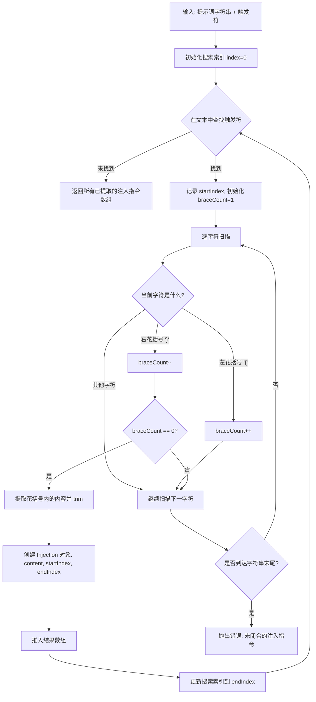

# injectionParser.ts

## 概述

`injectionParser` 是一个纯函数式的文本解析模块，提供了 `extractInjections` 函数，用于**从提示词字符串中提取注入指令**。它支持解析类似 `@{...}` 或 `!{...}` 形式的语法，并能正确处理嵌套花括号。

该模块是提示词处理管线中的基础工具层，被 `AtFileProcessor`（处理 `@{文件路径}` 引用）和 `ShellProcessor`（处理 `!{shell命令}` 引用）等上层处理器依赖。

解析策略基于简单的**花括号计数法**，不支持转义字符。当检测到未闭合的花括号时，解析器会抛出明确的错误。

## 架构图（Mermaid）



## 核心组件

### `Injection` 接口

表示在提示词字符串中检测到的一个注入位点。

| 字段 | 类型 | 说明 |
|---|---|---|
| `content` | `string` | 花括号内部提取的内容（经过 `trim()` 去除首尾空白），例如文件路径或 shell 命令 |
| `startIndex` | `number` | 注入在原始字符串中的起始索引（包含），指向触发符的起始位置（如 `@` 或 `!`） |
| `endIndex` | `number` | 注入在原始字符串中的结束索引（不包含），指向闭合 `}` 之后的位置 |

### `extractInjections` 函数

核心解析函数，迭代式地从提示词字符串中提取所有注入指令。

**函数签名：**

```typescript
function extractInjections(
  prompt: string,
  trigger: string,
  contextName?: string,
): Injection[]
```

**参数说明：**

| 参数 | 类型 | 必需 | 说明 |
|---|---|---|---|
| `prompt` | `string` | 是 | 待解析的提示词字符串 |
| `trigger` | `string` | 是 | 触发序列，如 `@{` 用于文件注入，`!{` 用于 shell 命令注入 |
| `contextName` | `string` | 否 | 可选的上下文名称（如命令名），仅用于在错误消息中提供额外信息 |

**返回值：** `Injection[]` — 提取到的所有注入指令数组，按在原始字符串中的出现顺序排列。

**异常：** 当检测到未闭合的注入指令（花括号不平衡）时，抛出 `Error`，错误消息包含起始索引和上下文信息。

### 解析算法详解

1. **外层循环**：使用 `indexOf` 从当前 `index` 位置向后搜索触发符（如 `@{`）。
2. **花括号计数**：找到触发符后，从触发符之后开始逐字符扫描：
   - 遇到 `{` 则计数器加 1（支持嵌套）。
   - 遇到 `}` 则计数器减 1。
   - 当计数器归零时，表示找到了匹配的闭合花括号。
3. **内容提取**：截取触发符之后到闭合花括号之前的子串，执行 `trim()` 去除首尾空白。
4. **索引更新**：将搜索起点更新到当前注入的 `endIndex`，继续搜索下一个注入。
5. **错误检测**：若内层循环扫描到字符串末尾仍未找到匹配的闭合花括号，立即抛出错误。

### 解析示例

```
输入: "请分析 @{src/main.ts} 和 @{src/utils.ts} 的代码"
触发符: "@{"

输出:
[
  { content: "src/main.ts", startIndex: 4, endIndex: 19 },
  { content: "src/utils.ts", startIndex: 22, endIndex: 38 }
]
```

```
输入: "运行 !{echo {hello}}"
触发符: "!{"

输出:
[
  { content: "echo {hello}", startIndex: 3, endIndex: 19 }
]
（嵌套花括号被正确处理）
```

## 依赖关系

### 内部依赖

无。`injectionParser.ts` 是一个完全独立的纯工具模块，不依赖任何其他内部模块。

### 外部依赖

无。该模块只使用 TypeScript/JavaScript 原生 API（`string.indexOf`、`string.substring`、`string.trim`）。

## 关键实现细节

1. **嵌套花括号支持**：通过维护 `braceCount` 计数器，解析器能正确处理内容中包含嵌套花括号的情况。例如 `@{path/to/{nested}/file}` 或 `!{echo ${VAR}}` 都能被正确解析。初始 `braceCount` 为 1（因为触发符本身包含一个 `{`），每遇到 `{` 加 1，遇到 `}` 减 1，直到归零表示找到匹配的闭合位置。

2. **不支持转义**：解析器不支持通过转义字符（如 `\{` 或 `\}`）来在内容中包含字面花括号。如果内容中的花括号不平衡，解析器会抛出错误。这是一个已知的设计限制，在错误消息中有明确说明。

3. **迭代式解析**：使用 `while` 循环而非正则表达式进行解析，这使得嵌套花括号的处理更加直观和可靠。正则表达式难以处理嵌套结构，而手动状态机方式更适合这种场景。

4. **严格模式**：解析器采用严格解析策略 — 遇到语法错误（未闭合的花括号）时立即抛出异常，而非静默忽略或尝试猜测。这确保了上游处理器能够收到明确的错误信号。

5. **内容修剪**：提取的内容会经过 `trim()` 处理，因此 `@{ path/to/file }` 和 `@{path/to/file}` 是等价的，提升了用户体验。

6. **索引精度**：`startIndex` 指向触发符的第一个字符，`endIndex` 指向闭合 `}` 之后的位置。这种半开区间设计使得上游处理器可以精确切割原始文本：`text.substring(injection.startIndex, injection.endIndex)` 恰好返回完整的注入表达式（包含触发符和花括号）。
