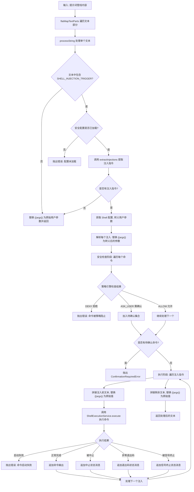

# shellProcessor.ts

## 概述

`ShellProcessor` 是一个提示词处理器，实现了 `IPromptProcessor` 接口。它的核心职责是**解析并执行提示词中的 `!{shell命令}` 语法，将其替换为 shell 命令的执行结果**。同时它还处理 `{{args}}` 参数占位符的替换逻辑。

该处理器具备完善的安全机制：
- 在 `!{...}` 内部的 `{{args}}` 会被**转义后**替换，防止 shell 注入攻击。
- 在 `!{...}` 外部的 `{{args}}` 会被**原始值**替换。
- 每个 shell 命令在执行前都会经过**策略引擎（Policy Engine）** 的安全检查。
- 被策略拒绝的命令会直接抛出错误；需要用户确认的命令会抛出 `ConfirmationRequiredError`。

该模块还导出了 `ConfirmationRequiredError` 类，供上层调用者捕获并处理用户确认流程。

## 架构图（Mermaid）

## 核心组件

### `ConfirmationRequiredError` 类

继承自 `Error`，当 shell 命令需要用户确认时抛出。

| 成员 | 类型 | 说明 |
|---|---|---|
| `name` | `string` | 固定为 `'ConfirmationRequiredError'` |
| `message` | `string` | 错误消息 |
| `commandsToConfirm` | `string[]` | 需要用户确认的命令列表 |

上层调用者可以通过捕获该错误来启动用户确认交互流程，确认后可将命令添加到会话白名单（`sessionShellAllowlist`）中以跳过后续确认。

### `ResolvedShellInjection` 接口（私有）

扩展了 `Injection` 接口，增加了参数替换后的命令字段。

| 字段 | 类型 | 说明 |
|---|---|---|
| `content` | `string` | 继承自 `Injection`，花括号内的原始内容 |
| `startIndex` | `number` | 继承自 `Injection`，注入的起始索引 |
| `endIndex` | `number` | 继承自 `Injection`，注入的结束索引 |
| `resolvedCommand` | `string \| undefined` | `{{args}}` 替换为转义后用户参数的最终命令。若原始内容为空字符串则为 `undefined` |

### `ShellProcessor` 类

| 成员 | 类型 | 说明 |
|---|---|---|
| `commandName` | `string`（只读私有） | 当前命令名称，用于错误消息和 `extractInjections` 的上下文参数 |
| `process(prompt, context)` | 异步方法 | 接口方法，遍历管线内容中的文本部分逐一处理 |
| `processString(prompt, context)` | 私有异步方法 | 核心处理逻辑，处理单个文本字符串 |

### `processString` 方法详细流程

#### 阶段一：快速路径检查

1. 获取用户原始参数 `userArgsRaw` = `context.invocation?.args || ''`。
2. 若文本不包含 `SHELL_INJECTION_TRIGGER`（`!{`），直接将所有 `{{args}}` 替换为原始用户参数并返回。

#### 阶段二：解析与参数替换

3. 检查安全配置是否已加载，若未加载则抛出错误。
4. 调用 `extractInjections` 提取所有 `!{...}` 注入指令。
5. 获取 shell 配置，使用 `escapeShellArg` 对用户参数进行 shell 转义。
6. 对每个注入指令，将 `{{args}}` 替换为**转义后**的用户参数，生成 `resolvedCommand`。空命令的 `resolvedCommand` 设为 `undefined`。

#### 阶段三：安全检查

7. 遍历所有解析后的注入指令：
   - 跳过空命令。
   - 检查命令是否在会话白名单（`sessionShellAllowlist`）中，若是则跳过检查。
   - 调用策略引擎的 `check` 方法，传入 `run_shell_command` 动作和最终命令。
   - `DENY` → 直接抛出错误。
   - `ASK_USER` → 加入待确认集合。
   - `ALLOW` → 通过。
8. 若待确认集合非空，抛出 `ConfirmationRequiredError`。

#### 阶段四：命令执行与结果拼接

9. 遍历注入指令，逐个处理：
   - 将注入前的文本段中的 `{{args}}` 替换为原始用户参数，追加到结果。
   - 调用 `ShellExecutionService.execute` 执行命令，配置包括目标目录、主题颜色、交互式 shell 设置等。
   - 检查执行结果并追加相应内容（输出文本、状态消息）。
10. 追加最后一个注入之后的剩余文本（同样替换 `{{args}}`）。
11. 返回包含单个文本部分的数组。

### Shell 命令执行结果处理

| 情况 | 处理方式 |
|---|---|
| 启动失败（`error` 存在且未中止） | 抛出错误，包含命令和错误消息 |
| 正常完成 | 追加 `output` 到结果 |
| 被中止（`aborted`） | 追加输出 + `[Shell command '...' aborted]` |
| 非零退出码 | 追加输出 + `[Shell command '...' exited with code N]` |
| 被信号终止 | 追加输出 + `[Shell command '...' terminated by signal S]` |

## 依赖关系

### 内部依赖

| 模块路径 | 导入内容 | 用途 |
|---|---|---|
| `@google/gemini-cli-core` | `escapeShellArg` | 对用户参数进行 shell 转义，防止注入攻击 |
| `@google/gemini-cli-core` | `getShellConfiguration` | 获取当前系统的 shell 配置信息（如使用的 shell 类型） |
| `@google/gemini-cli-core` | `ShellExecutionService` | Shell 命令执行服务，提供 `execute` 静态方法 |
| `@google/gemini-cli-core` | `flatMapTextParts` | 遍历 `Part[]` 中的文本部分并展平结果 |
| `@google/gemini-cli-core` | `PolicyDecision` | 策略决策枚举：`ALLOW`、`DENY`、`ASK_USER` |
| `../../ui/commands/types.js` | `CommandContext` | 命令上下文类型 |
| `./types.js` | `IPromptProcessor` | 提示词处理器接口 |
| `./types.js` | `PromptPipelineContent` | 提示词管线内容类型 |
| `./types.js` | `SHELL_INJECTION_TRIGGER` | Shell 注入触发符常量（`!{`） |
| `./types.js` | `SHORTHAND_ARGS_PLACEHOLDER` | 参数占位符常量（`{{args}}`） |
| `./injectionParser.js` | `extractInjections` | 从文本中提取注入指令 |
| `./injectionParser.js` | `Injection`（类型） | 注入指令接口 |
| `../../ui/themes/theme-manager.js` | `themeManager` | 主题管理器，用于获取当前活跃主题的前景/背景颜色配置 |

### 外部依赖

无直接外部第三方依赖。

## 关键实现细节

1. **双重参数替换策略**：这是该处理器最重要的安全设计。`{{args}}` 占位符在不同上下文中被替换为不同的值：
   - **`!{...}` 内部**：替换为经过 `escapeShellArg` 转义的用户参数（`userArgsEscaped`），防止 shell 注入。
   - **`!{...}` 外部**：替换为原始用户参数（`userArgsRaw`），因为这些文本不会被 shell 执行。

2. **三层安全防线**：
   - **第一层 — 参数转义**：用户输入的参数在注入到 shell 命令前经过 `escapeShellArg` 转义。
   - **第二层 — 策略引擎检查**：每个最终命令都要经过 `PolicyEngine.check` 的安全审查。
   - **第三层 — 用户确认**：策略引擎返回 `ASK_USER` 的命令需要用户明确确认才能执行。

3. **会话白名单缓存**：已确认的命令会被存储在 `context.session.sessionShellAllowlist` 中。后续相同命令的执行会跳过策略引擎检查，避免重复确认。

4. **命令执行配置**：Shell 命令的执行使用了主题管理器的颜色配置（`defaultFg` 和 `defaultBg`），使命令输出在终端中保持与当前主题一致的视觉体验。

5. **错误处理分层**：
   - 配置缺失 → 直接抛出 `Error`，阻止任何命令执行。
   - 策略拒绝 → 抛出 `Error`，包含被拒绝的命令信息。
   - 需要确认 → 抛出 `ConfirmationRequiredError`，由上层处理确认流程。
   - 执行失败 → 抛出 `Error`，包含命令和错误详情。
   - 非零退出/中止/信号 → 不抛出错误，而是在输出中追加状态消息，让 AI 模型了解命令的执行状态。

6. **AbortController 的使用**：当前实现中每次执行命令都创建一个新的 `AbortController`，且未向外暴露 — 这意味着命令一旦开始执行就无法被外部中止。这是当前的设计选择，未来可能会引入取消机制。

7. **空命令处理**：`!{}` 形式的空命令不会被执行（`resolvedCommand` 为 `undefined`），也不会经过安全检查，直接被跳过。
