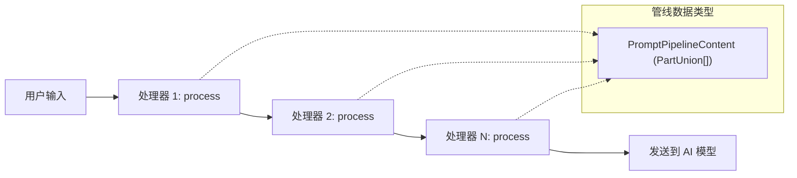

# types.ts

## 概述

`types.ts` 是提示词处理器（Prompt Processor）子系统的**类型定义与常量声明**模块。它定义了提示词处理管线的核心抽象：

- **`PromptPipelineContent`** — 管线中流动的数据类型。
- **`IPromptProcessor`** — 所有处理器必须实现的接口。
- **三个常量** — 用于在提示词文本中识别特殊语法（参数占位符、shell 注入、文件注入）的触发字符串。

该模块是整个 `prompt-processors` 子目录的类型基础，被 `AtFileProcessor`、`ShellProcessor` 等具体处理器以及上层管线编排代码广泛依赖。

## 架构图（Mermaid）

```mermaid
classDiagram
    class IPromptProcessor {
        <<接口>>
        +process(prompt: PromptPipelineContent, context: CommandContext) Promise~PromptPipelineContent~
    }

    class PromptPipelineContent {
        <<类型别名>>
        PartUnion[]
    }

    class AtFileProcessor {
        +process(input, context)
    }

    class ShellProcessor {
        +process(prompt, context)
    }

    IPromptProcessor <|.. AtFileProcessor : 实现
    IPromptProcessor <|.. ShellProcessor : 实现

    IPromptProcessor --> PromptPipelineContent : 输入/输出
    IPromptProcessor --> CommandContext : 使用上下文

    class 常量定义 {
        SHORTHAND_ARGS_PLACEHOLDER = "{{args}}"
        SHELL_INJECTION_TRIGGER = "!{"
        AT_FILE_INJECTION_TRIGGER = "@{"
    }

    ShellProcessor --> 常量定义 : 使用 SHELL_INJECTION_TRIGGER\n和 SHORTHAND_ARGS_PLACEHOLDER
    AtFileProcessor --> 常量定义 : 使用 AT_FILE_INJECTION_TRIGGER
```



## 核心组件

### `PromptPipelineContent` 类型

```typescript
export type PromptPipelineContent = PartUnion[];
```

提示词处理管线中流动的数据类型，即 `PartUnion` 数组。`PartUnion` 来自 `@google/genai` SDK，是 Gemini API 的多模态内容部分联合类型，可以包含：

- **文本部分**（`{ text: string }`）
- **内联数据部分**（如 Base64 编码的图片）
- **文件数据部分**（文件 URI 引用）
- **函数调用/响应部分**
- 其他 Gemini API 支持的内容类型

管线中的每个处理器接收一个 `PromptPipelineContent` 作为输入，处理后返回一个新的 `PromptPipelineContent`，实现了链式变换。

### `IPromptProcessor` 接口

```typescript
export interface IPromptProcessor {
  process(
    prompt: PromptPipelineContent,
    context: CommandContext,
  ): Promise<PromptPipelineContent>;
}
```

所有提示词处理器必须实现的接口，定义了统一的处理契约。

| 方法 | 参数 | 返回值 | 说明 |
|---|---|---|---|
| `process` | `prompt: PromptPipelineContent` — 当前管线内容（可能已被前序处理器修改） | `Promise<PromptPipelineContent>` | 对提示词执行特定变换 |
| | `context: CommandContext` — 命令上下文，提供调用详情、服务引用、UI 处理器等 | | |

**设计模式**：该接口采用了**管道-过滤器（Pipeline-Filter）** 模式。每个处理器是一个"过滤器"，负责一种特定的变换；多个处理器通过管线串联，依次处理提示词内容。

**异步设计**：返回 `Promise` 是因为处理器可能需要执行异步操作，如读取文件（`AtFileProcessor`）或执行 shell 命令（`ShellProcessor`）。

### 常量定义

#### `SHORTHAND_ARGS_PLACEHOLDER`

```typescript
export const SHORTHAND_ARGS_PLACEHOLDER = '{{args}}';
```

自定义命令中的**参数注入占位符**。在提示词模板中使用 `{{args}}` 来引用用户传入的参数。

**上下文敏感的替换行为**：
- 在 `!{...}` **外部**使用时：`{{args}}` 被替换为用户的**原始参数**（raw）。
- 在 `!{...}` **内部**使用时：`{{args}}` 被替换为经过 **shell 转义**的参数（escaped），以防止 shell 注入攻击。

**示例**：
```
自定义命令模板: "分析 {{args}} 的输出: !{cat {{args}}}"
用户参数: "file with spaces.txt"

处理结果:
- 外部的 {{args}} → "file with spaces.txt"（原始值）
- 内部的 {{args}} → "'file with spaces.txt'"（shell 转义后）
```

#### `SHELL_INJECTION_TRIGGER`

```typescript
export const SHELL_INJECTION_TRIGGER = '!{';
```

**Shell 命令注入**的触发字符串。当提示词文本中包含 `!{` 时，`ShellProcessor` 会识别并提取 `!{...}` 块中的 shell 命令，执行后将结果替换回提示词。

#### `AT_FILE_INJECTION_TRIGGER`

```typescript
export const AT_FILE_INJECTION_TRIGGER = '@{';
```

**文件内容注入**的触发字符串。当提示词文本中包含 `@{` 时，`AtFileProcessor` 会识别并提取 `@{...}` 块中的文件路径，读取文件内容后将结果替换回提示词。

## 依赖关系

### 内部依赖

| 模块路径 | 导入内容 | 用途 |
|---|---|---|
| `../../ui/commands/types.js` | `CommandContext`（类型） | 作为 `IPromptProcessor.process` 方法的参数类型，提供命令执行的完整上下文 |

### 外部依赖

| 模块 | 导入内容 | 用途 |
|---|---|---|
| `@google/genai` | `PartUnion`（类型） | Gemini API 的多模态内容部分联合类型，作为 `PromptPipelineContent` 的元素类型 |

## 关键实现细节

1. **`PartUnion` 而非 `string`**：管线中流动的不是简单的字符串，而是 `PartUnion[]`（多模态内容部分数组）。这使得处理器能够处理和生成包含文本、图片、文件等多种类型内容的提示词。例如 `AtFileProcessor` 可以将文件路径替换为文件的实际内容部分（可能是文本或二进制数据）。

2. **触发符设计**：三个触发符（`!{`、`@{`、`{{args}}`）都使用了花括号语法，与 `injectionParser` 模块的花括号计数解析算法配合工作。`!{` 和 `@{` 使用 `extractInjections` 解析，`{{args}}` 使用简单的字符串替换（`replaceAll`）。

3. **管线可扩展性**：通过 `IPromptProcessor` 接口，系统可以方便地添加新的处理器类型。只需实现 `process` 方法并将其注册到管线中即可。现有的处理器是独立的、可组合的。

4. **类型安全**：通过 TypeScript 的类型系统，管线的输入输出类型在编译时就能得到验证。`PromptPipelineContent` 类型别名既提供了语义清晰性（"这是管线内容"），又保持了与底层 `PartUnion[]` 类型的兼容性。

5. **常量集中管理**：所有特殊语法的触发字符串都集中定义在此文件中，避免了魔法字符串分散在各个处理器中。这使得修改语法触发符时只需改一处，降低了维护成本和出错风险。
