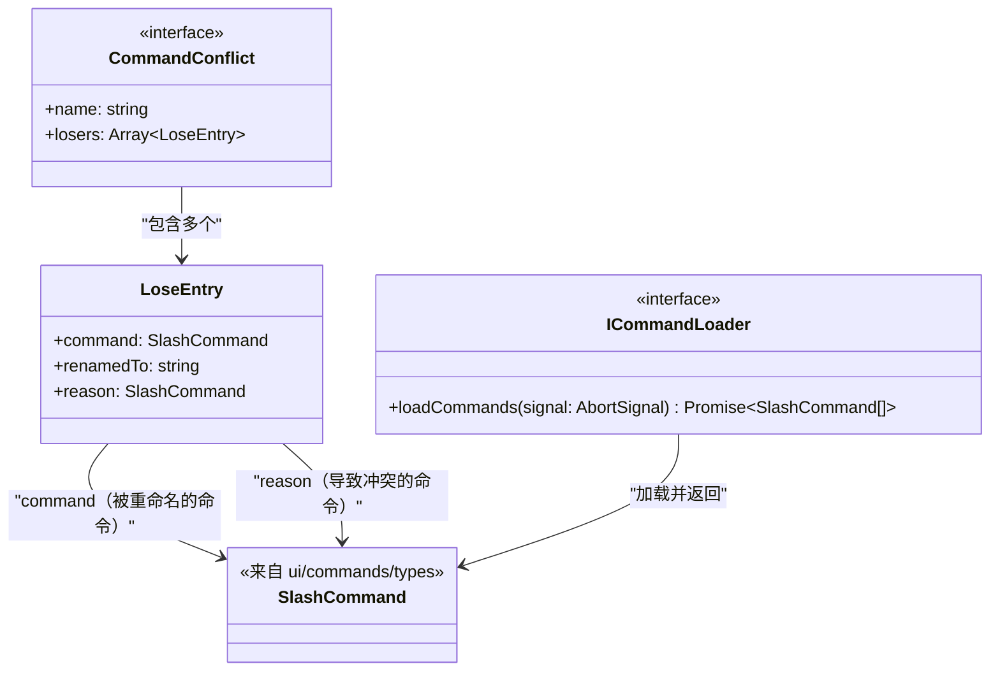
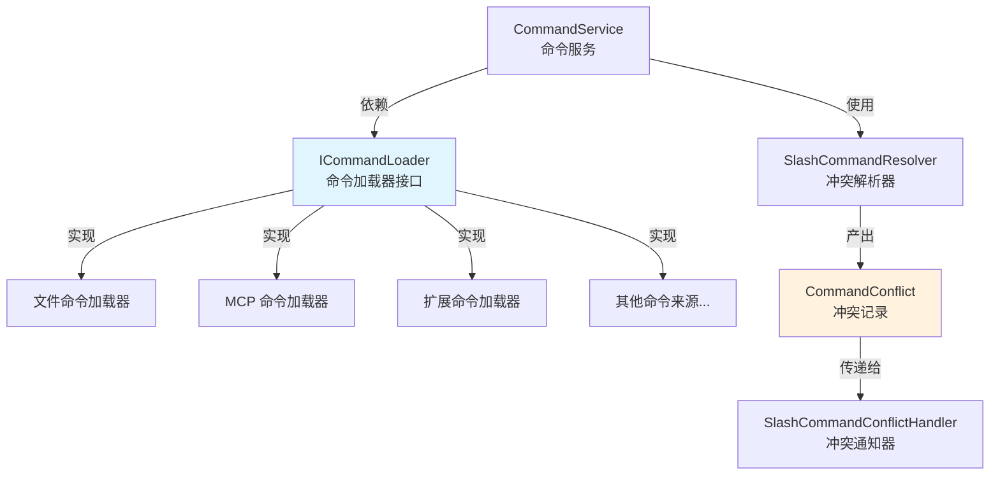

# types.ts（services 模块类型定义）

## 概述

`types.ts` 是 `services` 模块的核心类型定义文件，定义了斜杠命令加载和冲突解析所需的两个关键接口：

1. **`ICommandLoader`**：命令加载器的抽象接口，定义了命令发现与加载的契约。通过该接口，`CommandService` 可以在不修改自身代码的情况下接入新的命令来源（如文件系统、远程 API 等），体现了**依赖倒置原则（DIP）**和**开闭原则（OCP）**。

2. **`CommandConflict`**：命令冲突记录的数据结构，用于描述一次斜杠命令名称冲突事件中的所有"失败方"信息。

## 架构图（Mermaid）



### 在系统中的位置



## 核心组件

### 接口：`ICommandLoader`

命令加载器的抽象契约。任何能够发现和提供斜杠命令的类都应实现此接口。

```typescript
export interface ICommandLoader {
  loadCommands(signal: AbortSignal): Promise<SlashCommand[]>;
}
```

| 方法 | 参数 | 返回值 | 说明 |
|---|---|---|---|
| `loadCommands` | `signal: AbortSignal` | `Promise<SlashCommand[]>` | 从该加载器的来源中发现并返回斜杠命令列表 |

**设计要点**：
- **AbortSignal 支持**：方法接收 `AbortSignal` 参数，支持取消操作。这对于长时间运行的加载操作（如远程 API 调用）尤为重要，允许调用方在不再需要结果时提前终止。
- **依赖注入**：文档注释明确指出，加载器应通过构造函数接收必要的依赖（如 `Config`），而不是在 `loadCommands` 方法中传递，遵循了构造器注入的模式。
- **异步返回**：返回 `Promise`，支持异步命令发现（如文件系统扫描、网络请求等）。

### 接口：`CommandConflict`

描述一次命令名称冲突事件。

```typescript
export interface CommandConflict {
  name: string;
  losers: Array<{
    command: SlashCommand;
    renamedTo: string;
    reason: SlashCommand;
  }>;
}
```

| 字段 | 类型 | 说明 |
|---|---|---|
| `name` | `string` | 冲突的原始命令名称 |
| `losers` | `Array<{...}>` | 所有在冲突中"失败"并被重命名的命令列表 |

**`losers` 数组中每个元素的字段**：

| 字段 | 类型 | 说明 |
|---|---|---|
| `command` | `SlashCommand` | 被重命名的命令对象 |
| `renamedTo` | `string` | 该命令被重命名后的新名称 |
| `reason` | `SlashCommand` | 导致该命令被重命名的"胜利方"命令对象 |

**设计要点**：
- **一对多关系**：一个原始命令名可能有多个"失败方"（例如三个不同来源都注册了 `/run` 命令，其中两个可能同时被重命名）。
- **双向追溯**：每条 `loser` 记录同时包含被重命名的命令（`command`）和导致其被重命名的原因命令（`reason`），使得通知系统能够生成"X 被重命名为 Y 因为与 Z 冲突"这样的完整信息。

## 依赖关系

### 内部依赖

| 模块路径 | 导入内容 | 说明 |
|---|---|---|
| `../ui/commands/types.js` | `SlashCommand` (type-only) | 斜杠命令的核心接口定义。`ICommandLoader` 返回它，`CommandConflict` 引用它 |

### 外部依赖

无外部第三方依赖。本文件是纯类型定义文件，不包含任何运行时代码，仅使用 TypeScript 内置类型和 Web API 标准类型（`AbortSignal`）。

## 关键实现细节

1. **纯类型文件**：本文件仅包含 `interface` 定义（使用 `type-only` 导入），编译为 JavaScript 后不会产生任何运行时代码。这意味着它对打包体积零影响，仅在 TypeScript 编译期提供类型检查。

2. **策略模式的基础**：`ICommandLoader` 接口是策略模式的核心抽象。`CommandService` 持有一组 `ICommandLoader` 实现，在运行时调用它们的 `loadCommands` 方法来聚合来自不同来源的命令。新增命令来源只需实现此接口并注册到 `CommandService`，无需修改已有代码。

3. **冲突记录的生产者与消费者分离**：`CommandConflict` 由 `SlashCommandResolver.resolve()` 生产，由 `SlashCommandConflictHandler` 消费（转换为用户通知）。类型定义在独立文件中，解耦了生产者和消费者。

4. **AbortSignal 的传播**：`ICommandLoader.loadCommands` 接受 `AbortSignal`，这与现代 Web/Node.js API 的取消规范一致。调用方可以通过 `AbortController` 创建信号，在应用关闭或用户取消操作时中止所有正在进行的命令加载。
