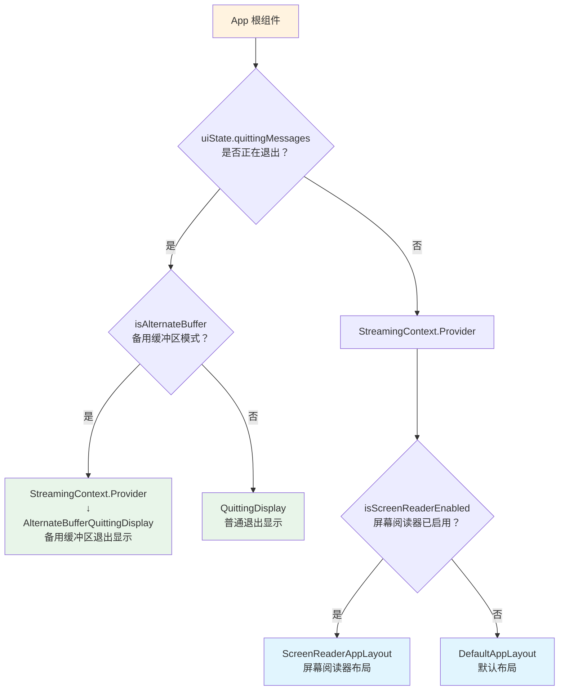
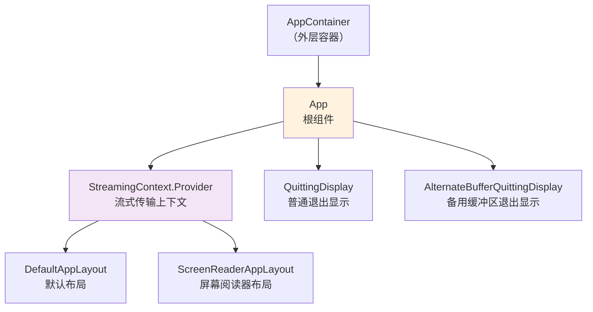

# App.tsx

## 概述

`App` 是 Gemini CLI 用户界面的**根组件**（Root Component），也是整个 UI 渲染树的入口点。它是一个 React 函数组件，负责根据当前应用状态决定渲染哪种布局：

1. **退出状态**：应用正在退出时，根据是否处于备用缓冲区（alternate buffer）模式选择不同的退出显示组件。
2. **正常状态**：应用运行时，根据是否启用了屏幕阅读器选择不同的应用布局。

`App` 还负责通过 `StreamingContext.Provider` 向下传递流式传输状态，使所有子组件都能访问当前的流式传输上下文。

## 架构图（Mermaid）

### 组件渲染决策流程

### 组件层级结构

## 核心组件

### 函数组件：`App`

这是一个无状态渲染组件（状态全部来自 hooks），采用条件渲染模式。

#### 使用的 Hooks

| Hook | 来源 | 返回值 | 用途 |
|---|---|---|---|
| `useUIState()` | `./contexts/UIStateContext.js` | `uiState` 对象 | 获取全局 UI 状态，包括 `quittingMessages`（退出消息）和 `streamingState`（流式传输状态） |
| `useAlternateBuffer()` | `./hooks/useAlternateBuffer.js` | `boolean` | 检测终端是否处于备用缓冲区模式（一种终端全屏模式） |
| `useIsScreenReaderEnabled()` | `ink` | `boolean` | 检测用户是否启用了屏幕阅读器（无障碍功能） |

#### 渲染逻辑

**分支 1：正在退出（`uiState.quittingMessages` 为 truthy）**

- **备用缓冲区模式**：渲染 `AlternateBufferQuittingDisplay`，并用 `StreamingContext.Provider` 包裹，确保退出动画可以访问流式传输状态。
- **普通模式**：直接渲染 `QuittingDisplay`，不需要 `StreamingContext.Provider`。

**分支 2：正常运行**

- 用 `StreamingContext.Provider` 包裹布局组件，将 `uiState.streamingState` 传递给整个子树。
- **屏幕阅读器启用**：渲染 `ScreenReaderAppLayout`，为视障用户提供优化的交互体验。
- **默认模式**：渲染 `DefaultAppLayout`，标准的 CLI 交互界面。

## 依赖关系

### 内部依赖

| 模块路径 | 导入内容 | 说明 |
|---|---|---|
| `./contexts/UIStateContext.js` | `useUIState` | 全局 UI 状态 Hook，提供退出消息和流式传输状态 |
| `./contexts/StreamingContext.js` | `StreamingContext` | 流式传输上下文，通过 Provider 向子组件传递流式传输状态 |
| `./components/QuittingDisplay.js` | `QuittingDisplay` | 普通模式下的退出显示组件 |
| `./components/AlternateBufferQuittingDisplay.js` | `AlternateBufferQuittingDisplay` | 备用缓冲区模式下的退出显示组件 |
| `./layouts/ScreenReaderAppLayout.js` | `ScreenReaderAppLayout` | 无障碍屏幕阅读器布局组件 |
| `./layouts/DefaultAppLayout.js` | `DefaultAppLayout` | 默认应用布局组件 |
| `./hooks/useAlternateBuffer.js` | `useAlternateBuffer` | 备用缓冲区检测 Hook |

### 外部依赖

| 包名 | 导入内容 | 说明 |
|---|---|---|
| `ink` | `useIsScreenReaderEnabled` | Ink 框架提供的屏幕阅读器检测 Hook。Ink 是一个用 React 构建 CLI 界面的框架 |

## 关键实现细节

1. **Ink 框架**：该组件基于 [Ink](https://github.com/vadimdemedes/ink) 框架构建，Ink 允许使用 React 组件模型来构建终端 CLI 界面。所有的 JSX 最终会被渲染为终端文本输出，而非 DOM 元素。

2. **StreamingContext 的条件提供**：注意在退出分支中，只有备用缓冲区模式才包裹 `StreamingContext.Provider`，而普通退出模式（`QuittingDisplay`）不包裹。这表明 `QuittingDisplay` 不需要访问流式传输状态，而 `AlternateBufferQuittingDisplay` 需要（可能因为备用缓冲区退出时需要清理或展示流式传输的最终状态）。

3. **无障碍支持**：通过 `useIsScreenReaderEnabled` 检测屏幕阅读器，动态切换到专门优化的 `ScreenReaderAppLayout` 布局。这体现了对无障碍（a11y）的重视，确保视障用户也能有效使用 CLI 工具。

4. **备用缓冲区（Alternate Buffer）**：终端的备用缓冲区是一种全屏模式（类似 vim、less 等程序使用的模式），进入时隐藏原有终端内容，退出时恢复。在这种模式下退出需要特殊处理，以确保终端状态正确恢复。

5. **组件职责单一**：`App` 组件本身不包含任何业务逻辑或状态管理，仅负责"路由"——根据状态条件选择正确的子组件进行渲染。所有实际的 UI 逻辑都委托给了布局组件和显示组件。
