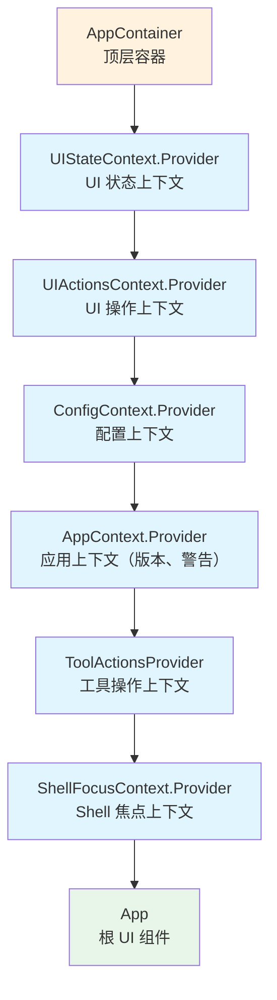
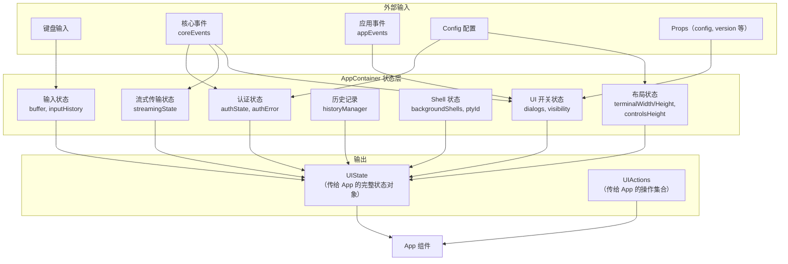
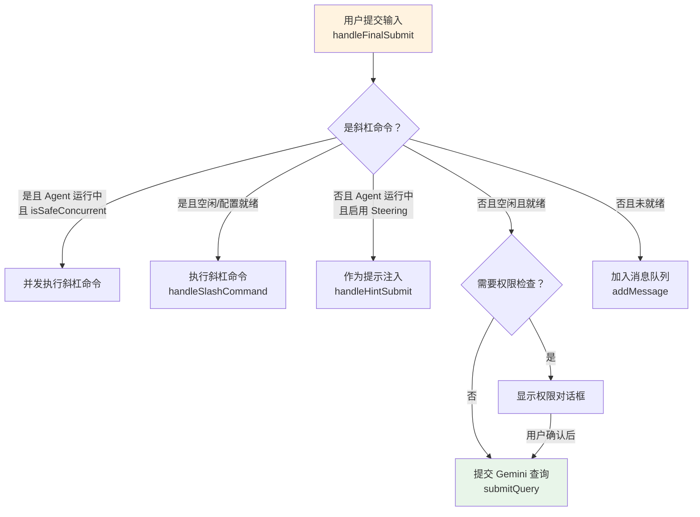
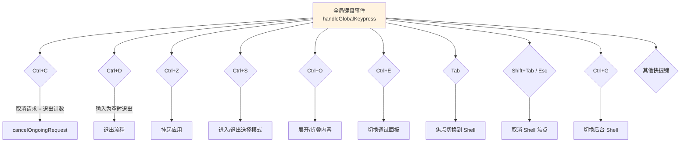

# AppContainer.tsx

## 概述

`AppContainer` 是 Gemini CLI 整个用户界面的**顶层容器组件**，也是应用中最庞大、最核心的组件（约 2650 行）。它承担了以下关键职责：

1. **全局状态管理**：通过大量的 `useState` 管理整个应用的 UI 状态，包括认证、对话框开关、终端布局、流式传输、Shell 交互、扩展管理等。
2. **Context Provider 层**：将全局状态（`UIState`）和全局操作（`UIActions`）通过 React Context 向下传递给所有子组件。
3. **事件监听与协调**：监听来自核心事件系统（`coreEvents`）和应用事件系统（`appEvents`）的各类事件，并将事件转化为 UI 状态变更。
4. **输入处理**：管理用户输入的完整生命周期，包括文本缓冲区、斜杠命令、Gemini 查询提交、Vim 模式、键盘快捷键等。
5. **初始化与清理**：负责应用启动时的配置初始化、Session 事件触发，以及退出时的资源清理（Shell 进程、IDE 连接、鼠标事件等）。

它是 `App` 组件的直接父组件，为 `App` 提供所有运行所需的上下文环境。

## 架构图（Mermaid）

### 组件层级与 Context Provider 结构



### 核心数据流与状态管理



### 用户提交输入的处理流程



### 键盘快捷键处理



## 核心组件

### Props 接口：`AppContainerProps`

| 属性 | 类型 | 说明 |
|---|---|---|
| `config` | `Config` | 应用配置对象，提供 Gemini 客户端、模型、认证等配置 |
| `startupWarnings` | `StartupWarning[]` (可选) | 启动时产生的警告信息 |
| `version` | `string` | 应用版本号字符串 |
| `initializationResult` | `InitializationResult` | 初始化结果，包含主题错误、认证错误、账户暂停信息等 |
| `resumedSessionData` | `ResumedSessionData` (可选) | 恢复的 Session 数据（用于 Session 恢复功能） |

### 常量

| 常量 | 值 | 说明 |
|---|---|---|
| `SHELL_WIDTH_FRACTION` | `0.89` | Shell 占终端宽度的比例（89%），提供水平内边距 |
| `SHELL_HEIGHT_PADDING` | `10` | 从终端可用高度中减去的行数，为其他 UI 元素预留空间 |

### 主要状态变量分组

#### 认证相关

| 状态 | 类型 | 说明 |
|---|---|---|
| `authState` | `AuthState` | 当前认证状态（来自 `useAuthCommand`） |
| `authContext` | `{ requiresRestart?: boolean }` | 认证上下文，标记是否需要重启（如 Login with Google） |
| `userTier` | `UserTierId \| undefined` | 用户层级 |
| `paidTier` | `GeminiUserTier \| undefined` | 付费层级 |
| `quotaStats` | `QuotaStats \| undefined` | 配额统计信息 |

#### UI 对话框开关

| 状态 | 类型 | 说明 |
|---|---|---|
| `isPermissionsDialogOpen` | `boolean` | 权限对话框 |
| `isAgentConfigDialogOpen` | `boolean` | Agent 配置对话框 |
| `showPrivacyNotice` | `boolean` | 隐私通知 |
| `showDebugProfiler` | `boolean` | 调试性能分析器 |
| `shortcutsHelpVisible` | `boolean` | 快捷键帮助 |
| `copyModeEnabled` | `boolean` | 选择/复制模式 |
| `customDialog` | `React.ReactNode \| null` | 自定义对话框节点 |
| `showErrorDetails` | `boolean` | 错误详情面板 |
| `showFullTodos` | `boolean` | 完整 TODO 列表 |

#### 输入与编辑

| 状态 | 类型 | 说明 |
|---|---|---|
| `buffer` | 来自 `useTextBuffer` | 文本缓冲区（支持多行编辑、路径转义、Vim 模式） |
| `shellModeActive` | `boolean` | Shell 模式是否激活 |
| `inputHistory` | 来自 `useInputHistoryStore` | 用户输入历史（支持上箭头回溯） |

#### 终端与布局

| 状态 | 类型 | 说明 |
|---|---|---|
| `terminalWidth` / `terminalHeight` | `number` | 终端尺寸 |
| `controlsHeight` | `number` | 控件区域高度（通过 ResizeObserver 测量） |
| `constrainHeight` | `boolean` | 是否约束内容高度 |
| `availableTerminalHeight` | `number` | 可用终端高度（总高度 - 控件高度 - Shell 高度 - 1） |

#### Shell 与后台进程

| 状态 | 类型 | 说明 |
|---|---|---|
| `embeddedShellFocused` | `boolean` | 嵌入式 Shell 是否获得焦点 |
| `backgroundShells` | `Map<number, BackgroundShell>` | 后台 Shell 进程映射 |
| `isBackgroundShellVisible` | `boolean` | 后台 Shell 面板是否可见 |
| `activeBackgroundShellPid` | 来自 `useBackgroundShellManager` | 当前活跃的后台 Shell PID |

#### 流式传输与 Gemini

| 状态 | 类型 | 说明 |
|---|---|---|
| `streamingState` | `StreamingState` | 流式传输状态（Idle, Responding, WaitingForConfirmation） |
| `thought` | 来自 `useGeminiStream` | 模型当前的思考内容 |
| `pendingToolCalls` | 来自 `useGeminiStream` | 待处理的工具调用 |
| `retryStatus` | 来自 `useGeminiStream` | 重试状态信息 |

### 核心 Hooks 使用一览

| Hook | 来源 | 用途 |
|---|---|---|
| `useHistory` | `./hooks/useHistoryManager.js` | 管理对话历史记录 |
| `useMemoryMonitor` | `./hooks/useMemoryMonitor.js` | 监控内存使用 |
| `useThemeCommand` | `./hooks/useThemeCommand.js` | 主题选择与切换 |
| `useAuthCommand` | `./auth/useAuth.js` | 认证流程管理 |
| `useQuotaAndFallback` | `./hooks/useQuotaAndFallback.js` | 配额管理与降级 |
| `useEditorSettings` | `./hooks/useEditorSettings.js` | 编辑器设置 |
| `useSettingsCommand` | `./hooks/useSettingsCommand.js` | 设置对话框 |
| `useModelCommand` | `./hooks/useModelCommand.js` | 模型选择对话框 |
| `useSlashCommandProcessor` | `./hooks/slashCommandProcessor.js` | 斜杠命令处理 |
| `useVimMode` | `./contexts/VimModeContext.js` | Vim 模式切换 |
| `useErrorCount` | `./hooks/useConsoleMessages.js` | 错误计数 |
| `useTerminalSize` | `./hooks/useTerminalSize.js` | 终端尺寸检测 |
| `useTextBuffer` | `./components/shared/text-buffer.js` | 文本输入缓冲区 |
| `useLogger` | `./hooks/useLogger.js` | 日志记录 |
| `useGeminiStream` | `./hooks/useGeminiStream.js` | Gemini API 流式传输核心 |
| `useVim` | `./hooks/vim.js` | Vim 键绑定处理 |
| `useFocus` | `./hooks/useFocus.js` | 终端窗口焦点检测 |
| `useKeypress` | `./hooks/useKeypress.js` | 键盘事件处理 |
| `useLoadingIndicator` | `./hooks/useLoadingIndicator.js` | 加载指示器（提示语、耗时等） |
| `useShellInactivityStatus` | `./hooks/useShellInactivityStatus.js` | Shell 非活跃状态检测 |
| `useFolderTrust` | `./hooks/useFolderTrust.js` | 文件夹信任管理 |
| `useIdeTrustListener` | `./hooks/useIdeTrustListener.js` | IDE 信任变更监听 |
| `useMessageQueue` | `./hooks/useMessageQueue.js` | 消息队列（MCP/配置未就绪时排队） |
| `useMcpStatus` | `./hooks/useMcpStatus.js` | MCP 服务器就绪状态 |
| `useApprovalModeIndicator` | `./hooks/useApprovalModeIndicator.js` | 审批模式指示器 |
| `useSessionStats` | `./contexts/SessionContext.js` | Session 统计 |
| `useGitBranchName` | `./hooks/useGitBranchName.js` | Git 分支名 |
| `useExtensionUpdates` | `./hooks/useExtensionUpdates.js` | 扩展更新管理 |
| `useSessionBrowser` | `./hooks/useSessionBrowser.js` | Session 浏览器 |
| `useSessionResume` | `./hooks/useSessionResume.js` | Session 恢复 |
| `useIncludeDirsTrust` | `./hooks/useIncludeDirsTrust.js` | 包含目录信任管理 |
| `useInputHistoryStore` | `./hooks/useInputHistoryStore.js` | 输入历史存储 |
| `useBanner` | `./hooks/useBanner.js` | 横幅文本管理 |
| `useTerminalSetupPrompt` | `./utils/terminalSetup.js` | 终端设置提示 |
| `useHookDisplayState` | `./hooks/useHookDisplayState.js` | Hook 执行显示状态 |
| `useBackgroundShellManager` | `./hooks/useBackgroundShellManager.js` | 后台 Shell 管理 |
| `useRepeatedKeyPress` | `./hooks/useRepeatedKeyPress.js` | 连续按键检测（退出确认） |
| `useVisibilityToggle` | `./hooks/useVisibilityToggle.js` | UI 可见性切换（Clean UI） |
| `useKeyMatchers` | `./hooks/useKeyMatchers.js` | 键盘快捷键匹配器 |
| `useTerminalTheme` | `./hooks/useTerminalTheme.js` | 终端主题自动检测 |
| `useTimedMessage` | `./hooks/useTimedMessage.js` | 定时消息（自动消失） |
| `useSuspend` | `./hooks/useSuspend.js` | 应用挂起（Ctrl+Z） |
| `useRunEventNotifications` | `./hooks/useRunEventNotifications.js` | 运行事件桌面通知 |

### 关键方法详解

#### `handleFinalSubmit(submittedValue: string)` (useCallback)

用户提交输入的主入口，处理逻辑：

1. 重置溢出状态和展开提示。
2. 判断是否为斜杠命令：
   - **是斜杠命令 + Agent 运行中 + 命令标记为 `isSafeConcurrent`**：并发执行（不中断当前 Agent）。
   - **是斜杠命令 + 配置就绪**：执行斜杠命令。
3. 判断是否为用户提示注入（Model Steering）：
   - **Agent 运行中 + 非斜杠命令 + 启用 Steering**：作为运行时提示注入。
4. 判断是否提交 Gemini 查询：
   - **空闲 + MCP 和配置就绪**：执行权限检查后提交查询。
   - **未就绪**：将消息加入排队，并显示等待提示。
5. 记录输入到历史。

#### `handleGlobalKeypress(key: Key)` (useCallback)

全局键盘事件处理器，注册为最高优先级。处理的快捷键包括：

- **Ctrl+C**：取消当前请求 + 退出计数（连按 2 次退出，3 次记录退出失败）
- **Ctrl+D**：输入为空时退出（与 Ctrl+C 类似的连按逻辑）
- **Ctrl+Z**：挂起应用
- **Ctrl+S**：进入/退出选择（复制）模式
- **Ctrl+O**：展开/折叠内容
- **Ctrl+E**：切换调试/错误面板
- **Ctrl+T**：切换 TODO 完整显示
- **Ctrl+M**：切换 Markdown 渲染
- **Tab**：焦点切换到嵌入式 Shell
- **Shift+Tab / Esc**：从 Shell 取消焦点
- **Ctrl+G**：切换后台 Shell
- **Ctrl+B**：显示后台 Shell 列表
- 其他 IDE 相关和调试快捷键

#### `performMemoryRefresh()` (useCallback)

刷新分层记忆（GEMINI.md 或其他上下文文件）：
- 支持 JIT（Just-In-Time）上下文模式和传统模式。
- 刷新后在历史记录中显示加载结果。

#### `handleAuthSelect(authType, scope)` (useCallback)

认证方法选择处理：
- 清除缓存凭据。
- 根据选择的认证类型刷新认证。
- 特殊处理 Login with Google（可能需要重启应用）。
- 记录计费事件。

### UIState 对象

通过 `useMemo` 构建的巨大状态对象，包含 120+ 个字段，传递给 `UIStateContext.Provider`。主要分类：

- 对话框开关状态（约 20 个）
- 认证状态（约 8 个）
- 流式传输与 Gemini 状态（约 10 个）
- 输入与历史（约 8 个）
- 终端布局（约 10 个）
- Shell 相关（约 8 个）
- 配额与计费（嵌套对象）
- 扩展与更新（约 5 个）
- UI 显示选项（约 15 个）
- 其他辅助状态

### UIActions 对象

通过 `useMemo` 构建的操作集合，包含 40+ 个方法，传递给 `UIActionsContext.Provider`。涵盖：

- 对话框打开/关闭操作
- 认证操作（选择方法、提交 API Key、取消）
- 主题/编辑器/模型选择
- 输入提交与屏幕清除
- 配额对话框选择
- Session 浏览与恢复
- Shell 焦点管理
- 重启应用
- 新 Agent 确认
- Banner 可见性控制

### 渲染输出

**特殊分支**：如果 `authState === AuthState.AwaitingGoogleLoginRestart`，直接渲染 `LoginWithGoogleRestartDialog`。

**正常分支**：渲染 6 层 Context Provider 嵌套，最内层是 `<App />` 组件：
```
UIStateContext.Provider
  → UIActionsContext.Provider
    → ConfigContext.Provider
      → AppContext.Provider
        → ToolActionsProvider
          → ShellFocusContext.Provider
            → App
```

## 依赖关系

### 内部依赖

| 模块路径 | 导入内容 | 说明 |
|---|---|---|
| `./App.js` | `App` | 根 UI 组件 |
| `./contexts/AppContext.js` | `AppContext` | 应用上下文（版本、启动警告） |
| `./contexts/UIStateContext.js` | `UIStateContext`, `UIState` | UI 状态上下文 |
| `./contexts/UIActionsContext.js` | `UIActionsContext`, `UIActions` | UI 操作上下文 |
| `./contexts/ConfigContext.js` | `ConfigContext` | 配置上下文 |
| `./contexts/ToolActionsContext.js` | `ToolActionsProvider` | 工具操作上下文 |
| `./contexts/VimModeContext.js` | `useVimMode` | Vim 模式上下文 |
| `./contexts/OverflowContext.js` | `useOverflowActions`, `useOverflowState` | 内容溢出管理上下文 |
| `./contexts/StreamingContext.js` | （间接） | 流式传输上下文 |
| `./contexts/KeypressContext.js` | `KeypressPriority` | 键盘事件优先级 |
| `./contexts/SessionContext.js` | `useSessionStats` | Session 统计上下文 |
| `./contexts/ShellFocusContext.js` | `ShellFocusContext` | Shell 焦点上下文 |
| `./contexts/SettingsContext.js` | `useSettings` | 设置上下文 |
| `./types.js` | `HistoryItem`, `AuthState`, `ConfirmationRequest`, `MessageType`, `StreamingState` 等 | UI 类型定义 |
| `./hooks/*` | 30+ 个 Hook | 各种功能 Hook |
| `./components/InputPrompt.js` | `calculatePromptWidths` | 输入提示宽度计算 |
| `./utils/ui-sizing.js` | `calculateMainAreaWidth` | 主区域宽度计算 |
| `./utils/commandUtils.js` | `isSlashCommand` | 斜杠命令判断 |
| `./utils/historyUtils.js` | `isToolExecuting`, `isToolAwaitingConfirmation`, `getAllToolCalls` | 历史记录工具 |
| `./utils/terminalCapabilityManager.js` | `terminalCapabilityManager` | 终端能力管理 |
| `./utils/shortcutsHelp.js` | `useIsHelpDismissKey` | 快捷键帮助关闭判断 |
| `./utils/terminalSetup.js` | `useTerminalSetupPrompt` | 终端设置提示 |
| `./utils/updateCheck.js` | `UpdateObject` 类型 | 更新检查 |
| `./key/keyMatchers.js` | `Command` | 键盘命令枚举 |
| `./IdeIntegrationNudge.js` | `IdeIntegrationNudgeResult` | IDE 集成引导结果类型 |
| `./auth/useAuth.js` | `useAuthCommand` | 认证命令 Hook |
| `./auth/LoginWithGoogleRestartDialog.js` | `LoginWithGoogleRestartDialog` | Google 登录重启对话框 |
| `./components/NewAgentsNotification.js` | `NewAgentsChoice` | 新 Agent 通知选项 |
| `@google/gemini-cli-core` | 大量类型和工具函数 | 核心库 |
| `../config/auth.js` | `validateAuthMethod` | 认证方法验证 |
| `../config/settings.js` | `LoadableSettingScope`, `SettingScope` | 设置作用域 |
| `../config/extension-manager.js` | `ExtensionManager` | 扩展管理器 |
| `../config/extensions/consent.js` | `requestConsentInteractive` | 交互式同意请求 |
| `../config/trustedFolders.js` | `isWorkspaceTrusted` | 工作区信任检查 |
| `../core/initializer.js` | `InitializationResult` | 初始化结果类型 |
| `../utils/windowTitle.js` | `computeTerminalTitle` | 终端窗口标题计算 |
| `../utils/events.js` | `appEvents`, `AppEvent`, `TransientMessageType` | 应用事件系统 |
| `../utils/handleAutoUpdate.js` | `setUpdateHandler` | 自动更新处理 |
| `../utils/cleanup.js` | `registerCleanup`, `runExitCleanup` | 清理注册与执行 |
| `../utils/processUtils.js` | `relaunchApp` | 应用重启 |
| `../utils/sessionUtils.js` | `SessionInfo` | Session 信息类型 |
| `../utils/commands.js` | `parseSlashCommand` | 斜杠命令解析 |
| `../utils/terminalNotifications.js` | `isNotificationsEnabled` | 通知开关检查 |

### 外部依赖

| 包名 | 导入内容 | 说明 |
|---|---|---|
| `react` | `useMemo`, `useState`, `useCallback`, `useEffect`, `useRef`, `useLayoutEffect` | React 核心 Hooks |
| `ink` | `DOMElement`, `ResizeObserver`, `useApp`, `useStdout`, `useStdin`, `AppProps` | Ink 终端 UI 框架 |
| `ansi-escapes` | `ansiEscapes` | ANSI 转义序列工具（清屏等） |
| `node:process` | `process` | Node.js 进程对象 |
| `node:path` | `basename` | 路径工具（提取目录名） |

## 关键实现细节

1. **巨型组件模式**：`AppContainer` 是一个约 2650 行的超大组件，集中管理了整个应用的全局状态。虽然看起来违反了"组件应该小而专注"的原则，但这是一个有意为之的设计选择——所有全局状态和操作集中在一处，通过 Context Provider 分发，避免了 prop drilling 和状态分散带来的复杂性。

2. **6 层 Context Provider 嵌套**：渲染树中有 6 层 Context Provider（UIState → UIActions → Config → App → ToolActions → ShellFocus），形成了完整的依赖注入体系。每一层都为下游组件提供特定领域的数据或操作。

3. **初始化与清理的生命周期管理**：
   - `useEffect` 中进行 `config.initialize()` 和 Session 开始事件。
   - `registerCleanup` 注册退出清理逻辑（关闭鼠标事件、杀死后台 Shell、断开 IDE 连接、触发 Session 结束事件）。
   - 后台生成前一个 Session 的摘要（fire-and-forget）。

4. **消息队列机制**：当配置或 MCP 服务器尚未初始化完成时，用户输入不会被丢弃，而是加入 `messageQueue` 排队等待。一旦就绪，队列中的消息会自动被提交。

5. **双重退出确认**：Ctrl+C 和 Ctrl+D 都使用 `useRepeatedKeyPress` 实现连按检测。单按一次只显示警告，连按两次触发 `/quit` 命令，连按三次记录退出失败事件。

6. **Model Steering（模型引导）**：当 Agent 正在运行时，用户的非斜杠命令输入会被作为"hint"注入到模型上下文中，而不是排队等待。这允许用户在 Agent 运行过程中动态调整其行为方向。

7. **ResizeObserver 测量控件高度**：使用 Ink 提供的 `ResizeObserver` 动态测量控件区域高度，用于精确计算可用终端空间。`copyModeEnabled` 时使用上一次的高度快照，避免复制模式下的布局抖动。

8. **终端窗口标题动态更新**：根据 `streamingState`、思考内容、确认状态等动态更新终端窗口标题（通过 ANSI 转义序列 `\x1b]0;...\x07`），仅在标题发生变化时写入 stdout。

9. **coreEvents.drainBacklogs()**：在 `UserFeedback` 事件监听器注册后，立即调用 `drainBacklogs()` 来刷新启动期间积压的消息，确保启动阶段产生的反馈不会丢失。

10. **选择/复制模式**：在备用缓冲区模式下，Ctrl+S 进入选择模式（禁用鼠标事件以允许终端原生选择文本）。任何非滚动按键退出选择模式并重新启用鼠标事件。
