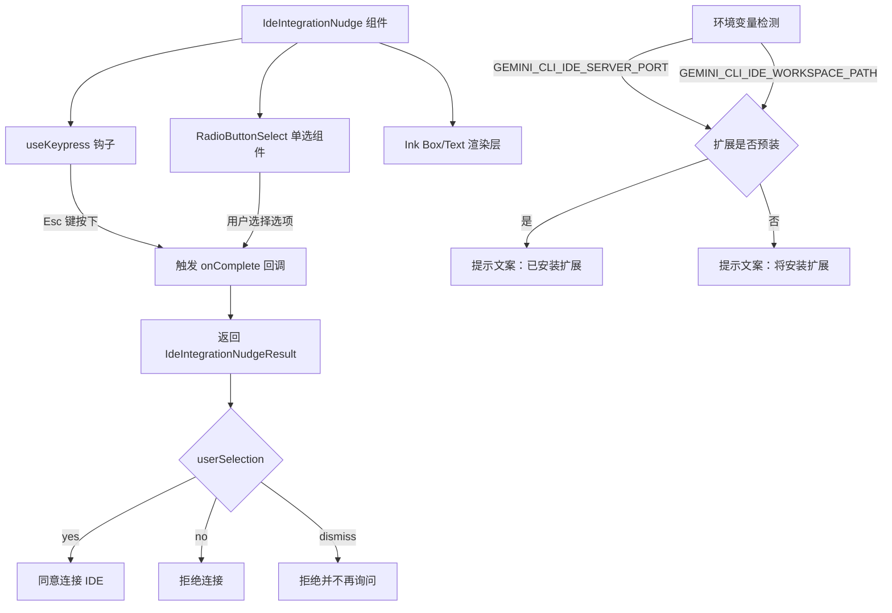

# IdeIntegrationNudge.tsx

## 概述

`IdeIntegrationNudge` 是一个 React (Ink) 组件，用于在 CLI 终端中向用户展示一个 IDE 集成提示对话框。当检测到用户正在使用某个 IDE（如 VS Code）时，该组件会询问用户是否希望将该 IDE 与 Gemini CLI 进行连接，以便获得更好的开发体验（如访问打开的文件、在编辑器中直接显示 diff 等）。

该组件提供三个选项供用户选择：
- **Yes**：同意连接 IDE
- **No (esc)**：拒绝连接（也可按 Esc 键触发）
- **No, don't ask again**：拒绝并永久关闭提示

组件还会自动检测 IDE 扩展是否已预装（通过环境变量判断），并据此调整提示文案。

## 架构图（Mermaid）



## 核心组件

### 类型定义

#### `IdeIntegrationNudgeResult`

```typescript
export type IdeIntegrationNudgeResult = {
  userSelection: 'yes' | 'no' | 'dismiss';
  isExtensionPreInstalled: boolean;
};
```

- `userSelection`：用户的选择结果，有三种取值：
  - `'yes'`：用户同意连接 IDE
  - `'no'`：用户拒绝连接
  - `'dismiss'`：用户拒绝并选择不再询问
- `isExtensionPreInstalled`：布尔值，表示 IDE 扩展是否已预装

#### `IdeIntegrationNudgeProps`

```typescript
interface IdeIntegrationNudgeProps {
  ide: IdeInfo;
  onComplete: (result: IdeIntegrationNudgeResult) => void;
}
```

- `ide`：来自 `@google/gemini-cli-core` 的 IDE 信息对象，包含 `displayName` 等属性
- `onComplete`：用户完成选择后的回调函数

### 主组件 `IdeIntegrationNudge`

功能逻辑：

1. **键盘监听**：通过 `useKeypress` 钩子监听 Esc 键，按下时自动以 `'no'` 结果调用 `onComplete`
2. **扩展预装检测**：检查环境变量 `GEMINI_CLI_IDE_SERVER_PORT` 和 `GEMINI_CLI_IDE_WORKSPACE_PATH` 是否同时存在，若是则认为扩展已预装
3. **选项列表构建**：构建包含三个 `RadioSelectItem` 的数组，每个选项都携带 `isExtensionPreInstalled` 信息
4. **文案动态生成**：根据扩展是否预装，显示不同的提示文案
5. **UI 渲染**：使用 Ink 的 `Box` 和 `Text` 组件渲染带圆角边框的对话框，内含提示文字和单选按钮组

### UI 结构

```
┌─────────────────────────────────────────────┐
│  > Do you want to connect [IDE] to Gemini CLI?  │
│  [提示文案 - 灰色次要文本]                          │
│                                                   │
│  ○ Yes                                            │
│  ○ No (esc)                                       │
│  ○ No, don't ask again                            │
└─────────────────────────────────────────────┘
```

边框使用 `round` 样式，边框颜色为 `theme.status.warning`（警告色），内边距为 1，左外边距为 1，宽度 100%。

## 依赖关系

### 内部依赖

| 模块路径 | 导入内容 | 用途 |
|---------|---------|------|
| `./components/shared/RadioButtonSelect.js` | `RadioButtonSelect`, `RadioSelectItem` | 单选按钮选择组件及其选项类型 |
| `./hooks/useKeypress.js` | `useKeypress` | 键盘按键监听钩子 |
| `./semantic-colors.js` | `theme` | 语义化颜色主题配置 |

### 外部依赖

| 包名 | 导入内容 | 用途 |
|------|---------|------|
| `@google/gemini-cli-core` | `IdeInfo`（类型） | IDE 信息类型定义 |
| `ink` | `Box`, `Text` | 终端 UI 渲染组件 |

## 关键实现细节

1. **环境变量驱动的扩展检测**：组件通过检查 `process.env['GEMINI_CLI_IDE_SERVER_PORT']` 和 `process.env['GEMINI_CLI_IDE_WORKSPACE_PATH']` 两个环境变量来判断 IDE 扩展是否已安装。这两个环境变量由 IDE 扩展在启动 CLI 时注入。只有两者同时存在才认为扩展已预装。

2. **Esc 键快捷退出**：`useKeypress` 钩子始终处于活跃状态（`isActive: true`），当用户按下 Esc 键时，直接以 `userSelection: 'no'` 和 `isExtensionPreInstalled: false` 调用 `onComplete`。注意此处 `isExtensionPreInstalled` 硬编码为 `false`，与通过选项选择 "No" 时的行为不同（后者会传递实际检测结果）。

3. **文案差异化**：
   - 扩展已预装时：提示 "CLI 将可以访问你的打开文件并在编辑器中直接显示 diff"
   - 扩展未预装时：提示 "我们将安装一个扩展来实现以上功能"

4. **IDE 名称容错**：使用 `ideName ?? 'your editor'` 进行空值处理，当 IDE 名称不可用时回退为通用文案 "your editor"。

5. **导出方式**：组件和 `IdeIntegrationNudgeResult` 类型均使用命名导出（`export`），供上层调用方引用。
