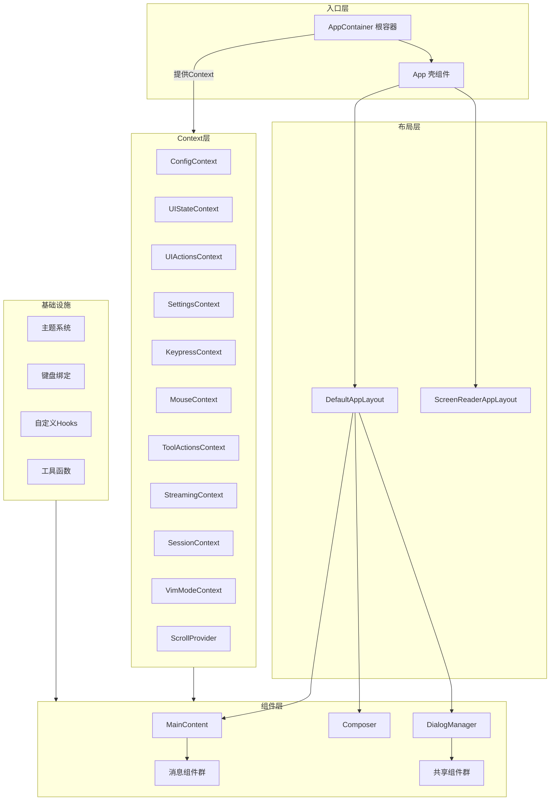

# ui

## 概述

`ui` 目录是 Gemini CLI 的终端用户界面层，基于 React + Ink 框架构建。它实现了一个完整的终端交互界面，包括消息展示、输入编辑、对话框管理、主题系统、键盘快捷键、滚动控制等功能。整个 UI 层采用 React 的组件化和 Context 模式来管理状态和行为。

## 目录结构

```
ui/
├── App.tsx                   # 应用壳组件，选择布局
├── AppContainer.tsx          # 根状态管理容器，所有 Context Provider
├── IdeIntegrationNudge.tsx   # IDE 集成提示组件
├── colors.ts                 # 动态颜色代理（委托给 ThemeManager）
├── semantic-colors.ts        # 语义化颜色代理
├── constants.ts              # UI 常量定义
├── debug.ts                  # 调试状态（动画组件计数）
├── textConstants.ts          # 文本常量（屏幕阅读器前缀等）
├── types.ts                  # UI 类型定义（HistoryItem、StreamingState 等）
├── components/               # React 组件
├── hooks/                    # 自定义 React Hooks
├── contexts/                 # React Context 定义
├── layouts/                  # 布局组件
├── themes/                   # 主题系统
├── editors/                  # 编辑器设置管理
├── key/                      # 键盘绑定系统
├── state/                    # 状态管理（Reducer）
└── utils/                    # UI 工具函数
```

## 架构图



## 核心组件

### 顶层文件

| 文件 | 职责 |
|------|------|
| `App.tsx` | 应用壳组件，根据状态选择退出显示或正常布局 |
| `AppContainer.tsx` | 根状态管理容器（约 2000+ 行），管理所有核心 UI 状态和 Context Provider |
| `types.ts` | 定义 `HistoryItem`、`StreamingState`、`ToolCallStatus` 等核心类型 |
| `colors.ts` | 颜色代理对象，通过 getter 委托给 `ThemeManager` |
| `semantic-colors.ts` | 语义化颜色代理，提供 `text`、`background`、`border`、`ui`、`status` 分组 |
| `constants.ts` | 定义 Shell 相关常量、超时时间、UI 尺寸阈值等 |

### 类型体系 (`types.ts`)

- **`HistoryItem`**: 聊天历史条目联合类型，支持 user/gemini/tool_group/info/error 等 20+ 种类型
- **`StreamingState`**: 流式状态枚举（Idle / Responding / WaitingForConfirmation）
- **`ToolCallStatus`**: 工具调用状态（Pending / Confirming / Executing / Success / Error）
- **`SlashCommandProcessorResult`**: 斜杠命令处理结果

## 依赖关系

### 内部依赖
- `@google/gemini-cli-core`: 核心配置、认证、工具系统
- `../config/`: CLI 配置、设置、认证
- `../utils/`: 通用工具函数

### 外部依赖
- `react`: UI 框架
- `ink`: 终端渲染引擎
- `mnemonist`: 高性能数据结构（MultiMap）
- `highlight.js` / `lowlight`: 代码高亮
- `tinygradient` / `tinycolor2`: 颜色渐变和操作

## 数据流

### 状态管理架构
```
AppContainer (状态所有者)
  ├── UIStateContext  → 只读 UI 状态
  ├── UIActionsContext → UI 操作回调
  ├── ConfigContext   → 应用配置
  ├── SettingsContext → 用户设置
  ├── KeypressContext → 键盘事件分发
  ├── MouseContext    → 鼠标事件分发
  ├── SessionContext  → 会话统计
  └── StreamingContext → 流式状态
```

### 键盘事件流
1. `KeypressContext` 中的 `KeypressProvider` 监听 `stdin` 原始数据
2. 数据经过 `emitKeys` 生成器解析为 `Key` 对象
3. 经过 `bufferPaste`、`bufferBackslashEnter`、`bufferFastReturn` 管道处理
4. 按优先级广播给所有订阅的 handler（Critical > High > Normal > Low）
5. 任意 handler 返回 `true` 则停止传播
