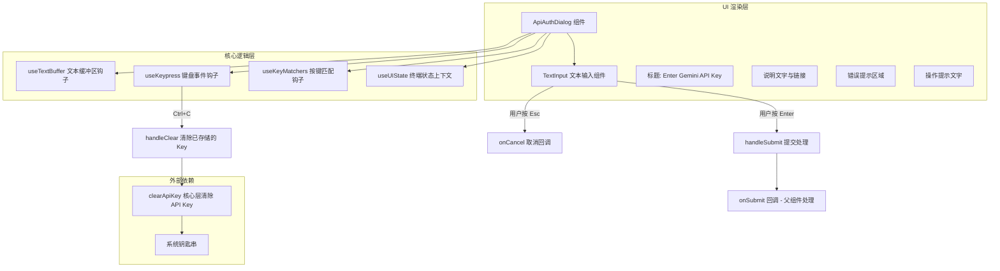

# ApiAuthDialog.tsx

## 概述

`ApiAuthDialog` 是一个 React (Ink) 终端 UI 组件，用于在 Gemini CLI 中提供 API Key 认证对话框。当用户选择通过 API Key 方式进行身份认证时，此组件会渲染一个带边框的交互式输入界面，允许用户输入、提交或清除 Gemini API Key。输入的 API Key 会被安全存储在系统钥匙串（keychain）中。

该组件位于 `packages/cli/src/ui/auth/ApiAuthDialog.tsx`，是认证流程中 API Key 认证方式的核心 UI 入口。

## 架构图（Mermaid）



## 核心组件

### 1. `ApiAuthDialogProps` 接口

| 属性 | 类型 | 必填 | 默认值 | 说明 |
|------|------|------|--------|------|
| `onSubmit` | `(apiKey: string) => void` | 是 | - | 用户按下 Enter 提交 API Key 时的回调函数 |
| `onCancel` | `() => void` | 是 | - | 用户按下 Esc 取消时的回调函数 |
| `error` | `string \| null` | 否 | `undefined` | 错误信息，有值时在输入框下方显示红色错误文本 |
| `defaultValue` | `string` | 否 | `''` | 输入框的默认值（可用于预填已存储的 Key） |

### 2. `ApiAuthDialog` 函数组件

主要功能：

- **文本输入区域**：使用 `TextInput` 组件与 `useTextBuffer` 钩子管理用户的 API Key 输入，支持光标定位和视口滚动。
- **输入过滤**：通过 `inputFilter` 严格限制输入字符为 `a-zA-Z0-9_-`，自动过滤换行符和非法字符。
- **提交处理（`handleSubmit`）**：将用户输入的 API Key 传递给父组件的 `onSubmit` 回调。
- **清除处理（`handleClear`）**：调用核心层的 `clearApiKey()` 函数从系统钥匙串中删除已存储的 API Key，并清空输入缓冲区。该操作支持取消（通过 `pendingPromise` ref 管理异步生命周期）。
- **键盘快捷键**：通过 `useKeypress` 钩子监听 `Ctrl+C`（`Command.CLEAR_INPUT`）来触发清除操作。
- **错误显示**：当 `error` prop 有值时，在输入框下方渲染红色错误提示文本。

### 3. UI 布局结构

```
┌─────────────────────────────────────┐ (round 边框, focus 颜色)
│  Enter Gemini API Key (粗体标题)      │
│                                       │
│  Please enter your Gemini API key...  │
│  You can get an API key from [链接]   │
│                                       │
│  ┌─────────────────────────────┐     │ (round 边框, default 颜色)
│  │ [文本输入区域]                │     │
│  └─────────────────────────────┘     │
│                                       │
│  [错误提示 - 仅在有错误时显示]         │
│                                       │
│  (Press Enter to submit, Esc to       │
│   cancel, Ctrl+C to clear stored key) │
└─────────────────────────────────────┘
```

## 依赖关系

### 内部依赖

| 模块 | 导入内容 | 用途 |
|------|----------|------|
| `../semantic-colors.js` | `theme` | 语义化颜色主题，用于 UI 元素的颜色配置（`text.primary`、`text.secondary`、`text.link`、`ui.focus`、`border.default`、`status.error`） |
| `../components/shared/TextInput.js` | `TextInput` | 终端文本输入组件，处理用户键盘输入并渲染文本 |
| `../components/shared/text-buffer.js` | `useTextBuffer` | 文本缓冲区管理钩子，维护输入文本状态、光标位置和视口 |
| `../contexts/UIStateContext.js` | `useUIState` | UI 状态上下文钩子，提供 `terminalWidth` 等终端信息 |
| `../hooks/useKeypress.js` | `useKeypress` | 键盘事件监听钩子，用于捕获特定按键组合 |
| `../hooks/useKeyMatchers.js` | `useKeyMatchers` | 按键匹配器钩子，返回预定义的按键命令匹配函数 |
| `../key/keyMatchers.js` | `Command` | 按键命令枚举，使用 `Command.CLEAR_INPUT` 匹配清除输入的快捷键 |

### 外部依赖

| 包名 | 导入内容 | 用途 |
|------|----------|------|
| `react` | `useRef`, `useEffect` | React 钩子：`useRef` 管理异步 Promise 引用，`useEffect` 处理组件卸载时的清理 |
| `ink` | `Box`, `Text` | Ink 框架的终端 UI 基础组件，用于布局和文本渲染 |
| `@google/gemini-cli-core` | `clearApiKey`, `debugLogger` | 核心包功能：`clearApiKey` 从系统钥匙串清除存储的 API Key，`debugLogger` 输出调试日志 |

## 关键实现细节

### 1. 异步操作生命周期管理

组件使用 `useRef<{ cancel: () => void } | null>` 模式管理异步 Promise 的生命周期：

```typescript
const pendingPromise = useRef<{ cancel: () => void } | null>(null);

useEffect(
  () => () => {
    pendingPromise.current?.cancel();
  },
  [],
);
```

- 在 `handleClear` 中，每次发起新的 `clearApiKey()` 调用前，先取消上一次未完成的操作。
- 通过 `isCancelled` 标志位包装原始 Promise，防止组件卸载或重复操作后仍然执行回调（避免内存泄漏和状态更新错误）。
- 这是一种手动的"可取消 Promise"模式，替代了 `AbortController` 方案。

### 2. 输入过滤策略

```typescript
inputFilter: (text) =>
  text.replace(/[^a-zA-Z0-9_-]/g, '').replace(/[\r\n]/g, ''),
```

API Key 的输入被严格限制为字母、数字、下划线和短横线，所有其他字符（包括空格、换行等）均被自动过滤。这既防止了意外粘贴多余字符，也符合 Gemini API Key 的格式规范。

### 3. 视口宽度计算

```typescript
const { terminalWidth } = useUIState();
const viewportWidth = terminalWidth - 8;
```

输入区域的视口宽度为终端宽度减去 8 个字符（预留给边框、padding 等装饰元素），确保文本输入不会溢出终端边界。

### 4. 单行输入模式

`useTextBuffer` 配置了 `singleLine: true`，确保 API Key 输入仅在单行内进行，不允许换行。视口高度设为 4 行但实际内容被限制为单行。

### 5. 错误状态的条件渲染

```typescript
{error && (
  <Box marginTop={1}>
    <Text color={theme.status.error}>{error}</Text>
  </Box>
)}
```

仅在 `error` prop 有值时才渲染错误提示区域，使用 `theme.status.error` 颜色（通常为红色）进行视觉警示。
