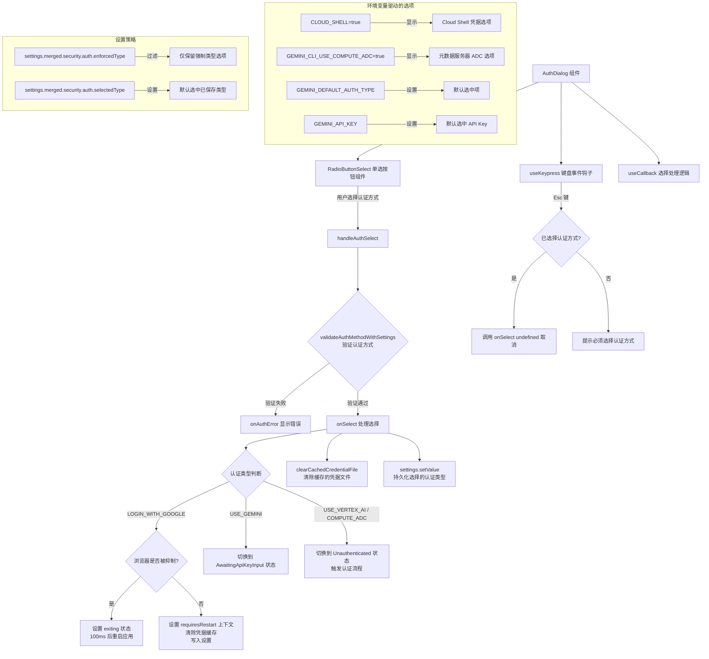

# AuthDialog.tsx

## 概述

`AuthDialog` 是 Gemini CLI 认证流程中的**主认证选择对话框**组件。当用户首次启动 CLI 或需要重新认证时，此组件会渲染一个包含多种认证方式的单选列表，引导用户选择合适的身份验证方式。

支持的认证方式包括：
- **Sign in with Google**（Google 账号登录）
- **Use Cloud Shell user credentials**（Cloud Shell 环境凭据，仅在 Cloud Shell 环境中可见）
- **Use metadata server application default credentials**（元数据服务器 ADC，仅当 `GEMINI_CLI_USE_COMPUTE_ADC=true` 时可见）
- **Use Gemini API Key**（使用 Gemini API Key）
- **Vertex AI**（使用 Vertex AI 认证）

该组件还处理认证方式的持久化存储、设置强制认证类型的策略执行、以及在特定条件下触发应用重启。

文件位于 `packages/cli/src/ui/auth/AuthDialog.tsx`。

## 架构图（Mermaid）



## 核心组件

### 1. `AuthDialogProps` 接口

| 属性 | 类型 | 说明 |
|------|------|------|
| `config` | `Config` | 核心配置对象，用于检查浏览器启动是否被抑制 |
| `settings` | `LoadedSettings` | 已加载的设置对象，包含认证策略配置和读写方法 |
| `setAuthState` | `(state: AuthState) => void` | 设置认证状态的回调（如切换到 `AwaitingApiKeyInput` 或 `Unauthenticated`） |
| `authError` | `string \| null` | 当前的认证错误信息 |
| `onAuthError` | `(error: string \| null) => void` | 设置/清除认证错误的回调 |
| `setAuthContext` | `(context: { requiresRestart?: boolean }) => void` | 设置认证上下文（如标记需要重启） |

### 2. 认证选项列表构建

组件根据环境变量动态构建认证选项列表：

| 条件 | 选项 | AuthType |
|------|------|----------|
| 始终显示 | Sign in with Google | `LOGIN_WITH_GOOGLE` |
| `CLOUD_SHELL=true` | Use Cloud Shell user credentials | `COMPUTE_ADC` |
| `GEMINI_CLI_USE_COMPUTE_ADC=true` | Use metadata server application default credentials | `COMPUTE_ADC` |
| 始终显示 | Use Gemini API Key | `USE_GEMINI` |
| 始终显示 | Vertex AI | `USE_VERTEX_AI` |

若 `settings.merged.security.auth.enforcedType` 有值，列表会被过滤为仅包含该强制类型。

### 3. 默认选中项逻辑

默认选中项按以下优先级确定：

1. `settings.merged.security.auth.selectedType` — 用户之前已保存的选择
2. `GEMINI_DEFAULT_AUTH_TYPE` 环境变量
3. `GEMINI_API_KEY` 环境变量存在时选择 `USE_GEMINI`
4. 兜底选择 `LOGIN_WITH_GOOGLE`

如果存在 `enforcedType`，则强制选中索引 0（即过滤后的唯一选项）。

### 4. `onSelect` 核心处理逻辑

该回调函数（使用 `useCallback` 缓存）处理用户选择后的全部逻辑：

1. 防止在 `exiting` 状态下重复触发
2. 根据认证类型设置 `authContext`（`LOGIN_WITH_GOOGLE` 需要标记 `requiresRestart`）
3. 调用 `clearCachedCredentialFile()` 清除之前缓存的凭据文件
4. 通过 `settings.setValue()` 将选择的认证类型持久化到用户级设置
5. 特殊处理：
   - **LOGIN_WITH_GOOGLE + 浏览器被抑制**：设置 `exiting` 状态，延迟 100ms 后调用 `relaunchApp()` 重启应用
   - **USE_GEMINI**：切换到 `AuthState.AwaitingApiKeyInput` 显示 API Key 输入对话框
   - **其他类型**：切换到 `AuthState.Unauthenticated` 触发后续认证流程

### 5. Esc 键处理逻辑

- 如果当前有错误消息，阻止退出（用户尚未认证）
- 如果用户之前未选择过认证方式（`selectedType === undefined`），提示必须选择并阻止退出
- 否则调用 `onSelect(undefined, ...)` 允许取消选择

### 6. `exiting` 状态的 UI

当 `exiting` 为 `true` 时，组件渲染简化的重启提示文本：

```
Logging in with Google... Restarting Gemini CLI to continue.
```

## 依赖关系

### 内部依赖

| 模块 | 导入内容 | 用途 |
|------|----------|------|
| `../semantic-colors.js` | `theme` | 语义化颜色主题 |
| `../components/shared/RadioButtonSelect.js` | `RadioButtonSelect` | 单选按钮列表组件，用于渲染认证方式选项 |
| `../../config/settings.js` | `SettingScope`, `LoadableSettingScope`, `LoadedSettings` | 设置作用域类型和已加载设置类型 |
| `../hooks/useKeypress.js` | `useKeypress` | 键盘事件监听钩子 |
| `../types.js` | `AuthState` | 认证状态枚举类型 |
| `./useAuth.js` | `validateAuthMethodWithSettings` | 验证认证方式与当前设置的兼容性 |
| `../../utils/processUtils.js` | `relaunchApp` | 重启应用的工具函数 |

### 外部依赖

| 包名 | 导入内容 | 用途 |
|------|----------|------|
| `react` | `useCallback`, `useState` | React 钩子 |
| `ink` | `Box`, `Text` | Ink 终端 UI 组件 |
| `@google/gemini-cli-core` | `AuthType`, `clearCachedCredentialFile`, `Config` | 认证类型枚举、清除凭据文件函数、配置类型 |

## 关键实现细节

### 1. 环境感知的选项动态构建

组件通过检测多个环境变量（`CLOUD_SHELL`、`GEMINI_CLI_USE_COMPUTE_ADC`、`GEMINI_DEFAULT_AUTH_TYPE`、`GEMINI_API_KEY`）来动态调整可用选项列表和默认选中项。这使得同一组件能适应不同的运行环境（本地开发、Cloud Shell、自定义计算环境等）。

### 2. 设置强制策略（enforcedType）

当管理员通过设置文件配置了 `security.auth.enforcedType` 时：
- 选项列表被过滤为仅包含该类型
- 初始选中索引强制设为 0
- 用户无法选择其他认证方式

这是一种企业级安全策略机制，允许组织管控认证方式。

### 3. 浏览器抑制场景下的重启机制

```typescript
if (authType === AuthType.LOGIN_WITH_GOOGLE && config.isBrowserLaunchSuppressed()) {
  setExiting(true);
  setTimeout(relaunchApp, 100);
  return;
}
```

在某些终端环境中（如远程 SSH 会话），浏览器无法直接启动。此时组件不会尝试打开浏览器，而是设置退出状态并在 100ms 后重启应用。这个延迟确保 React 状态更新和 UI 渲染能在进程重启前完成。

### 4. 认证验证前置检查

在调用 `onSelect` 之前，`handleAuthSelect` 会先通过 `validateAuthMethodWithSettings` 验证所选认证方式与当前设置是否兼容。只有验证通过后才会执行后续的设置持久化和状态切换操作。验证失败时通过 `onAuthError` 显示错误信息。

### 5. 凭据文件清理

每次切换认证方式时都会调用 `clearCachedCredentialFile()`，确保之前认证方式遗留的凭据文件不会干扰新的认证流程。这是一个重要的安全实践。

### 6. 条款与隐私提示

对话框底部始终显示 Gemini CLI 的服务条款和隐私通知链接（`https://geminicli.com/docs/resources/tos-privacy/`），确保用户在认证前了解相关法律条款。
