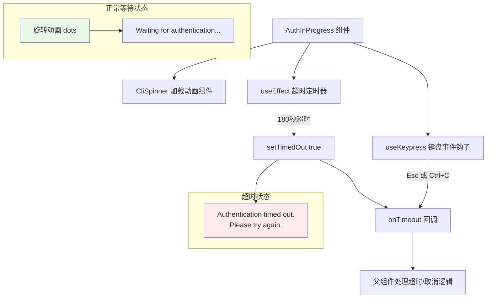

# AuthInProgress.tsx

## 概述

`AuthInProgress` 是一个 React (Ink) 终端 UI 组件，用于在用户发起身份认证（如 Google OAuth 登录）后显示一个**等待中**的加载状态界面。该组件会渲染一个带旋转动画的加载指示器（spinner），告知用户认证正在进行中，同时提供超时自动取消和手动取消的机制。

典型使用场景：用户选择了 "Sign in with Google" 后，CLI 打开浏览器让用户完成 OAuth 登录，此时终端中显示此等待组件，直到认证完成或超时。

文件位于 `packages/cli/src/ui/auth/AuthInProgress.tsx`。

## 架构图（Mermaid）



## 核心组件

### 1. `AuthInProgressProps` 接口

| 属性 | 类型 | 必填 | 说明 |
|------|------|------|------|
| `onTimeout` | `() => void` | 是 | 认证超时或用户手动取消时的回调函数 |

### 2. `AuthInProgress` 函数组件

组件内部维护一个 `timedOut` 布尔状态，用于控制 UI 在"等待中"和"已超时"两种状态之间切换。

**两种状态的 UI 表现：**

| 状态 | UI 表现 |
|------|---------|
| 等待中（`timedOut === false`） | 显示 dots 旋转动画 + "Waiting for authentication... (Press Esc or Ctrl+C to cancel)" |
| 已超时（`timedOut === true`） | 显示红色错误文本 "Authentication timed out. Please try again." |

**取消/超时触发机制：**

1. **自动超时**：通过 `useEffect` 设置 180 秒（3 分钟）定时器，超时后设置 `timedOut = true` 并调用 `onTimeout`
2. **手动取消**：通过 `useKeypress` 监听 Esc 键或 Ctrl+C，立即调用 `onTimeout`

### 3. UI 布局结构

```
┌─────────────────────────────────────────────┐ (round 边框, default 颜色)
│  ⠋ Waiting for authentication...             │
│    (Press Esc or Ctrl+C to cancel)           │
└─────────────────────────────────────────────┘

-- 超时后变为 --

┌─────────────────────────────────────────────┐
│  Authentication timed out. Please try again. │ (红色文本)
└─────────────────────────────────────────────┘
```

## 依赖关系

### 内部依赖

| 模块 | 导入内容 | 用途 |
|------|----------|------|
| `../components/CliSpinner.js` | `CliSpinner` | 终端加载旋转动画组件，使用 `dots` 类型渲染等待动画 |
| `../semantic-colors.js` | `theme` | 语义化颜色主题，用于边框颜色（`border.default`）和错误状态颜色（`status.error`） |
| `../hooks/useKeypress.js` | `useKeypress` | 键盘事件监听钩子，用于捕获 Esc 和 Ctrl+C 按键 |

### 外部依赖

| 包名 | 导入内容 | 用途 |
|------|----------|------|
| `react` | `useState`, `useEffect` | React 钩子：`useState` 管理超时状态，`useEffect` 设置和清理定时器 |
| `ink` | `Box`, `Text` | Ink 终端 UI 基础组件 |

## 关键实现细节

### 1. 超时定时器管理

```typescript
useEffect(() => {
  const timer = setTimeout(() => {
    setTimedOut(true);
    onTimeout();
  }, 180000);

  return () => clearTimeout(timer);
}, [onTimeout]);
```

- 超时时间为 **180,000 毫秒（3 分钟）**，这是 OAuth 登录流程的合理等待上限。
- 使用 `useEffect` 的清理函数 `clearTimeout(timer)` 确保组件卸载时取消定时器，防止内存泄漏。
- 依赖数组包含 `onTimeout`，意味着如果父组件传入的 `onTimeout` 引用变化，定时器会被重置。

### 2. 双重取消机制

组件同时支持自动超时和手动取消两种机制，确保认证流程不会无限期阻塞：

- **自动超时**：3 分钟后自动触发，适用于用户忘记在浏览器中完成认证的场景
- **手动取消**：Esc 或 Ctrl+C 立即触发，适用于用户主动放弃认证的场景

两种机制都调用同一个 `onTimeout` 回调，简化了父组件的处理逻辑。

### 3. 状态切换的不可逆性

一旦 `timedOut` 被设为 `true`，组件 UI 会永久切换为超时错误提示，无法自动恢复。这是合理的设计，因为超时后需要由父组件决定下一步操作（通常是返回认证选择界面）。

### 4. CliSpinner 动画类型

使用 `type="dots"` 的旋转动画，这是终端应用中常见的加载指示样式（如 `⠋ ⠙ ⠹ ⠸ ⠼ ⠴ ⠦ ⠧ ⠇ ⠏` 循环），视觉效果简洁且不干扰用户阅读。

### 5. 轻量级组件设计

相比 `AuthDialog` 和 `ApiAuthDialog` 等复杂组件，`AuthInProgress` 设计非常简洁——仅管理一个布尔状态和一个定时器。这符合其单一职责：显示等待状态并处理超时/取消。
