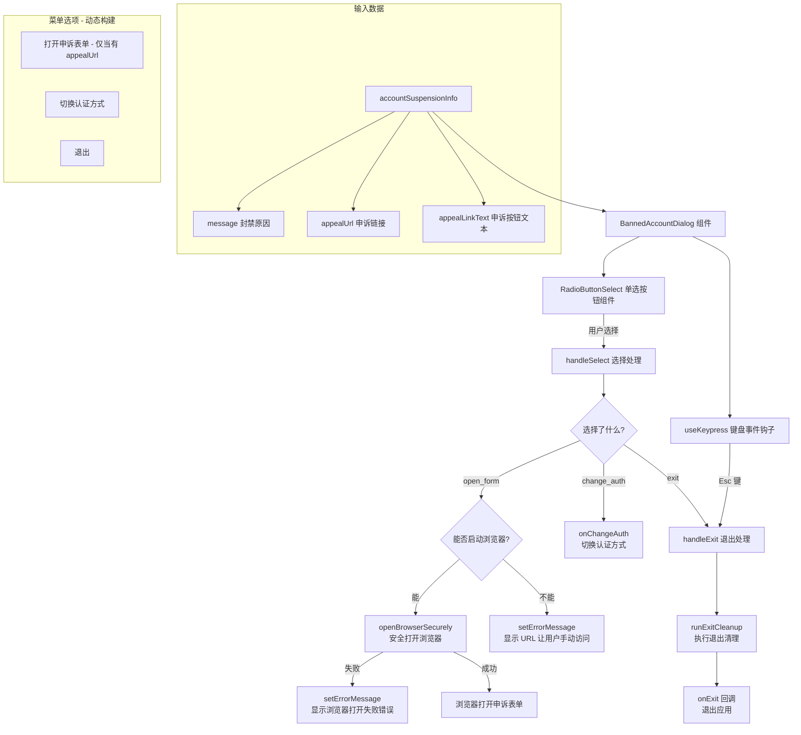

# BannedAccountDialog.tsx

## 概述

`BannedAccountDialog` 是一个 React (Ink) 终端 UI 组件，当用户的 Google 账号被暂停/封禁时显示的对话框。该组件通知用户其账号已被暂停，展示相关的封禁原因信息，并提供以下操作选项：

- **打开申诉表单**（如果服务端返回了申诉 URL）
- **切换认证方式**（允许用户使用其他账号或认证方式）
- **退出应用**

此组件是认证流程中的异常处理路径，确保被封禁的用户获得清晰的反馈和可操作的后续步骤。

文件位于 `packages/cli/src/ui/auth/BannedAccountDialog.tsx`。

## 架构图（Mermaid）



## 核心组件

### 1. `BannedAccountDialogProps` 接口

| 属性 | 类型 | 必填 | 说明 |
|------|------|------|------|
| `accountSuspensionInfo` | `AccountSuspensionInfo` | 是 | 账号暂停信息对象，包含封禁消息、申诉 URL 和申诉链接文本 |
| `onExit` | `() => void` | 是 | 用户选择退出时的回调函数 |
| `onChangeAuth` | `() => void` | 是 | 用户选择切换认证方式时的回调函数 |

### 2. `AccountSuspensionInfo` 类型（来自 UIStateContext）

| 字段 | 类型 | 说明 |
|------|------|------|
| `message` | `string` | 封禁原因说明文本 |
| `appealUrl` | `string \| undefined` | 申诉表单 URL（可选，由服务端返回） |
| `appealLinkText` | `string \| undefined` | 申诉链接显示文本，默认值为 `"Open the Google Form"` |

### 3. 菜单选项动态构建

通过 `useMemo` 缓存，菜单选项根据 `appealUrl` 是否存在动态构建：

| 条件 | 选项标签 | 值 |
|------|----------|------|
| `appealUrl` 存在时 | `appealLinkText`（或默认 "Open the Google Form"） | `"open_form"` |
| 始终显示 | "Change authentication" | `"change_auth"` |
| 始终显示 | "Exit" | `"exit"` |

### 4. `handleSelect` 选择处理逻辑

```
open_form → shouldLaunchBrowser() ?
  → 是 → openBrowserSecurely(appealUrl) → 成功/失败
  → 否 → 显示 URL 让用户手动访问

change_auth → onChangeAuth() 回到认证选择

exit → runExitCleanup() → onExit()
```

### 5. `handleExit` 退出处理

退出前会调用 `runExitCleanup()` 执行清理操作（如清理临时文件、关闭连接等），然后才调用 `onExit` 回调。

### 6. UI 布局结构

```
Error: Account Suspended  (粗体红色标题)

[账号暂停原因信息]

Appeal URL:                     (仅当有申诉 URL 时显示)
[https://申诉链接]               (蓝色链接)

[错误提示 - 浏览器打开失败等]     (仅在有错误时显示, 红色)

  ○ Open the Google Form         (仅当有申诉 URL 时显示)
  ○ Change authentication
  ○ Exit

Escape to exit                   (暗色提示文本)
```

## 依赖关系

### 内部依赖

| 模块 | 导入内容 | 用途 |
|------|----------|------|
| `../semantic-colors.js` | `theme` | 语义化颜色主题（`status.error`、`text.link`） |
| `../components/shared/RadioButtonSelect.js` | `RadioButtonSelect` | 单选按钮列表组件 |
| `../hooks/useKeypress.js` | `useKeypress` | 键盘事件监听钩子，用于捕获 Esc 键 |
| `../../utils/cleanup.js` | `runExitCleanup` | 应用退出前的清理函数 |
| `../contexts/UIStateContext.js` | `AccountSuspensionInfo`（类型） | 账号暂停信息的类型定义 |

### 外部依赖

| 包名 | 导入内容 | 用途 |
|------|----------|------|
| `react` | `useCallback`, `useMemo`, `useState` | React 钩子 |
| `ink` | `Box`, `Text` | Ink 终端 UI 基础组件 |
| `@google/gemini-cli-core` | `openBrowserSecurely`, `shouldLaunchBrowser` | 安全打开浏览器、检测浏览器可用性 |

## 关键实现细节

### 1. 浏览器启动的安全检测

```typescript
if (!shouldLaunchBrowser()) {
  setErrorMessage(`Please open this URL in a browser: ${appealUrl}`);
  return;
}
```

在尝试打开浏览器前，先通过 `shouldLaunchBrowser()` 检测当前环境是否支持浏览器启动。在远程 SSH 会话、Docker 容器等无桌面环境中，浏览器无法启动，此时会直接显示 URL 让用户手动在其他设备上访问。

### 2. 浏览器打开的双层错误处理

即使 `shouldLaunchBrowser()` 返回 `true`，`openBrowserSecurely()` 仍然可能因各种原因失败（如浏览器路径错误、权限问题等）。组件通过 try-catch 捕获异常，显示回退提示信息：

```typescript
try {
  await openBrowserSecurely(appealUrl);
} catch {
  setErrorMessage(`Failed to open browser. Please visit: ${appealUrl}`);
}
```

### 3. 申诉 URL 的条件性展示

组件设计考虑了服务端可能不返回申诉 URL 的情况。当 `appealUrl` 为 `undefined` 时：
- UI 中不显示 "Appeal URL" 区域
- 菜单中不包含 "Open the Google Form" 选项
- 用户只能选择切换认证方式或退出

这确保了组件在不同封禁策略下的正确表现。

### 4. 退出前的清理保证

```typescript
const handleExit = useCallback(async () => {
  await runExitCleanup();
  onExit();
}, [onExit]);
```

无论用户通过 Esc 键还是选择 "Exit" 菜单项退出，都会先执行 `runExitCleanup()` 异步清理操作。这确保了临时文件、网络连接等资源的正确释放。

### 5. 菜单项的 `useMemo` 优化

菜单项列表使用 `useMemo` 缓存，依赖于 `appealUrl` 和 `appealLinkText`。这避免了每次渲染时重新创建数组，减少 `RadioButtonSelect` 组件的不必要重渲染。

### 6. `openBrowserSecurely` vs 普通浏览器打开

组件使用 `openBrowserSecurely` 而非直接的 `open` 命令来打开浏览器。这是一个安全增强函数，可能包含 URL 验证、协议白名单等安全检查，防止通过恶意 URL 进行命令注入攻击。
