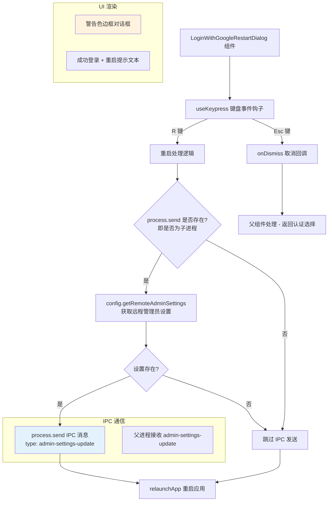

# LoginWithGoogleRestartDialog.tsx

## 概述

`LoginWithGoogleRestartDialog` 是一个 React (Ink) 终端 UI 组件，在用户**成功完成 Google 账号登录后**显示的重启提示对话框。由于 Google OAuth 登录需要应用重启才能使新的凭据生效，此组件通知用户登录成功并提供两个操作选项：

- 按 **R 键** 重启 Gemini CLI 以应用新的认证凭据
- 按 **Esc 键** 取消并选择其他认证方式

该组件还负责在重启前通过 IPC（进程间通信）将远程管理员设置同步到父进程，确保设置不会在重启过程中丢失。

文件位于 `packages/cli/src/ui/auth/LoginWithGoogleRestartDialog.tsx`。

## 架构图（Mermaid）



## 核心组件

### 1. `LoginWithGoogleRestartDialogProps` 接口

| 属性 | 类型 | 必填 | 说明 |
|------|------|------|------|
| `onDismiss` | `() => void` | 是 | 用户按 Esc 键取消时的回调函数，通常用于返回认证方式选择界面 |
| `config` | `Config` | 是 | 核心配置对象，用于获取远程管理员设置 |

### 2. `LoginWithGoogleRestartDialog` 函数组件

这是一个箭头函数组件（`const` 导出），与其他认证对话框的 `function` 声明风格略有不同。

**键盘事件处理：**

| 按键 | 行为 |
|------|------|
| R / r | 延迟 100ms 后执行重启逻辑：同步远程管理员设置 → 重启应用 |
| Esc | 调用 `onDismiss` 回调，取消重启并返回认证选择 |

**重启逻辑详细流程：**

1. 使用 `setTimeout` 延迟 100ms 执行（确保 UI 状态更新完成）
2. 检查 `process.send` 是否存在（判断当前进程是否为子进程）
3. 如果是子进程，通过 `config.getRemoteAdminSettings()` 获取远程管理员设置
4. 如果设置存在，通过 `process.send()` 发送 IPC 消息到父进程，消息类型为 `admin-settings-update`
5. 调用 `relaunchApp()` 重启应用

### 3. UI 布局结构

```
┌─────────────────────────────────────────────────────────────┐ (round 边框, warning 颜色)
│ You've successfully signed in with Google. Gemini CLI needs │
│ to be restarted. Press R to restart, or Esc to choose a     │
│ different authentication method.                             │ (warning 颜色文本)
└─────────────────────────────────────────────────────────────┘
```

组件使用 `theme.status.warning`（警告色，通常为黄色/橙色）作为边框和文本颜色，视觉上提醒用户需要执行重启操作。

## 依赖关系

### 内部依赖

| 模块 | 导入内容 | 用途 |
|------|----------|------|
| `../semantic-colors.js` | `theme` | 语义化颜色主题，用于警告状态的边框和文本颜色（`status.warning`） |
| `../hooks/useKeypress.js` | `useKeypress` | 键盘事件监听钩子，用于捕获 R 键和 Esc 键 |
| `../../utils/processUtils.js` | `relaunchApp` | 重启应用的工具函数 |

### 外部依赖

| 包名 | 导入内容 | 用途 |
|------|----------|------|
| `ink` | `Box`, `Text` | Ink 终端 UI 基础组件 |
| `@google/gemini-cli-core` | `Config`（类型） | 核心配置类型，提供 `getRemoteAdminSettings()` 和 `isBrowserLaunchSuppressed()` 等方法 |

## 关键实现细节

### 1. IPC 进程间通信机制

```typescript
if (process.send) {
  const remoteSettings = config.getRemoteAdminSettings();
  if (remoteSettings) {
    process.send({
      type: 'admin-settings-update',
      settings: remoteSettings,
    });
  }
}
```

此段代码是组件中最关键的实现细节：

- **`process.send` 检查**：Node.js 中只有通过 `child_process.fork()` 创建的子进程才拥有 `process.send` 方法。Gemini CLI 可能运行在父子进程架构中（例如守护进程模式）。
- **远程管理员设置同步**：在重启之前，将当前进程中缓存的远程管理员设置通过 IPC 发送给父进程。这确保了管理员配置（如认证策略、功能开关等）在应用重启后不会丢失。
- **消息格式**：使用结构化的 `{ type: 'admin-settings-update', settings: ... }` 格式，父进程通过 `type` 字段路由消息处理。

### 2. 延迟重启策略

```typescript
setTimeout(async () => {
  // ... IPC + relaunch
}, 100);
```

使用 100ms 延迟执行重启，与 `AuthDialog` 中的延迟重启策略一致。这个延迟确保：
- React 的按键事件处理完成
- 任何挂起的状态更新和 UI 渲染完成
- IPC 消息有足够时间被发送和接收

### 3. 组件的简洁设计

与其他认证对话框不同，此组件没有使用 `useState` 管理内部状态（除了隐含在 `useKeypress` 中的状态）。它是一个几乎无状态的提示组件，仅在特定时刻短暂显示，用户必须选择重启或取消，不存在中间状态。

### 4. 大小写不敏感的 R 键处理

```typescript
if (key.name === 'r' || key.name === 'R') {
```

组件同时接受小写 `r` 和大写 `R` 来触发重启，提升了用户操作的容错性，避免用户因 Caps Lock 状态而困惑。

### 5. 导出风格差异

此组件使用 `export const ... = () => {}` 箭头函数导出，而其他同目录的认证组件使用 `export function ...() {}` 函数声明。虽然功能上等价，但箭头函数组件不支持提升（hoisting），且在 React DevTools 中的显示名可能不同（取决于转译配置）。

### 6. 警告色的语义使用

组件选择 `theme.status.warning` 而非 `theme.status.success` 作为视觉主题，尽管用户已"成功"登录。这是因为当前状态需要用户执行额外操作（重启），警告色能更有效地引起用户注意并促使其采取行动。
