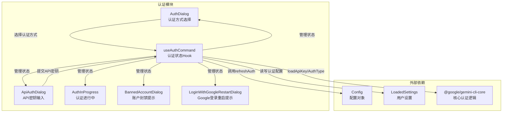
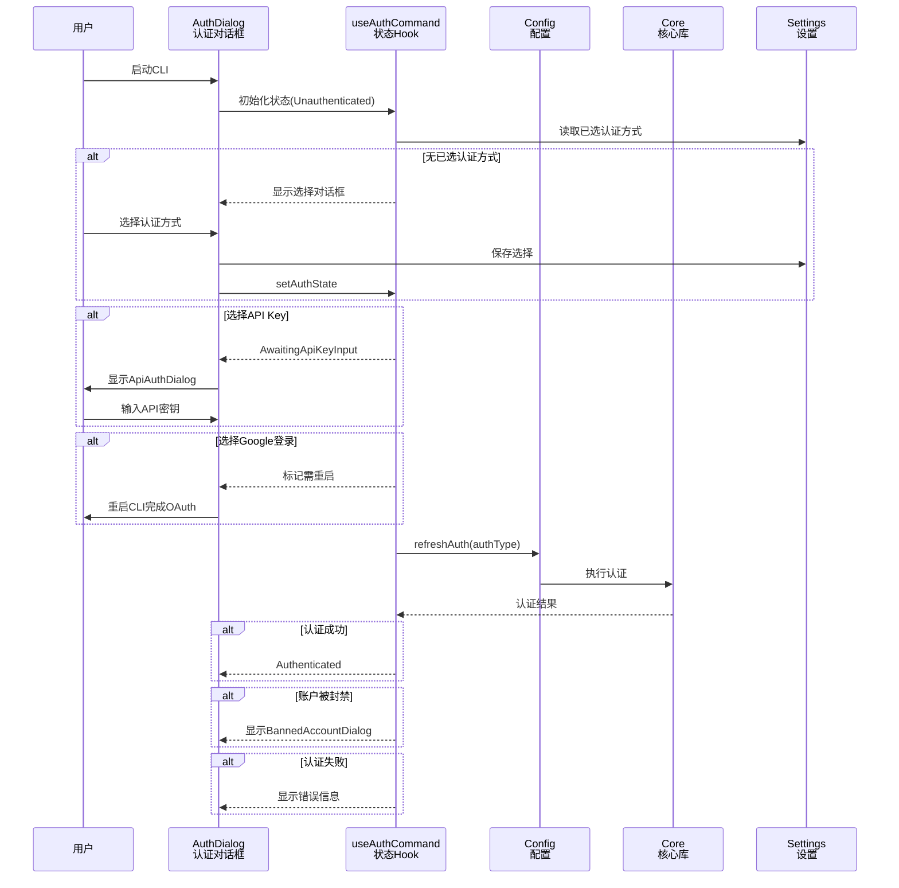

# auth - 认证对话框模块

## 概述

`auth` 目录实现了 Gemini CLI 的用户认证 UI 层，基于 Ink (React for CLI) 框架构建。该模块负责呈现认证方式选择对话框、API Key 输入对话框、认证进度指示、账户封禁提示以及 Google 登录重启提示等交互界面，并通过 `useAuth` 自定义 Hook 管理整个认证状态机的生命周期。

## 目录结构

```
auth/
├── AuthDialog.tsx                  # 主认证选择对话框组件
├── AuthDialog.test.tsx             # AuthDialog 单元测试
├── ApiAuthDialog.tsx               # API Key 输入对话框组件
├── ApiAuthDialog.test.tsx          # ApiAuthDialog 单元测试
├── AuthInProgress.tsx              # 认证进行中状态提示组件
├── AuthInProgress.test.tsx         # AuthInProgress 单元测试
├── BannedAccountDialog.tsx         # 账户被封禁提示对话框
├── BannedAccountDialog.test.tsx    # BannedAccountDialog 单元测试
├── LoginWithGoogleRestartDialog.tsx # Google 登录需重启提示
├── LoginWithGoogleRestartDialog.test.tsx # 对应测试
├── useAuth.ts                      # 认证状态管理 Hook
├── useAuth.test.tsx                # useAuth 单元测试
└── __snapshots__/                  # Jest 快照文件目录
```

## 架构图



## 核心组件

### AuthDialog.tsx - 认证方式选择对话框

主入口对话框组件，提供以下认证方式供用户选择：
- **Sign in with Google** (`LOGIN_WITH_GOOGLE`) - 默认选项
- **Use Cloud Shell user credentials** (`COMPUTE_ADC`) - 仅在 Cloud Shell 环境显示
- **Use metadata server ADC** (`COMPUTE_ADC`) - 仅在设置了 `GEMINI_CLI_USE_COMPUTE_ADC` 时显示
- **Use Gemini API Key** (`USE_GEMINI`) - 使用 API 密钥
- **Vertex AI** (`USE_VERTEX_AI`) - 使用 Vertex AI 认证

支持通过 `settings.merged.security.auth.enforcedType` 强制限定认证类型，以及通过环境变量 `GEMINI_DEFAULT_AUTH_TYPE` 设置默认类型。选择 Google 登录时会标记需要重启，选择 API Key 时跳转到 API Key 输入状态。

### useAuth.ts - 认证状态管理 Hook

`useAuthCommand` Hook 是认证流程的核心状态机，管理以下状态：
- `AuthState.Unauthenticated` - 未认证，触发认证流程
- `AuthState.Updating` - 更新中（有错误待处理）
- `AuthState.AwaitingApiKeyInput` - 等待 API Key 输入
- `AuthState.Authenticated` - 认证成功

关键功能：
- `validateAuthMethodWithSettings()` - 校验认证方式是否被允许（考虑强制类型和外部认证配置）
- 自动从环境变量 `GEMINI_API_KEY` 或存储中加载 API Key
- 调用 `config.refreshAuth()` 执行实际认证
- 处理账户封禁（`isAccountSuspendedError`）和项目 ID 缺失（`ProjectIdRequiredError`）等异常

## 依赖关系

| 依赖 | 用途 |
|------|------|
| `@google/gemini-cli-core` | 提供 `AuthType` 枚举、`loadApiKey`、`clearCachedCredentialFile`、`Config` 等核心认证能力 |
| `ink` | CLI UI 渲染框架（`Box`, `Text`） |
| `react` | 状态管理与组件生命周期 |
| `../../config/settings.js` | 用户/项目设置读写 |
| `../../config/auth.js` | `validateAuthMethod` 认证方式校验 |
| `../semantic-colors.js` | 主题颜色 |
| `../components/shared/RadioButtonSelect.js` | 单选按钮组件 |
| `../hooks/useKeypress.js` | 键盘事件监听 |
| `../types.js` | `AuthState` 状态枚举 |
| `../../utils/processUtils.js` | `relaunchApp` 进程重启工具 |

## 数据流


