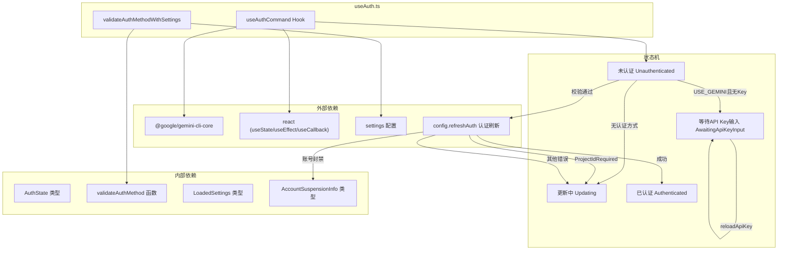

# useAuth.ts

## 概述

`useAuth.ts` 是 Gemini CLI 认证模块的核心 React Hook 文件，位于 `packages/cli/src/ui/auth/` 目录下。它提供了两个主要导出：

1. **`validateAuthMethodWithSettings`** -- 一个纯函数，用于根据用户设置（Settings）校验当前认证方式是否被允许。
2. **`useAuthCommand`** -- 一个自定义 React Hook，封装了完整的认证状态机逻辑，包括认证状态管理、API Key 加载、认证刷新、错误处理（含账号封禁检测）等。

该模块是 CLI 应用 UI 层中认证流程的入口，驱动了从"未认证"到"已认证"或"错误/等待输入"的完整状态流转。

## 架构图（Mermaid）



## 核心组件

### 1. `validateAuthMethodWithSettings(authType, settings)` 函数

**签名：**
```typescript
function validateAuthMethodWithSettings(
  authType: AuthType,
  settings: LoadedSettings,
): string | null
```

**功能：** 校验给定的认证方式是否符合用户设置中的安全策略。

**逻辑流程：**
1. 检查 `settings.merged.security.auth.enforcedType`：如果设置了强制认证类型，且当前类型不匹配，则返回错误信息。
2. 检查 `settings.merged.security.auth.useExternal`：如果启用了外部认证，直接放行（返回 `null`）。
3. 如果认证类型为 `AuthType.USE_GEMINI`（即 Gemini API Key），跳过校验直接返回 `null`，因为后续可能需要提示用户输入。
4. 否则委托给 `validateAuthMethod(authType)` 进行底层校验。

**返回值：** `null` 表示校验通过，`string` 表示错误信息。

---

### 2. `useAuthCommand(settings, config, initialAuthError?, initialAccountSuspensionInfo?)` Hook

**签名：**
```typescript
const useAuthCommand = (
  settings: LoadedSettings,
  config: Config,
  initialAuthError: string | null = null,
  initialAccountSuspensionInfo: AccountSuspensionInfo | null = null,
) => { ... }
```

**功能：** 管理整个认证生命周期的 React Hook。

**参数说明：**

| 参数 | 类型 | 默认值 | 说明 |
|------|------|--------|------|
| `settings` | `LoadedSettings` | 必填 | 已加载的用户配置 |
| `config` | `Config` | 必填 | 核心配置对象，提供 `refreshAuth` 方法 |
| `initialAuthError` | `string \| null` | `null` | 初始认证错误（用于恢复状态） |
| `initialAccountSuspensionInfo` | `AccountSuspensionInfo \| null` | `null` | 初始账号封禁信息 |

**内部状态：**

| 状态变量 | 类型 | 说明 |
|----------|------|------|
| `authState` | `AuthState` | 当前认证状态枚举值 |
| `authError` | `string \| null` | 当前认证错误信息 |
| `accountSuspensionInfo` | `AccountSuspensionInfo \| null` | 账号封禁详情 |
| `apiKeyDefaultValue` | `string \| undefined` | API Key 的默认值（来自环境变量或存储） |

**返回值：**

```typescript
{
  authState,               // 当前认证状态
  setAuthState,            // 设置认证状态
  authError,               // 认证错误信息
  onAuthError,             // 错误回调（设置错误并切换状态为 Updating）
  apiKeyDefaultValue,      // API Key 默认值
  reloadApiKey,            // 重新加载 API Key 的函数
  accountSuspensionInfo,   // 账号封禁信息
  setAccountSuspensionInfo // 设置账号封禁信息
}
```

#### 内部回调函数

**`onAuthError(error)`：**
设置错误信息，如果有错误则将状态切换为 `AuthState.Updating`。

**`reloadApiKey()`：**
异步函数。优先从环境变量 `GEMINI_API_KEY` 读取，否则通过 `loadApiKey()` 从持久存储加载。加载后设置 `apiKeyDefaultValue` 并返回 key 值。

#### useEffect 副作用

**副作用 1 -- API Key 输入监听：**
当 `authState` 变为 `AwaitingApiKeyInput` 时，自动调用 `reloadApiKey()` 加载已有的 API Key 作为输入框默认值。

**副作用 2 -- 认证主流程（核心逻辑）：**
当 `authState` 为 `Unauthenticated` 时触发，执行以下流程：

1. **获取认证类型：** 从 `settings.merged.security.auth.selectedType` 读取。
2. **无认证方式：** 如果 `selectedType` 为空：
   - 若环境变量中存在 `GEMINI_API_KEY`，提示用户选择 "Gemini API Key" 选项。
   - 否则报告 "No authentication method selected"。
3. **Gemini API Key 认证：** 调用 `reloadApiKey()` 加载 key，若为空则切换到 `AwaitingApiKeyInput` 状态等待用户输入。
4. **校验认证方式：** 调用 `validateAuthMethodWithSettings()` 校验。
5. **校验 `GEMINI_DEFAULT_AUTH_TYPE` 环境变量：** 检查该环境变量值是否为合法的 `AuthType` 枚举值。
6. **执行认证刷新：** 调用 `config.refreshAuth(authType)` 进行实际认证。
   - **成功：** 清除错误信息，设置状态为 `Authenticated`。
   - **账号封禁错误（`isAccountSuspendedError`）：** 设置 `accountSuspensionInfo`，包含封禁消息、申诉链接等。
   - **ProjectIdRequiredError：** OAuth 成功但需要项目 ID，直接显示错误信息。
   - **其他错误：** 显示 "Failed to sign in" 前缀的错误信息。

## 依赖关系

### 内部依赖

| 模块路径 | 导入内容 | 说明 |
|----------|----------|------|
| `../../config/settings.js` | `LoadedSettings` (类型) | 已加载的用户配置类型定义 |
| `../types.js` | `AuthState` | 认证状态枚举（Unauthenticated, AwaitingApiKeyInput, Updating, Authenticated） |
| `../../config/auth.js` | `validateAuthMethod` | 底层认证方式校验函数 |
| `../contexts/UIStateContext.js` | `AccountSuspensionInfo` (类型) | 账号封禁信息接口定义 |

### 外部依赖

| 包名 | 导入内容 | 说明 |
|------|----------|------|
| `react` | `useState`, `useEffect`, `useCallback` | React 核心 Hooks |
| `@google/gemini-cli-core` | `AuthType`, `Config` (类型), `loadApiKey`, `debugLogger`, `isAccountSuspendedError`, `ProjectIdRequiredError`, `getErrorMessage` | 核心库提供的认证类型枚举、配置接口、API Key 加载函数、调试日志、错误检测工具等 |

## 关键实现细节

1. **状态机驱动设计：** 整个认证流程基于 `AuthState` 枚举的状态机模式。状态转换由 `useEffect` 监听 `authState` 变化来驱动，确保每次状态变化都能触发对应的业务逻辑。

2. **初始状态判断：** 如果构造时传入了 `initialAuthError`，则初始状态为 `Updating`（即跳过初始认证流程，直接进入错误处理/重新认证界面）；否则为 `Unauthenticated`（触发认证主流程）。

3. **API Key 加载优先级：** `reloadApiKey()` 优先读取环境变量 `GEMINI_API_KEY`，其次从持久化存储（通过 `loadApiKey()`）加载。这使得在 CI/CD 环境中可以通过环境变量快速配置认证。

4. **多层错误分类：** 认证失败时会区分三种错误类型：
   - **账号封禁（`isAccountSuspendedError`）：** 提取申诉链接等信息，走专门的封禁处理流程。
   - **缺少项目 ID（`ProjectIdRequiredError`）：** OAuth 成功但账号设置不完整，直接显示错误消息（不加 "Failed to login" 前缀）。
   - **其他错误：** 通用错误处理，附带 "Failed to sign in" 前缀。

5. **设置强制类型（Enforced Type）：** `validateAuthMethodWithSettings` 支持管理员通过设置文件强制指定认证类型。如果当前认证类型与强制类型不一致，认证会被阻断。

6. **外部认证跳过校验：** 当 `settings.merged.security.auth.useExternal` 为 `true` 时，校验直接通过，允许使用外部认证提供者。

7. **环境变量 `GEMINI_DEFAULT_AUTH_TYPE` 校验：** 在执行认证前会检查该环境变量的值是否合法，防止无效配置导致不可预期的行为。

8. **异步 IIFE 模式：** 主认证 `useEffect` 内部使用了 `(async () => { ... })()` 的异步立即执行函数模式来处理异步认证逻辑，这是 React 中处理异步副作用的常见模式。
