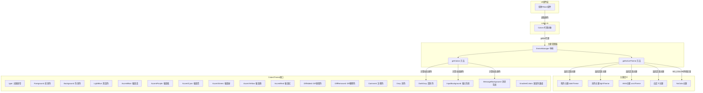

# colors.ts

## 概述

`colors.ts` 是 Gemini CLI UI 层的颜色代理模块，位于 `packages/cli/src/ui/` 目录下。它导出一个全局单例对象 `Colors`，该对象实现了 `ColorsTheme` 接口，但并不直接存储颜色值，而是通过 JavaScript getter（属性访问器）将每次颜色读取**动态委托**给 `themeManager`（主题管理器）。

这种设计使得 `Colors` 对象成为当前活跃主题颜色的**透明代理**：当主题切换时，所有通过 `Colors` 读取的颜色值会自动反映新主题的配色方案，无需重新绑定或更新引用。整个 UI 层的组件只需引用 `Colors` 即可获取当前主题的颜色，实现了主题系统与 UI 组件之间的解耦。

## 架构图（Mermaid）

## 核心组件

### `Colors` 对象

**类型：** `ColorsTheme`（通过 getter 实现）

`Colors` 是模块的唯一导出，它是一个实现了 `ColorsTheme` 接口的对象字面量。每个属性都定义为 getter，在每次访问时实时从 `themeManager` 获取当前活跃主题的对应颜色值。

#### 属性列表与委托方式

`Colors` 的属性在获取颜色值时使用了两种不同的委托路径：

**路径一：`themeManager.getActiveTheme().colors.*`（直接主题颜色）**

以下属性直接从活跃主题的 `colors` 属性读取，获取的是主题定义时的**静态**颜色值：

| 属性 | 用途说明 |
|------|----------|
| `type` | 主题类型标识（`'light'` / `'dark'` / `'ansi'` / `'custom'`） |
| `Foreground` | 默认前景文字颜色 |
| `LightBlue` | 浅蓝色（用于属性高亮等） |
| `AccentBlue` | 强调蓝色（用于关键字、链接等） |
| `AccentPurple` | 强调紫色（用于变量等） |
| `AccentCyan` | 强调青色（用于内置类型等） |
| `AccentGreen` | 强调绿色（用于数字、成功状态等） |
| `AccentYellow` | 强调黄色（用于字符串、警告等） |
| `AccentRed` | 强调红色（用于正则表达式、错误等） |
| `DiffAdded` | Diff 新增内容背景色 |
| `DiffRemoved` | Diff 删除内容背景色 |
| `Comment` | 注释文字颜色 |
| `Gray` | 灰色（用于次要文字） |
| `GradientColors` | 渐变色数组（可选，用于 UI 装饰） |

**路径二：`themeManager.getColors().*`（动态计算颜色）**

以下属性通过 `getColors()` 方法获取，该方法会**考虑终端背景色**进行动态计算和缓存：

| 属性 | 用途说明 |
|------|----------|
| `Background` | 背景色（可能被终端实际背景色覆盖） |
| `DarkGray` | 深灰色（根据终端背景色动态插值计算） |
| `InputBackground` | 输入框背景色（根据终端背景色动态插值计算） |
| `MessageBackground` | 消息区域背景色（根据终端背景色动态插值计算） |

**两种委托路径的关键区别：**
- `getActiveTheme().colors.*`：直接返回主题预定义的颜色值，不考虑终端实际背景。
- `getColors().*`：如果终端背景色已知且与主题兼容，会基于终端背景色通过 `interpolateColor` 重新计算 `Background`、`DarkGray`、`InputBackground`、`MessageBackground` 等值，以获得更好的视觉融合效果。

## 依赖关系

### 内部依赖

| 模块路径 | 导入内容 | 说明 |
|----------|----------|------|
| `./themes/theme-manager.js` | `themeManager` | 主题管理器单例实例，提供 `getActiveTheme()` 和 `getColors()` 方法 |
| `./themes/theme.js` | `ColorsTheme` (类型) | 颜色主题接口定义，`Colors` 对象的类型声明 |

### 外部依赖

无外部（第三方）依赖。本模块是纯粹的内部桥接模块。

## 关键实现细节

1. **Getter 代理模式（Proxy-like Pattern）：** `Colors` 对象的所有属性都是 getter，而非静态值。这意味着每次读取属性时都会执行函数调用获取最新值。这是一种轻量级的代理模式，避免了使用 ES6 `Proxy` 的复杂性，同时实现了相同的动态绑定效果。

2. **两层颜色获取策略：**
   - 大部分颜色（13个属性）直接通过 `themeManager.getActiveTheme().colors` 获取，返回主题定义的原始颜色值。
   - 4个与背景相关的颜色（`Background`、`DarkGray`、`InputBackground`、`MessageBackground`）通过 `themeManager.getColors()` 获取。`getColors()` 内部会检测终端背景色，如果主题与终端背景兼容，则基于终端实际背景色进行颜色插值计算，使 UI 更好地融入终端环境。

3. **主题切换无感知：** 由于 getter 每次都重新查询 `themeManager`，当调用 `themeManager.setActiveTheme()` 切换主题后，所有后续对 `Colors` 的访问会自动返回新主题的颜色，无需任何额外的通知或更新机制。

4. **NO_COLOR 环境变量支持：** `themeManager.getActiveTheme()` 内部会检查 `process.env['NO_COLOR']` 环境变量。如果设置了该环境变量，会返回 `NoColorTheme`（一个所有颜色值均为空的主题），从而在不支持颜色的终端中禁用所有颜色输出。

5. **缓存机制：** `themeManager.getColors()` 内部实现了基于 `主题名:终端背景色` 组合的缓存机制。只要主题和终端背景色未变化，动态计算的颜色值会被缓存，避免每次 getter 调用都进行颜色插值计算。

6. **ColorsTheme 接口完整性：** `ColorsTheme` 接口定义了 17 个颜色属性（含 3 个可选属性 `InputBackground`、`MessageBackground`、`FocusBackground`、`FocusColor`、`GradientColors`）。`Colors` 代理对象实现了其中 17 个（不含 `FocusBackground` 和 `FocusColor`，这两个仅在 `Theme` 类的语义颜色系统中使用）。
