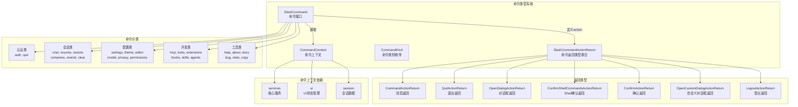
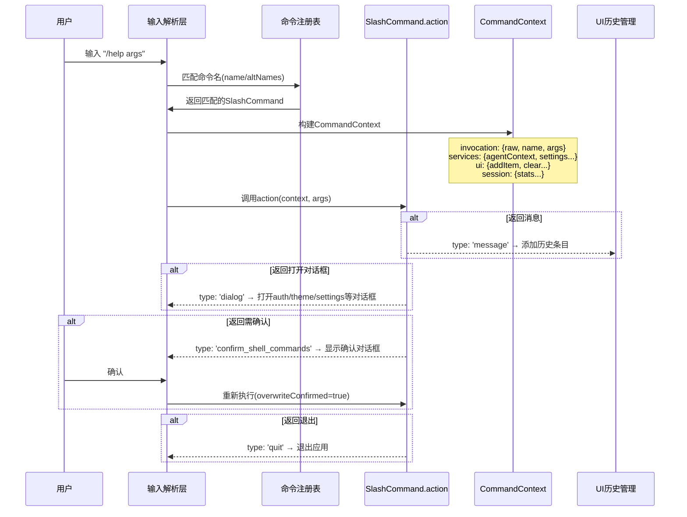

# commands - 斜杠命令模块

## 概述

`commands` 目录实现了 Gemini CLI 所有的斜杠命令（Slash Commands）。每个命令都遵循统一的 `SlashCommand` 接口契约，由 `types.ts` 定义核心类型系统。命令通过 `/` 前缀触发，支持子命令、参数补全、自动执行等特性，覆盖了从认证管理、会话控制到 UI 主题配置的全部交互功能。

## 目录结构

```
commands/
├── types.ts                    # 核心类型定义（SlashCommand, CommandContext 等）
├── aboutCommand.ts             # /about - 显示版本与关于信息
├── agentsCommand.ts            # /agents - Agent 管理
├── authCommand.ts              # /auth - 认证管理
├── bugCommand.ts               # /bug - 提交 Bug 报告
├── chatCommand.ts              # /chat - 会话管理
├── clearCommand.ts             # /clear - 清屏
├── commandsCommand.ts          # /commands - 自定义命令管理与重载
├── compressCommand.ts          # /compress - 压缩会话上下文
├── copyCommand.ts              # /copy - 复制内容到剪贴板
├── corgiCommand.ts             # /corgi - 彩蛋：柯基模式
├── directoryCommand.tsx        # /directory - 目录切换
├── docsCommand.ts              # /docs - 打开文档
├── editorCommand.ts            # /editor - 编辑器配置
├── extensionsCommand.ts        # /extensions - 扩展管理
├── footerCommand.tsx           # 底部信息栏命令
├── helpCommand.ts              # /help - 帮助信息
├── hooksCommand.ts             # /hooks - Hooks 管理
├── ideCommand.ts               # /ide - IDE 集成
├── initCommand.ts              # /init - 初始化项目配置
├── mcpCommand.ts               # /mcp - MCP 服务管理
├── memoryCommand.ts            # /memory - 记忆/上下文管理
├── modelCommand.ts             # /model - 模型选择
├── oncallCommand.tsx           # /oncall - 值班相关
├── permissionsCommand.ts       # /permissions - 权限管理
├── planCommand.ts              # /plan - 规划模式
├── policiesCommand.ts          # /policies - 策略管理
├── privacyCommand.ts           # /privacy - 隐私设置
├── profileCommand.ts           # /profile - 用户配置
├── quitCommand.ts              # /quit - 退出应用
├── restoreCommand.ts           # /restore - 恢复会话
├── resumeCommand.ts            # /resume - 恢复中断的任务
├── rewindCommand.tsx           # /rewind - 回退操作
├── settingsCommand.ts          # /settings - 设置管理
├── setupGithubCommand.ts       # /setup-github - GitHub 集成配置
├── shellsCommand.ts            # /shells - Shell 管理
├── shortcutsCommand.ts         # /shortcuts - 快捷键管理
├── skillsCommand.ts            # /skills - 技能管理
├── statsCommand.ts             # /stats - 会话统计
├── terminalSetupCommand.ts     # /terminal-setup - 终端配置
├── themeCommand.ts             # /theme - 主题切换
├── toolsCommand.ts             # /tools - 工具管理
├── upgradeCommand.ts           # /upgrade - 升级 CLI
├── vimCommand.ts               # /vim - Vim 模式切换
└── *.test.ts(x)                # 对应的单元测试文件
```

## 架构图



## 核心组件

### types.ts - 命令类型系统

定义了整个命令框架的核心接口：

- **`SlashCommand`** - 命令契约接口，包含：
  - `name` / `altNames` - 命令名称与别名
  - `kind` - 命令类别（`BUILT_IN`、`USER_FILE`、`WORKSPACE_FILE`、`EXTENSION_FILE`、`MCP_PROMPT`、`AGENT`、`SKILL`）
  - `action` - 命令执行函数，接收 `CommandContext` 和参数字符串
  - `completion` - 参数补全函数
  - `subCommands` - 子命令列表
  - `autoExecute` - 是否在选中后自动执行
  - `isSafeConcurrent` - 是否可在 Agent 忙碌时安全并发执行

- **`CommandContext`** - 命令执行上下文，分为三个域：
  - `services` - 核心服务（`agentContext`、`settings`、`git`、`logger`）
  - `ui` - UI 操作（`addItem`、`clear`、`setPendingItem`、`loadHistory` 等）
  - `session` - 会话数据（`stats`、`sessionShellAllowlist`）

- **`SlashCommandActionReturn`** - 联合返回类型，支持消息输出、退出、打开对话框、Shell 命令确认、自定义对话框、登出等多种返回行为。

### 命令实现模式

每个命令文件导出一个符合 `SlashCommand` 接口的常量对象。典型模式如下：
```typescript
export const helpCommand: SlashCommand = {
  name: 'help',
  kind: CommandKind.BUILT_IN,
  description: '帮助信息',
  autoExecute: true,
  action: async (context) => {
    context.ui.addItem({ type: MessageType.HELP, timestamp: new Date() });
  },
};
```

支持子命令的命令（如 `/commands`）通过 `subCommands` 字段注册子命令，每个子命令也是完整的 `SlashCommand` 对象。

## 依赖关系

| 依赖 | 用途 |
|------|------|
| `@google/gemini-cli-core` | `GitService`、`Logger`、`CommandActionReturn`、`AgentDefinition`、`AgentLoopContext` 等核心类型 |
| `../../config/settings.js` | `LoadedSettings` 设置类型 |
| `../types.js` | `HistoryItem`、`MessageType`、`ConfirmationRequest` 等 UI 类型 |
| `../hooks/useHistoryManager.js` | `UseHistoryManagerReturn` 历史管理 |
| `../contexts/SessionContext.js` | `SessionStatsState` 会话统计 |
| `../state/extensions.js` | 扩展状态管理类型 |
| `ink` / `react` | 部分 `.tsx` 命令使用 React 组件渲染 |

## 数据流


